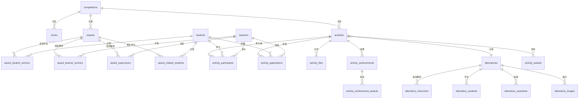

# 数据库结构说明

**版本**: 2.0
**更新时间**: 2026-01-17
**数据库类型**: SQLite
**主数据库文件**: `database/competitions.db`

---

## 目录

1. [概述](#概述)
2. [核心数据表](#核心数据表)
3. [关联表](#关联表)
4. [文件存储系统](#文件存储系统)
5. [辅助数据库](#辅助数据库)
6. [数据迁移](#数据迁移)

---

## 概述

本系统使用 SQLite 数据库存储竞赛、奖状、用户、活动等信息。主数据库文件为 `database/competitions.db`。

### 设计说明

- **统一奖状存储**: 竞赛奖状、专利证书、软著证书均存储在 `awards` 表中
- **SHA256 文件存储**: 证书图片使用 SHA256 哈希值作为文件名，存储在 `files/award_images/` 目录
- **多对多关系**: 通过中间关联表处理奖状与教师、学生的关系
- **活动系统**: 支持竞赛活动、创新创业项目等活动的管理

---

## 核心数据表

### 1. 竞赛相关表

#### `competitions` - 竞赛信息表

存储竞赛的基本信息、分类和别名。

| 字段 | 类型 | 约束 | 默认值 | 说明 |
|------|------|------|--------|------|
| `id` | INTEGER | PRIMARY KEY AUTOINCREMENT | - | 竞赛唯一标识符 |
| `competition_name` | TEXT | NOT NULL UNIQUE | - | 竞赛官方名称 |
| `official_website` | TEXT | - | - | 官方网站链接 |
| `organizer` | TEXT | - | - | 主办单位 |
| `competition_time` | TEXT | - | - | 举办时间范围描述（如"4-10月"） |
| `participant_requirements` | TEXT | - | - | 参赛要求 |
| `grade_category` | TEXT | - | - | 学院判定等级（A类/B类等） |
| `brief_description` | TEXT | - | - | 竞赛简介 |
| `alias_list` | TEXT | - | - | 竞赛别名列表（逗号分隔） |
| `white_list` | BOOLEAN | - | 0 | 是否为白名单赛事（高含金量） |
| `watch_list` | BOOLEAN | - | 0 | 是否为观察名单赛事 |
| `is_auto_added` | BOOLEAN | - | 0 | 是否为程序自动添加 |

**索引**: `competition_name` (UNIQUE)

#### `tracks` - 竞赛赛道表

存储竞赛的细分赛道/组别。

| 字段 | 类型 | 约束 | 说明 |
|------|------|------|------|
| `id` | INTEGER | PRIMARY KEY AUTOINCREMENT | 赛道唯一标识符 |
| `competition_id` | INTEGER | NOT NULL | 所属竞赛ID（外键） |
| `year` | TEXT | - | 年份 |
| `track_id` | TEXT | - | 赛道标识符 |
| `track_name` | TEXT | - | 赛道名称 |

**外键**: `competition_id` → `competitions(id)`

---

### 2. 用户认证表

#### `admins` - 管理员表

| 字段 | 类型 | 约束 | 说明 |
|------|------|------|------|
| `id` | INTEGER | PRIMARY KEY AUTOINCREMENT | 主键 |
| `username` | TEXT | UNIQUE | 用户名 |
| `password_hash` | TEXT | NOT NULL | 密码哈希值 |
| `name` | TEXT | - | 真实姓名 |
| `user_activated` | INTEGER | - | 账户是否激活 |
| `created_at` | TIMESTAMP | - | 创建时间 |

#### `teachers` - 教师表

| 字段 | 类型 | 约束 | 说明 |
|------|------|------|------|
| `id` | INTEGER | PRIMARY KEY AUTOINCREMENT | 主键 |
| `teacher_id` | TEXT | UNIQUE | 工号 |
| `name` | TEXT | NOT NULL | 姓名 |
| `title` | TEXT | - | 职称 |
| `department` | TEXT | NOT NULL | 所属部门 |
| `phone` | TEXT | - | 联系电话 |
| `id_number` | TEXT | - | 身份证号 |
| `qq` | TEXT | - | QQ号 |
| `skills` | TEXT | - | 技能标签 |
| `password_hash` | TEXT | - | 密码哈希值 |
| `role` | TEXT | - | 角色标识 |
| `user_activated` | INTEGER | - | 账户是否激活 |
| `created_at` | TIMESTAMP | - | 创建时间 |
| `updated_at` | TIMESTAMP | - | 更新时间 |

**索引**: `teacher_id` (UNIQUE)

#### `students` - 学生表

| 字段 | 类型 | 约束 | 说明 |
|------|------|------|------|
| `id` | INTEGER | PRIMARY KEY AUTOINCREMENT | 主键 |
| `student_id` | TEXT | UNIQUE | 学号 |
| `name` | TEXT | NOT NULL | 姓名 |
| `major` | TEXT | NOT NULL | 专业 |
| `grade` | TEXT | NOT NULL | 年级 |
| `phone` | TEXT | - | 联系电话 |
| `qq` | TEXT | - | QQ号 |
| `skills` | TEXT | - | 技能标签 |
| `password_hash` | TEXT | - | 密码哈希值 |
| `role` | TEXT | - | 角色标识 |
| `user_activated` | INTEGER | - | 账户是否激活 |
| `created_at` | TIMESTAMP | - | 创建时间 |
| `updated_at` | TIMESTAMP | - | 更新时间 |

**索引**: `student_id` (UNIQUE)

---

### 3. 奖状证书表 (核心)

#### `awards` - 奖状/证书统一存储表

**重要**: 此表存储所有类型的证书，包括竞赛奖状、专利证书、软件著作权证书。

| 分类 | 字段 | 类型 | 约束 | 说明 |
|------|------|------|------|------|
| **主键** | `id` | INTEGER | PRIMARY KEY AUTOINCREMENT | 主键 |
| **文件引用** | `image_hash` | TEXT | - | 图片文件SHA256哈希值 |
| | `certificate_id` | TEXT | - | 证书编号 |
| **匹配状态** | `match_status` | BOOLEAN | - | 人名是否全部匹配成功 |
| | `is_abnormal` | BOOLEAN | - | 异常标记（True=存在异常） |
| **原始数据** | `ocr_result` | TEXT | - | OCR原始识别文本 |
| **抽取字段** | `competition_name_in_file` | TEXT | - | 证书中的竞赛名称 |
| | `track` | TEXT | - | 赛道/组别 |
| | `issuer` | TEXT | - | 颁发机构 |
| | `province` | TEXT | - | 省份 |
| | `group_name` | TEXT | - | 组别名称 |
| | `winner_name` | TEXT | - | 获奖者姓名列表（逗号分隔） |
| | `supervisor_name` | TEXT | - | 指导教师姓名列表（逗号分隔） |
| | `award_level` | TEXT | - | 获奖等级（如"省赛二等奖"） |
| | `competition_level` | TEXT | - | 比赛级别（国赛/省赛/校赛） |
| | `date` | TEXT | - | 获奖日期 |
| | `project_title` | TEXT | - | 项目名称 |
| | `granted_role` | TEXT | - | 授予角色（学生/教师） |
| | `related_student_name` | TEXT | - | 相关学生姓名列表 |
| | `edition` | INTEGER | - | 届数 |
| | `year` | INTEGER | - | 年份 |
| **系统字段** | `competition_id` | INTEGER | NOT NULL | 关联竞赛ID（外键） |
| | `uploaded_by_user_id` | TEXT | - | 上传者ID |
| | `uploaded_by_user_type` | TEXT | - | 上传者类型 |
| | `created_at` | TIMESTAMP | - | 创建时间 |
| | `updated_at` | TIMESTAMP | - | 更新时间 |

**索引**: `competition_id`, `is_abnormal`

**外键**: `competition_id` → `competitions(id)`

**重要说明**:
- **专利和软著证书也存储在此表中**，通过 `competition_name_in_file` 字段区分类型
- 专利: `competition_name_in_file` 包含"专利"关键词
- 软著: `competition_name_in_file` 包含"软著"或"著作权"关键词
- `image_hash` 字段用于定位图片文件（见[文件存储系统](#文件存储系统)）

---

### 4. 活动系统表

#### `activities` - 活动表

存储各类活动（竞赛、项目等）信息。

| 字段 | 类型 | 约束 | 说明 |
|------|------|------|------|
| `id` | INTEGER | PRIMARY KEY AUTOINCREMENT | 主键 |
| `competition_id` | INTEGER | - | 关联竞赛ID |
| `competition_name` | TEXT | NOT NULL | 竞赛名称 |
| `year` | INTEGER | - | 年份 |
| `student_name_list` | TEXT | - | 学生名单 |
| `leader_name` | TEXT | - | 负责人姓名 |
| `leader_type` | TEXT | - | 负责人类型（student/teacher） |
| `leader_id` | INTEGER | - | 负责人ID |
| `track` | TEXT | - | 赛道 |
| `teacher_name_list` | TEXT | - | 教师名单 |
| `project_title` | TEXT | - | 项目名称 |
| `edition` | INTEGER | - | 届数 |
| `start_date` | TEXT | - | 开始日期 |
| `end_date` | TEXT | - | 结束日期 |
| `status` | TEXT | - | 活动状态 |
| `activity_type` | TEXT | - | 活动类型（默认competition） |
| `description` | TEXT | - | 活动描述 |
| `visibility` | TEXT | - | 可见性（public/private） |
| `laboratory_id` | INTEGER | - | 关联实验室ID |
| `name` | TEXT | UNIQUE | 活动名称（唯一） |
| `created_at` | TIMESTAMP | - | 创建时间 |
| `updated_at` | TIMESTAMP | - | 更新时间 |

**索引**: `activity_type`, `(leader_id, leader_type)`, `laboratory_id`, `visibility`

#### `activity_participants` - 活动参与者表

| 字段 | 类型 | 约束 | 说明 |
|------|------|------|------|
| `activity_id` | INTEGER | NOT NULL | 活动ID |
| `participant_id` | INTEGER | NOT NULL | 参与者ID |
| `participant_type` | TEXT | NOT NULL | 参与者类型（student/teacher） |
| `role` | TEXT | - | 角色 |
| `created_at` | TIMESTAMP | - | 加入时间 |

**主键**: `(activity_id, participant_id, participant_type)`

**检查约束**: `participant_type IN ('student', 'teacher')`

#### `activity_applications` - 活动申请表

| 字段 | 类型 | 约束 | 说明 |
|------|------|------|------|
| `id` | INTEGER | PRIMARY KEY AUTOINCREMENT | 主键 |
| `activity_id` | INTEGER | NOT NULL | 活动ID |
| `applicant_id` | INTEGER | NOT NULL | 申请人ID |
| `applicant_type` | TEXT | NOT NULL | 申请人类型 |
| `status` | TEXT | NOT NULL | 状态（pending/approved/rejected） |
| `application_text` | TEXT | - | 申请内容 |
| `created_at` | TIMESTAMP | - | 创建时间 |
| `updated_at` | TIMESTAMP | - | 更新时间 |

**检查约束**: `applicant_type IN ('student', 'teacher')`, `status IN ('pending', 'approved', 'rejected')`

#### `activity_files` - 活动文件表

| 字段 | 类型 | 约束 | 说明 |
|------|------|------|------|
| `id` | INTEGER | PRIMARY KEY AUTOINCREMENT | 主键 |
| `activity_id` | INTEGER | NOT NULL | 活动ID |
| `file_name` | TEXT | NOT NULL | 文件名 |
| `file_path` | TEXT | NOT NULL | 文件路径 |
| `file_type` | TEXT | - | 文件类型 |
| `file_size` | INTEGER | - | 文件大小 |
| `uploaded_by_id` | INTEGER | - | 上传者ID |
| `uploaded_by_type` | TEXT | - | 上传者类型 |
| `description` | TEXT | - | 文件描述 |
| `created_at` | TIMESTAMP | - | 上传时间 |

#### `activity_achievements` - 活动成果表

| 字段 | 类型 | 约束 | 说明 |
|------|------|------|------|
| `id` | INTEGER | PRIMARY KEY AUTOINCREMENT | 主键 |
| `activity_id` | INTEGER | NOT NULL | 活动ID |
| `achievement_type` | TEXT | NOT NULL | 成果类型 |
| `title` | TEXT | NOT NULL | 成果标题 |
| `description` | TEXT | - | 成果描述 |
| `date` | TEXT | - | 获得日期 |
| `created_at` | TIMESTAMP | - | 创建时间 |
| `updated_at` | TIMESTAMP | - | 更新时间 |

**检查约束**: `achievement_type IN ('award', 'project_approval', 'copyright', 'paper')`

---

### 5. 实验室系统表

#### `laboratories` - 实验室表

| 字段 | 类型 | 约束 | 说明 |
|------|------|------|------|
| `id` | INTEGER | PRIMARY KEY AUTOINCREMENT | 主键 |
| `name` | TEXT | NOT NULL | 实验室名称 |
| `description` | TEXT | - | 实验室描述 |
| `cover_image` | TEXT | - | 封面图片路径 |
| `created_at` | TIMESTAMP | - | 创建时间 |
| `updated_at` | TIMESTAMP | - | 更新时间 |

#### `laboratory_instructors` - 实验室指导教师表

| 字段 | 类型 | 约束 | 说明 |
|------|------|------|------|
| `laboratory_id` | INTEGER | NOT NULL | 实验室ID |
| `teacher_id` | INTEGER | NOT NULL | 教师ID |

**主键**: `(laboratory_id, teacher_id)`
**外键**: `laboratory_id` → `laboratories(id)`, `teacher_id` → `teachers(id)`

#### `laboratory_students` - 实验室学生表

| 字段 | 类型 | 约束 | 说明 |
|------|------|------|------|
| `laboratory_id` | INTEGER | NOT NULL | 实验室ID |
| `student_id` | INTEGER | NOT NULL | 学生ID |

**主键**: `(laboratory_id, student_id)`

#### `laboratory_assistants` - 实验室助理表

| 字段 | 类型 | 约束 | 说明 |
|------|------|------|------|
| `laboratory_id` | INTEGER | NOT NULL | 实验室ID |
| `student_id` | INTEGER | NOT NULL | 学生ID |

**主键**: `(laboratory_id, student_id)`
**唯一约束**: `student_id` (每个学生只能担任一个实验室的助理)

#### `laboratory_images` - 实验室图片表

| 字段 | 类型 | 约束 | 说明 |
|------|------|------|------|
| `id` | INTEGER | PRIMARY KEY AUTOINCREMENT | 主键 |
| `laboratory_id` | INTEGER | NOT NULL | 实验室ID |
| `image_path` | TEXT | NOT NULL | 图片路径 |
| `display_order` | INTEGER | - | 显示顺序 |
| `created_at` | TIMESTAMP | - | 上传时间 |

---

### 6. 检测规则表

#### `detect_rules` - 检测规则表

用于奖状数据的异常检测。

| 字段 | 类型 | 约束 | 说明 |
|------|------|------|------|
| `id` | INTEGER | PRIMARY KEY AUTOINCREMENT | 主键 |
| `competition_name` | TEXT | - | 竞赛名称 |
| `track` | TEXT | - | 赛道 |
| `competition_level` | TEXT | - | 比赛级别 |
| `granted_role` | TEXT | - | 授予角色 |
| `field_name` | TEXT | NOT NULL | 字段名称 |
| `is_required` | BOOLEAN | - | 是否必填 |
| `is_manual_override` | BOOLEAN | - | 是否手动覆盖 |
| `threshold_percentage` | REAL | - | 阈值百分比 |
| `actual_percentage` | REAL | - | 实际百分比 |
| `created_at` | TIMESTAMP | - | 创建时间 |
| `updated_at` | TIMESTAMP | - | 更新时间 |

**索引**: `field_name`, `(competition_name, track, competition_level, granted_role)`

#### `detect_scan_reports` - 检测扫描报告表

| 字段 | 类型 | 约束 | 说明 |
|------|------|------|------|
| `id` | INTEGER | PRIMARY KEY AUTOINCREMENT | 主键 |
| `scan_time` | TIMESTAMP | - | 扫描时间 |
| `category_hash` | TEXT | NOT NULL | 类别哈希 |
| `competition_name` | TEXT | NOT NULL | 竞赛名称 |
| `track` | TEXT | - | 赛道 |
| `competition_level` | TEXT | - | 比赛级别 |
| `granted_role` | TEXT | - | 授予角色 |
| `award_count` | INTEGER | NOT NULL | 奖状数量 |
| `field_statistics` | TEXT | NOT NULL | 字段统计（JSON） |
| `created_at` | TIMESTAMP | - | 创建时间 |

**索引**: `scan_time`, `category_hash`

---

## 关联表

### 奖状关联表

处理奖状与教师、学生的多对多关系。

#### `award_student_winners` - 学生获奖者关联表

| 字段 | 类型 | 约束 | 说明 |
|------|------|------|------|
| `award_id` | INTEGER | - | 奖状ID |
| `student_id` | INTEGER | - | 学生ID |

**索引**: `student_id`

#### `award_teacher_winners` - 教师获奖者关联表

| 字段 | 类型 | 约束 | 说明 |
|------|------|------|------|
| `award_id` | INTEGER | - | 奖状ID |
| `teacher_id` | INTEGER | - | 教师ID |

**索引**: `teacher_id`

#### `award_supervisors` - 指导教师关联表

| 字段 | 类型 | 约束 | 说明 |
|------|------|------|------|
| `award_id` | INTEGER | - | 奖状ID |
| `teacher_id` | INTEGER | - | 教师ID |

**索引**: `teacher_id`

#### `award_related_students` - 相关学生关联表

| 字段 | 类型 | 约束 | 说明 |
|------|------|------|------|
| `award_id` | INTEGER | - | 奖状ID |
| `student_id` | INTEGER | - | 学生ID |

**索引**: `student_id`

### 活动关联表

#### `activity_students` - 活动学生关联表

| 字段 | 类型 | 约束 | 说明 |
|------|------|------|------|
| `activity_id` | INTEGER | NOT NULL | 活动ID |
| `student_id` | INTEGER | NOT NULL | 学生ID |

**索引**: `activity_id`, `student_id`

#### `activity_awards` - 活动奖状关联表

| 字段 | 类型 | 约束 | 说明 |
|------|------|------|------|
| `activity_id` | INTEGER | NOT NULL | 活动ID |
| `award_id` | INTEGER | NOT NULL | 奖状ID |

**主键**: `(activity_id, award_id)`
**索引**: `activity_id`, `award_id`

#### `activity_achievement_awards` - 成果奖状关联表

| 字段 | 类型 | 约束 | 说明 |
|------|------|------|------|
| `achievement_id` | INTEGER | NOT NULL | 成果ID |
| `award_id` | INTEGER | NOT NULL | 奖状ID |

**主键**: `(achievement_id, award_id)`

#### `activity_achievement_participants` - 成果参与者关联表

| 字段 | 类型 | 约束 | 说明 |
|------|------|------|------|
| `achievement_id` | INTEGER | NOT NULL | 成果ID |
| `participant_id` | INTEGER | NOT NULL | 参与者ID |
| `participant_type` | TEXT | NOT NULL | 参与者类型 |

**主键**: `(achievement_id, participant_id, participant_type)`

---

## 文件存储系统

### 证书图片存储

**存储路径**: `files/images/`

**文件命名规则**:
- 使用 SHA256 哈希值作为文件名
- 保留原始图片扩展名 (`.jpg`, `.png`, `.gif`, `.jpeg`)
- 示例: `a3d5f9c1b2e8f4a6...jpg`

**数据库关联**:
- `awards.image_hash` 字段存储哈希值（不含扩展名）
- 通过 `Award.get_image_path()` 方法获取完整路径

**配置路径** (`config/flask.py`):
```python
FILES_DIR = BASE_DIR / 'files'
IMAGES_DIR = FILES_DIR / 'images'  # 统一存储所有证书图片（奖状、专利、软著）
```

**代码示例**:
```python
# 获取奖状图片路径
award = award_manager.get_award_by_id(award_id)
image_path = award.get_image_path()  # 返回 Path 对象

# 图片路径格式: files/images/{hash}.jpg
```

**已删除的错误路径**:
- ~~`database/award_images/`~~ - 重复目录，已删除
- ~~`files/award_images/`~~ - 已重命名为 `files/images/`

---

## 辅助数据库

除了主数据库外，系统还使用以下辅助数据库：

### OCR 缓存数据库

**文件**: `database/ocr_cache.db`

**用途**: 缓存 OCR 识别结果，避免重复处理相同图片

**主要表**: `ocr_cache`
- `image_hash` TEXT PRIMARY KEY
- `ocr_result` TEXT
- `created_at` TIMESTAMP

### 文档抽取缓存数据库

**文件**: `database/extract_cache.db`

**用途**: 缓存 LLM 结构化抽取结果

**主要表**: `extract_cache`
- `image_hash` TEXT PRIMARY KEY
- `extract_result` TEXT
- `created_at` TIMESTAMP

### 文档验证数据库

**文件**: `database/document_extract_validation.db`

**用途**: 存储文档抽取的验证规则和扫描规则

**主要表**:
- `validation_rule_sets` - 验证规则集
- `validation_rules` - 具体验证规则
- `scan_rules` - 扫描规则

---

## 数据迁移

### 迁移脚本位置

`database/migrations/`

### 现有迁移脚本

| 文件名 | 说明 |
|--------|------|
| `add_admin_table.py` | 添加管理员表 |
| `add_auth_fields.py` | 添加认证字段 |
| `add_award_abnormal_flag.py` | 添加异常标记字段 |
| `add_competition_constraint.py` | 添加竞赛约束 |
| `add_laboratory_assistants_table.py` | 添加实验室助理表 |
| `add_laboratory_id_to_activities.py` | 添加实验室ID到活动表 |
| `add_user_profile_fields.py` | 添加用户资料字段 |
| `add_activity_system_v2.py` | 添加活动系统v2 |
| `drop_activity_tables.py` | 删除旧活动表 |
| `remove_award_template_award_id.py` | 移除奖状模板ID |
| `update_detect_rules_category_key.py` | 更新检测规则分类键 |

---

## 关系图



---

## 更新历史

| 版本 | 日期 | 更新内容 |
|------|------|----------|
| 2.0 | 2026-01-17 | 完整整理，添加所有表结构和说明 |
| 1.0 | 2024-12-30 | 初始版本 |

---

## 相关文档

- [重构主计划](../docs/refactoring/REFACTORING_MASTER_PLAN.md)
- [问题记录](../docs/refactoring/bugfix.md)
- [迁移验证指南](../docs/refactoring/migration_verification_guide.md)
- [API 变更日志](../docs/refactoring/api_change_log.md)
