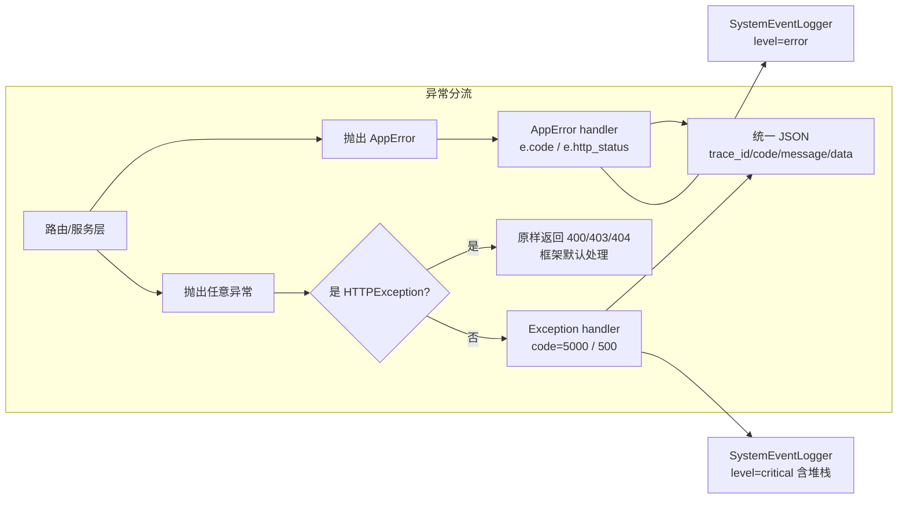
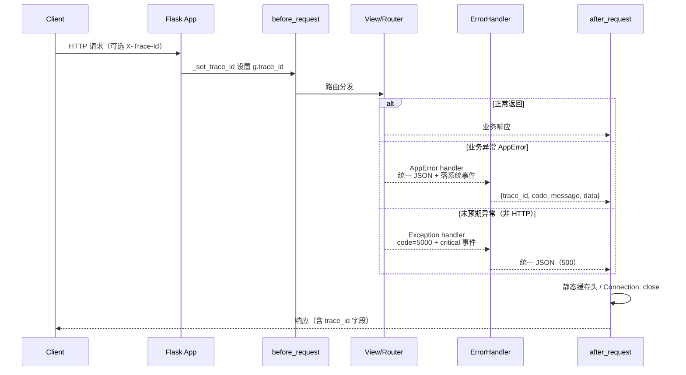

# 应用工厂与启动装配

## 页面定位

`create_app` 是整个 AwardIE-AgentFlow 系统的装配核心，位于 `app/__init__.py`。它接受一个配置类（缺省时自动解析），返回一个已完成配置加载、全局中间件注入、统一异常契约、全部蓝图注册和日志调度启动的 Flask 应用实例。理解本页即理解系统如何从 `run.py` 进入 Flask 生命周期，以及每个请求在进入路由前后会经过哪些系统级钩子。

## 启动入口：run.py 的引导序列

`run.py` 是进程级入口，在调用 `create_app` 之前完成四类环境准备：

1. **加载 .env**：尽早调用 `load_dotenv()`，使 `LOG_LEVEL`、`SECRET_KEY` 等环境变量在日志与配置解析前生效。
2. **剥离代理环境变量**：删除 `HTTP_PROXY`/`HTTPS_PROXY`/`ALL_PROXY` 及小写变体，并设置 `NO_PROXY=*`。这是有意的网络策略——本机常驻代理未启动时，`openai/httpx/requests` 会把 LLM/OCR 出站请求误发给死代理导致 Connection error，剥离后所有出站直连。
3. **日志系统初始化**：日志级别优先级为环境变量 `LOG_LEVEL` > `settings.json` 的 `flask.log_level` > 默认 INFO；配置控制台 + RotatingFileHandler（10MB×5 备份）双通道，并给每个 handler 挂载 `TraceIdFilter`——从 Flask `g` 中读取 `trace_id`，以 `[tid:xxx]` 形式注入每条日志记录，无请求上下文时为 `'-'`。
4. **安全调试开关**：`_should_enable_debug()` 硬约束（P0-3）——仅当 `FLASK_ENV=development` 且显式设置 `FLASK_DEBUG=1` 时才允许 `debug=True`。调试器等同于 RCE，禁止由配置文件隐式开启。

随后依次执行 `config = get_config()`（来自 `config/flask.py`）和 `app = create_app(config)`，最后以 `host='0.0.0.0'`、端口取自 `PORT`（默认 5001）进入 `app.run()`。

```mermaid
flowchart TD
    A[run.py 进程启动] --> B[load_dotenv 加载 .env]
    B --> C[剥离 HTTP(S)/ALL_PROXY 代理变量]
    C --> D[ConfigLoader 读取 settings.json<br/>确定 LOG_LEVEL 优先级]
    D --> E[配置控制台 + RotatingFileHandler<br/>挂载 TraceIdFilter]
    E --> F[get_config 选择配置类]
    F --> G{production 且弱 SECRET_KEY?}
    G -->|是| H[RuntimeError 拒绝启动<br/>fail-fast]
    G -->|否| I[app = create_app config]
    I --> J[app.run 0.0.0.0:PORT<br/>debug 受安全硬约束]
    J --> K[进入 Flask 请求生命周期]
```

关键节点：代理剥离和日志过滤器都发生在 `create_app` 之前，属于进程级环境准备；弱密钥校验在 `get_config()` 内部完成，生产环境命中即抛异常，不进入工厂函数。

## create_app 装配步骤

`create_app(config_class=None)` 按固定顺序完成以下装配。

### 1. Flask 实例化与配置加载

```python
app = Flask(__name__, template_folder='templates',
            static_folder='static', static_url_path='/static')
if config_class is None:
    from config.flask import get_config
    config_class = get_config()
app.config.from_object(config_class)
```

- 显式指定模板与静态目录，`static_url_path` 固定为 `/static`。
- `config.flask.get_config()` 的环境解析顺序：`settings.json` 的 `flask.env` → `FLASK_ENV` → `default`（DevelopmentConfig）。`config_map` 同时维护 development/production/testing 三套配置类。
- 生产环境在 `get_config()` 内调用 `validate_secret_key()`：SECRET_KEY 过短（<32 字符）或含 `dev-secret`、`change-in-production`、`secret-key`、`123456` 等占位词时直接抛 `RuntimeError`。开发/测试环境允许弱 key，但会打告警日志。
- `Config` 基类集中管理：`SECRET_KEY`、session cookie 名 `competition_session`/HttpOnly/SameSite=Lax（生产强制 Secure=True）、31 天会话生命周期、`DATABASE_PATH`、`FILES_DIR`、`MAX_CONTENT_LENGTH`（由 `settings.json` 的 `flask.max_content_length_mb` 换算字节）、`TEMPLATES_AUTO_RELOAD`。路径值经 `config.loader.ConfigLoader` 延迟加载，失败时降级为相对路径默认值。

### 2. trace_id 全链路透传

```python
def _current_trace_id():
    try:
        return _g.get('trace_id', None)
    except RuntimeError:
        return None

@app.before_request
def _set_trace_id():
    _g.trace_id = _request.headers.get('X-Trace-Id') or _uuid.uuid4().hex[:12]
```

- 每个请求在 `before_request` 阶段生成或透传 `trace_id`：优先取请求头 `X-Trace-Id`（外部链路透传），否则生成 12 位十六进制 UUID。
- `_current_trace_id()` 注册为 `app._current_trace_id`，成为 errorhandler 与 SystemEventLogger 的统一读取入口；无请求上下文（如启动期日志）时安全返回 None。这一设计修复了"`app._current_trace_id` 从未赋值、响应恒为 None"的存量缺陷。

### 3. CSRF 全局防护

```python
from flask_wtf.csrf import CSRFProtect
CSRFProtect(app)
```

- 所有写请求（POST/PUT/PATCH/DELETE）强制要求携带 CSRF Token。
- 前端注入契约：`csrf.js` 统一处理 fetch/XHR 自动加头、POST 表单动态补 hidden 字段；模板侧经 `csrf_token()` 输出 meta。
- CSRF 校验失败抛出的是框架级 `HTTPException`（400），会由后面的异常 handler 放行默认处理，不会被误包装成 500。

### 4. 统一异常契约

两个 `errorhandler` 组成响应契约的边界，业务侧只抛异常、不自行 `jsonify` 错误。

**AppError 处理器**（业务异常，`_handle_app_error`）：
- 将 `AppError` 及其子类翻译为统一 JSON：`{"trace_id": ..., "code": e.code, "message": e.message, "data": null}`，HTTP 状态码取 `e.http_status`。
- 以 `error` 级别调用 `SystemEventLogger.from_exception()` 落系统事件（`source_module="app.errorhandler"`），写入失败被吞掉，不阻断响应。
- 若异常为 `BreakerOpenError`，额外注入 `Retry-After: 60` 响应头，配合熔断降级。

**Exception 兜底处理器**（未预期异常，`_handle_unexpected_error`）：
- 首先判断 `werkzeug.exceptions.HTTPException`——CSRF 400、IDOR 403、404 等框架级响应原样返回，避免被误吞成 500（代码注释明确记录此为 L1 实测教训）。
- 其余异常以 `critical` 级别落系统事件（含堆栈），返回 `code=5000, message="服务器内部错误"` 的统一包装，HTTP 500。

错误码段位见 `backend/utils/app_error.py`：3xxx=业务状态机冲突（3001 状态冲突、3002 非 submit 不可审核、3003 重复入库、3004 驳回未修改重交，均 409）；2xxx=文件类错误（2002 类型拒绝 415、2003 过大 413）；4xxx=外部依赖（4003 熔断开启 503）；基类默认 5002/500。



关键节点：HTTPException 的放行判断是避免框架级错误被二次包装的关键；`BreakerOpenError` 由 handler 统一注入 `Retry-After`，业务侧无需关注响应头细节。

### 5. 蓝图注册

`_register_blueprints(app)` 使用函数内延迟 import（避免模块加载期循环依赖），集中注册 18 个蓝图，按角色与功能分组：

- **主角色**：`auth.bp`（无前缀，登录/登出）、`admin.bp`（/admin）、`teacher.bp`（/teacher）、`student.bp`（/student）。
- **API 与 AI**：`api.bp`（/api，统一 JSON 接口）、`chat.bp`（无前缀，智能助手 HTTP/SSE）。
- **管理子蓝图**：全部以 `/admin` 为前缀——成果汇总（admin_achievement）、奖状（admin_awards）、导出（admin_export）、实验室（admin_laboratory）、模板（admin_templates）、专利（admin_patents）、软著（admin_software）、大创（admin_innovation）、审核（admin_review）、其他文件（admin_other_files）、数据分析（admin_data_analysis）、日志（admin_log）。

同一前缀下多个蓝图共享 `/admin` 命名空间，Flask 按注册顺序匹配；各蓝图内部用 `url_for('.xxx')` 引用自身路由，跨蓝图需使用端点全名。

### 6. 上下文处理器与模板注入

`_register_context_processors` 注册 `inject_user`：
- 无条件注入 `get_competition_level_badge_class`（竞赛等级徽章样式工具函数）。
- 已登录时注入 `current_user`（含 `id/user_id`、`type/user_type`、`role`、`name/user_name` 等兼容字段）与 `user_route`/`user_route_name` 路由辅助函数。
- 未登录时 `current_user=None`，`user_route` 降级为返回 `'#'` 的空 Lambda，`user_route_name` 返回空字符串，保证模板渲染不因缺用户而崩溃。

### 7. 应用启动事件与日志调度

- 装配末尾写入一条 `system/info` 级系统事件："应用启动（env=...）"，来源标记 `app.create_app`，成为运维排障的启动锚点。
- 非测试环境（`not TESTING`）调用 `backend.utils.log_scheduler.start()`，启动后台调度线程：metrics 归档、每日报告、容量清理，防止长时间运行导致内存/日志膨胀。测试环境强制不启线程，避免污染测试进程。

### 8. 静态缓存与调试连接策略

两个 `after_request` 钩子：

- **静态强缓存**：`request.path` 以 `/static/vendor/` 开头时设置 `public, max-age=604800 (7天), immutable`；其他 `/static/` 资源 `public, max-age=3600 (1小时)`。两者均先将 `no_cache` 置 None 以移除 Flask 静态默认的 no-cache。模板引用多带 `?v=` 版本参数，改动时 bump 版本即可突破缓存。
- **调试连接关闭**：`DEBUG=True`（缺省视为 True）时每个响应追加 `Connection: close`，以独立短连接规避本机浏览器 keep-alive 连接池复用导致请求 Stalled 的问题（本地排障 P17/P18）。

## 请求生命周期



关键节点：`before_request` 是 trace_id 的唯一生成点；异常路径通过 errorhandler 统一收敛为契约 JSON；`after_request` 不修改业务 body，只追加缓存与连接语义。

## 关键状态与边界条件

| 状态/条件 | 行为 | 证据位置 |
|---|---|---|
| `config_class=None` | 自动从 `config.flask.get_config()` 解析环境 | `app/__init__.py#L24-L27` |
| `FLASK_ENV=production` 且弱 SECRET_KEY | `RuntimeError` 拒绝启动 | `config/flask.py#L50-L66` |
| 请求头带 `X-Trace-Id` | 透传外部 trace_id，否则生成 12 位 hex | `app/__init__.py#L41-L43` |
| 无请求上下文调用 `_current_trace_id()` | 返回 None（启动期日志安全） | `app/__init__.py#L35-L39` |
| `HTTPException` 进入 Exception handler | 原样返回，不二次包装 | `app/__init__.py#L79-L81` |
| `BreakerOpenError` | 响应附加 `Retry-After: 60` | `app/__init__.py#L68-L69` |
| `TESTING=True` | 不启动日志调度线程 | `app/__init__.py#L106-L108` |
| `DEBUG=True` | 响应附加 `Connection: close` | `app/__init__.py#L113-L117` |
| `/static/vendor/*` | 7 天 immutable 强缓存 | `app/__init__.py#L122-L128` |
| 其他 `/static/*` | 1 小时强缓存 | `app/__init__.py#L129-L132` |
| 未登录模板渲染 | `current_user=None`、`user_route` 返回 `'#'` | `app/__init__.py#L206-L211` |

## 扩展点

- **新增蓝图**：在 `app/routes/` 下定义模块级 `bp`，在 `_register_blueprints` 中 import 并注册即可；管理端子蓝图统一挂 `/admin`，新功能可按前缀自动归组。
- **新增业务异常**：继承 `AppError`，在 `backend/utils/app_error.py` 中登记错误码（遵守 API §1.2 段位），全局 handler 自动适配，无需改动 `create_app`。
- **配置环境扩展**：在 `config/flask.py` 的 `config_map` 中添加新配置类，并通过 `settings.json` 的 `flask.env` 选择。
- **模板能力注入**：`inject_user` 上下文处理器是向全站模板暴露工具函数与用户信息的唯一入口，新增全局模板函数在此扩展。
- **日志调度**：`start_log_scheduler()` 内部的归档/清理任务可独立启停；测试环境通过 `TESTING` 开关抑制线程。
- **静态缓存策略**：`_static_cache` 按路径前缀分流缓存策略，可扩展更多资源类别的缓存规则。

Sources: [app/__init__.py](app/__init__.py#L1-L215) [run.py](run.py#L1-L121) [config/flask.py](config/flask.py#L1-L138) [backend/utils/app_error.py](backend/utils/app_error.py#L1-L72) [config/loader.py](config/loader.py#L1-L120)