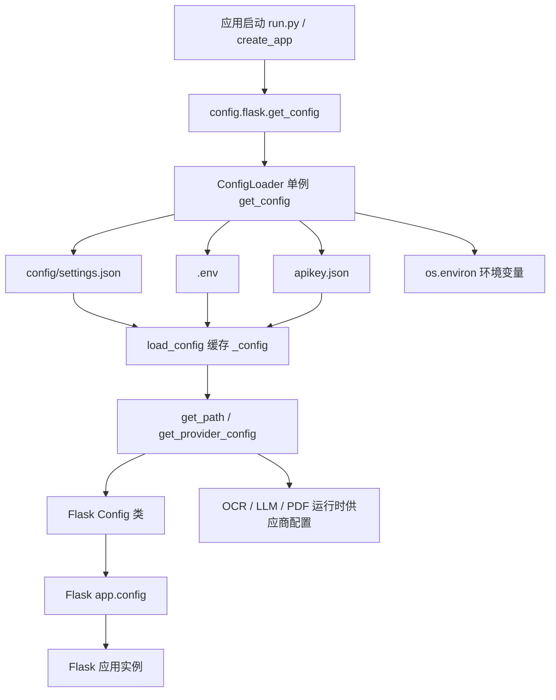

# 配置加载与运行时环境

## 概述

本页覆盖系统配置的加载链路与运行时环境：`config/loader.py` 提供统一的 `ConfigLoader`，从 `config/settings.json` 读取主配置，并从 `.env`、`apikey.json` 和环境变量中补充密钥；`config/flask.py` 将配置转换为 Flask `Config` 类，供应用工厂装配 Flask 实例。整个体系支持环境变量覆盖、密钥注入、配置缓存、运行时 OCR 供应商配置，以及生产环境弱密钥 fail-fast 校验。

## 模块职责

### ConfigLoader（config/loader.py）

- 负责定位项目根目录：`project_root` 被解析为 `config/` 的父目录，并通过 `resolve()` 转为绝对路径，避免部署时工作目录差异导致路径错误。
- 加载主配置：`load_config()` 读取 `config/settings.json`，支持移除 JSON 中的 `//` 和 `/* */` 注释，再解析为字典并缓存到 `self._config`。
- 加载 `.env`：若安装了 `python-dotenv`，会将项目根目录下的 `.env` 载入环境变量；未安装时发出告警。
- 密钥注入：`load_api_keys_into_env()` 根据 settings 中的 `api_key_env` / `secret_key_env` 声明，从 `apikey.json` 中取出用户实际密钥并写入 `os.environ`。OCR、LLM、PDF 三类 provider 均被覆盖。
- 供应商配置读取：`get_provider_config('ocr'|'llm', provider)` 获取指定供应商配置，并将 `xxx_env` 形式的值替换为环境变量中的真实值。
- 路径读取：`get_path(*path_keys)` 从 settings 中取相对路径，并基于 `project_root` 解析为绝对路径，例如数据库路径、文件目录、OCR runtime 状态文件路径。
- 配置校验：`validate()` 检查必需的顶级键 `ocr`、`llm`，并确保默认供应商存在于 `providers` 中。
- 单例模式：模块级 `_loader` 持有全局唯一的 `ConfigLoader`，通过 `get_config()` 获取。

### Flask Config（config/flask.py）

- 定义基础 `Config` 及 `DevelopmentConfig`、`ProductionConfig`、`TestingConfig` 三个环境子类。
- 从 `settings.json` 延迟读取路径：`_get_paths_from_config()` 调用 `ConfigLoader.get_path()` 获取数据库路径、文件目录和上传大小上限，避免硬编码；加载失败时退回默认路径和 50MB 上限。
- 提供 `get_config()` 选择配置类：优先取 `settings.json` 中 `flask.env`，其次取环境变量 `FLASK_ENV`，最终可回退到 `DevelopmentConfig`。
- 生产环境弱密钥保护：`validate_secret_key()` 在 `SECRET_KEY` 过短或包含占位词时抛出 `RuntimeError`，阻止生产环境使用可预测的签名密钥；开发/测试环境仅告警。

### settings.json（config/settings.json）

- 系统主配置，包含 `flask`、`ocr`、`llm`、`pdf`、`database`、`files`、`achievement_types`、`validation`、`extract` 等配置段。
- OCR 部分定义了 `default_provider`、各 provider 的 `api_key_env`、模型/接口参数、本地引擎参数、缓存开关与 `runtime_status_path`。
- LLM 部分类似，支持 API 型 provider 与本地 `ollama`，并配置 prompt 目录和缓存数据库。
- 大量领域常量也来自该文件，如竞赛等级、奖项等级、成果类型、校验规则、抽取扩展名等。

## 调用链与配置装配流程

关键节点说明：

- `config.flask.get_config()` 与 `config.loader.get_config()` 同名但职责不同：前者返回 Flask 配置类，后者返回 `ConfigLoader` 单例。
- `ConfigLoader.load_config()` 是核心入口：先读取解析 settings.json，再调用 `load_api_keys_into_env()` 注入密钥，之后所有配置读取都基于缓存的 `_config`。
- `get_provider_config()` 是运行时 OCR/LLM 配置的主要消费入口，它会复制 provider 配置并递归替换环境变量引用。
- `get_path()` 负责将 settings 中的相对路径解析为绝对路径，供 Flask 配置和业务模块使用。

## 关键状态

- `_loader`：模块级全局 `ConfigLoader` 单例，首次调用时创建。
- `_config`：`ConfigLoader` 内部缓存的 settings.json 解析结果；`reload()` 会清空缓存并强制重新加载。
- `os.environ`：作为密钥和运行时配置的最终载体，`api_key_env` 对应的环境变量在此被读取或写入。
- `_paths`：`config/flask.py` 模块级路径字典，包含 `database_path`、`files_dir`、`max_content_length_mb`。
- Flask Config 类属性：`SECRET_KEY`、`DATABASE_PATH`、`FILES_DIR`、`MAX_CONTENT_LENGTH`、Session Cookie 相关配置。

## 运行时 OCR 配置

- `settings.json` 的 `ocr` 段定义了默认供应商（当前为 `baidu`）、多个 provider（`zhipu`、`baidu`、`paddle`、`rapid`）、OCR 缓存数据库路径，以及运行时状态文件路径 `config/ocr_runtime.json`。
- provider 的密钥不直接写在 settings 中，而是通过 `api_key_env` 指定环境变量名，例如 `BAIDU_API_KEY`、`ZHIPUAI_API_KEY`。
- 百度 OCR 还支持 `secret_key_env`，`load_api_keys_into_env()` 兼容 `baidu_secret` 和 `baidu_secret_key` 两种键名，避免密钥静默缺失。
- 运行时配置可通过 `ConfigLoader.get_provider_config('ocr', provider)` 获取，环境变量引用会在返回前被替换为真实值。

## 边界条件

- `settings.json` 不存在时抛出 `ConfigFileNotFoundError`；JSON 解析失败抛出 `ConfigParseError`。
- 请求不存在的 provider 时抛出 `ConfigProviderNotFoundError`，并列出可用 provider。
- `get_path()` 遇到缺失键或非字符串值会抛出 `KeyError` / `ValueError`。
- `ConfigLoader.validate()` 要求 `ocr` 和 `llm` 均存在 `default_provider` 且默认供应商在 `providers` 中。
- `get_provider_config()` 目前仅接受 `ocr` 和 `llm`；PDF 密钥注入已支持，但 provider 查询逻辑仍需扩展才能覆盖 `pdf`。
- `config/flask.py` 中如果配置加载失败，会降级使用默认相对路径和 50MB 上传上限，保证开发环境能启动。
- 生产环境 `SECRET_KEY` 长度不足 32 或包含占位词时，应用拒绝启动；开发/测试环境仅记录告警。

## 扩展点

- 新增 OCR/LLM provider：在 `settings.json` 对应模块的 `providers` 中添加配置，并设置 `api_key_env`，然后在 `apikey.json` 或环境变量中提供密钥。
- 新增密钥类型：沿用 `api_key_env` / `secret_key_env` 命名约定，并在 `load_api_keys_into_env()` 中按模块补充注入逻辑。
- 支持新的配置模块：将 `get_provider_config()` 的模块白名单从 `['ocr', 'llm']` 扩展，使其可读取 `pdf` 等运行时 provider 配置。
- 运行时重载：调用 `ConfigLoader.reload()` 可清空缓存并重新加载 settings，便于运行时更新配置。
- 新增环境配置：在 `config/flask.py` 的 `config_map` 中注册新的配置类，并根据 `settings.json` 的 `flask.env` 选择。

Sources: [config/loader.py](config/loader.py#L1-L387), [config/flask.py](config/flask.py#L1-L138), [config/settings.json](config/settings.json#L1-L330)