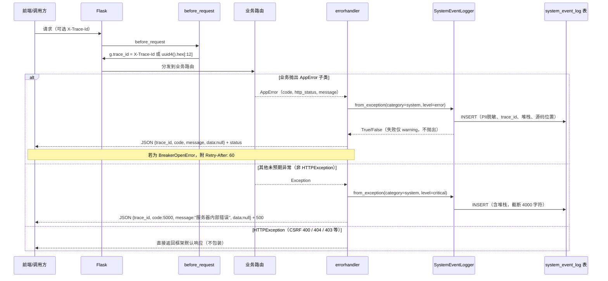

# 统一异常契约与错误码

## 模块职责

统一异常契约层由三部分协作完成：

1. **异常定义**（`backend/utils/app_error.py`）：`AppError` 作为业务异常基类，携带 `code`（业务错误码）与 `http_status`（HTTP 响应码）。业务侧只抛异常、不自行 `jsonify` 错误，从机制上根治"各接口各写各的错误格式"的问题。
2. **全局翻译器**（`app/__init__.py`）：在 Flask 应用工厂中注册 `AppError` 与 `Exception` 两个 errorhandler，将异常统一翻译为固定 JSON 包装 `{trace_id, code, message, data}`，并同步将异常写入系统事件表。
3. **系统事件落库**（`backend/utils/system_event_logger.py` + `backend/orm/system_event_log.py`）：以 best-effort 方式记录异常的类别、级别、消息、堆栈、`trace_id`、操作人与源码位置，供后端排障与审计视图查询。

契约的核心价值在于：**前端只需要识别一个固定响应结构；后端排障时通过 `trace_id` 关联全链路。**

## 统一响应包装

所有被全局 handler 捕获的异常最终返回：

```json
{
  "trace_id": "a1b2c3d4e5f6",
  "code": 3001,
  "message": "……",
  "data": null
}
```

- `trace_id`：请求进入时由 `before_request` 生成（优先透传 `X-Trace-Id` 请求头，否则生成 12 位 uuid 十六进制片段），存入 Flask `g`，errorhandler 经 `app._current_trace_id()` 统一读取。
- `code`：业务错误码，由异常类或兜底逻辑决定。
- `message`：面向调用方的错误描述。
- `data`：当前固定为 `null`，作为契约预留字段。

响应 HTTP 状态码与异常类的 `http_status` 一致。`BreakerOpenError` 还会额外注入 `Retry-After` 头，供客户端限速重试。

## 错误码体系

源码中的错误码定义如下（段位注释见 `app_error.py` 头部，设计 API §1.2）：

| 码段 | 错误码 | 含义 | HTTP | 异常类 |
| --- | --- | --- | --- | --- |
| 2xxx 文件 | 2002 | 文件类型被拒绝 | 415 | `FileTypeDenied` |
|  | 2003 | 文件过大 | 413 | `FileTooLarge` |
| 3xxx 业务状态机 | 3001 | 乐观锁/状态机并发冲突 | 409 | `StateConflictError` |
|  | 3002 | 非 submit 状态不可审核 | 409 | `NotSubmittableError` |
|  | 3003 | 重复入库（唯一索引拦截） | 409 | `DuplicateEntryError` |
|  | 3004 | 驳回后未修改不可重交 | 409 | `RejectWithoutEditError` |
| 4xxx 外部服务 | 4003 | 熔断器开启中 | 503 | `BreakerOpenError` |
| 5xxx 系统通用 | 5000 | 未预期异常兜底 | 500 | 全局 `Exception` handler |
|  | 5002 | 默认业务异常 | 500 | `AppError` 基类 |

`AppError` 默认 `code=5002, http_status=500`，实例化时可覆盖。新增业务异常应继承 `AppError` 并显式设置 `code/http_status`，且必须在 `__all__` 中登记（`app_error.py` 注释明确要求"新增异常在此登记"）。

## 调用链

以一次业务抛错为例：



关键节点说明：

1. **`before_request` 设置 trace_id**：这是统一包装中 `trace_id` 的唯一来源，也是链路贯穿的起点。
2. **AppError 专用 handler**：优先于通用 `Exception` handler 被 Flask 匹配，负责业务错误的翻译。
3. **通用 Exception handler 的 HTTPException 放行**：如果不放行，CSRF 防护的 400、权限不足的 403 等框架级响应会被误吞成 `5000` 统一错误，破坏框架语义（源码注释明确提到这是 L1 实测教训）。
4. **系统事件写入失败被吞**：事件落库是辅助行为，绝不影响主响应返回。

## 系统事件落库

两个 errorhandler 均调用 `SystemEventLogger.from_exception()`：

- `AppError`：`category="system"`、`level="error"`、`message=f"AppError {e.code}: {e.message}"`。
- 未预期异常：`category="system"`、`level="critical"`、消息默认为 `类型名: 异常内容`。
- `from_exception` 自动提取 `traceback` 最后一个栈帧作为 `source_file/source_line`，并将完整堆栈截断 4000 字符放入 `detail`。
- operator 解析优先级：显式 `operator` 字典 > Flask `session`（`user_id`）> 空。
- PII 脱敏：写入前对身份证（15/18 位）、手机号、学号进行掩码。

`system_event_log` 表由 ORM 模型 `SystemEventLog` 定义，与迁移 0006 同步；`_ensure_table` 为老库提供兜底建表。

## 主要文件

| 文件 | 职责 |
| --- | --- |
| `backend/utils/app_error.py` | `AppError` 基类与业务异常子类、错误码定义、`__all__` 登记 |
| `app/__init__.py` | 注册 `before_request`（trace_id）与两个全局 errorhandler，构造统一 JSON 响应 |
| `backend/utils/system_event_logger.py` | 系统事件写入器：类别/级别校验、PII 脱敏、独立连接、失败吞掉 |
| `backend/orm/system_event_log.py` | `system_event_log` 表 ORM 映射 |

## 边界条件

1. **HTTPException 不包装**：`Exception` handler 先判断 `isinstance(e, HTTPException)`，是则 `return e` 走 Flask 默认处理。
2. **无请求上下文时 trace_id 为 None**：`_current_trace_id()` 捕获 `RuntimeError` 返回 `None`，保证启动期日志等场景不炸。
3. **系统事件库文件不存在时跳过写入**：避免 `sqlite3.connect` 对不存在路径静默创建空库文件（CI 场景）；无库环境不落事件属预期，debug 级不刷 warning 噪声。
4. **事件写入任何失败均被吞**：`log()` 外层 `try/except` 捕获所有异常，仅 `logger.warning` 后返回 `False`；写入失败不阻塞主业务。
5. **非法 category/level 拒绝写入**：`EVENT_CATEGORIES` / `EVENT_LEVELS` 为 `frozenset`，不匹配直接返回 `False`。
6. **部分历史接口保留自有错误格式**：如 `app/routes/api.py` 的 `audit_timeline` 仍自行 `try/except` 返回 `{'success': False}` JSON。统一契约对新抛异常强制生效，对既有接口以兼容过渡为主。
7. **抽取模块异常不直接继承 AppError**：`backend/extract/exceptions.py` 的 `ExtractError` 体系与 `AppError` 独立；抽取异常需在业务调用层转换为 `AppError`，或落入全局 `5000` 兜底。

## 扩展点

- **新增业务异常**：继承 `AppError`，设置 `code` 与 `http_status`，在 `app_error.py` 的 `__all__` 登记；无需改动 errorhandler。
- **错误码段位**：新增码值应落入对应段位（2xxx 文件、3xxx 业务状态机、4xxx 外部服务/熔断、5xxx 系统通用），避免语义混乱。
- **熔断重试时间**：`BreakerOpenError` 构造时传入 `retry_after`，handler 自动附 `Retry-After` 头。
- **事件类别扩展**：如需新增事件类别，需同步扩充 `SystemEventLogger.EVENT_CATEGORIES` frozenset。
- **data 字段**：响应契约中的 `data` 当前恒为 `null`；未来如需携带结构化错误详情，可直接在 handler 中填充，前端契约不变。

Sources:
- [backend/utils/app_error.py](backend/utils/app_error.py#L1-L72)
- [app/__init__.py](app/__init__.py#L1-L215)
- [backend/utils/system_event_logger.py](backend/utils/system_event_logger.py#L1-L153)
- [backend/orm/system_event_log.py](backend/orm/system_event_log.py#L1-L25)
- [app/routes/api.py](app/routes/api.py#L28-L74)
- [backend/extract/exceptions.py](backend/extract/exceptions.py#L10-L31)