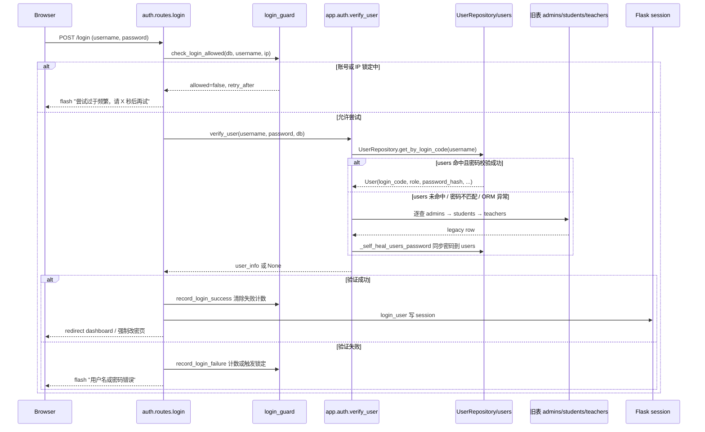

# 认证与会话管理

## 模块职责

认证与会话管理负责四件事：

1. **登录验证**：支持 `users` 单表优先、旧 `admins / students / teachers` 三表回退的渐进式认证。
2. **会话写入与销毁**：登录成功后把用户身份写入 Flask `session`，登出时 `session.clear()`。
3. **权限控制**：提供页面级与 API 级装饰器，统一拦截未登录、角色不足的请求。
4. **登录安全前置**：在密码校验前检查账号/IP 锁定状态，失败落库计数，成功清除计数。

核心代码分为认证函数模块 `app/auth.py` 和认证路由蓝图 `app/routes/auth.py`，后者负责 HTTP 入口，前者负责业务验证与装饰器。

## 主要文件

| 文件 | 职责 |
|---|---|
| `app/auth.py` | 用户验证、`session` 读写、权限装饰器、旧表回退与自愈同步 |
| `app/routes/auth.py` | `/login`、`/logout` 路由及登录跳转逻辑，挂载若干登录保护的文件访问端点 |
| `backend/utils/login_guard.py` | `failed_logins` 落库限速：账号/IP 双维度失败计数与锁定 |
| `backend/orm/users.py` | `users` 单表 ORM 模型，统一承载学生/教师/管理员身份 |
| `backend/orm/repositories.py` | `UserRepository`，提供 `users` 表的 ORM 读路径和幂等写路径 |

## 登录调用链

`auth.routes.login` 的完整调用链如下：

关键节点说明：

- `check_login_allowed` 在密码验证前执行，避免暴力破解消耗数据库验证资源。
- `verify_user` 是渐进式认证的核心：先走 `users` 单表，命中失败再回退旧三表。
- `record_login_success` 会同时删除该账号和该 IP 的失败记录，相当于解锁。
- `login_user` 只写入 `session`，后续装饰器不再查询数据库，性能较好。

## 渐进式认证：users 单表优先 + 旧三表回退

`verify_user` 的认证策略可以概括为：

1. **users 单表优先**：通过 `UserRepository.get_by_login_code(username)` 找用户，若 `user_activated` 为真且 `check_password_hash` 通过，直接返回用户信息。这一步用一条 SQL 替代旧三表逐查。
2. **ORM 异常兜底**：如果 ORM 不可用、数据库未迁移等，捕获异常并进入旧表回退路径。
3. **旧三表回退**：依次查询 `admins`、`students`、`teachers`：
   - `admins` 表不存在时捕获 `sqlite3.OperationalError` 继续向下查。
   - `students`、`teachers` 查询当前依赖迁移链保证表存在。
   - 空 `password_hash` 一律拒绝登录，不再保留“默认密码可登录”的旧兜底。
4. **自愈同步**：一旦旧表验证成功，`_self_heal_users_password` 会把旧表密码哈希同步进 `users`，避免两表漂移。自愈失败不影响登录。
5. **返回业务号**：当前返回的 `user_id` 仍使用 `login_code`（学号/工号/管理员用户名），以兼容存量路由；注释明确后续写入时会映射为 `users.id`。

这一策略的目标是让 `users` 单表逐步成为唯一真源，旧三表回退仅作为过渡兼容分支存在。

## 会话与权限装饰器

### Session 关键字段

`login_user(user_info)` 写入以下 session 键：

| 键 | 来源 | 说明 |
|---|---|---|
| `user_id` | `user_info['user_id']` | 当前为业务登录号，兼容旧路由 |
| `user_type` | `user_info['user_type']` | `student` / `teacher` / `admin` |
| `user_name` | `user_info['name']` | 显示名 |
| `role` | `user_info['role']` | 角色权限判断依据 |
| `needs_password_change` | 登录路由额外写入 | 首次登录强制改密标记 |

同时设置 `session.permanent = True`。登出时 `logout_user()` 调用 `session.clear()`。

### 装饰器

| 装饰器 | 行为 |
|---|---|
| `require_login` | 未登录则 flash「请先登录」并跳转 `/login?next=当前地址` |
| `require_role(*roles)` | 要求登录，且 `session['role']` 小写后命中允许角色列表 |
| `require_user_type(*types)` | 要求登录，`user_type` 或 `role` 命中允许类型即可 |
| `require_role_api(*roles)` | API 版本：未登录返回 JSON 401，角色不足返回 JSON 403 |

`app/routes/auth.py` 中的文件访问端点也大量使用 `require_login`，并叠加 mimetype 白名单、强制下载和归属校验，体现认证与文件安全边界结合。

## 登录限速与失败锁定

`backend/utils/login_guard.py` 使用 SQLite 表 `failed_logins` 实现不依赖 Redis 的落库限速：

- 账号维度：连续失败 5 次锁 15 分钟。
- IP 维度：1 分钟窗口内失败 10 次锁 5 分钟。
- 账号行与 IP 行独立计数，避免两维度命中同一行导致计数叠加。
- 锁定期内统一返回「尝试过于频繁」，不区分“账号不存在”与“密码错误”，防止账号枚举。
- 达到锁定阈值时写入系统安全事件。
- 登录成功后会删除该账号和该 IP 的失败记录。

## 关键状态

| 对象 | 状态/字段 | 含义 |
|---|---|---|
| `users.user_activated` | 0 / 1 | 是否允许登录 |
| `users.password_hash` | None 或哈希 | 空哈希拒绝登录 |
| `users.needs_password_change` | 0 / 1 | 是否需要强制改密 |
| `failed_logins` | `fail_count`, `first_fail_at`, `lock_until` | 记录失败窗口和锁定到期时间 |
| `session` | `user_id` etc. | 登录会话状态，登出时清空 |

## 边界条件

- 用户名或密码为空时，路由直接返回错误，不进入数据库。
- `user_activated` 为假时，即使密码正确也返回 `None`。
- `users` 密码不匹配时不会立即拒绝，而是继续走旧表回退，给自愈机会。
- `admins` 表不存在时可跳过；`students` 和 `teachers` 表查询当前假设迁移链保证存在。
- 自愈更新 `users.password_hash` 的 SQLite 异常会被吞掉，不影响本次登录。
- `needs_password_change` 为真时，登录成功后写入 session 并跳转到对应角色的「修改密码」页签。

## 扩展点

- `UserRepository` 已提供 `get_by_login_code`、`get_by_id`、`list_by_role` 和幂等 `create_user`，是 `users` 单表完全接管旧三表读写的演进入口。
- 登录限速阈值集中在 `backend/utils/login_guard.py` 顶部，可直接调整。
- 页面权限可组合使用 `require_login` / `require_role` / `require_user_type`；API 路由使用 `require_role_api`，便于前后端分离后统一返回 JSON。
- 当旧表彻底移除后，`verify_user` 中的“旧三表回退”分支可以整体删除，只保留 `users` 单表路径。

Sources: [app/auth.py](app/auth.py#L1-L240), [app/routes/auth.py](app/routes/auth.py#L1-L202), [backend/utils/login_guard.py](backend/utils/login_guard.py#L1-L137), [backend/orm/users.py](backend/orm/users.py#L1-L38), [backend/orm/repositories.py](backend/orm/repositories.py#L1-L158)