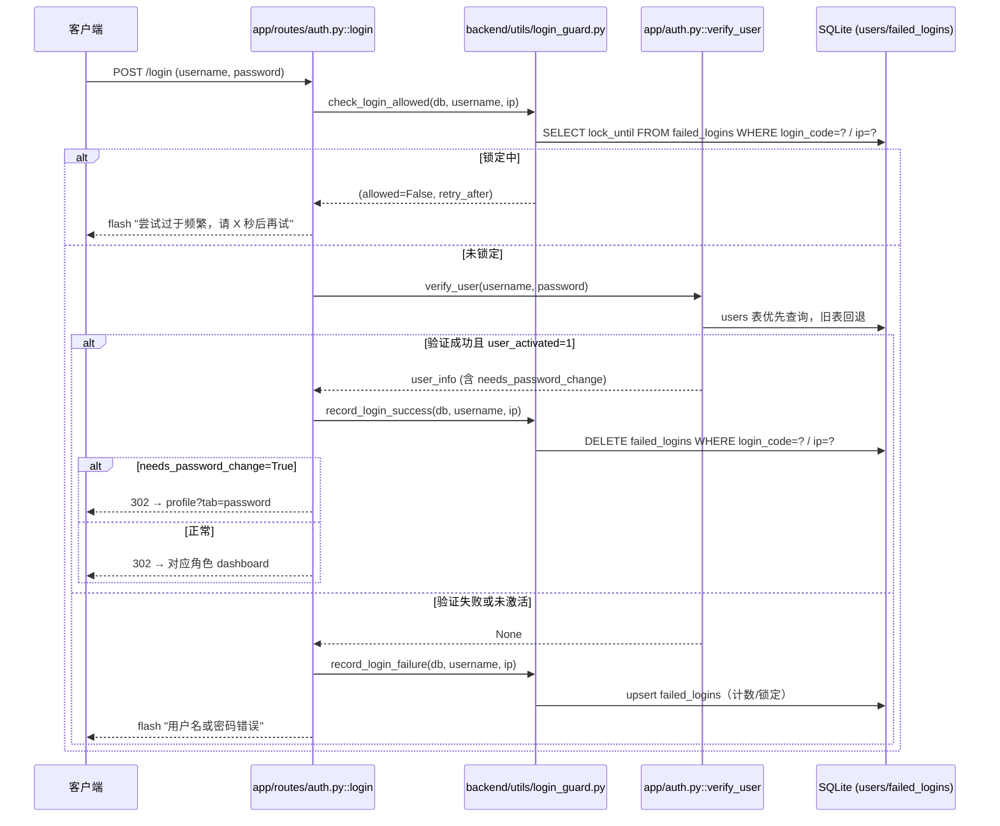

## 密码强度与账号安全

该模块负责账号凭证的“入场”安全：在登录前拦截锁定账号、登录时验证激活状态与密码强度、登录后按需强制改密、改密时执行复杂规则校验。它由 `app/password_policy.py`（强度校验与生成）、`backend/utils/login_guard.py`（失败锁定）、`app/auth.py`（用户验证）、`app/routes/auth.py`（登录入口）、`app/routes/user_common.py`（改密落地）协同完成，覆盖普通账号、管理员账号的差异化安全要求。

### 1. 模块职责

| 组件 | 职责 |
| --- | --- |
| `app/password_policy.py` | 密码复杂度校验、强密码生成。定义普通账号（>8 位，即 ≥9）和管理员（≥12）的不同门槛；四类字符至少出现 3 种；禁止 5 位及以上键盘连续序列（含倒序）。 |
| `backend/utils/login_guard.py` | 登录失败锁定，基于 SQLite `failed_logins` 表实现账号级 + IP 级限速，无 Redis 依赖。账号连续失败 5 次锁 15 分钟；IP 窗口 1 分钟失败 10 次锁 5 分钟。 |
| `app/auth.py::verify_user` | 用户凭证验证。`users` 单表优先，旧三表回退；只允许 `user_activated=1` 的用户登录；返回 `needs_password_change` 标记；旧表登录成功后自愈同步密码到 `users`。 |
| `app/routes/auth.py::login` | 登录路由编排：先查锁定态 → 调 `verify_user` → 成功清计数/失败记计数 → 首登强制改密跳转。 |
| `app/routes/user_common.py::change_password` | 修改密码路由：核验旧密码、调用密码强度校验、额外禁止与旧密码相同或包含登录号，成功后写入 `users` 表并清除 `needs_password_change` 标记。 |

### 2. 调用链

登录链路（`app/routes/auth.py::login`）：

1. 客户端提交用户名/密码。
2. 调用 `check_login_allowed(db_path, username, ip)`，若处于锁定期，直接返回“尝试过于频繁”并携带剩余秒数。
3. 通过锁定检查后，调用 `verify_user(username, password, db_path)` 验证身份。
   - `users` 表优先：经 `UserRepository.get_by_login_code` 查询，校验 `user_activated` 与 `password_hash`。
   - 未命中或 ORM 异常时，回退到 `admins`/`students`/`teachers` 旧表，同样检查激活与密码。
4. 验证成功：调用 `record_login_success` 清除账号与 IP 的失败计数；若 `needs_password_change=True`，写入 `session['needs_password_change']` 并重定向到对应角色 `profile?tab=password`；否则按角色跳转看板。
5. 验证失败：调用 `record_login_failure` 记录失败（账号/IP 维度各自计数），并对达到阈值的维度写入 `lock_until`，触发系统事件日志。

修改密码链路（`app/routes/user_common.py::change_password`）：

1. 前端提交 `old_password` / `new_password`。
2. 校验旧密码：`check_password_hash(user.password_hash, old_password)`。
3. 执行强度校验：`validate_password_strength(new_password)`，并检查“新密码与旧密码相同”、“包含学号/工号”。
4. 通过后，`UserRepository.update_password(str(user_id), new_hash, needs_password_change=0)` 写入 `users` 表（旧表视图化后不再直接写）。
5. 清除 `session['needs_password_change']`，返回成功。

### 3. 关键状态

- **账号激活**：`users.user_activated`（旧表中同名）——为 0 时一律拒绝登录。
- **强制改密**：`users.needs_password_change` ——登录成功后若为 1，则强制跳转改密页，直到改密成功清零。
- **登录锁定**：`failed_logins.lock_until` ——非空且未过期时禁止登录尝试；账号/IP 维度独立存储与判断。
- **Session 标记**：`session['needs_password_change']` ——登录时写入，改密成功后弹出，用于控制页面访问（如 dashboard 路由也检查该标记）。

### 4. 主要文件

- `app/password_policy.py` — 密码规则定义与生成器。
- `backend/utils/login_guard.py` — 锁定逻辑、DDL、计数/清除。
- `app/auth.py` — 用户验证、自愈同步、会话工具。
- `app/routes/auth.py` — 登录/登出路由，锁定判断与强制改密入口。
- `app/routes/user_common.py` — 学生/教师共用的改密 POST 路由。

### 5. 边界条件

- **密码策略**：空密码直接拒绝；管理员与普通账号长度门槛不同；四类字符统计基于 `[a-z]`、`[A-Z]`、`\d`、非字母数字；键盘序列通过预生成的 `_FORBIDDEN_RUNS` 集合匹配，覆盖 QWERTY 主行、数字行、字母序正反序。
- **登录锁定**：锁定提示统一，不区分账号是否存在，防止枚举；账号与 IP 使用独立行记录（`login_code` 和 `ip` 二者必有一个为空串），避免两个维度计数叠加误触发。
- **失败记录窗口**：账号维度按 15 分钟窗口，IP 维度按 1 分钟窗口；窗口外重记。锁定触发时写入 SystemEventLogger 的 `auth/warning` 事件。
- **旧表回退**：新库无 ORM 或未迁移时，`verify_user` 回退到原生 SQL 查询旧表；旧表验证成功会“自愈”同步密码哈希到 `users`，避免两表漂移。
- **默认密码兜底已移除**：旧表中空 `password_hash` 一律拒绝登录（P1-2 安全整改）。

### 6. 扩展点

- **密码规则**：`password_policy.py` 的常量（`MIN_LENGTH_*`、`KEYBOARD_RUN_LEN`、`_SPECIAL`）可调整；校验函数返回 `(ok, msg)`，便于前端直接展示或二次定制。
- **登录限速**：`login_guard.py` 的阈值常量可配置化；模块注释明确 flask-limiter + Redis 为完整方案，当前落库兜底可平滑替换或并存。
- **角色差异化**：`validate_password_strength` 的 `is_admin` 参数已支持管理员更严策略，未来可扩展更多角色维度。
- **账号状态机**：`user_activated`、`needs_password_change` 字段可支撑“未激活→激活→首次改密→正常→锁定/失活”的完整状态流转。

### 7. 登录流程时序图

图的关键节点：
- `check_login_allowed` 在登录前率先拦截锁定账号，避免无效哈希计算并统一提示，防账号枚举。
- `verify_user` 内同时处理激活状态与密码验证，`needs_password_change` 随用户信息返回，交由路由决定是否强制跳转。
- `record_login_failure` 按账号/IP 双维度记录，分别触发锁定阈值；锁定触发后写入系统事件，便于审计。

Sources: [app/password_policy.py](app/password_policy.py#L1-L64) [backend/utils/login_guard.py](backend/utils/login_guard.py#L1-L137) [app/auth.py](app/auth.py#L1-L221) [app/routes/auth.py](app/routes/auth.py#L1-L202) [app/routes/user_common.py](app/routes/user_common.py#L1-L221)