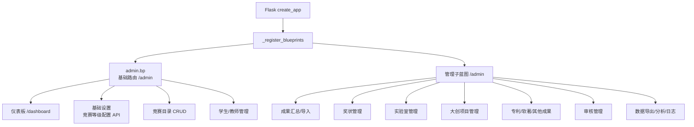
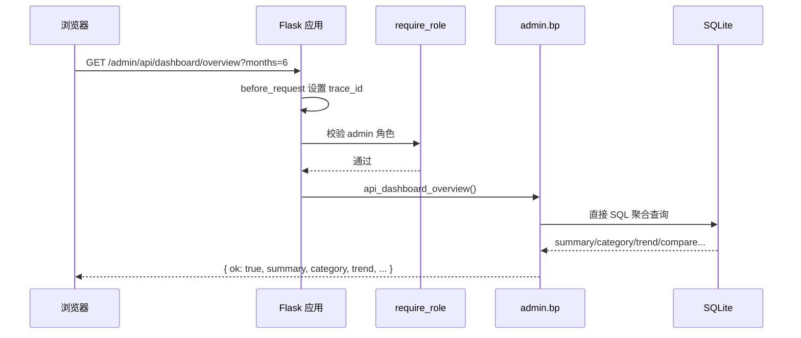

## 管理后台基础路由

### 模块职责

`app/routes/admin.py` 是管理后台的**基础蓝图**（`bp = Blueprint('admin', __name__)`），以 `/admin` 为前缀挂载到 Flask 应用。它承担四类职责：

1. **管理员仪表板**：渲染 `admin/dashboard.html`，并通过 `/admin/api/dashboard/overview` 提供成果数据总览聚合接口。
2. **基础设置**：提供竞赛等级配置读取接口，颜色映射与等级列表均来自 `config/settings.json`，不硬编码。
3. **人员与活动管理入口**：包含竞赛目录 CRUD、快速添加竞赛、添加别名，以及学生/教师管理页面入口。
4. **管理子蓝图汇总中枢**：在 `app/__init__.py` 的 `_register_blueprints()` 中，将所有管理子蓝图统一注册到 `/admin` 前缀下。

### 蓝图注册与子蓝图汇总

`app/__init__.py` 的 `_register_blueprints()` 先注册基础 `admin.bp`，再依次注册以下子蓝图，全部使用 `url_prefix='/admin'`：

- `admin_achievement`：成果汇总与文件导入
- `admin_awards`：奖状管理
- `admin_export`：数据导出与报表
- `admin_laboratory`：实验室管理
- `admin_templates`：模板管理
- `admin_patents` / `admin_software` / `admin_other_files`：专利、软著、其他成果
- `admin_innovation`：大创项目管理
- `admin_review`：审核管理
- `admin_data_analysis`：数据分析看板
- `admin_log`：操作日志与审计

这些子蓝图与基础蓝图共享 `/admin` 前缀，按具体 path 精确匹配，互不冲突，形成了“**基础入口 + 领域子模块**”的管理后台架构。

关键节点说明：

- `admin.bp` 是基础路由，处理管理员公共页面和通用管理入口。
- 各子蓝图通过统一注册机制挂载在 `/admin` 下，每个子蓝图只负责一个业务域，便于横向扩展。
- 新增管理功能时，只需新建蓝图并在 `_register_blueprints()` 中追加一行注册即可。

### 调用链

以仪表板接口为例：

在基础路由中，部分操作走 `get_app_context_instance()` 获取应用上下文单例，再通过 `CompetitionManager` 等管理对象完成业务操作；仪表板接口则直接使用 `backend.utils.db_connection.get_connection()` 连接 `competitions.db` 执行聚合 SQL。

### 关键状态

- **认证状态**：所有基础路由都使用 `@require_role('admin')` 或 `@require_role_api` 保护，只有管理员角色可访问。
- **应用上下文单例**：`get_app_context_instance()` 返回全局应用上下文，内部持有竞赛管理器、学生管理器等，是路由与底层数据模型之间的中间层。
- **运行时配置**：`get_config()` 读取 `settings.json`，其中 `validation.competition_levels` 与 `ui.competition_level_colors` 分别驱动竞赛等级校验和前端颜色展示。
- **仪表板查询口径**：直接 SQL 统计 `awards`、`pending_achievements`、`competitions`、`patents`、`software_copyrights`、`innovation_projects`、`other_files` 的数量，并支持 `months` 参数过滤近 N 月趋势。

### 主要文件

| 文件 | 职责 |
|---|---|
| `app/routes/admin.py` | 基础蓝图，负责仪表板、配置 API、竞赛目录、人员管理等 |
| `app/__init__.py` | 统一注册所有管理蓝图 |
| `app/auth.py` | 提供 `require_role`/`require_role_api` 管理员角色校验 |
| `app/templates/admin/dashboard.html` | 仪表板页面 |
| `app/templates/admin/settings.html` | 基础设置页面 |
| `app/templates/admin/competitions/` | 竞赛列表、详情、编辑模板 |
| `app/templates/admin/students/`、`teachers/` | 人员管理页面模板 |

### 边界条件

- **角色保护**：所有管理路由均需 `admin` 角色，未授权请求会被认证装饰器拦截。
- **数据库连接异常**：仪表板接口中，`get_connection()` 失败时返回 `{ ok: false, error }` 和 HTTP 500，并在 `finally` 中关闭连接。
- **环比除零**：上月奖状数为 0 时，`delta_pct` 置为 `None`，避免除零错误。
- **`months` 可选**：缺省时返回全量趋势；传入时以当月为起点向前回推 N 个月。
- **配置缺失**：`validation.competition_levels` 或 `ui.competition_level_colors` 缺失/为空时，接口返回 500，并在 DEBUG 模式下附带 traceback。
- **竞赛名称为空**：快速添加竞赛时，`name` 为空直接返回 400。
- **重复竞赛**：快速添加前通过 `match_competition()` 检查，避免创建重复竞赛。
- **分页边界**：竞赛列表页对页码做 `max(1, min(page, total_pages))` 钳制，避免越界。

### 扩展点

- **新增管理子蓝图**：在 `app/routes/` 下新建模块，定义 `bp = Blueprint(...)`，然后在 `_register_blueprints()` 中注册到 `/admin` 前缀。现有十二个子蓝图均遵循这一模式。
- **扩展仪表板数据源**：`api_dashboard_overview()` 返回的 JSON 结构可继续追加统计字段，前端 `dashboard.html` 按需消费。
- **配置驱动 UI**：竞赛等级与颜色映射全部来自 `config/settings.json`，新增等级/配色无需修改 Python 代码。
- **竞赛管理能力**：竞赛 CRUD 均通过 `CompetitionManager` 完成，替换或增强底层存储时只需扩展该管理器。

Sources: [app/routes/admin.py](app/routes/admin.py#L1-L240), [app/routes/admin.py](app/routes/admin.py#L240-L520), [app/routes/admin.py](app/routes/admin.py#L520-L760), [app/__init__.py](app/__init__.py#L142-L175)