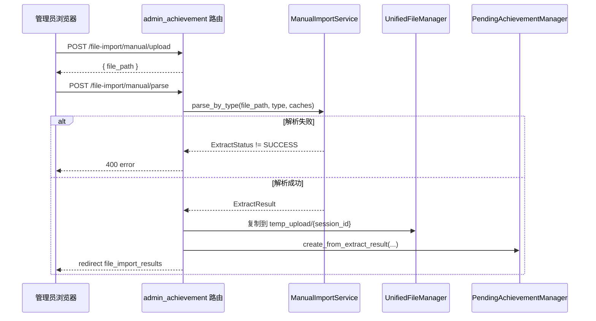
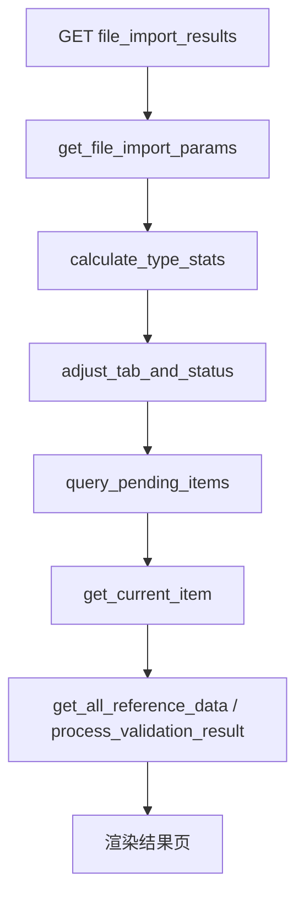

# 成果汇总与文件导入

## 模块职责

`app/routes/admin_achievement.py` 是管理端成果相关路由的汇总蓝图，蓝图名为 `admin_achievement`，与奖状管理路由 `admin_awards` 分离。它主要承担：

- 成果汇总页 `/achievements`：一个包含奖状、专利、软著、大创、其他文件五个 tab 的统一页面；
- 成果数量统计 API `/api/achievements/counts`：返回各成果类型数量；
- 文件导入页 `/file-import`：上传页面；
- 手动导入 JSON 接口：上传临时文件、按类型解析并生成待审核记录；
- 导入时的实验室自动关联：根据第一导师姓名解析所属实验室，并为大创项目逐个补齐 `laboratory_id`。

`app/routes/file_import_helpers.py` 是上述路由复用的辅助逻辑层，负责：

- 读取 `achievement_types` 成果类型配置；
- 读取导入结果页 URL 参数；
- 计算本次导入中各类型数量统计；
- 调整当前 tab 和子状态，确保页面始终展示有数据的类型；
- 查询待审核 pending 记录；
- 准备竞赛、学生、教师、实验室等参考数据；
- 将校验结果转换为字段级错误映射。

## 路由与调用链

### 成果汇总页

管理员访问 `/achievements` 时，`achievements()` 通过 `get_app_context_instance()` 获取竞赛管理器和实验室管理器，将竞赛列表、实验室列表连同 `tab` 参数一起渲染到 `admin/achievements.html`。前端可通过 `/api/achievements/counts` 获取各 tab 数量，该接口使用 `require_admin_or_lab_view_api`，允许管理员或实验室查看角色调用；`other` 类型数量来自 `laboratory_downloads` 表的直接统计。

### 文件导入

手动导入分为两步：

1. `POST /file-import/manual/upload`：把上传文件保存到 `temp_dir/manual_import`，文件名使用 `uuid4().hex` 加原始文件名避免冲突，返回相对路径供下一步使用；
2. `POST /file-import/manual/parse`：读取 `achievement_type`、`file_path` 和缓存开关，调用 `ManualImportService.parse_by_type()` 解析；成功后复制文件到统一文件服务的 `files_root/temp_upload/{session_id}`，创建 pending 记录，生成 PDF 预览图，最后重定向到导入结果页。

导入结果页的查询链路由 `file_import_helpers` 统一驱动：

关键节点说明：

- `get_file_import_params`：从 `request.args` 读取 `session_id`、`tab`、`sub_tab`、`index`；若 `session_id` 缺失则 flash 错误并终止查询；
- `calculate_type_stats`：按成果类型统计 pending 记录数量；
- `adjust_tab_and_status`：如果请求的 tab/status 没有数据，自动切换到第一个有数据的类型/状态；
- `query_pending_items`：执行待审核记录查询；
- `process_validation_result`：把 `content_issues` 和 `completeness_issues` 转换为字段错误映射，供页面表单展示。

## 关键状态与数据

- **导入会话 `session_id`**：手动解析时由当前时间 MD5 生成，用于把同一批 pending 记录聚合在一起，也作为 `temp_upload/{session_id}` 目录名。
- **待审核状态**：非 `other` 类型统一以 `status='pending'` 查询，再通过 `item.validation_passed()` 分为 `valid` 和 `invalid` 子状态。
- **其他文件状态**：`other` 类型不按校验结果分状态，而是按文件扩展名是否属于 `IMAGE_EXTENSIONS` 分为 `image` 和 `file`。
- **tab/status 自动修正**：`adjust_tab_and_status()` 保证页面不会停留在空状态；若 `other` 的 `image` 为空则切到 `file`，反之亦然。
- **实验室关联**：大创导入结果页会调用 `_ensure_innovation_laboratory_resolved()`，为当前 `session_id` 下所有 pending 大创项目的每个 project 补齐 `laboratory_id`，从而支持历史导入数据的展示。
- **PDF 预览**：手动解析 PDF 后生成预览图，并把相对路径写入 pending 的 `achievement_data['preview_image_path']`。

## 主要文件

- `app/routes/admin_achievement.py`：管理端成果汇总与文件导入路由；
- `app/routes/file_import_helpers.py`：类型配置、统计、待审核查询、状态调整等辅助函数；
- `app/routes/review_helpers.py`：提供 `normalize_related_student_from_ids` 等字段标准化能力；
- `backend/services/manual_import_service.py`：手动解析服务，`parse_by_type()` 入口；
- `backend/services/unified_file_manager.py`：统一文件管理，决定 `files_root` 与 `temp_upload` 路径；
- `backend/models/pending_achievement.py`：`PendingAchievementFilter` 与 pending 模型；
- `backend/services/review_service.py`：提供 `IMAGE_EXTENSIONS` 图片扩展名集合；
- `backend/utils/pdf_to_image.py`：PDF 首屏预览图生成；
- `backend/utils/users_sync.py`：`to_users_id` 用户映射转换；
- `config/settings.json`：`achievement_types` 配置来源。

## 边界条件

- 配置文件中缺少 `achievement_types`、`types`、`type_names` 或 `data_import_types` 时，helper 会直接抛出 `ValueError`。
- 手动解析接口仅支持 `award`、`patent`、`software` 三种类型，其他类型返回 400。
- 上传请求中没有文件，或 `file_path` 缺失、文件不存在，均返回 400。
- 解析结果状态不是 `ExtractStatus.SUCCESS` 时，返回 400 并携带 `error_message`。
- 结果页 `session_id` 为空时无法查询，提示用户重新上传。
- 当前记录索引越界时回退到第一项；列表为空时索引重置为 0。
- `other` 类型状态必须为 `image` 或 `file`。
- PDF 预览生成失败只记录 warning，不阻断导入流程。
- 计数接口异常时返回 500 和错误信息。

## 扩展点

- **成果类型配置驱动**：通过 `config/settings.json` 的 `achievement_types.types`、`type_names`、`data_import_types` 扩展页面 tab 和类型展示。
- **手动解析服务**：`ManualImportService` 抽象了解析逻辑，并支持 `use_ocr_cache`、`use_llm_cache` 缓存开关。
- **统一文件管理**：文件统一落在 `files_root` 的 `temp_upload/{session_id}` 下，便于跨服务器部署和后续 `move_to_review`。
- **pending 创建**：`create_from_extract_result()` 是抽取结果落库的扩展点。
- **按类型处理**：`process_award_item` 与 `process_non_award_item` 为奖状和非奖状成果提供独立加工入口。
- **实验室解析**：`_resolve_laboratory_by_first_supervisor()` 与 `_resolve_laboratory_id_for_innovation_project()` 可根据业务需要扩展导师与实验室的关联规则。

Sources: [app/routes/admin_achievement.py](app/routes/admin_achievement.py#L1-L440), [app/routes/file_import_helpers.py](app/routes/file_import_helpers.py#L1-L440)