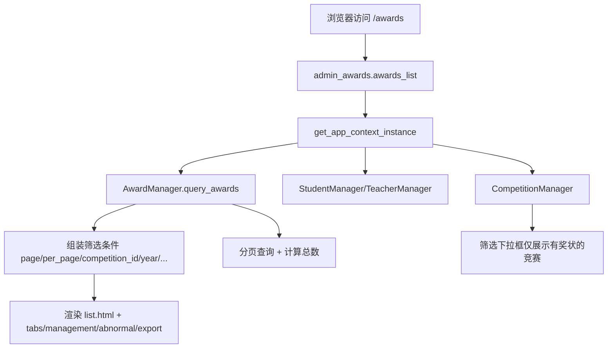
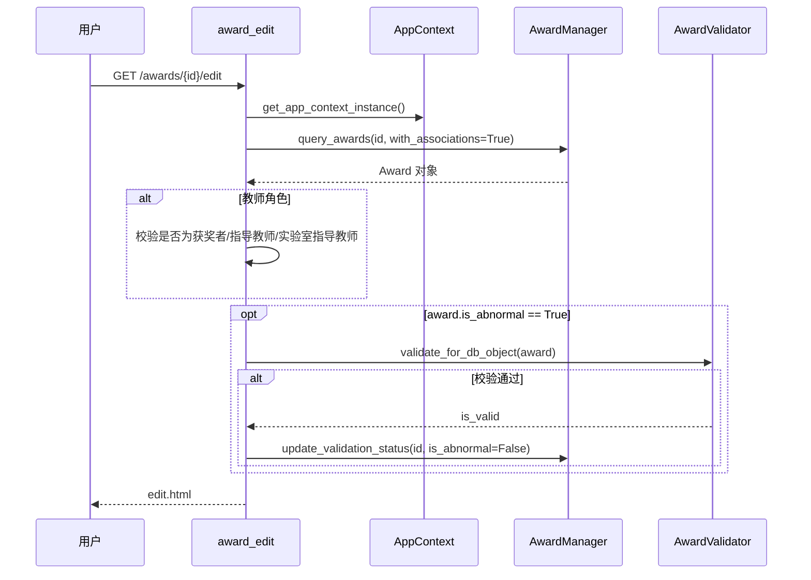

## 模块职责

`app/routes/admin_awards.py` 是“奖状管理”的后端路由主入口，负责：

- 奖状列表页：支持分页、多条件筛选、异常 TAB、学生/教师证书类型切换。
- 奖状编辑页：管理员直接编辑，教师仅在关联范围内可编辑；打开异常奖状时会触发重新校验。
- 奖状删除与批量删除：删除前检查记录是否真实存在，并写入审计日志（动作 `12=成果删除`）。
- 奖状图片访问：登录后按角色权限返回实体图片文件。
- 奖状指导教师信息刷新：用于从学生/教师数据中补充指导教师信息。

页面连接了 `AwardManager`、`CompetitionManager`、`StudentManager`、`TeacherManager`、`LaboratoryManager` 等业务服务，所有管理器统一通过 `get_app_context_instance()` 获取，避免路由层直接依赖具体实现。

主要模板位于 `app/templates/admin/awards/`：

- `list.html`：列表主页面。
- `main.html`：局部容器。
- `edit.html`：编辑/详情页。
- `tabs/management.html`：管理 TAB。
- `tabs/abnormal.html`：异常奖状 TAB。
- `tabs/export.html`：导出 TAB，衔接数据导出模块。

## 调用链

### 列表页调用链

列表页的关键点：

- `certificate_type` 默认为 `student`，通过 `granted_role='学生'` 和 `exclude_teacher_certificates=True` 过滤。
- `laboratory_id='none'` 时使用 `filter_no_laboratory=True`，筛选未关联实验室的奖状。
- 异常 TAB 使用 `is_abnormal=True` 查询。
- 总数统计时去掉 `limit/offset/with_associations`，避免加载关联数据，提升分页性能。
- 竞赛下拉框不是加载全量竞赛，而是先从当前筛选结果集中提取用到的 `competition_id`，再从管理器缓存或数据库加载对应竞赛。

### 编辑页调用链与重校验

编辑页不仅是表单页面，也承担“详情”能力。教师访问权限判断与图片访问保持一致：教师可作为获奖者、指导教师，或在“未认领奖状”和“已关联实验室”两种场景下作为实验室指导教师访问。

## 关键状态

### 异常奖状状态

奖状存在 `is_abnormal` 标记，标识导入/抽取时校验未通过。该状态有两个转换路径：

- 异常奖状通过“编辑页 GET 重新校验”后，如果 `AwardValidator` 校验通过，调用 `update_validation_status(id, is_abnormal=False, validation_result=None)` 清除异常标记。
- 如果校验仍不通过，异常标记保留，等待管理员手动修正。

### 删除审计防护状态

删除前通过直连 `competitions_db` 查询 `awards` 表确认记录存在：

- 不存在：返回 `404`，不写审计日志，防止“日志悬空”。
- 存在：先写审计日志，再执行 `delete_award`。
- 批量删除时，对已不存在的 ID 计为 `skipped_count`，不做删除且不写日志。

## 主要文件

- `app/routes/admin_awards.py`：奖状管理路由，包含列表、删除、批量删除、图片、编辑、刷新等接口。
- `backend/models/award.py`：奖状领域模型。
  - `Award_info`：将抽取结果 JSON 解析为结构化字段。
  - `split_names`：支持逗号、顿号、分号等分隔符拆分姓名。
  - `Award`：奖状核心数据类，供路由层和模板使用。
- `app/templates/admin/awards/list.html`、`edit.html`、`main.html`：列表与编辑页面。
- `app/templates/admin/awards/tabs/management.html`、`abnormal.html`、`export.html`：列表页内部 TAB。

`Award_info` 覆盖字段包括：

`competition_name`、`track`、`issuer`、`province`、`group_name`、`winner_name`、`supervisor_name`、`certificate_id`、`award_level`、`competition_level`、`date`、`project_title`、`granted_role`、`related_student`、`edition`、`year`。

其中 `track` 的字符串 `"None"` 会被转为空字符串，`winner_name`、`supervisor_name`、`related_student` 使用 `split_names` 拆分。

## 边界条件

- **权限边界**：
  - 列表和删除接口仅 `admin` 可访问。
  - 编辑和图片访问允许 `admin` 与 `teacher`，教师必须与奖状存在以下关联之一：获奖者、指导教师、未认领奖状的实验室指导教师、已关联实验室的指导教师。
- **图片访问边界**：
  - 未登录返回 `401`。
  - 教师无关联权限返回 `403`。
  - `images_dir` 未配置或找不到 `.jpg/.jpeg/.png/.gif` 文件时返回 `404`，并记录 `image_hash` 便于排查。
- **删除边界**：
  - 单条删除：不存在返回 `404`，不写审计。
  - 批量删除：部分失败时仍返回 `success=True`，但通过 `errors` 数组返回前 5 个失败原因。
- **筛选边界**：
  - 非法 `laboratory_id` 会被忽略。
  - 异常 TAB 强制 `is_abnormal=True`。
- **异常重新校验**：
  - 只在 `GET` 打开编辑页时触发，`POST` 提交表单时不触发。
  - 校验器异常会被捕获，不影响编辑页打开。

## 扩展点

- **新增筛选维度**：在 `awards_list` 中扩展 `query_params`，再同步到 `AwardManager.query_awards` 即可。
- **新增证书类型**：当前 `certificate_type` 映射 `student/teacher/all`，可扩展为更多 `granted_role` 组合。
- **奖状校验规则**：通过替换或增强 `AwardValidator`，可在编辑页重校验中应用新的异常判定逻辑。
- **删除审计动作**：当前使用审计动作 `12=成果删除`，可在审计日志模块中扩展新的删除原因或复核流程。
- **导出能力**：`tabs/export.html` 已预留导出 TAB，可衔接数据导出与报表模块。

Sources: [app/routes/admin_awards.py](app/routes/admin_awards.py#L1-L280), [app/routes/admin_awards.py](app/routes/admin_awards.py#L280-L560), [app/routes/admin_awards.py](app/routes/admin_awards.py#L560-L980), [backend/models/award.py](backend/models/award.py#L1-L120)