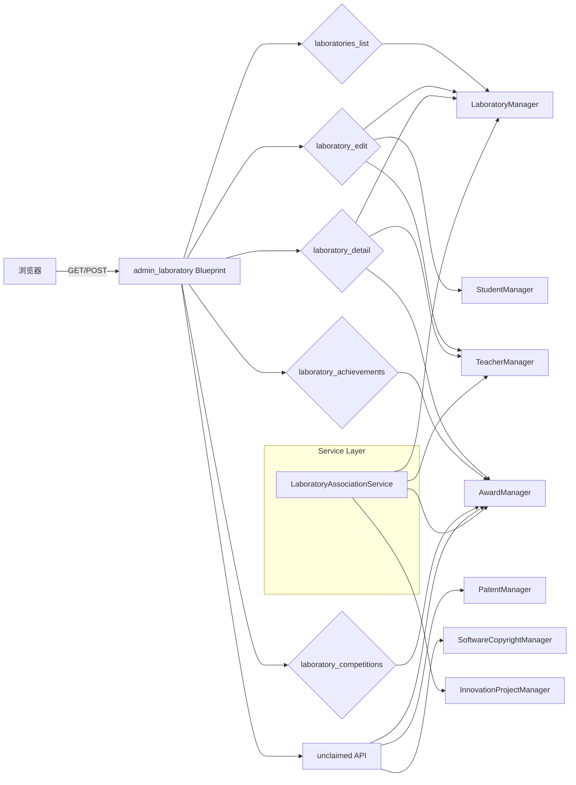

## 实验室管理

实验室管理是系统管理后台中的一个核心子模块，以 `admin_laboratory` 蓝图为入口，为管理员和具有编辑权限的教师提供实验室的完整管理能力，包括实验室的增删改查、教师/学生成员关联、实验室维度的成果数据统计与展示，以及未关联实验室成果的认领入口。模块同时提供独立的 `LaboratoryAssociationService` 服务，用于根据第一指导教师或获奖者信息，将奖状和大创项目自动关联到所属实验室，从而解决历史数据中实验室关联缺失的问题。

---

### 模块职责

1. **实验室 CRUD**  
   提供实验室列表页、添加/编辑页（`GET/POST /laboratories/add` 与 `/laboratories/<int:lab_id>/edit`），支持名称、描述、封面图片、教师成员、学生成员的新增与修改，并落库保存。

2. **成员关联**  
   在编辑实验室时，通过表单提交的 `instructor_ids` 和 `student_ids` 设置指导教师与学生成员。使用 ORM 关系（`lab.instructors`、`lab.students`）在内存中清除原有关联后重建新关联。

3. **实验数据分析与统计**  
   在实验室详情页（`/laboratories/<int:lab_id>`）中，根据实验室直接关联或通过指导教师间接关联的奖状，统计参与竞赛数量、白名单竞赛数量、近三年国家级/省级奖项数量，并展示实验室的成果卡片（奖状、专利、软著、大创项目）。

4. **成果认领与页面渲染**  
   提供实验室详情页、实验室成果页（`/laboratories/<int:lab_id>/achievements`）、实验室竞赛页（`/laboratories/<int:lab_id>/competitions`）等渲染路由，以及若干 JSON API 用于返回未关联实验室的奖状、专利、软著列表，供前端「成果认领」功能使用。

5. **自动关联服务（独立服务类）**  
   在 `backend/services/laboratory_association_service.py` 中封装了根据奖状第一指导教师、教师证书获奖者、大创项目第一导师，自动将成果关联到实验室的逻辑，供路由层或测试复用。

---

### 调用链

```
浏览器/前端请求
    │
    ▼
Flask 路由 (admin_laboratory.py)
    │ 权限装饰器 (require_role / require_role_api / require_can_edit_laboratory)
    ▼
get_app_context_instance() → 获取应用上下文中的各类 Manager
    │
    ├── LaboratoryManager     → 实验室 ORM 操作
    ├── StudentManager        → 学生查询
    ├── TeacherManager        → 教师查询
    ├── AwardManager          → 奖状查询/统计
    ├── PatentManager         → 专利查询（未认领）
    ├── SoftwareCopyrightManager → 软著查询（未认领）
    ├── InnovationProjectManager → 大创项目查询
    └── CompetitionManager    → 竞赛信息查询
    │
    ▼
模板渲染 (render_template) 或 JSON 响应 (jsonify)
    │
    ▼
自动关联服务 (LaboratoryAssociationService) —— 仅当触发自动关联时
    │ 通过 Manager 查找未关联成果、按姓名匹配教师、获取教师所属实验室
    ▼
更新成果的 laboratory_id 并保存
```

核心流程如下：

- **列表页**：`laboratories_list` 获取全部实验室，遍历每个实验室的 `instructors`、`students`、`assistants` 关系，统计成员数量与教师姓名列表，渲染 `admin/laboratories/list.html`。
- **编辑页**：`laboratory_edit` 同时支持新增和编辑。POST 时校验名称，处理封面图片上传到 `static/images/laboratory_covers/`，然后更新实验室字段和成员关联，调用 `laboratory_manager.save` 落库。
- **详情页**：`laboratory_detail` 通过 `can_edit_laboratory` 判断当前用户是否有编辑权限（管理员或该实验室的指导教师）。随后加载奖状、专利、软著、大创成果数据，并筛选属于该实验室的成果：优先依据 `laboratory_id` 直接关联，其次依据指导教师匹配兼容旧数据。
- **成果页**：`laboratory_achievements` 渲染 `admin/achievements.html`，传递实验室 ID、名称、编辑只读状态以及竞赛/实验室列表，支持按 Tab 展示不同成果类型。
- **未认领 API**：提供 `/api/laboratories/unclaimed/awards`、`/api/laboratories/unclaimed/patents`、`/api/laboratories/unclaimed/software` 三个接口，返回 `laboratory_id` 为空的成果列表，供前端编辑页的“成果认领”功能拉取。

自动关联服务的调用链（以奖状为例）：
1. 调用 `award_manager.query_awards(filter_no_laboratory=True)` 查询所有未关联实验室的奖状。
2. 筛选出有 `supervisor_name`（学生证书）或 `winner_name` + `granted_role` 包含“教师”（教师证书）的记录。
3. 分别通过第一指导教师姓名或获奖者姓名查找教师对象（先尝试奖状已有对象，再按姓名精确匹配）。
4. 通过 `laboratory_manager.get_laboratory_by_teacher_id` 找到该教师所属实验室。
5. 设置 `award.laboratory_id = lab.id` 并保存，返回统计字典。

---

### 关键状态

实验室管理本身不维护复杂状态机，关键状态体现在成果与实验室的关联字段：

- **`laboratory_id`（奖状、专利、软著、大创项目）**：`None` 表示未关联实验室，为自动关联和认领功能提供筛选依据。
- **实验室成员关系**：`lab.instructors`、`lab.students` 是 ORM 动态关系，编辑时先清空再重建，可视为“编辑中状态”。
- **封面图片**：上传后生成唯一文件名，保存相对路径到实验室记录；更新时若更换封面会删除旧图片文件。

---

### 主要文件

| 文件 | 职责 |
|------|------|
| `app/routes/admin_laboratory.py` | 定义实验室管理的所有页面路由、API 路由、权限控制、数据组装与统计逻辑。 |
| `backend/services/laboratory_association_service.py` | 封装自动关联奖状和大创项目到实验室的业务逻辑，提供可复用的服务类。 |
| （相关）`app/auth.py` | 权限装饰器 `require_role`、`require_role_api`、`require_can_edit_laboratory` 等，控制访问。 |
| （相关）`app/__init__.py` 或 `app/utils.py` | `get_app_context_instance` 获取应用上下文实例，进而获得各类 Manager。 |
| （相关）`backend/models/laboratory.py` 等 | 实验室、教师、学生、奖状、专利等 ORM 模型，提供字段与关系。 |

---

### 边界条件

- **权限控制**：  
  - 列表页、详情页、竞赛页允许所有用户访问，但详情页根据 `can_edit_laboratory` 决定是否显示编辑入口；  
  - 编辑页（添加/编辑）需要 `require_can_edit_laboratory` 权限，非管理员或非该实验室指导教师会被拒绝；  
  - 未认领 API 需要 `admin` 或 `teacher` 角色。

- **实验室不存在**：  
  - 编辑时若 `lab_id` 对应的实验室不存在，则 `flash` 错误并重定向到列表；  
  - 详情页实验室不存在时，管理员重定向到列表，其他用户返回 404。

- **表单校验**：  
  - 名称为空时返回编辑页并提示错误；  
  - 封面图片上传时通过 `secure_filename` 处理文件名，并放在独立目录，避免路径穿越和冲突。

- **数据兼容**：  
  - 统计奖状时优先使用 `laboratory_id` 关联，其次通过指导教师 ID 匹配，兼容历史未直接关联的数据。

- **自动关联跳过条件**：  
  - 无指导教师姓名/获奖者姓名、教师对象找不到、教师未关联实验室时，跳过该条并计数为 `skipped_count`；  
  - 异常情况计为 `failed_count`。

- **异常处理**：  
  - 所有路由均捕获异常并 `flash` 错误信息，DEBUG 模式下展示 traceback；  
  - API 路由返回 `{success: False, message: str(e)}`，HTTP 500。

---

### 扩展点

1. **自动关联服务复用**  
   `LaboratoryAssociationService` 将自动关联逻辑独立出来，可被定时任务、管理后台按钮或测试脚本调用，只需传入对应的 Manager 依赖。后续若需支持软著、专利的自动关联，可在此服务中增加方法。

2. **成果认领机制**  
   当前通过三个 API 返回未关联成果列表，前端可自行实现“认领”操作（通过调用各成果的编辑接口设置实验室）。未来可统一封装为专门的认领接口，减少前端复杂度。

3. **统计逻辑扩展**  
   详情页的统计目前聚焦于奖状维度（竞赛数、白名单、近三年国/省奖）。如需扩展统计到专利、软著或大创项目，可在 `statistics` 字典中新增键，并在模板中展示。

4. **封面存储策略**  
   当前封面保存在静态目录 `static/images/laboratory_covers/`，若迁移到对象存储或需要压缩处理，可替换上传逻辑为统一文件服务。

5. **实验室成员管理**  
   目前成员通过表单多选方式一次更新。后续可增加成员分页加载、搜索、权限细分（如实验室负责人、助理）等能力。

---

### 架构图

以下图描述了实验室管理模块的主要路由和服务调用关系：



**关键节点说明：**

- **admin_laboratory Blueprint**：所有实验室相关路由的统一入口，通过权限装饰器过滤非法访问。
- **LaboratoryManager**：对实验室 ORM 的增删改查，是核心数据访问对象。
- **AwardManager**：提供带关联查询的奖状列表，供详情页统计和自动关联服务使用。
- **LaboratoryAssociationService**：独立服务，封装自动化关联逻辑，可与路由层解耦，便于测试和复用。
- **unclaimed API**：为前端提供未关联成果数据，支撑“成果认领”交互。

---

Sources:  
[admin_laboratory.py](app/routes/admin_laboratory.py#L1-L220)  
[admin_laboratory.py](app/routes/admin_laboratory.py#L220-L500)  
[admin_laboratory.py](app/routes/admin_laboratory.py#L500-L528)  
[laboratory_association_service.py](backend/services/laboratory_association_service.py#L1-L220)