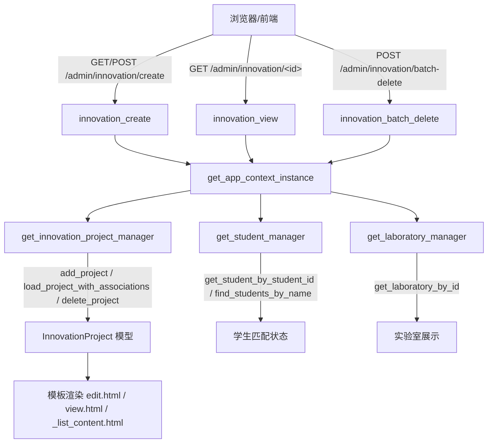
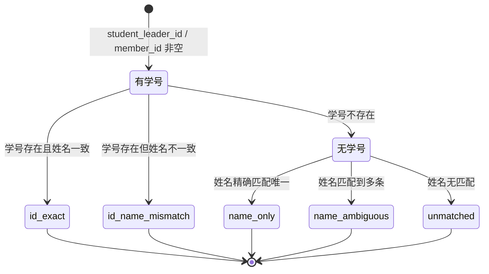

## 大创项目管理

本页面覆盖 `app/routes/admin_innovation.py` 中所有与大学生创新创业项目（大创）相关的管理路由，以及 `backend/models/innovation_project.py` 中对应的项目模型与关联匹配逻辑。该模块的定位是**管理员专用的大创数据维护入口**：管理员创建、查看、批量删除大创项目，并在创建/编辑时对项目成员和指导教师进行结构化解析与学生身份匹配，为成果管理页的“大创 tab”提供数据底座。

### 模块职责

- **项目维护入口**：原 `/admin/innovation` 路由已合并进成果管理页，`_innovation_list_url()` 统一返回 `admin_achievement.achievements` 的 `tab='innovation'`，保证列表页只有唯一入口。
- **创建大创项目**：`innovation_create` 提供 GET 表单页和 POST 提交逻辑，仅管理员可操作；创建时固定 `submitter_type='admin'`，并通过 `to_users_id()` 将 session 中的用户映射为 `users.id`。
- **查看详情**：`innovation_view` 加载项目并调用 `refresh_student_associations` 恢复学生关联，同时展示实验室信息。
- **批量删除**：`innovation_batch_delete` 接收 JSON 项目 ID 列表，逐个调用 `delete_project` 并汇总成功/失败结果。
- **学生身份匹配**：在编辑/审核页面中，对项目负责人和成员执行“学号优先、姓名兜底”的匹配，输出 `matched / ambiguous / not_found` 三类状态，帮助管理员识别数据质量问题。

### 核心调用链

关键节点说明：

- **`get_app_context_instance()`** 是路由获取业务对象的统一入口，保证 BLUEPRINT 内不直接实例化管理器。
- **`InnovationProjectManager`** 负责项目落库与删除；**`StudentManager`** 负责学生查询与匹配；**`LaboratoryManager`** 可选地补充实验室信息。
- **`load_project_with_associations`** 会调用模型内部的 `refresh_student_associations`，将文本形式的负责人/成员字段转换为 `Student` 对象列表。

### 关键状态与匹配机

项目模型 `InnovationProject` 的关键状态：

| 字段 | 取值/含义 |
|---|---|
| `status` | `进行中`、`已结题`、`终止`，默认 `进行中` |
| `project_type` | `国家级`、`省级`、`校级`（可空） |
| `other_members` | JSON 列表或逗号分隔字符串，兼容新旧格式 |
| `supervisors` | 逗号分隔的教师姓名 |
| `_match_status` | 记录每位学生字段的匹配结果，不落库 |

学生匹配状态机（由 `refresh_student_associations` 和路由中的状态列表逻辑共同实现）：

状态解释：

- `student_id_exact`：学号 + 姓名同时命中，最高置信度。
- `id_name_mismatch`：学号能查到学生但姓名对不上，仍建立关联但标记异常。
- `name_only`：无学号或学号无效，仅靠姓名唯一匹配。
- `name_ambiguous`：姓名重名，路由中会标记为 `ambiguous` 并默认选择第一个候选。
- `unmatched`：未找到对应学生，管理员需人工处理。

### 主要文件

- `app/routes/admin_innovation.py`：全部大创管理路由。
- `backend/models/innovation_project.py`：`InnovationProject` 数据类 + `InnovationProjectManager` + `InnovationProjectFilter`。
- `app/templates/admin/innovation/_list_content.html`：成果管理页大创 tab 的列表片段。
- `app/templates/admin/innovation/edit.html`：创建/编辑表单页（含成员匹配状态展示）。
- `app/templates/admin/innovation/view.html`：项目详情页。

### 边界条件

- **必填校验**：创建时 `project_name` 为空则 flash 错误并重定向回创建页，不落库。
- **实验室可选**：`laboratory_id` 先取字符串再转 int，空字符串或非法值转为 `None`。
- **成员格式兼容**：`_parse_other_members()` 依次尝试 JSON 新格式、JSON 旧格式（`"张三(2022001)"`）、逗号分隔纯姓名，兜底返回空列表。
- **年份解析**：`get_year()` 支持 `YYYY.MM`、`YYYY-MM`、`YYYY-MM-DD`、`YYYY年`、纯数字 5 种格式，并限制在 1900–2100 之间，避免脏数据。
- **批量删除部分失败**：单条删除失败不会中断整体流程，返回 `success_count` + `failed_count`，且最多回传前 10 条错误。
- **匹配去重**：在成员状态列表中，通过 `seen_member_ids` 避免同一名学生被重复计入。

### 扩展点

- **匹配策略**：当前为“学号优先、姓名兜底”，未来可新增班级、学院等匹配维度，只需在 `refresh_student_associations` 和路由状态计算中同步扩展。
- **审核流程**：项目状态 `status` 已预留 `进行中/已结题/终止`，但审核动作尚未独立成服务；后续可接入统一的成果审核状态机，将管理员匹配校验作为审核前置步骤。
- **导入能力**：当前仅支持管理员手动创建；可复用 `_parse_other_members` 的格式兼容逻辑，扩展 Excel/文件批量导入。
- **前端展示**：`_match_status` 目前只存在于内存中，可考虑落库，以便历史审核记录追溯。

Sources: [app/routes/admin_innovation.py](app/routes/admin_innovation.py#L1-L220)  
Sources: [app/routes/admin_innovation.py](app/routes/admin_innovation.py#L220-L420)  
Sources: [backend/models/innovation_project.py](backend/models/innovation_project.py#L1-L160)  
Sources: [backend/models/innovation_project.py](backend/models/innovation_project.py#L160-L560)