## 专利、软著与其他成果

### 模块职责

本页面汇集了管理端对**专利**、**软件著作权（软著）** 以及其他文件类成果（如证书、其他知识产权）的管理路由。核心职责包括：

- 提供专利与软著的后台 CRUD 页面（列表、详情、创建、编辑、删除）。
- 提供证书文件的安全下载（通过统一文件服务定位物理路径）。
- 提供重复性检查接口（用于创建/编辑时前端异步校验）。
- 提供成果汇总页（admin_achievements）中对应 Tab 的异步加载接口，支持实验室视图（只读/隐藏实验室列）。
- 通过统一的 Filter 对象实现分页、筛选，满足管理列表的通用查询模式。

该模块是**成果管理**的一部分，与奖状、竞赛、大创项目等其他成果类型并行，但每种类型独立维护各自的 Manager 与 ORM 模型。

### 调用链

#### 路由注册与权限

专利路由蓝图 `admin_patents`、软著路由蓝图 `admin_software` 均在应用工厂中注册。所有常规页面路由均受 `@require_role('admin')` 保护；用于成果汇总页异步加载的 API 路由使用 `@require_admin_or_lab_view_api`，允许管理员及具备实验室查看权限的教师访问，并根据 `laboratory_id` 参数决定是否只读。

#### 数据访问模式

所有业务逻辑均通过 `get_app_context_instance()` 获取应用上下文中的 Manager 实例（`PatentManager` / `SoftwareCopyrightManager`），Manager 封装了 ORM 查询与写入。以专利列表为例：

1. 解析请求参数（`page`、`per_page`、`patent_type`、`inventor`、`laboratory_id`）。
2. 构造 `PatentFilter` 对象，传入分页与筛选条件。
3. 调用 `patent_manager.query_patents(filter_obj)` 获取列表。
4. 通过 `laboratory_manager.get_all()` 获取实验室下拉数据，并构建 `lab_dict` 映射。
5. 根据 `submitter_type` 查询学生/教师姓名，用于展示提交人。
6. 渲染 `admin/patents/list.html`。

创建/编辑流程类似，额外处理文件上传（`certificate_file`）并传递给 Manager 落盘。

#### 文件访问调用链

专利证书文件端点 `/patents/<id>/file` 的流程：

1. 通过 `patent_manager.get_patent_by_id()` 获取记录。
2. 获取统一文件管理器 `file_manager`（来自 `get_file_upload_service().file_manager`）。
3. 调用 `file_manager.find_file_by_path(patent.certificate_file)` 解析文件真实路径。
4. 若路径无效或文件不存在，分别返回 404；否则用 `send_file()` 返回。

软著文件端点 `/software/<id>/file` 类似，但额外增加了回退机制：若主路径文件不存在且证书为 PDF，则尝试返回同目录下或 `temp_upload/pdf_previews` 中的同名 PNG 预览图。

### 关键状态

- **权限状态**：`require_role('admin')` 强制管理员；`require_admin_or_lab_view_api` 中通过 `get_current_user()` 与 `can_edit_laboratory()` 判断当前用户是否可编辑指定实验室的数据，从而设置 `is_readonly` 和 `hide_laboratory_filter`。
- **分页与筛选状态**：`page`、`per_page`、筛选条件通过 Filter 对象传递，列表页面保持这些参数以便翻页和筛选。
- **重复检查状态**：`check_duplicate` 接口返回 `has_duplicate`、`duplicate_id`、`duplicate_name`，前端据此提示用户。
- **文件存在性状态**：文件路径可能失效，路由通过 404/500 处理异常。

### 主要文件

| 文件 | 作用 |
|------|------|
| `app/routes/admin_patents.py` | 专利管理路由：列表、详情、创建、编辑、删除、文件下载、重复检查、成果 Tab API |
| `app/routes/admin_software.py` | 软著管理路由：列表、详情、创建、编辑、删除、文件下载、成果 Tab API |
| `backend/models/patent.py` | `Patent` ORM 模型、`PatentManager` 数据访问层、`PatentFilter` 筛选类 |
| `backend/models/software_copyright.py` | `SoftwareCopyright` ORM 模型、`SoftwareCopyrightManager`、`SoftwareCopyrightFilter` |
| `backend/services/unified_file_manager.py` | 统一文件管理器，负责 `find_file_by_path` 路径解析 |
| `app/auth.py` | 权限装饰器：`require_role`、`require_role_api`、`require_admin_or_lab_view_api`、`can_edit_laboratory` |

### 边界条件

- **数据不存在**：详情页、编辑页在记录不存在时 `flash` 错误并重定向到列表。
- **文件缺失**：文件下载时若文件路径不存在，返回 404；若查询过程异常，返回 500。
- **必填字段校验**：创建专利/软著时，若名称（`patent_name`/`software_name`）为空，`flash` 错误并回到编辑页。
- **权限边界**：教师访问软著编辑时，会调用 `_teacher_can_edit_software` 检查是否有权编辑；若否则重定向至教师仪表盘。
- **实验室视图只读**：在成果 Tab API 中，当传入 `laboratory_id` 且当前用户不可编辑该实验室时，标记 `is_readonly=True`，前端隐藏编辑按钮。
- **异常兜底**：几乎所有路由都用 `try/except` 包裹，捕获异常后写入日志并 `flash` 错误信息，保证页面不崩溃。

### 扩展点

- **新成果类型接入**：仿照专利/软著，创建新的蓝图（如 `admin_other.py`）、Manager 与 ORM 模型，并在成果汇总页中增加对应 Tab API 路由（`/api/achievements/<type>`）。
- **筛选扩展**：Filter 类可追加更多字段（如时间范围、状态）以支持更精细的检索。
- **文件回退策略**：软著文件下载已展示回退模式，可扩展至其他类型，或统一抽象到文件服务层。
- **重复检查**：`check_duplicate` 接口可复用为通用 API，接收任意字段组合，在创建/编辑时防止录入重复成果。

### 路由概览

```mermaid
graph TD
    A["/patents"] --> B[patents_list]
    A2["/software"] --> B2[software_list]
    C["/patents/<id>"] --> D[patent_view]
    C2["/software/<id>"] --> D2[software_view]
    E["/patents/create"] --> F[patent_create]
    E2["/software/create"] --> F2[software_create]
    G["/patents/<id>/edit"] --> H[patent_edit]
    G2["/software/<id>/edit"] --> H2[software_edit]
    I["/patents/<id>/delete"] --> J[patent_delete]
    I2["/software/<id>/delete"] --> J2[software_delete]
    K["/patents/<id>/file"] --> L[patent_file]
    K2["/software/<id>/file"] --> L2[software_file]
    M["/api/achievements/patents"] --> N[api_achievements_patents]
    M2["/api/achievements/software"] --> N2[api_achievements_software]
    O["/api/patents/check-duplicate"] --> P[api_check_duplicate]

    subgraph "统一管理器"
        Q[PatentManager]
        R[SoftwareCopyrightManager]
    end

    B --> Q
    D --> Q
    F --> Q
    H --> Q
    J --> Q
    L --> Q
    B2 --> R
    D2 --> R
    F2 --> R
    H2 --> R
    J2 --> R
    L2 --> R
```

图中各路由均以蓝图 `admin_patents` / `admin_software` 注册，所有数据操作委托给对应的 Manager，Manager 再与 ORM 模型交互。文件访问端点额外依赖统一文件管理器进行路径解析，体现了文件服务的统一边界。

Sources: [app/routes/admin_patents.py](app/routes/admin_patents.py#L1-L420)  
Sources: [app/routes/admin_software.py](app/routes/admin_software.py#L1-L360)