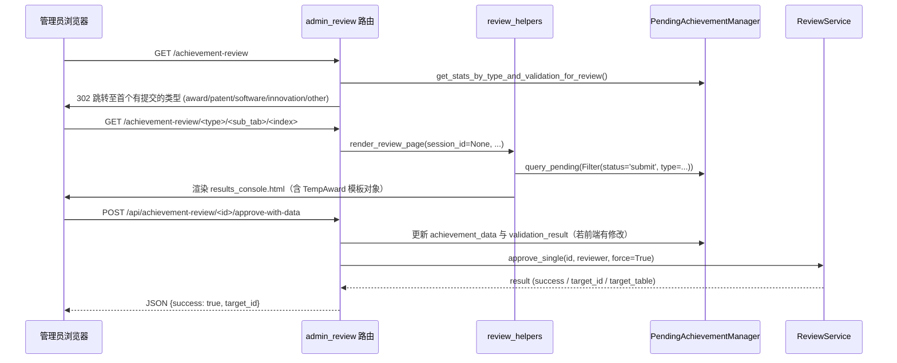
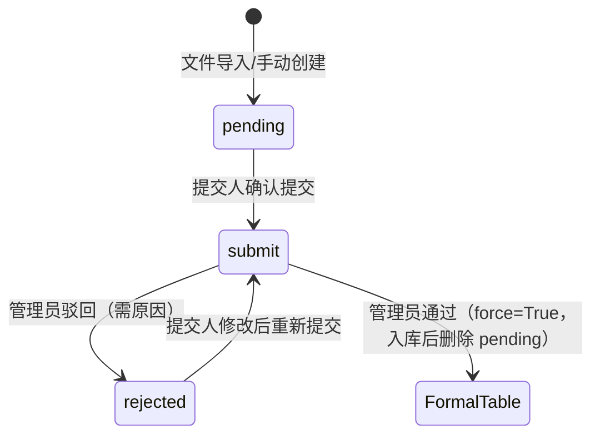

### 审核管理路由

#### 模块职责
`admin_review` 蓝图是管理员对成果提交记录进行审核的 **HTTP 控制层**。该模块本身不承载审核的业务规则，而是统一交由 `ReviewService`（成果审核服务）执行，仅负责请求解析、权限校验、页面/数据渲染以及审核前的前置数据处理（如字段标准化与重新校验）。它的核心价值在于：

1. **统一审核入口**：同时支持页面式的表单提交（`review_approve`）与 JSON API 式的前端异步操作（`api_approve_with_data`、`api_reject`）。
2. **复用渲染链路**：与文件导入审核共用同一套 `review_helpers` 渲染逻辑，将「全局审核（`session_id=None`）」与「导入会话审核（`session_id=xxx`）」在数据查询上解耦，在模板呈现上统一。
3. **数据修订与兜底**：在审核通过前，允许前端提交修改后的表单数据，由服务端完成 `laboratory_id` 规范化、关联学生名称回填和 `competition_name` 兜底，再基于最新数据重新计算校验结果并落库。

#### 调用链与路由结构
路由入口分为三个层次：列表重定向、全局审核单页、详情查看，以及三个 JSON API 接口。核心调用链如下：

关键节点说明：
- `review_list` 通过 `get_stats_by_type_and_validation_for_review()` 计算各类型待审数量，重定向到第一个有 `submit` 记录的类型，避免用户跳到空列表。
- `render_review_page` 是统一渲染枢纽。它按 `route_prefix` 自动选择壳模板（管理端 `results_console.html`，师生端 `results_portal.html`），并通过 `query_pending_items` 根据 `session_id` 是否为 `None` 区分全局审核与导入审核。
- `api_approve_with_data` 是最复杂的链路：先合并前端 `modified_data`，执行字段标准化（`normalize_related_student_from_ids`、`normalize_laboratory_id`、`original_competition_name` 兜底），调用 `_get_full_validation_result` 重新计算校验结果并更新 pending 记录，最后才交给 `ReviewService.approve_single` 完成入库。这样保证审核时使用的数据与展示给管理员的数据一致。

#### 关键状态与审核状态机
`review_helpers.query_pending_items` 明确区分了两种查询语境：导入会话（`status='pending'`）与全局提交（`status='submit'`）。结合驳回接口，可推导出完整的状态流转：

关键节点说明：
- `submit` 是管理的核心候选状态。全局审核只查询 `status='submit'` 的记录，而 `pending` 状态则被文件导入会话使用（识别成功与待修订均使用 `pending`，再通过 `validation_passed()` 区分 `valid`/`invalid` 子标签）。
- 驳回操作在 `api_reject` 中完成，要求必须填写原因（400），并调用 `audit_log(7, ...)` 写入审计记录（`action_result=2` 表示驳回）。若记录状态已变化会返回 409 冲突。
- 通过操作使用 `force=True` 跳过验证检查，允许人工强制通过存在细微问题的记录。成功后将 pending 删除，成果数据写入 `awards`、`patents` 等正式表，返回 `target_id` 与 `target_table`。

#### Helper 字段标准化机制
`review_helpers.py` 是审核页面的数据整理中枢，提供了以下关键能力：

- **`normalize_laboratory_id(value)`**：将前端可能传入的字符串或空值统一规范为 `int` 或 `None`。由于 `laboratory_id` 可能同时存在于 `achievement_data` JSON 与 `pending_item.laboratory_id` 直接字段中，`prepare_award_context` 会优先取 achievement_data 中的值，没有则回退到直接字段，从而避免模板比较时的类型不一致问题。
- **`normalize_related_student_from_ids(data, student_manager)`**：兼容前端新旧字段 `related_student_ids` 与 `related_student_ids[]`，将其转换为逗号分隔的中文姓名 `related_student` 和 `related_student_name`，确保归档时关联学生正确落库。
- **`TempAward`**：为模板渲染构造的轻量 DTO。它聚合了记录中的 OCR 文本、LLM 响应、提取结果、匹配模板名等，并将获奖者、指导教师、关联学生按姓名精确匹配到数据库中的师生实体（`find_students_by_name` / `find_teachers_by_name`），渲染时可展示人员是否已建档。

#### 主要文件
- `app/routes/admin_review.py`：路由定义，HTTP 入参与响应契约。
- `app/routes/review_helpers.py`：跨审核入口共用的渲染逻辑与字段标准化工具。
- `backend/services/review_service.py`：审核业务核心，处理状态机与正式表入库。
- `app/routes/admin_achievement.py`：提供 `_get_full_validation_result` 供审核接口复用。
- `backend/models/pending_achievement.py`：数据模型与查询过滤器。

#### 边界条件与扩展点
1. **多重实验室 ID 来源**：`api_approve_with_data` 会按「修改数据中的 `laboratory_id` → pending 直接字段 → achievement_data 中的值」的优先级三取其一，最终交给 `ReviewService`。
2. **竞赛名兜底**：若管理员未显式填写 `competition_name`，且存在解析得出的 `original_competition_name`，则自动填充，由后端在通过时创建或关联竞赛。
3. **权限边界**：页面路由使用 `require_role('admin')`，API 路由使用 `require_role_api('admin')`；驳回操作额外调用 `get_pending_for_admin()` 验证管理员对该记录的可见性（403 无权操作）。
4. **新成果类型的接入**：`_get_review_service` 中通过 `hasattr(app_context, 'get_xxx_manager')` 动态挂载专利、软著、大创、其他文件管理器，新增类型只需在 `app_context` 提供对应 Manager 并在 `get_type_names` 中注册名称即可，无需修改路由主体。
5. **模板外壳的按角色扩展**：`_results_template(route_prefix)` 支持 `teacher`/`student` 路由前缀切换门户壳，未来如需教师团队审核，只需复用 `render_review_page` 并传入新前缀。

Sources: [app/routes/admin_review.py](app/routes/admin_review.py#L1-L418), [app/routes/review_helpers.py](app/routes/review_helpers.py#L1-L560)