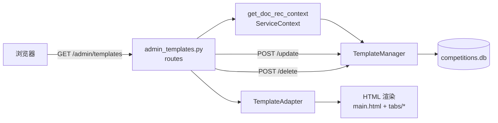
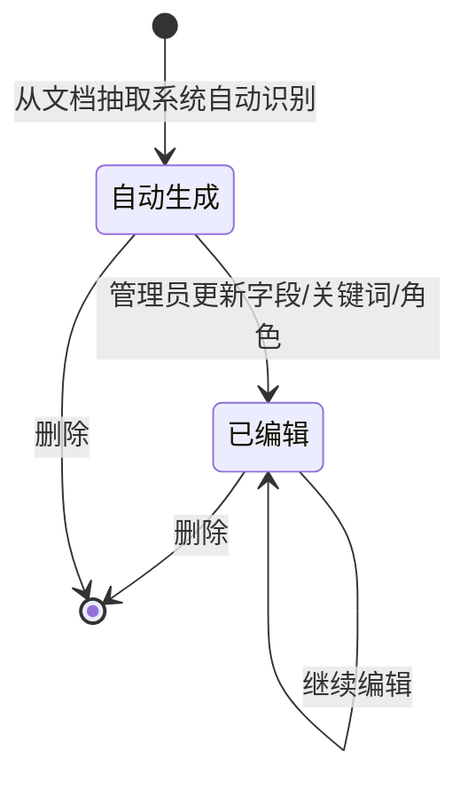

模板管理页是管理员维护奖状抽取模板的入口，覆盖模板列表、样本图片、字段规则、关键词、授予角色等配置能力。该页面围绕 `TemplateManager` 提供管理界面，并将模板的编辑结果持久化到数据库，供后续奖状抽取流程使用。

## 模块职责

模板管理模块负责：

- **模板列表与筛选**：展示所有 `award` 类型模板，支持按竞赛和授予角色过滤，统计手工编辑/自动模板数量。
- **模板详情与编辑**：支持查看/修改模板的默认字段（`default_fields`）、LLM 字段（`llm_fields`）、关键词、语言、字数范围、样本抽取结果等。
- **样本图片服务**：通过 `/templates/image/<id>` 提供模板样本图片的二进制流。
- **模板生命周期操作**：删除模板、清空全部 `award` 模板（强制重置）、更新授予角色、生成 Prompt 预览。
- **前端交互封装**：通过 `templates.js` 提供刷新、删除、字段更新、测试等功能的事件绑定与异步请求。

## 调用链

管理员通过浏览器访问 `/admin/templates`，最终由 `app/routes/admin_templates.py` 中的蓝图为入口提供路由。核心流程如下：

1. 请求进入 `templates_list()`，从 `ServiceContext` 获取 `TemplateManager`。
2. `TemplateManager.get_templates_by_type('award')` 取出所有奖状模板原始对象。
3. 每个原始对象经 `TemplateAdapter` 适配为页面可用的形式（补全 `competition_id`、默认角色、兼容字段等）。
4. 查询参数 `tab/competition_id/granted_role` 驱动页面渲染 `list.html`、`detail.html` 或 `create.html`。
5. 所有写操作（更新、删除、强制刷新等）通过 POST 接口调用 `TemplateManager` 的持久化方法，随后返回 JSON 结果。
6. 图片请求走独立路由，直接读取模板对象中的样本图片字节并 `send_file` 返回。

- `TemplateAdapter` 是关键适配层，它把 `backend.extract.template.Template` 对象的内部属性映射为通俗字段（如 `competition_name`、`granted_role`），并兼容旧版 `AwardTemplate` 的接口。
- `ServiceContext` 通过 `get_doc_rec_context()` 全局单例获取，避免每次请求重复初始化。

## 关键状态

- **模板类型**：当前页面只处理 `award` 类型，`template_manager.get_templates_by_type('award')` 明确限定。
- **手工编辑标记**：`template.is_manual_edited` 标识模板是否被管理员手动修改过。列表页据此统计 `manual_count`/`auto_count`。一旦调用更新接口，该标记自动置为 `True`。
- **授予角色**：模板 `default_fields.granted_role` 记录该模板适用的获奖者角色（学生/教师），未设置时默认为 `学生`。
- **样本抽取结果**：`sample_extracted` 是 JSON 字符串，详情页会解析成字典供前端展示。

- 强制恢复功能（`force-refresh`）会清空所有 `award` 模板，但该操作已不再是重建模板，而是直接删除——刷新逻辑已从旧版“批量从奖状创建”移除。

## 主要文件

| 文件 | 职责 |
|------|------|
| `app/routes/admin_templates.py` | 路由 + 适配器，定义所有模板管理接口 |
| `app/templates/admin/templates/main.html` | 页面主体框架，包含 header、sidebar、tab 容器 |
| `app/templates/admin/templates/tabs/list.html` | 模板列表视图（卡片/表格形式） |
| `app/templates/admin/templates/tabs/detail.html` | 模板详情与编辑视图 |
| `app/templates/admin/templates/tabs/create.html` | 创建模板视图（上传图片 → 抽取 → 编辑 → 提交） |
| `app/static/js/templates.js` | 前端交互逻辑，绑定按钮与异步请求 |

## 边界条件

- **权限控制**：所有路由都通过 `@require_role('admin')` 保护，非管理员不可访问。
- **模板不存在**：删除、更新等接口对不存在的 `template_id` 返回 404 和相应 JSON 错误。
- **图片缺失**：模板没有样本图片时返回 404 文本错误。
- **参数校验**：更新授予角色时仅允许 `学生`/`教师`，否则返回 400。
- **旧验证规则**：`ValidationRuleManager` 已废弃，`field_rules` 和 `default_required_fields` 在详情页中置空，代码中已注释掉相关查询逻辑。
- **刷新接口**：`/templates/refresh` 已不可用，直接返回 400 并提示新机制。

## 扩展点

- 模板类型目前固定为 `award`，但 `TemplateManager` 支持其他类型（如 `certificate`），若管理端需要扩展其他模板，只需在路由中参数化 `template_type`。
- `base_fields` 由 `TemplateManager.get_base_fields()` 提供，未来可动态扩展字段定义，页面会自动渲染字段管理表。
- 生成 Prompt 的接口支持按模板独立调用，可结合 LLM 引擎进行 Prompt 调优。
- `TemplateAdapter` 将底层对象与页面解耦，后续若更换模板存储模型，只需修改适配器而无需改动前端模板。

Sources: [app/routes/admin_templates.py](app/routes/admin_templates.py#L1-L220) [app/routes/admin_templates.py](app/routes/admin_templates.py#L220-L440) [app/routes/admin_templates.py](app/routes/admin_templates.py#L409-L700) [app/static/js/templates.js](app/static/js/templates.js#L1-L220) [app/templates/admin/templates/main.html](app/templates/admin/templates/main.html#L1-L80) [app/templates/admin/templates/tabs/list.html](app/templates/admin/templates/tabs/list.html#L1-L80) [app/templates/admin/templates/tabs/detail.html](app/templates/admin/templates/tabs/detail.html#L1-L80) [app/templates/admin/templates/tabs/create.html](app/templates/admin/templates/tabs/create.html#L1-L80)