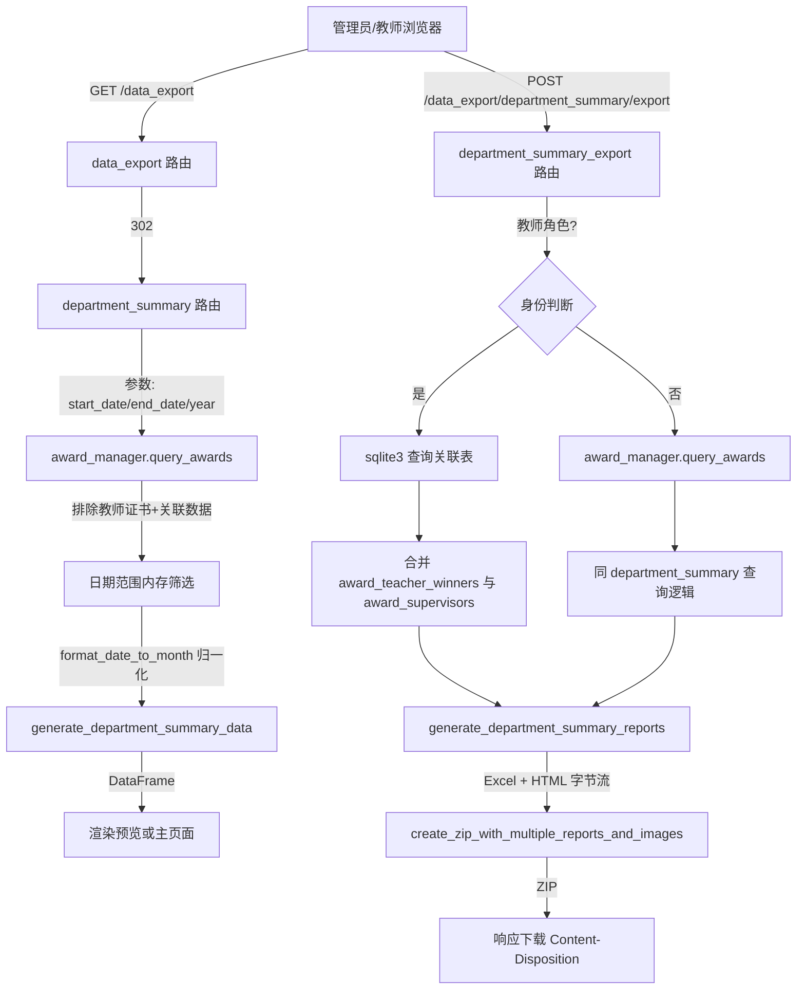

### 数据导出与报表

#### 模块职责

数据导出与报表模块负责将系统中的获奖成果数据按条件筛选、加工后导出为可交付的报表文件。核心能力包括：

1. **系年度总结**：按日期范围/年份筛选奖状，生成包含 14 个字段的结构化报表数据，并以 HTML 预览或完整页面展示。
2. **报表文件导出**：将同一数据集同时渲染为 Excel（.xlsx）和 HTML 两种格式，并打包为 ZIP 压缩包供下载；可选携带获奖证书图片。
3. **教师个人导出**：教师角色按登录身份限定数据范围，仅导出与当前教师（作为获奖者或指导教师）相关的奖状。
4. **预留扩展页面**：`student_affairs`（学工数据）与 `teacher_personal`（教师个人数据）路由已注册但仅渲染空模板，为后续扩展保留入口。

#### 调用链

**关键节点说明**：

- **`department_summary`（GET）** 是页面的主入口，负责数据聚合与预览渲染；`department_summary_export`（POST）是独立的文件生成端点，二者查询逻辑刻意保持同步，确保预览与导出数据一致。
- **教师身份分流**发生在导出端点内部：当 `teacher_id` 存在且 `session['user_type'] == 'teacher'` 时，绕过通用查询，直连 SQLite 从 `award_teacher_winners`（获奖者）和 `award_supervisors`（指导教师）两张关联表收集奖状 ID 集合，再回表加载奖状对象；这一设计使教师只能看到与自己有关的成果。
- **日期筛选采用内存过滤**：`query_awards` 不支持原生日期范围参数，因此路由层对查询结果逐条调用 `format_date_to_month`，将奖状日期归一化为 `YYYY-MM` 字符串后与 `start_date`/`end_date` 做字典序比较。

#### 关键状态

**默认筛选区间**（无参数时）：

- 开始日期 = 当前日期减 365 天，格式 `YYYY-MM`
- 结束日期 = 当前月份，格式 `YYYY-MM`

**导出文件命名规则**：

- 管理员：`竞赛数据（系）_[年份]_从{start_date}到{end_date}_YYYYMMDD.zip`
- 教师：`教师成果导出_{教师姓名}_[年份]_从{start_date}到{end_date}_YYYYMMDD.zip`
- ZIP 内文件名使用 ASCII 安全的基础名（由 Excel 文件名派生），HTTP 响应头通过 RFC 2231 编码携带中文显示名。

**错误状态**：

- 导出失败时返回 HTTP 500 + JSON 结构 `{success: false, message, error_type}`，不抛出 HTML 错误页。

#### 主要文件

| 文件 | 职责 |
|---|---|
| `app/routes/admin_export.py` | 蓝图路由定义：页面渲染、AJAX 预览、导出端点、教师数据隔离 |
| `backend/utils/export_utils.py` | 数据加工与渲染核心：字段格式化、DataFrame 生成、Excel 渲染、实验室归属解析 |
| `backend/utils/report.py` | 报告打包高内聚封装：`generate_department_summary_reports` 生成 Excel+HTML 双格式，`create_zip_with_multiple_reports_and_images` 组装 ZIP；内置 ECharts 首页 HTML 模板 |
| `templates/admin/data_export/main.html` | 主页面容器，按 tab 区分子页面 |
| `templates/admin/data_export/tabs/department_summary_preview.html` | AJAX 局部刷新的预览片段 |

#### 边界条件

1. **教师导出数据范围**：教师导出依赖 SQLite 直接连接 `award_manager.db_path`，若数据库引擎切换（如迁移到 MySQL）此段逻辑会失效，需改为 ORM 查询。
2. **日期字段缺失**：奖状 `date` 为空或无法解析为年月时，该记录在内存筛选中被跳过；`format_date_to_month` 支持 `2024-03-15`、`2024/03`、`2024年3月` 等格式，无法匹配时保留原字符串。
3. **实验室归属回退**：先查奖状直接关联的 `laboratory_id`；若无，则取第一个指导教师的实验室；批量查询失败时降级为单条查询。每个奖状只考虑第一名指导教师，避免重复归属。
4. **Excel 引擎降级**：`render_excel_report` 优先使用 `openpyxl`，异常时回退 `xlsxwriter`；两者均失败则抛出异常触发 500。
5. **中文文件名兼容**：`Content-Disposition` 使用 ASCII 文件名 + RFC 2231 `filename*` 扩展，若编码失败降级为纯 ASCII 文件名。
6. **AJAX 与普通请求分流**：`X-Requested-With: XMLHttpRequest` 时只渲染预览片段，否则渲染完整页面；避免整页刷新。
7. **图片附加**：`include_images` 参数控制是否将证书图片打包进 ZIP；默认关闭，图片根路径固定为 `images` 目录。

#### 扩展点

- **新增报表类型**：在 `admin_export.py` 中仿照 `department_summary` 模式新增蓝图路由 + 模板，复用 `export_utils` 中的字段格式化函数与 `report.py` 的打包工具；`student_affairs` 与 `teacher_personal` 即预留的挂载点。
- **数据源替换**：`generate_department_summary_data` 接收奖状对象列表而非直接依赖 ORM，只要传入满足属性约定的对象即可复用；教师导出中的原生 SQLite 查询是唯一强耦合点，建议后续收敛到仓库层。
- **新竞赛级别**：`LEVEL_MAPPING` 为白名单映射（省赛→省级、国赛→国家级、校赛→校级），新增级别只需扩展该字典，未命中的级别原样透传。
- **列扩展**：`generate_department_summary_data` 明确构造 14 列的字典列表，新增列需同步修改该函数、`columns` 列表及 `main.html` 表头。
- **双格式打包**：`create_zip_with_multiple_reports_and_images` 接受任意 `{data, filename}` 列表，可平滑扩展为 PDF 等更多格式。

Sources:
- [app/routes/admin_export.py](app/routes/admin_export.py#L1-L322)
- [backend/utils/export_utils.py](backend/utils/export_utils.py#L1-L420)
- [backend/utils/report.py](backend/utils/report.py#L1-L140)