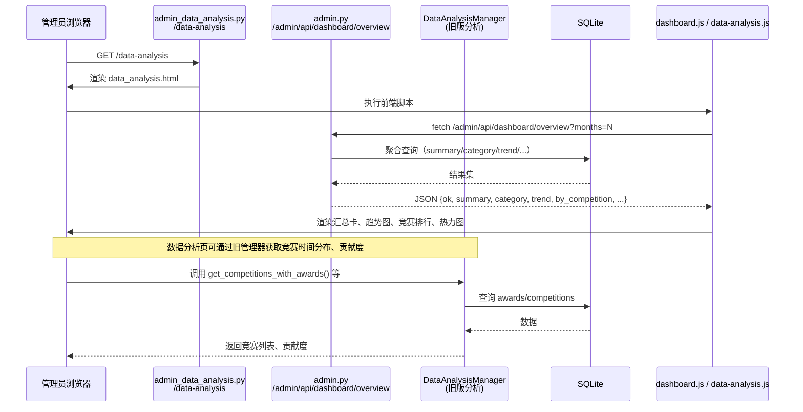

数据分析看板模块面向管理员，提供获奖数据的统计、筛选和可视化。它由三部分组成：页面路由（`app/routes/admin_data_analysis.py`）、聚合接口（`app/routes/admin.py` 中的 `/admin/api/dashboard/overview`）以及前端可视化脚本（`dashboard.js`、`data-analysis.js`），另有 `backend/managers/data_analysis_manager.py` 作为底层分析能力的补充。

- **页面路由**：`/data-analysis` 通过 `require_role('admin')` 限制访问，仅渲染 `admin/data_analysis.html` 模板，无业务逻辑。
- **聚合接口**：`/admin/api/dashboard/overview` 是看板核心数据源，支持 `months` 参数控制趋势和环比周期。它直接查询 SQLite，返回汇总指标、分类计数、趋势序列、环比、竞赛排行和最新获奖记录。
- **前端可视化**：`dashboard.js` 负责管理首页看板的汇总卡、竞赛列表和趋势折线图；`data-analysis.js` 实现数据分析页的年份标签筛选与实验室×竞赛热力图。两者都基于 ECharts，并适配控制台明暗主题。
- **旧版管理器**：`DataAnalysisManager` 提供竞赛奖状统计、时间分布和贡献度计算，虽然当前看板接口未直接调用它，但保留了实验室过滤和年份/白名单筛选能力，可作为更复杂统计的扩展边界。

**关键状态**：
- `currentMonths`（dashboard.js）：周期筛选值，`null` 表示全部；
- `selectedYears`（YearTagFilter）：年份标签选择集合，至少保留一个；
- `chart`：ECharts 实例，主题切换时通过 `_applyChartTheme` 重绘；
- `window._dashData`：缓存最近一次接口数据，避免主题切换时重新请求。

**边界条件**：
- 所有路由和接口都有管理员权限保护；
- 数据库异常时接口返回 500 与错误信息，前端显示加载失败；
- 空数据时汇总卡显示 0，排行显示“暂无数据”，趋势折线保持连贯（用 0 填充缺失月份）；
- `months` 参数非法时回退为全部；
- ECharts 未加载（CDN 被拦截）时显示提示文字；
- 明暗主题通过 CSS 变量和 MutationObserver 自动适配。

**扩展点**：
- 在聚合接口上可增加学院、指导教师等维度；
- 图表可扩展柱状图、饼图等；
- `months` 与年份标签可联动；
- 页面标题为“数据分析与导出”，可与数据导出模块集成；
- `DataAnalysisManager` 支持 `laboratory_id`，可接入实验室维度分析。

Sources: [app/routes/admin_data_analysis.py](app/routes/admin_data_analysis.py#L1-L15), [app/routes/admin.py](app/routes/admin.py#L27-L111), [app/static/js/dashboard.js](app/static/js/dashboard.js#L1-L172), [app/static/js/data-analysis.js](app/static/js/data-analysis.js#L1-L120), [backend/managers/data_analysis_manager.py](backend/managers/data_analysis_manager.py#L1-L221), [app/templates/admin/data_analysis.html](app/templates/admin/data_analysis.html#L1-L221)