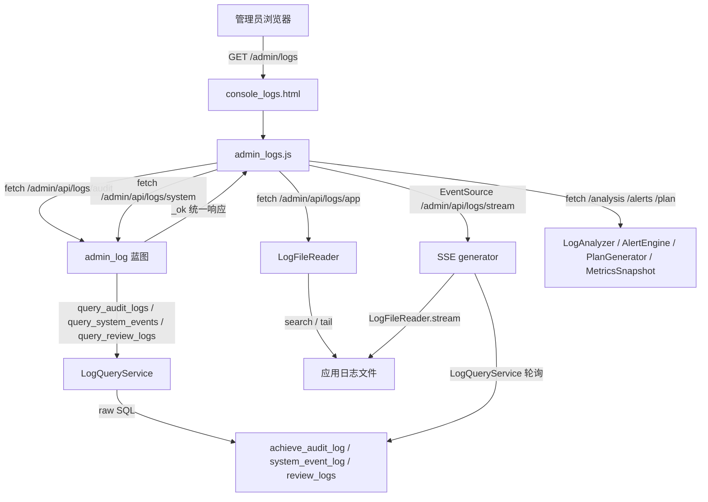

# 操作日志与审计视图

## 页面说明

管理员通过 `/admin/logs` 进入日志管理控制台，页面由 `admin_log` 蓝图承载，前端由 `admin_logs.js` 驱动，核心交互分为三个 Tab：

1. **日志查看**：从审计日志、系统事件、应用日志文件三个源头分页查询，并支持 SSE 实时流。
2. **分析看板**：通过“生命体征带”和 ECharts 图表展示动作分布、错误趋势、审核瓶颈、用户活跃度、AI 健康度和审计写入健康度。
3. **行动计划**：查看告警生成的维护计划，并对计划项执行 `acknowledge` / `resolve` 状态流转。

所有接口统一要求 `admin` 角色，统一返回 `{trace_id, code, message, data}` 结构，其中 `trace_id` 来自 `current_app._current_trace_id()`，保证与全链路日志 trace 贯穿。

## 模块职责

### 路由层：`app/routes/admin_log.py`

- 提供日志管理页面路由 `/admin/logs`，渲染 `admin_logs.html`。
- 提供查询类接口：
  - `/api/logs/audit`：查询 `achievement_audit_log`。
  - `/api/logs/system`：查询 `system_event_log`。
  - `/api/logs/review`：查询 `review_logs`。
  - `/api/logs/app`：搜索应用日志文件。
  - `/api/logs/app/tail`：读取日志文件尾部。
- 提供分析类接口：
  - 动作分布、错误趋势、审核瓶颈、用户活跃度、AI 健康度、指标快照、日报。
- 提供告警与计划接口：
  - 当前告警、历史告警、计划列表、计划确认、计划解决。
- 提供 SSE 实时流接口 `/api/logs/stream`。
- 所有接口通过 `@require_role_api_json('admin')` 做权限控制。

### 查询服务层：`backend/services/log_query_service.py`

- 只读服务，不触碰任何写入路径。
- 负责三个数据库来源的分页查询与筛选：
  - `achievement_audit_log`
  - `system_event_log`
  - `review_logs`
- 提供跨源合并能力 `query_all`，按 `created_at` 降序合并审计与系统事件。
- 对审计日志做展示加工：
  - 注入 `action_label` 动作中文标签。
  - 将历史数据中纯数字的 `operator_name` 批量解析为“学号 姓名”显示名。

### 前端交互层：`app/static/js/admin_logs.js`

- 管理日志查看状态 `state.source` / `state.page` / `state.perPage`。
- 从过滤表单读取筛选条件并拼装请求 URL。
- 渲染三类日志行：审计、系统、应用文件。
- 点击日志行可展开 JSON 详情。
- 通过 `EventSource` 连接 `/admin/api/logs/stream`，处理 `open`、`log`、`ping` 事件。
- 分析看板通过 CSS 变量读取主题色，随主题重绘图表。

## 调用链



关键节点说明：

- **LogQueryService** 是数据库日志查询的统一入口，只读且分页。
- **LogFileReader** 是应用日志文件查询、尾部读取和增量流的服务。
- **SSE generator** 在连接期间循环读取文件增量并轮询数据库新记录，超时发送 `ping` 心跳。
- **分析/告警/计划服务** 从日志聚合出指标、告警和运维计划，供前端看板展示。

## 关键状态与数据语义

### 动作类型与实体语义

前端与后端 `ACTION_LABELS` 对齐，动作类型 `1-12` 分别表示提交、AI 审核、AI 通过、AI 驳回、教师复核、审核通过、驳回打回、入库、修改字段、删除/放弃、撤回、成果删除。

实体编号语义：

- 动作类型 `8`（入库）和 `12`（成果删除）作用于 `awards.id`，显示为“成果#”。
- 其余动作作用于 `pending.id`，显示为“待审成果#”。

### 审计日志默认过滤

`query_audit_logs` 默认排除冗余删除留痕：

```sql
COALESCE(is_redundant,0)=0
```

如需查看全部记录，需要额外放开该条件。

### SSE 连接状态

`_SSE_CONN` 以 `user_id` 为 key 记录进程内连接数，每个管理员并发连接数上限为 `2`，超限返回 `429` 与错误码 `4029`。连接关闭时在 `finally` 中递减计数。

### 计划项状态

`plan_generator.transition` 支持将计划项流转为 `acknowledged`，再流转为 `resolved`。若计划项不存在或已流转，接口返回提示信息而非报错。

## 主要文件

| 文件 | 职责 |
|---|---|
| `app/routes/admin_log.py` | 日志管理路由、权限控制、统一响应、SSE 实时流 |
| `app/static/js/admin_logs.js` | 日志页前端交互、渲染、SSE 客户端、分析看板 |
| `backend/services/log_query_service.py` | 多源日志只读查询、分页、展示加工、跨源合并 |
| `backend/orm/audit_log.py` | `achievement_audit_log` 的 ORM 模型定义 |
| `backend/services/log_file_reader.py` | 应用日志文件搜索、tail、流式读取 |
| `backend/services/log_analyzer.py` | 动作分布、错误趋势、瓶颈等分析 |
| `backend/services/alert_engine.py` | 告警评估与历史告警 |
| `backend/services/plan_generator.py` | 行动计划生成与状态流转 |
| `backend/services/metrics_snapshot.py` | 指标快照采集 |

## 边界条件

- **只读不变量**：`LogQueryService` 只查询、不写入；分层上严格保持只读边界。
- **SSE 并发限制**：单管理员最多 `2` 个 SSE 连接，超限返回 `429`。
- **跨源合并上限**：`query_all` 每次从单个来源最多取 `500` 条合并，超出部分不做完整分页扫描。
- **应用日志默认上限**：`search` 默认 `limit=500`，`tail` 默认 `100` 行。
- **冗余记录**：审计查询默认排除 `is_redundant=1` 的记录。
- **审核日志合并策略**：`review_logs` 字段异构较大，默认不并入 `query_all` 的统一视图。
- **前端请求安全**：所有 `fetch` 请求携带 `X-CSRF-Token`，后端已实现 CSRF 全局防护。

## 扩展点

- **新增日志来源**：可在 `admin_log` 蓝图新增查询路由，并在 `LogQueryService` 中补充对应查询方法；前端在 `loadLogs()` 中按 `state.source` 扩展 URL 映射。
- **SSE 多 worker 化**：当前 `_SSE_CONN` 为进程内字典，注释指明多 worker 场景下可随 Redis 迁移统一，扩展为分布式连接计数。
- **分析能力扩展**：`LogAnalyzer`、`MetricsSnapshot`、`AlertEngine`、`PlanGenerator` 均为独立服务，可基于同一批日志表增加新的分析指标或告警规则。
- **操作人显示解析**：历史数据中的纯数字 `operator_name` 统一通过 `AuditLogger.resolve_display_names` 解析，后续若调整用户体系，只需修改该解析实现。
- **前端图表主题化**：ECharts 配色读取 CSS 变量，新增主题时无需改动图表配置，只需调整 CSS token。

Sources: [app/routes/admin_log.py](app/routes/admin_log.py#L1-L271)  
Sources: [app/static/js/admin_logs.js](app/static/js/admin_logs.js#L1-L221)  
Sources: [backend/services/log_query_service.py](backend/services/log_query_service.py#L1-L148)  
Sources: [backend/orm/audit_log.py](backend/orm/audit_log.py#L1-L26)