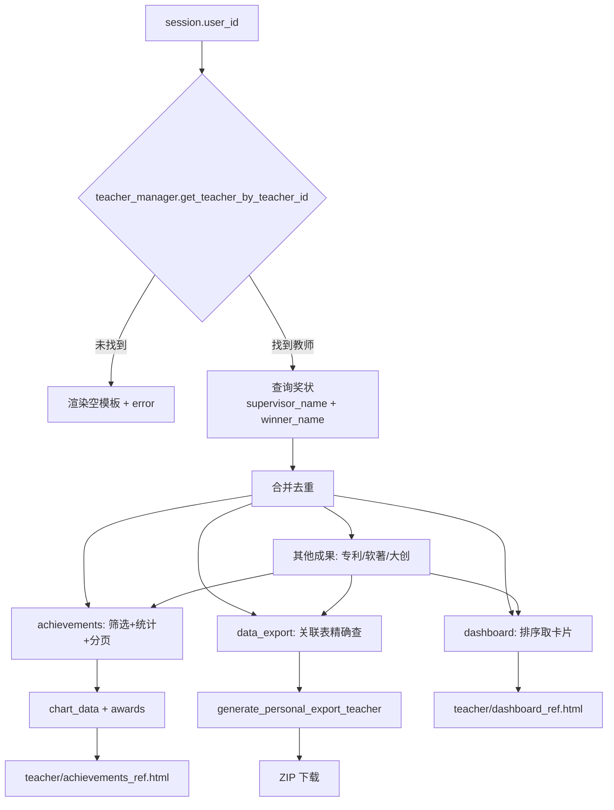

## 教师门户

### 模块职责

教师门户是系统中教师角色专属的 Web 界面集合，负责展示教师本人的指导成果与个人获奖、提供学生提交成果的审核入口、按条件导出成果数据，以及管理个人资料。该模块由独立的 Flask 蓝图 `teacher` 实现，路由前缀为 `/teacher`（推测），并复用 `app/routes/user_common.py` 注册的通用个人资料与密码管理路由。

从源码证据看，教师门户覆盖以下功能区间：

- **仪表板（Dashboard）**：展示教师成果总数、技能标签、所属实验室、最近获奖卡片。
- **成果总览（Achievements）**：按指导教师姓名与获奖者姓名检索奖状，支持按竞赛、年份、奖项等级筛选，展示国赛/省赛年份统计图表、分页列表，并关联展示教师提交的专利、软著和大创项目。
- **大创项目详情（只读）**：教师查看自己作为指导教师的项目详情，无编辑权限。
- **数据导出（Data Export）**：根据筛选条件，将教师关联的奖状、专利、软著、大创项目打包为 ZIP 下载。
- **学生提交审核**：通过 `register_common_routes` 注册的共同路由（未跳过 `submissions`），结合模板 `submissions.html`/`submissions_list.html` 实现，用于查看和处理学生提交的成果审核请求。
- **个人资料管理**：同样由 `register_common_routes` 注册的通用路由提供，包括个人资料查看/编辑、头像上传、修改密码等。

### 路由与页面构成

教师蓝图（`app/routes/teacher.py`）中明确自定义的路由如下：

| 路由 | 函数 | 模板 | 说明 |
|------|------|------|------|
| `/`、`/dashboard` | `dashboard()` | `teacher/dashboard_ref.html` | 仪表板，真实数据渲染 |
| `/achievements` | `achievements()` | `teacher/achievements_ref.html` | 成果总览，含统计图表与筛选 |
| `/innovation/<int:project_id>` | `innovation_view()` | `admin/innovation/view.html` | 大创项目只读详情（教师本人作为指导教师） |
| `/data_export` | `data_export()` | `teacher/data_export.html` | 数据导出页面及导出 ZIP 下载 |

除上述路由外，`register_common_routes(bp, 'teacher', skip_routes=['dashboard', 'personal', 'achievements', 'activities'])` 将个人主页、提交审核、资料管理等通用路由注册到教师蓝图。由于跳过了 `personal`，个人主页已合并到仪表板（源码注释 `# 个人主页已合并到仪表板`）。

### 核心调用链

#### 1. 仪表板数据组装

`dashboard()` 从 `session` 获取 `user_id`，通过 `get_app_context_instance()` 获取应用上下文管理器，再取得：

- `teacher_manager`：查询教师信息（`get_teacher_by_teacher_id`）
- `award_manager`：查询奖状（`query_awards`）
- `laboratory_manager`：查询实验室（`get_laboratory_by_teacher_id`）
- `competition_manager` / `student_manager`：用于奖状关联数据解析

奖状查询采用**双路径合并**策略（与管理端奖状管理保持一致）：

1. `award_manager.query_awards(supervisor_name=teacher_name)` → 教师作为第一指导教师的奖状；
2. `award_manager.query_awards(winner_name=teacher_name)` → 教师作为获奖者的奖状，再过滤 `granted_role` 包含“教师”的条目。

去重后按日期排序，生成用于卡片展示的 `recent_awards_data`。同时，`_parse_skills(teacher.skills)` 解析技能标签，实验室信息一并传入模板。异常时降级为空数据并返回 `error` 信息。

#### 2. 成果总览与统计

`achievements()` 的查询逻辑与仪表板相同，但增加了筛选参数（`competition_id`、`year`、`competition_level`、`award_level`、`include_teacher_certificates`）和分页。核心统计逻辑：

- 从奖状中提取年份（优先 `year` 字段，否则从 `date` 解析）；
- 仅统计 `competition_level` 为 “国赛” 和 “省赛” 的奖状，生成 `stats_by_year` 字典；
- 图表数据 `chart_data` 包含年份列表和对应国赛/省赛计数。

此外，通过 `patent_manager`、`software_copyright_manager`、`innovation_project_manager` 分别查询教师作为提交者的专利、软著，以及指导教师姓名包含教师的大创项目。这些数据一同传入模板，形成成果全貌。

#### 3. 数据导出流程

`data_export()` 首先直接使用 SQLite 查询关联表 `award_teacher_winners` 和 `award_supervisors` 获取奖状 ID（比文本匹配更精确），再合并去重。接着应用同样的筛选逻辑（过滤出含学生或仅教师？详见代码 L800），最后调用 `generate_personal_export_teacher` 生成 ZIP 数据，文件名包含筛选条件。该路由既渲染导出页面，也处理导出请求（推测通过 `?format=zip` 或 POST 触发下载，但源码片段未完整展示）。

### 关键状态与数据来源

- **当前用户身份**：依赖 `session['user_id']`，由 `require_user_type('teacher')` 装饰器校验用户类型。
- **教师实体**：通过 `teacher_manager.get_teacher_by_teacher_id(user_id)` 获取。注意这里的 `user_id` 是登录用户 ID，与 `teacher.teacher_id` 可能不同（在旧版三表结构中 `user_id` 可能对应 `login_code`）。
- **奖状归属判定**：主要有两种方式：
  - 文本匹配：`supervisor_name` / `winner_name` 直接对 `award.supervisor_name` / `award.winner_name` 做字符串比较（用于仪表板和成果页）；
  - 关联表查询：通过 `award_teacher_winners` / `award_supervisors` 按 `teacher_id` 精确查询（用于导出）。
- **其他成果类型**：专利/软著通过 `PatentFilter(submitter_type='teacher', submitter_id=teacher.id)` 查询；大创项目通过遍历所有项目并匹配 `get_supervisors_list()` 中的教师姓名，属于内存过滤。

### 主要文件

- `app/routes/teacher.py`：教师门户路由核心，定义仪表板、成果页、数据导出、大创详情等。
- `app/routes/user_common.py`：提供 `register_common_routes`，动态注册个人资料、提交审核、活动等通用路由。
- `app/routes/file_import_helpers.py`：提供 `get_data_import_types`，可能用于提交审核的数据类型配置。
- `app/routes/admin_achievement.py`：导出 `_get_review_service`，供成果审核服务调用。
- `backend/utils/idempotency.py`：`idempotent` 装饰器，用于幂等控制。
- `app/utils.py`：提供 `get_app_context_instance` 应用上下文工厂。
- 模板目录 `app/templates/teacher/`：包含 `dashboard_ref.html`、`achievements_ref.html`、`data_export.html`、`submissions.html`、`submissions_list.html` 等页面模板。

### 边界条件与容错

- **未登录**：所有页面返回对应模板并设置 `error`，不重定向到登录页（可能与共同路由的 flash 重定向不同）。
- **教师信息不存在**：仪表板/成果页展示空数据与错误提示。
- **异常兜底**：路由函数捕获所有异常，记录完整堆栈并返回带 `error` 的空模板，避免白屏。
- **日期解析容错**：支持多种字符串日期格式（`%Y-%m-%d`、`%Y/%m/%d`、`%Y年%m月%d日`、`%Y.%m.%d`），失败则返回 `datetime.min` 使其排在末位。
- **成果归属过滤**：教师自身证书需要 `granted_role` 含“教师”，避免将学生同名证书误算；导出时通过关联表避免文本匹配歧义。
- **大创详情权限**：仅当教师姓名出现在项目指导教师列表中时才可访问，否则 flash 错误并重定向回成果页。

### 扩展点

- **新增成果类型**：在成果页和导出中，只需从 `app_context` 获取对应的 manager，并实现类似的过滤器/查询方法，即可扩展新的成果类型。
- **筛选条件丰富**：`achievements()` 已支持按竞赛、年份、等级筛选，后续可在此基础上增加更多维度（如奖项级别、日期范围）。
- **导出格式**：当前通过 `generate_personal_export_teacher` 生成 ZIP，可在此函数基础上扩展为 PDF/Word 等格式。
- **通用路由复用**：`register_common_routes` 允许每个角色蓝图复用相同的个人资料、提交审核逻辑，通过 `skip_routes` 灵活覆盖默认行为。
- **统计图表扩展**：现有国赛/省赛统计维度较为固定，可参考 `chart_data` 结构增加校级奖项等其他等级。

### 关键流程示意

以下流程图展示教师门户中成果数据在三个页面间的复用关系（基于源码证据）：

- **关键节点说明**：
  - `session['user_id']` 是所有教师页面的身份起点，通过 `require_user_type('teacher')` 确保仅有教师角色可访问。
  - 奖状查询的文本匹配策略保证了与管理端的一致性，但导出时切换为关联表查询以提高精度。
  - 成果页复用仪表板的查询结果，但在内存中完成筛选与统计，无需重复访问数据库。
  - 导出功能额外关联专利/软著/大创，使导出内容覆盖教师全部学术成果。

### Sources

Sources: [app/routes/teacher.py](app/routes/teacher.py#L1-L220) · [app/routes/teacher.py](app/routes/teacher.py#L220-L480) · [app/routes/teacher.py](app/routes/teacher.py#L480-L800) · [app/routes/teacher.py](app/routes/teacher.py#L800-L1150)