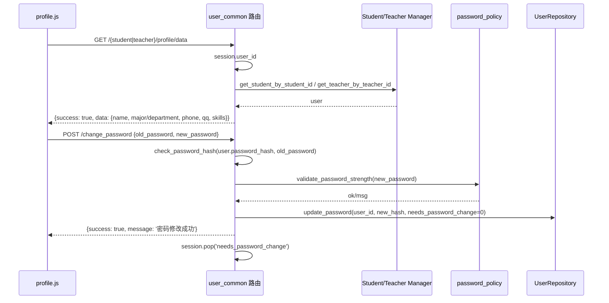

# 公共用户信息

本页面向学生、教师及管理员提供通用的用户侧能力。当前已读源码的核心是 `app/routes/user_common.py`，它把学生和教师共用的路由、个人资料装配、修改密码逻辑抽取到同一模块，避免在 `student.py` / `teacher.py` 中重复实现；同时 `app/utils/user_routes.py` 提供统一的 URL 路由名解析，`app/static/js/profile.js` 负责个人设置页面前端交互。

## 模块职责

- **公共路由注册器 `register_common_routes`**：向传入的蓝图批量注册 `/dashboard`、`/activities`、`/achievements`、`/profile`、`/change_password` 等路由，并通过 `skip_routes` 参数允许各蓝图跳过不需要的路由。
- **仪表板与参考页**：学生/教师首页、活动页、成果页使用 `dashboard_ref.html` 等模板；这些路由在渲染前会检查 `session['needs_password_change']`，如果为真则强制跳转到 `profile?tab=password`。
- **个人资料读取 `get_profile_data_common`**：按 `user_type` 从会话 `user_id` 取用户，然后分别通过学生管理器或教师管理器加载资料，返回统一的 JSON 结构。
- **修改密码 `change_password`**：校验旧密码、密码强度、新密码不能与旧密码相同、不能包含学号/工号，最后写入新的密码哈希。
- **路由名映射 `get_user_route_url`**：把 `profile`、`activities`、`achievements` 等逻辑路由名映射到不同用户类型下实际存在的端点；例如管理员的 `profile` 映射到 `dashboard`。
- **前端个人设置页 `profile.js`**：根据 URL 路径判断用户类型，拉取 `/student/profile/data` 或 `/teacher/profile/data`，填充表单、展示技能标签，并处理资料提交和密码修改。

## 调用链

用户进入个人资料与修改密码的主要调用链如下：

1. 用户访问 `/student/` 或 `/teacher/dashboard`，经 `@require_user_type` 鉴权。
2. 若 `session['needs_password_change']` 为真，后端直接重定向到 `url_for(f'{user_type}.profile', tab='password')`。
3. 前端 `profile.js` 加载后从路径判断 `userType`，请求 `/{userType}/profile/data`。
4. 后端 `get_profile_data_common` 从会话取得 `user_id`，通过 `get_app_context_instance()` 获取应用上下文中的学生/教师管理器。
5. 管理器使用 `session['user_id']`（学号/工号）找到用户，并返回姓名、专业/院系、电话、QQ、技能标签等 JSON 数据。
6. 修改密码时，前端 POST `/change_password`，携带 `old_password` 和 `new_password`。
7. 后端依次校验必填项、用户存在性、旧密码哈希、密码策略、新旧密码差异、密码是否包含学号/工号。
8. 校验通过后调用 `UserRepository.update_password(..., needs_password_change=0)`，直接写入 `users` 表，并清除会话中的 `needs_password_change` 标记。

图中关键节点：

- `get_app_context_instance()` 是服务定位入口，用于获取学生/教师/待审核成果等管理器。
- 密码修改不直接写旧的学生/教师表，而是写 `users` 真源表，因为视图化后旧表不可写。
- 修改成功后清除会话中的强制改密标记，用户下次访问不再被重定向到密码页。

## 关键状态

- `session['needs_password_change']`：首次登录或管理员强制改密时置位；为真时所有公共门户页面会跳转至改密标签页。
- `needs_password_change=0`：`UserRepository.update_password` 写入用户表的同时重置该标记，完成“强制改密”闭环。
- `user_type`：决定使用学生管理器还是教师管理器，也决定返回资料字段的差异。
- `skip_routes`：蓝图注册时的配置状态，使不同用户类型可以保留或移除公共路由。

## 主要文件

- `app/routes/user_common.py`：公共路由注册、个人资料数据装配、修改密码逻辑，以及 `shared_achievement_submit_upload` 共享上传链。
- `app/utils/user_routes.py`：路由名映射表和 URL 生成工具，避免页面硬编码不同用户类型的端点。
- `app/static/js/profile.js`：个人设置页前端，负责资料展示、技能标签和表单提交。

## 边界条件

- 只有登录且通过 `@require_user_type(user_type)` 校验的用户才能访问公共路由。
- 学生资料字段为 `student_id/major/grade/phone/qq/skills`；教师资料字段为 `teacher_id/department/phone/qq/skills`。
- 修改密码时，旧密码为空、新密码为空、用户不存在、旧密码错误、强度不足、新旧相同、新密码包含学号/工号都会返回 4xx JSON 错误。
- 管理员的 `profile` 路由名被映射到 `dashboard`，因此管理员个人设置入口不直接复用学生/教师的 profile 页面。
- 教师的活动页模板已删除，`activities` 路由名被映射到 `dashboard`。
- 已读源码中未出现独立的“头像上传”端点；现有共享文件上传流程已经给出 `FileUploadService` 和统一文件管理器的使用方式，未来若实现头像上传，可复用该文件服务新增独立路由。

## 扩展点

- `register_common_routes` 的 `skip_routes` 参数允许新增用户类型时按需裁剪公共路由。
- `get_profile_data_common` 是典型的分支装配函数，新增角色时可增加分支，只扩展字段映射，不需要改动前端整体结构。
- `ROUTE_NAME_MAPPING` 集中维护路由名差异，新端点或重命名时只需修改映射表。
- `shared_achievement_submit_upload` 展示了将 student/teacher 重复逻辑参数化的范式：用户获取、submitter、跳转蓝图、日志文案等差异点被提取为函数参数，后续公共流程可参照此模式收敛。

Sources: [app/routes/user_common.py](app/routes/user_common.py#L1-L220), [app/routes/user_common.py](app/routes/user_common.py#L180-L420), [app/routes/user_common.py](app/routes/user_common.py#L420-L539), [app/utils/user_routes.py](app/utils/user_routes.py#L1-L60), [app/static/js/profile.js](app/static/js/profile.js#L1-L200)