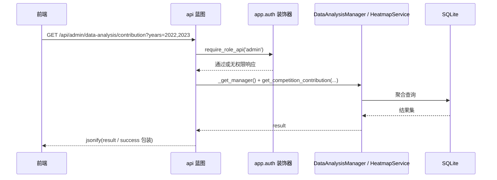

# API 与辅助接口

## 模块职责

`app/routes/api.py` 是系统统一 JSON/AJAX 接口的 `api` 蓝图，在 `create_app` 中通过 `app.register_blueprint(api.bp, url_prefix='/api')` 挂载，所有路由都位于 `/api` 前缀下。当前源码中的接口主要分为四类：

- **系统探测**：`/api/health` 健康检查、`/api/metrics` Prometheus 指标暴露。
- **通用用户接口**：`/api/user/info` 返回当前登录用户信息。
- **审计轨迹接口**：`/api/audit/timeline/<kind>/<int:entity_id>` 返回某一成果的审核/操作时间线。
- **数据分析接口**：面向管理员和教师的竞赛、奖状、实验室数据统计接口。

另外，`app/routes/api_helpers.py` 提供用户 ID 转换等辅助函数，供接口实现复用。

## 蓝图装配与请求入口

调用链从 Flask 应用工厂开始：

1. `create_app()` 加载配置、注册全局 `before_request`（生成/透传 `trace_id`）、启用 CSRF 保护、注册统一异常处理器。
2. `_register_blueprints(app)` 将 `api.bp` 注册到 `/api` 前缀。
3. 前端通过 `fetch` 或 AJAX 请求 `/api/...` 时，先经过应用级中间件，再进入 `api` 蓝图路由。
4. 路由通过 `require_login` 或 `require_role_api` 校验身份和角色后，调用对应的 Manager/Service，最终返回 `jsonify` 结果。

典型调用链：

关键节点：

- `require_role_api('admin')` 等装饰器限制了接口的角色范围，是系统权限边界。
- `_get_manager()` 从 `config.get_path("database", "competitions_db")` 获取数据库路径，并构造 `DataAnalysisManager`；实验室维度接口还会传入 `laboratory_id`。
- 审计时间线接口不走 ORM，而是直接使用 `backend.utils.db_connection` 查询 `achievement_audit_log` 表，然后通过 `AuditLogger.resolve_display_names` 做历史数据兼容解析。

## 路由总览

| 路由 | 方法 | 权限 | 说明 |
|---|---|---|---|
| `/api/health` | GET | 无 | 健康检查，返回 `status: ok` |
| `/api/metrics` | GET | 无（建议 nginx 内网白名单） | Prometheus 指标暴露，返回 `exporter_response()` 原始响应 |
| `/api/audit/timeline/<kind>/<int:entity_id>` | GET | admin, teacher | 成果审核/操作轨迹时间线 |
| `/api/user/info` | GET | 登录用户 | 返回 `user_id`, `user_type`, `name`, `role` |
| `/api/admin/data-analysis/competitions` | GET | admin | 有奖状的竞赛列表 |
| `/api/admin/data-analysis/award-timeline` | GET | admin | 指定竞赛的奖状时间分布 |
| `/api/admin/data-analysis/contribution` | GET | admin | 竞赛贡献度，支持多年/范围筛选 |
| `/api/admin/data-analysis/trend` | GET | admin | 指定竞赛历年获奖趋势 |
| `/api/admin/data-analysis/heatmap` | GET | admin | 奖状月度分布热力图（旧版） |
| `/api/admin/data-analysis/lab-competition-heatmap` | GET | admin, teacher, student | 实验室×竞赛热力图（新版） |
| `/api/admin/data-analysis/dynamic-chart` | GET | admin | 动态图表数据，支持 X 轴/颜色分组 |
| `/api/laboratory/<lab_id>/data-analysis/...` | GET | teacher | 实验室维度的竞赛、时间线、贡献度、趋势、热力图 |
| `/api/admin/laboratory/<lab_id>/data-analysis/...` | GET | admin, teacher, student | 管理员视角的实验室数据分析接口 |

当前路由均为 GET 只读接口，不涉及写操作；若未来增加 POST/PUT/DELETE 接口，需要留意应用工厂中的全局 `CSRFProtect` 会强制校验 CSRF Token。

## 关键状态

- **请求级状态**：应用工厂在 `before_request` 中设置 `flask.g.trace_id`，接口返回的审计轨迹中包含 `trace_id`；统一异常处理器也会读取该值。
- **会话状态**：`/api/user/info` 直接读取 `session` 中的 `user_id`、`user_type`、`user_name`、`role`。
- **接口内部状态**：`DataAnalysisManager` 和 `HeatmapService` 在请求处理时按需构造，数据库路径来自 `get_config()`；蓝图本身不维护跨请求可变状态。

## 主要文件

- `app/routes/api.py`：蓝皮定义、路由、参数解析、数据分析接口。
- `app/routes/api_helpers.py`：用户 ID 转换辅助函数。
- `app/__init__.py`：应用工厂与蓝图注册点，决定 `/api` 前缀。
- 依赖模块：`backend.managers.data_analysis_manager.DataAnalysisManager`、`backend.services.heatmap_service.HeatmapService`、`backend.utils.audit_logger`、`backend.utils.db_connection`、`backend.utils.metrics`、`app.auth`。

## 辅助函数

`api.py` 内部定义了三个辅助函数：

- `_get_manager(laboratory_id=None)`：读取配置中的 `competitions_db` 路径，创建 `DataAnalysisManager` 实例；传入 `laboratory_id` 时限定数据分析范围。
- `_parse_years(years_str)`：将 `"2022,2023,2024"` 解析为整数列表；解析失败返回 `None`。
- `_parse_year_range(year_range_str)`：将 `"2022,2024"` 解析为 `(2022, 2024)` 二元组，用于兼容旧的前后端年份范围参数。

`api_helpers.py` 提供：

- `get_user_db_id(user_info, student_manager=None, teacher_manager=None)`：将 `user_info` 中的 `user_id`（字符串学号/工号）转换为数据库整数 ID。`student` 类型走 `student_manager.get_student_by_student_id`，`teacher` 类型走 `teacher_manager.get_teacher_by_teacher_id`；失败或参数缺失返回 `None`。

这些辅助函数是后续新增接口时可以复用的基础工具。

## 边界条件

- **成果类型白名单**：`audit/timeline` 只允许 `award|patent|software|innovation|other`，否则返回 400。
- **必填参数校验**：`award-timeline`、`trend`、`heatmap` 等接口缺少 `competition_id` 时返回 400。
- **动态图表冲突检测**：当 `x_axis` 与 `color_by` 相同时返回 400，防止生成无意义的图表。
- **历史数据兼容**：审计日志中的 `operator_name` 可能是 `users.id` 或旧版 `login_code`，接口通过 `AuditLogger.resolve_display_names` 统一解析为“学号/工号 姓名”展示，未命中时保留原始字符串。
- **异常处理不一致**：部分实验室接口用 `try/except` 捕获异常并返回 `{'success': False, 'message': str(e)}` 的 500 响应；这会被局部捕获，不会进入应用级的 `AppError` 统一异常契约。新增接口时建议优先使用统一异常体系，避免错误响应结构分叉。
- **审计过滤**：时间线查询会过滤 `is_redundant=1` 的冗余记录，按 `created_at, id` 正序返回，保证前端时间轴稳定。

## 扩展点

- **新增数据分析接口**：可以在 `api.py` 中新增 `@bp.route`，复用 `_get_manager()` 或 `HeatmapService`，按需组合 `_parse_years` / `_parse_year_range`。
- **扩展审计轨迹类型**：如果需要支持新的成果类型，可以将新类型加入 `kind` 白名单，并确保 `achievement_audit_log.achievement_kind` 写入对应值。
- **扩展用户 ID 转换**：`api_helpers.get_user_db_id` 目前只覆盖 `student` 和 `teacher`；未来可增加管理员映射或基于 `users` 单表的通用解析。
- **角色扩展**：现有数据分析接口的权限通过 `require_role_api` 控制，调整角色列表即可开放给更多角色。
- **指标扩展**：`/metrics` 通过 `backend.utils.metrics.exporter_response()` 输出，新增指标时只需在 metrics 模块扩展，不需要修改蓝图结构。

Sources: [app/routes/api.py](app/routes/api.py#L1-L221); [app/routes/api.py](app/routes/api.py#L213-L515); [app/routes/api_helpers.py](app/routes/api_helpers.py#L1-L38); [app/__init__.py](app/__init__.py#L142-L175)