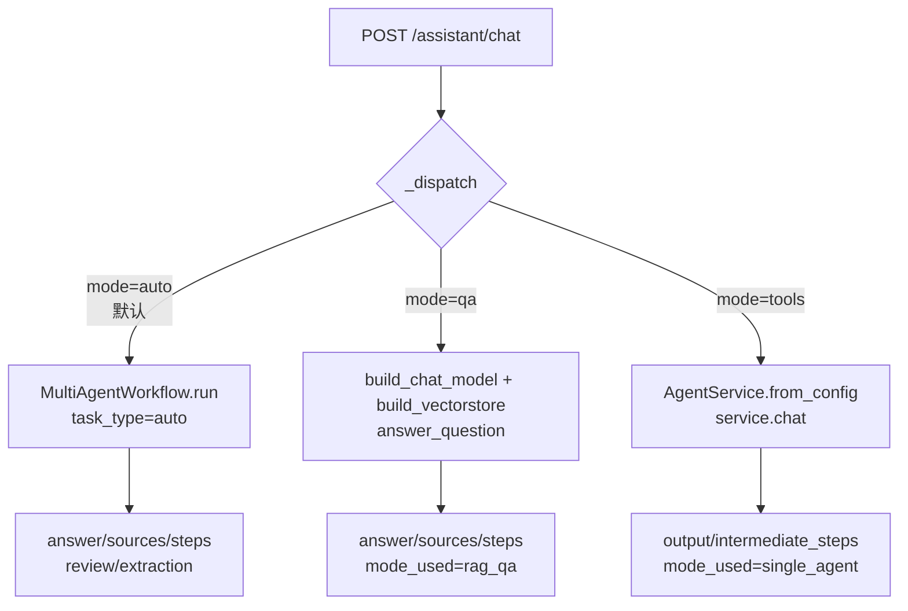
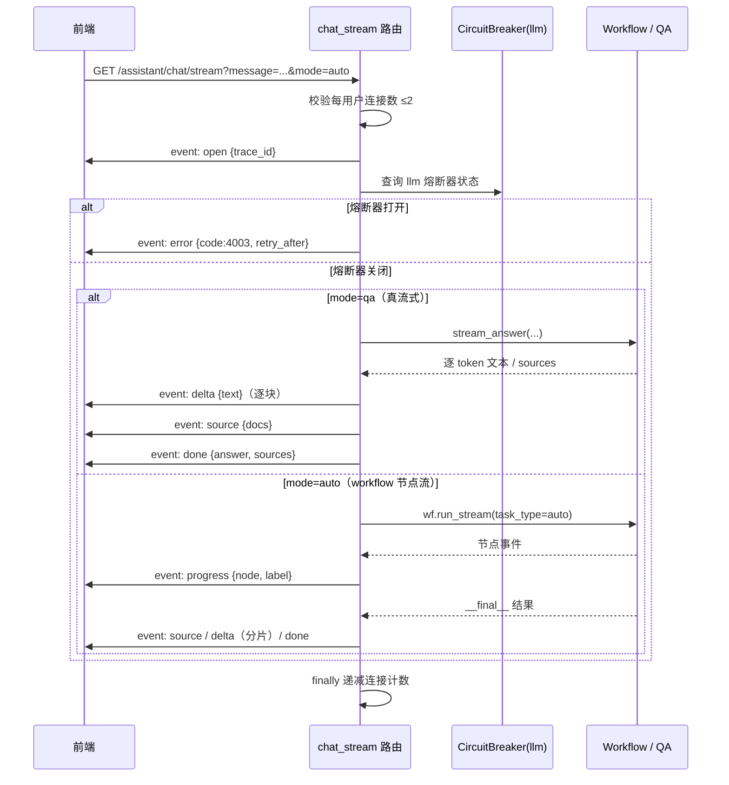

## AI 助手聊天接口

### 模块职责

`app/routes/chat.py` 是 AI 智能助手的 HTTP/SSE 路由层，将前端对话请求接入三类后端能力：

1. **RAG 问答**（`qa` 模式）：直接走向量库检索 + LLM 生成，回答竞赛规则类问题；
2. **单 Agent 工具调用**（`tools` 模式）：通过 `AgentService` 以 Function Calling 方式调用查询、统计、抽取、导出工具；
3. **多智能体协作**（`auto` 模式）：通过 `MultiAgentWorkflow` 运行 supervisor/extract/review/qa 状态图，自动路由用户意图，并透传抽取与审核的结构化结果。

该路由还提供：

- `GET /assistant`——对话页面，按角色分端渲染（admin 用控制台壳，teacher/student 用门户外壳）；
- `GET /assistant/chat/stream`——SSE 流式对话，支持 `open → progress / delta / source → done` 事件序列；
- `GET /assistant/health`——健康检查，探测依赖安装、数据库可读性和熔断器状态；
- `POST /assistant/extract`——上传奖状文件，直接触发「抽取 + 审核」多智能体工作流。

### 路由分发调用链

同步接口 `POST /assistant/chat` 的核心是 `_dispatch()`，按 `mode` 参数将请求分发到三条路径：

- **auto 路径**（`_run_workflow`）：`MultiAgentWorkflow.get_default(config_loader).run(...)` 执行完整状态图。当走「抽取 + 审核」分支时 `qa_context` 为空，路由层给出友好默认回答「已完成材料抽取与智能审核，详见下方结果卡片。」，同时将 `review`（审核结论）和 `extraction`（抽取结果）原样透传给前端展示。
- **qa 路径**（`_run_qa`）：依次构造 LLM、embedding 和向量库，调用 `answer_question` 完成 RAG 检索增强生成，返回 `answer` 与 `sources`。
- **tools 路径**（`_run_tools`）：`AgentService.from_config` 组装 LLM + 全部工具 + `create_agent`，调用 `service.chat` 返回最终回答与工具调用轨迹。

`AgentService` 内部通过 LangChain 1.x `create_agent` 构建基于 LangGraph 的 Agent，`invoke` 时以 `recursion_limit = max_iterations * 4 + 2` 控制最大工具调用轮次，并从最终消息轨迹中提取 AI 纯文本回答（无 `tool_calls` 的 `AIMessage`）。

### SSE 流式对话与时序

`GET /assistant/chat/stream` 是流式对话的核心路径，按照注释中「open → source → delta → done | error」的事件契约实现：

关键节点说明：

- **熔断器前置检查**：流开始前先读 `CircuitBreaker.get("llm")`，若为 `open` 直接发送 `error {code:4003, retry_after}`，不发起任何 LLM 调用，避免雪崩。
- **qa 模式真流式**（T23）：通过 `build_chat_model(..., streaming=True)` 构造流式 LLM，`stream_answer` 逐 chunk 产出 token，每个 token 作为一个 `delta` 事件下发；`__sources__` 特殊 chunk 被收集后以 `source` 事件发送。
- **auto 模式节点流**：`wf.run_stream` 产出节点级事件（supervisor/extraction/review/qa/tools），路由层映射为中文标签（如「AI 抽取中」）作为 `progress` 事件下发；最终结果通过 `done` 事件携带完整 answer/sources/steps/review/extraction。
- **呈现层分片回退**：当工作流整体生成答案后（tools 模式或 auto 回退），`_answer_pieces()` 按 token 切成 8 字符小段逐个以 `delta` 下发，模拟打字机效果，`done` 仍回传完整答案供排版。
- **连接计数**：`_ACTIVE_SSE` 是进程级字典，以 `user_type:user_id` 为 key，每用户同时最多 2 个 SSE 连接，超出返回 429。该计数在 `finally` 中递减，保证异常路径不泄漏。

### 文件上传抽取审核

`POST /assistant/extract` 提供文件上传入口：

1. 校验 `request.files['file']` 存在且文件名非空；
2. 落盘到 `files/agent_upload/`，使用 `secure_filename` 清洗文件名并加 `uuid.uuid4().hex[:8]` 前缀避免冲突；
3. 调用 `MultiAgentWorkflow.run(task_type="extract_and_review", file_path=...)`，驱动 Supervisor → 抽取 Agent → 审核 Agent 的串联工作流；
4. 返回 `extraction`、`review`、`steps`、`mode_used` 的 JSON 结构。

### 健康检查

`GET /assistant/health` 实现 P2「假绿修复」：

- 依赖检查：`_check_capability()` 探测 `langchain` / `langgraph` / `langchain_openai` 三个包是否可导入，全部就绪才算 `ready`；
- 数据层探活：先检查 `competitions_db` 文件是否存在（避免 `sqlite3.connect` 对不存在文件创建空库的副作用），再 `SELECT 1` 验证可读；
- 熔断状态：读取 `CircuitBreaker.get("llm")` 与 `CircuitBreaker.get("ocr")` 的状态，**不主动拨测外部服务**，避免产生费用。

### 关键状态

| 状态 | 位置 | 说明 |
|---|---|---|
| `_ACTIVE_SSE` | 模块级字典 | 进程级 SSE 连接计数，每用户 ≤2（CR-6）；多 worker 精确计数待 Redis 限流 T2 |
| `CircuitBreaker("llm")` | 熔断器单例 | 流式对话前检查，open 时返回 4003 |
| `user_context` | 每次请求从 session 构造 | `{role, name, user_id, user_type}` 注入 Agent 上下文 |
| `capability` | `_check_capability()` 返回 | 依赖就绪状态，页面渲染时判断是否 flash 警告 |

### 主要文件

| 文件 | 职责 |
|---|---|
| `app/routes/chat.py` | 路由定义、模式分发、SSE 事件编排、健康检查、上传入口 |
| `backend/agent/service.py` | 单 Agent 服务：组装 LLM + 工具 + `create_agent`，暴露 `.chat()` |
| `backend/agent/graph/workflow.py` | 多智能体工作流：`run` / `run_stream`，`get_default` 工厂 |
| `backend/agent/qa_agent.py` | RAG 问答：`answer_question` / `stream_answer` |
| `backend/agent/llm_adapter.py` | LLM Provider 适配：`build_chat_model`（支持 streaming） |
| `backend/rag/embeddings.py` / `vectorstore.py` | 向量化与向量库构建，`build_vectorstore` 可能返回 `None` |
| `backend/utils/circuit_breaker.py` | 熔断器单例，供健康检查和流式前置检查 |

### 边界条件

- **空消息**：同步与流式接口均返回 400「消息不能为空」。
- **依赖未安装**：同步接口捕获 `ImportError` 返回 503，附 `pip install` 提示；流式接口发送 `error {code:503}`。
- **未预期异常**：同步返回 500 `{"error": "处理失败: ..."}`；流式发送 `error {code:500}`，均记录 `logger.exception`。
- **SSE 超限**：每用户同时连接 ≥2 时返回 429。
- **熔断器打开**：流式对话直接返回 4003 + `retry_after`，不调用 LLM。
- **知识库未初始化**：qa 模式下 `build_vectorstore` 返回 `None` 时，发送 `delta` 提示「知识库未初始化」并 `done` 结束。
- **auto 流式异常回退**：workflow 流式执行抛出 `ImportError` 或异常时，静默回退到 `_dispatch` 同步路径。
- **文件未上传**：`POST /assistant/extract` 返回 400。
- **上传文件名安全**：`secure_filename` 清洗，空结果回退 `'upload'`。

### 扩展点

1. **新模式接入**：在 `_dispatch()` 中增加 `mode` 分支即可扩展对话模式；SSE 路径中对应增加模式专属事件流。
2. **新工具注册**：`AgentService._collect_all_tools()` 集中收集查询/统计/抽取/导出工具，新增工具只需在 `backend/agent/tools/` 下实现工厂函数并加入列表。
3. **新 Agent 节点**：`MultiAgentWorkflow` 状态图注册新节点后，在 `NODE_LABELS` 中增加节点中文名，流式 `progress` 事件自动透出。
4. **多 LLM Provider**：`build_chat_model(config_loader, llm_provider)` 已支持按配置选择 Provider，`AgentService.from_config` 可通过 `llm_provider` 参数覆盖默认值。
5. **SSE 精确限流**：当前 `_ACTIVE_SSE` 为进程级近似计数，注释明确后续可替换为 Redis 限流（T2），路由层接口形状已预留。

Sources: [app/routes/chat.py](app/routes/chat.py#L1-L459) [backend/agent/service.py](backend/agent/service.py#L1-L221) [backend/agent/decision.py](backend/agent/decision.py#L1-L19)