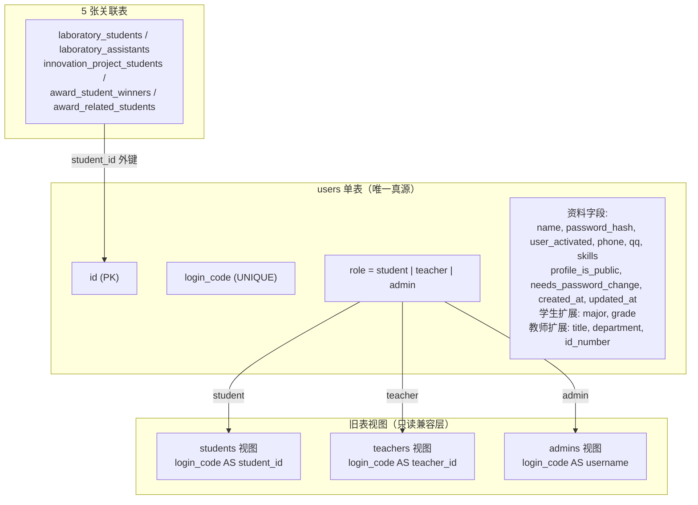
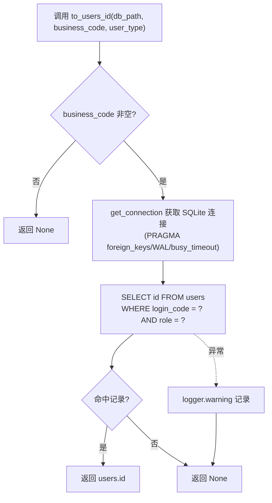

## 用户体系数据映射

### 模块职责

用户体系数据映射是 M1 渐进式迁移中“users 单表收口”的专门模块，承担两个核心职责：

1. **旧表读路径兼容**：旧 `students` / `teachers` / `admins` 三张实体表在迁移 `0002_legacy_tables_to_views` 中被替换为指向 `users` 的只读视图。视图列名和列序与旧表完全一致（例如 `students.student_id` 来自 `users.login_code` ），因此存量 SQL、报表和旧代码可以零改动继续以表名访问。
2. **业务号 → users.id 桥接**：旧写入链路仍以业务号（学号/工号/用户名）标识用户。`backend/utils/users_sync.py` 的 `to_users_id()` 将业务号转换为 `users.id`，保证以 `users.id` 为外键的写入正确落库。

设计原则：

- `users` 是唯一真源，旧三表仅是不可写的只读视图；
- 所有新写入（创建、改密、更新资料、软删）必须走 `UserRepository` / `users` 表；
- 历史关联表（5 张）的 `student_id` 外键已在迁移中物理重写为指向 `users.id`。

### 数据映射模型

下图概括 users 单表与旧三表视图、以及关联表外键之间的映射关系：

**关键节点解读**：

- `users` 行通过 `role` 字段进入对应视图；学生视图带 `major`/`grade`，教师视图带 `title`/`department`/`id_number`，管理员视图只暴露登录所需列。
- 5 张关联表不引用视图，而是外键直接指向 `users.id`，避免视图化后因不可写而无法维护关系。
- 关联表原 `student_id` 值在迁移中通过 `users.login_code` 与旧 `students.student_id` 连接重写为 `users.id`，并执行零悬空断言，存在无法映射的行时直接中止迁移。

视图主要列映射如下：

| users 列 | students 视图 | teachers 视图 | admins 视图 |
|---|---|---|---|
| id | id | id | id |
| login_code | student_id | teacher_id | username |
| name | name | name | name |
| password_hash | password_hash | password_hash | password_hash |
| user_activated | user_activated | user_activated | user_activated |
| created_at | created_at | created_at | created_at |
| needs_password_change | needs_password_change | needs_password_change | needs_password_change |
| major | major | — | — |
| grade | grade | — | — |
| title | — | title | — |
| department | — | department | — |
| id_number | — | id_number | — |

### 调用链

#### 业务号 → users.id 写入转换

**关键节点解读**：

- `to_users_id` 由 `backend/utils/users_sync.py` 导出，接收 `db_path`、`business_code` 和 `user_type`（`student`/`teacher`/`admin`）。
- 查询条件同时带 `login_code` 与 `role`，避免学号和管理员用户名冲突时错映射。
- 未命中或异常时返回 `None`，由调用方降级（例如放弃写入或改用其它标识）。
- 连接统一经 `get_connection`，强制开启外键、WAL 和 30s busy_timeout，避免并发写锁竞争。

#### 认证读路径中的体现

`auth.verify_user` 是“users 优先 + 旧表回退”的渐进式认证（用户体系数据映射的读侧体现）：

1. 先通过 `UserRepository.get_by_login_code()` 查询 `users` 单表；
2. 命中且 `user_activated=1`、密码校验通过，直接返回用户信息；
3. `users` 密码不匹配或 ORM 不可用时，回退查询 `admins`/`students`/`teachers` 视图；
4. 旧表验证成功时，`_self_heal_users_password()` 将密码同步回 `users.password_hash`，防止双表漂移；
5. 返回的 `user_id` 仍为业务号，供存量路由使用；需要 `users.id` 的场景再经 `to_users_id` 转换。

### 关键状态

- `user_activated`：`1` 启用 / `0` 停用（软删）。登录时需为 `1`。
- `needs_password_change`：`1` 表示首次登录或管理员重置后需强制改密。
- `role`：`student` / `teacher` / `admin`，决定视图归属和路由权限。
- `password_hash`：可为空，空 hash 一律拒绝登录（默认密码兜底已移除）。

### 主要文件

| 文件 | 职责 |
|---|---|
| `backend/orm/users.py` | `User` ORM 模型，定义 users 表结构及学生/教师扩展字段 |
| `backend/orm/repositories.py` | `UserRepository` 读写仓储，提供幂等创建、改密、更新资料、软删、改 login_code |
| `backend/orm/base.py` | SQLAlchemy engine/session 基建，复用 G1 连接契约 |
| `backend/utils/users_sync.py` | `to_users_id` 桥接函数，业务号 + 角色 → `users.id` |
| `backend/utils/db_connection.py` | SQLite 连接工厂，强制外键/WAL/busy_timeout |
| `migrations/versions/0002_legacy_tables_to_views.py` | 迁移：关联表 student_id 重写、旧三表视图化 |
| `app/auth.py` | 登录验证的渐进式认证路径（users 优先 + 旧表回退） |

### 边界条件

- **未迁移库**：`users` 表不存在时 ORM 查询抛异常，`verify_user` 捕获后回退旧三表实体表（仅存在于迁移前的环境）。
- **视图不可写**：旧三表是视图，任何直接 `INSERT`/`UPDATE`/`DELETE` 都会失败；写路径必须通过 `UserRepository` 操作 `users` 表。
- **幂等创建**：`create_user` 对已存在的 `login_code` 执行资料更新而不是重复插入，适合重复提交保护。
- **软删**：`deactivate` 只置 `user_activated=0`，不物理删除，避免历史成果 `submitter_id` 悬空。
- **login_code 换绑**：`update_login_code` 保持 `users.id` 不变，业务表引用不受影响；如果新号已存在，SQLite 唯一约束抛 `IntegrityError`，由调用方处理。
- **to_users_id 降级**：业务号查不到或数据库异常时返回 `None`，调用方不能假定一定映射成功。
- **空密码哈希**：任何角色如果 `password_hash` 为空，登录直接拒绝（P1-2 安全修复）。

### 扩展点

- **新增角色**：在 `users.role` 增加取值，并按 `0002` 模式追加对应视图即可；`UserRepository` 白名单字段需补充该角色的资料字段。
- **新增关联表**：新的学生关联表应直接 `FOREIGN KEY(student_id) REFERENCES users(id)`，不要再引用 `students` 视图。
- **Manager 退役**：`StudentManager`/`TeacherManager` 计划随读路径切换完成后移除，所有读写统一收敛到 `UserRepository`。
- **ORM 读路径辐射**：`UserRepository` 的 read 方法（`get_by_login_code`/`get_by_id`/`list_by_role`）已可供认证和列表页逐步替换手写 SQL。

Sources:  
- [backend/orm/users.py](backend/orm/users.py#L1-L38)  
- [backend/orm/repositories.py](backend/orm/repositories.py#L1-L158)  
- [backend/utils/users_sync.py](backend/utils/users_sync.py#L1-L31)  
- [migrations/versions/0002_legacy_tables_to_views.py](migrations/versions/0002_legacy_tables_to_views.py#L1-L197)  
- [backend/utils/db_connection.py](backend/utils/db_connection.py#L1-L32)  
- [backend/orm/base.py](backend/orm/base.py#L1-L66)  
- [app/auth.py](app/auth.py#L1-L221)