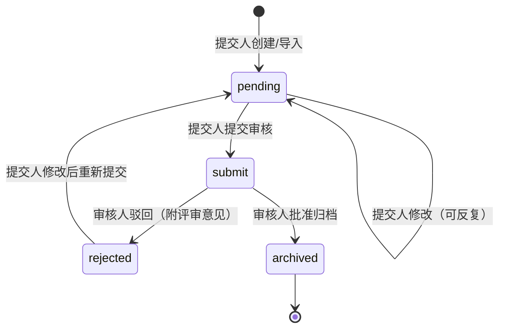
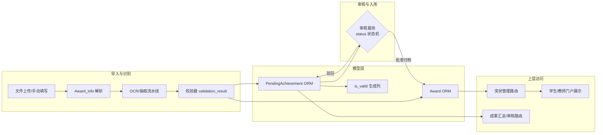

# 奖状与待审核成果模型

## 模块职责

本模块是奖状（`Award`）与待审核成果（`PendingAchievement`）的领域模型层，位于 `backend/orm` 与 `backend/models` 两个层次：

- **ORM 层（`backend/orm/awards.py`、`backend/orm/pending.py`）**：SQLAlchemy 2.0 风格的持久化模型，分别映射 `awards` 表与 `pending_achievements` 表，是 M1 后半 ORM 化的核心产物。
- **数据类层（`backend/models/achievement.py`、`backend/models/pending_achievement.py`、`backend/models/award.py`）**：面向业务逻辑的内存对象，提供 JSON 解析、校验辅助和历史 Manager 读写路径；在 ORM 化过渡期间，两者并存。

`Award` 持久化一条经过 OCR/抽取/校验的奖状记录，包含识别字段、文件溯源字段和审核结果字段；`PendingAchievement` 持久化一条待审核的成果提交（可以是奖状、专利、软著、大创、论文等任意类型），以 `achievement_type + achievement_data(JSON)` 承载多态数据。

## 关键模型字段

### Award（`awards` 表）

| 分组 | 字段 | 说明 |
|---|---|---|
| 识别字段 | `competition_name_in_file`、`track`、`issuer`、`province`、`group_name`、`winner_name`、`supervisor_name`、`award_level`、`competition_level`、`date`、`project_title`、`granted_role`、`related_student_name`、`edition`、`year` | 来自 OCR/抽取结果的结构化识别内容 |
| 溯源字段 | `image_hash`（文件去重）、`certificate_id`（证书编号）、`match_status`（模板匹配成功标志）、`ocr_result`（OCR 原始文本）、`extract_json`（抽取器输出 JSON）、`llm_prompt`/`llm_response`（LLM 调试信息）、`validation_result`（校验结果 JSON） | 记录识别链路每个环节的产物，支撑排障与审计 |
| 关联字段 | `competition_id`（关联竞赛目录）、`submitter_type`/`submitter_id`（提交人类型与 users.id）、`laboratory_id`（关联实验室）、`submit_time` | 建立与竞赛、用户、实验室的关联 |
| 审计字段 | `created_at`、`updated_at` | 时间戳 |

### PendingAchievement（`pending_achievements` 表）

| 分组 | 字段 | 说明 |
|---|---|---|
| 类型与数据 | `achievement_type`（award/patent/software/innovation/other）、`achievement_data`（JSON 长文本，承载具体成果数据） | 多态成果的统一容器 |
| 审核状态 | `status`（pending/submit/rejected/archived）、`reviewer_id`、`review_time`、`review_comment`、`assigned_reviewer_type`、`reviewer_type` | 审核流转的核心字段 |
| 识别溯源 | `file_path`、`file_hash`、`ocr_text`、`llm_prompt`、`llm_response`、`ext_info`（含 ocr_cache_hit/llm_cache_hit/match_score/template_id）、`session_id`（文件管理会话） | 与奖状处理流水线衔接 |
| 并发控制 | `version`（乐观锁，默认 1） | 服务层条件更新（P1-15）的前置字段 |
| 生成列 | `is_valid`（VIRTUAL） | 由 `validation_result` JSON 中的 `is_valid` 自动推导，SQLAlchemy `Computed` 表达式：`CASE WHEN json_extract(validation_result, '$.is_valid') IS NULL THEN NULL ELSE CAST(... AS INTEGER) END` |

## 核心状态

`PendingAchievement.status` 是审核流程的状态机：

关键节点说明：

- **`pending`**：草稿态，仅提交人可操作（修改/删除/提交）。
- **`submit`**：已提交，审核人可操作；`assigned_reviewer_type` 记录预分配审核人类型，`reviewer_type` 记录实际审核人类型。
- **`rejected`**：驳回态，审核人填写 `review_comment`；提交人修改后重新进入 `pending`。
- **`archived`**：终态，成果正式入库（写入 `awards` 或对应成果表）。

`version` 字段作为乐观锁，服务层更新时必须携带版本号，避免并发审核覆盖。

## 调用链

1. **识别链路**：上传文件后走「奖状处理流水线」（OCR → 抽取 → 校验），产物写入 `Award.ocr_result` / `extract_json` / `validation_result`，或 `PendingAchievement.ocr_text` / `llm_prompt` / `llm_response` / `ext_info`。
2. **审核链路**：「成果审核服务」依据 `status` 状态机推进，批准后成果数据落入库表（`awards` 等），驳回则保留在 `pending_achievements`。
3. **访问链路**：管理端「奖状管理」「成果汇总与文件导入」、学生/教师门户通过 ORM/Repository 读写模型；`UserRepository` 负责提交人（`submitter_id`）的读写，且与 `users` 表保持一致（`users.id` 是统一外键引用）。

## 主要文件

| 文件 | 职责 |
|---|---|
| `backend/orm/awards.py` | `Award` ORM 模型，44 个字段的完整映射 |
| `backend/orm/pending.py` | `PendingAchievement` ORM 模型，含 `is_valid` VIRTUAL 生成列 |
| `backend/orm/base.py` | ORM 基座：`Base` 声明式基类、engine 单例（WAL/外键/busy_timeout）、Session 工厂 |
| `backend/orm/repositories.py` | `UserRepository`：用户读写仓储（含幂等创建、软删、login_code 变更） |
| `backend/models/achievement.py` | 成果抽象基类与类型枚举：`AwardAchievement`、`ProjectApprovalAchievement`、`CopyrightAchievement`、`PaperAchievement` |
| `backend/models/pending_achievement.py` | `PendingAchievement` 数据类：JSON 解析、`validation_passed()`、`has_content_issues()`、`has_completeness_issues()` 等辅助方法 |
| `backend/models/award.py` | `Award_info` 数据类：从抽取 JSON 解析奖状信息，`split_names` 切分中英文名单 |

## 边界条件

- **无外键约束**：`awards`/`pending_achievements` 的 `submitter_id`、`competition_id`、`laboratory_id` 均无 FK 约束，因此用户软删而非物理删（`UserRepository.deactivate` 将 `user_activated=0`），避免悬空引用。
- **生成列只读**：`is_valid` 是 VIRTUAL 生成列，由 `validation_result` 自动推导，不可直接写入；读取时用 `validation_passed()` 方法规避同名遮蔽问题。
- **乐观锁**：`PendingAchievement.version` 默认 1，服务层条件更新必须携带版本号，并发审核时版本不匹配则更新失败。
- **`achievement_data` 是必填列**：但可以为空字符串；解析失败时返回 `{}` 并记录错误日志，不抛出异常。
- **`Award_info` 容错**：对 `track` 字段的字符串 `"None"` 做归一化为空串；名单字段支持逗号、顿号、分号混合分隔（`split_names`）。

## 扩展点

- **新成果类型接入**：`achievement_type` 是字符串字段，新增类型只需在 `AchievementType` 枚举或 `pending_achievement.py` 注释中的类型列表扩展，无需改表结构——`achievement_data` JSON 天然支持多态。
- **ORM 化过渡**：`backend/models` 中的 Manager/数据类与 `backend/orm` 并行，读路径已由 `UserRepository` 接管，写路径逐步迁移；旧表视图化后 Manager 可彻底移除。
- **校验逻辑扩展**：`validation_result` JSON 可扩展 `content_issues`/`completeness_issues` 等子结构，`PendingAchievement` 数据类已提供对应解析方法。
- **AI 调试信息**：`ext_info`（JSON）预留 `ocr_cache_hit`、`llm_cache_hit`、`match_score`、`template_id` 字段，为 OCR/LLM 缓存命中率与模板匹配分值的观测提供扩展位。

## Sources

Sources: [backend/orm/awards.py](backend/orm/awards.py#L1-L43), [backend/orm/pending.py](backend/orm/pending.py#L1-L45), [backend/orm/base.py](backend/orm/base.py#L1-L66), [backend/orm/repositories.py](backend/orm/repositories.py#L1-L158), [backend/models/achievement.py](backend/models/achievement.py#L1-L182), [backend/models/pending_achievement.py](backend/models/pending_achievement.py#L1-L120), [backend/models/award.py](backend/models/award.py#L1-L130)