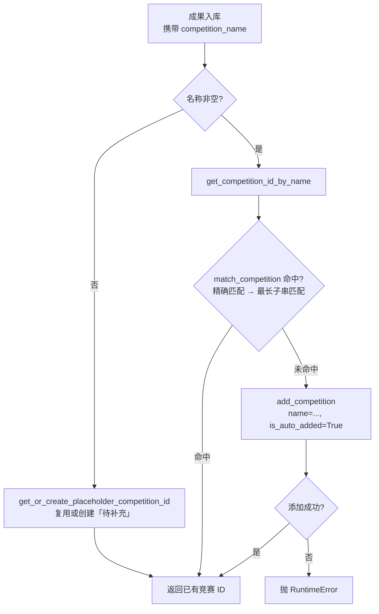
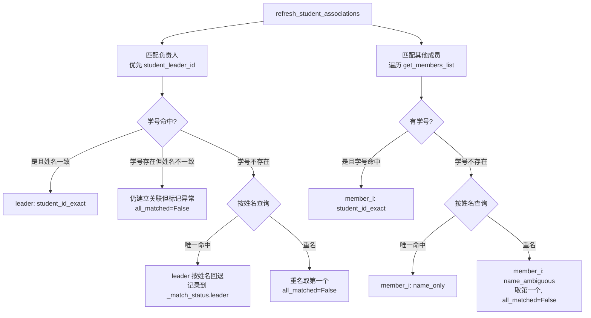

# 竞赛与大创项目模型

## 模块职责

本页面覆盖两套紧密支撑成果库的领域模型：**竞赛目录**（`Competition` / `CompetitionManager`）与**大创项目**（`InnovationProject`）。它们分别承担：

| 模型 | 文件 | 职责 |
|---|---|---|
| `Competition` | `backend/models/competition.py` | 竞赛主数据：名称、等级、白/观察名单、时间范围、别名、来源标记等 |
| `CompetitionManager` | `backend/models/competition.py` | 竞赛目录的加载、内存缓存、名称匹配、自动注册与模板关联 |
| `parse_competition_time` | `backend/utils/competition_time_parser.py` | 独立的竞赛时间字符串解析工具，输出起止月份与跨年标记 |
| `InnovationProject` | `backend/models/innovation_project.py` | 大创项目主数据：负责人/成员/指导教师、经费、状态、提交信息、学生对象关联 |

需要先澄清一个命名差异：目录上下文称这些为 "ORM 模型"，但源码证据显示它们是 **dataclass + `sqlite3.Row` 映射** 的轻量领域模型，并非 SQLAlchemy 声明式模型。`CompetitionManager` 通过 `backend.utils.db_connection.get_connection` 直连 SQLite，在应用层完成行数据到对象的转换。阅读后续代码时不应期待 `db.Column` 式定义。

## 竞赛目录模型

### 关键字段与常量

`Competition` 的字段反映了竞赛目录的业务状态：

- **识别字段**：`id`（主键）、`name`（官方名称，库字段 `competition_name`）
- **等级与名单**：`grade_category`（学院判定等级，如 A类/B类）、`is_white_list`（高含金量/官方认可）、`is_watch_list`（考察期）
- **时间字段**：`time_range`（原始字符串，库字段 `competition_time`）、`start_month` / `end_month`（解析结果）
- **匹配辅助**：`aliases`（由 `alias_list` 按 `; , ， ； \n` 切分）
- **来源标记**：`is_auto_added`（True=程序自动添加，False=手工添加）
- **可选元数据**：`official_website`、`organizer`、`participant_requirements`（旧库可能无此列，读取时用 `row.keys()` 判存）

两个关键常量：

- `MISSING_COMPETITION_ID = 2147483647`（INT32_MAX）：表示"查询不到竞赛"的哨兵值，`is_missing_competition_id()` 同时把 `None` 视为缺失。
- `PLACEHOLDER_COMPETITION_NAME = "待补充"`：`competition_name` 为空时使用的占位竞赛名。库中 `competition_name` 唯一，故全局只有一条。

### 时间字段解析

系统内存在**两套时间解析实现**，失败策略刻意不同：

| 维度 | `Competition._parse_time_range` | `parse_competition_time` |
|---|---|---|
| 调用时机 | `from_db_row` 加载竞赛行时 | 需要显式跨年判断或独立解析时 |
| 支持格式 | "4-10月"、"四月-十月"（"到"→"-"）、"5月"、"五月" | "4-10月"、"4～10月"、"4~10月"、"9月"、"十月" |
| 单月处理 | 前后各扩展 1 个月并处理回绕（1月→12,2；12月→11,1） | `start_month = end_month = 该月` |
| 跨年标记 | 无 | `is_cross_year = start_month > end_month`（如 "10-4月"） |
| 解析失败 | 返回默认 `(1, 11)` + warning | 返回 `None, None`，由调用方感知未知 |

**边界条件**：模型加载侧偏向"有默认值可用"，工具函数侧偏向"暴露未知"。使用 `start_month` / `end_month` 时需区分这两种语义，避免把占位默认值当作真实赛程。

### 竞赛匹配与自动注册（调用链）

竞赛匹配是奖状入库、模板关联等链路的公共前置步骤：

关键节点说明：

- `match_competition` 分两级：先做归一化（去除所有非中英文数字字符并小写）后的名称/别名**精确匹配**；未命中时再做"输入串包含别名/名称"的**最长子串匹配**，例如 "2024蓝桥杯省赛" 会命中 "蓝桥杯"，取最长候选以避免短关键词误判。
- `get_competition_id_by_name` 对空值/非字符串入参抛 `ValueError`，未命中时自动注册 `is_auto_added=True` 的竞赛，保证**永远返回合法竞赛 ID，不会返回缺失值**。
- `associate_competition_from_template(template_id, template_manager)` 从模板 `default_fields['competition_name']` 反查竞赛，是抽取模板与竞赛目录之间的桥接。

### 缓存回源机制

`CompetitionManager` 构造时把全部竞赛加载进内存 `self.competitions`。两条查询路径：

- `get_competition_by_id`：只查内存，适合常规展示。
- `get_competition_by_id_from_db`：按 ID 回源数据库，找到后**追加进内存缓存**再返回。用于奖状列表等场景——当奖状引用了"本请求内新建、尚未刷入内存"的竞赛时，避免漏显示。

### 扩展点

- `from_db_row` 的 `row.keys()` 判断模式是新增竞赛属性时的向后兼容模板，可直接沿用。
- 匹配算法集中在 `match_competition`，如需更高级的相似度/分词匹配，替换该方法即可，调用方不受影响。
- 时间解析的"模型默认值"与"工具显式 None"双策略并存，扩展新格式时需同时考虑两处。

## 大创项目模型

### 核心字段与业务规则

`InnovationProject` 关键状态：

- **项目**：`project_no`、`project_name`、`project_type`（国家级/省级/校级）、`start_date`、`end_date`
- **人员**：`student_leader_name`、`student_leader_id`、`other_members`（JSON 或逗号分隔）、`supervisors`（逗号分隔教师名）
- **经费与状态**：`funding_amount`、`status`（进行中/已结题/终止）
- **提交信息**：`submitter_type`（默认 `"admin"`）、`submitter_id`、`submit_time`、`laboratory_id`
- **系统字段**：`id`、`created_at`、`updated_at`
- **对象关联**（不落主表，落关联表）：`student_leader_obj`、`student_members`、`_match_status`

模块 docstring 明确业务规则：**只有管理员可以提交大创项目**（"Only admin can submit innovation projects"），与 `submitter_type = "admin"` 的默认值一致。

### 成员与指导教师解析

`other_members` 是历史兼容的重灾区，`_parse_other_members` 按顺序尝试三种格式：

1. JSON 列表且元素为 dict（新格式）：`[{"姓名":"...","学号":"..."}, ...]`
2. JSON 列表且元素为 str（旧格式）：`["张三(2022001)", "李四(2022002)"]` → `_parse_legacy_format` 按括号切出姓名/学号
3. 纯逗号分隔：`"张三, 李四"` → 学号置 `None`

展示辅助 `get_other_members_display` 统一输出 `姓名(学号), ...`；`get_supervisors_list` 按逗号拆分指导教师姓名。`get_year()` 从 `start_date` 提取年份，支持 `YYYY.MM`、`YYYY-MM`、`YYYY-MM-DD`、`YYYY年`、纯 `YYYY`，并校验 1900–2100 区间。

### 学生关联刷新与匹配状态

`refresh_student_associations(student_manager)` 是连接大创模型与学生模型的关键调用链，返回布尔值表示**是否全部匹配成功**：

关键节点说明：

- `_match_status` 是 `Dict[str, str]`，键为 `leader` 或 `member_{i}`，值为匹配方式。源码中明确可见的状态值有：`student_id_exact`（学号+姓名校验通过）、`name_only`（仅姓名唯一命中）、`name_ambiguous`（重名，取第一个并置 `all_matched=False`）。
- 学号存在但姓名不一致时，代码**仍建立关联但标记异常**，避免因脏数据阻断整条入库链路。
- 匹配优先级始终是"学号优先、姓名回退"，符合校园场景中学号区分度高于姓名的现实。

### 边界条件与扩展点

- **成员格式兼容**：`_parse_other_members` 的逐级尝试模式是天然扩展点，新增格式只需在 JSON 解析失败后追加解析分支。
- **匹配策略**：`refresh_student_associations` 的学号→姓名回退策略可替换为更严格/宽松的规则（如院系+姓名复合匹配），调用方只依赖返回值与 `_match_status`。
- **重名处理**：重名时选择第一个匹配并标记 `name_ambiguous`，管理端可据此高亮待人工确认项。

## 调用链总览

- 管理端大创路由 → `InnovationProject` 数据操作 → `refresh_student_associations(StudentManager)` 建立学生对象关联。
- 奖状处理流水线 → `CompetitionManager.get_competition_id_by_name` → 命中已有目录或自动注册新竞赛。
- 奖状列表展示 → `get_competition_by_id`（内存）→ 未命中时 `get_competition_by_id_from_db`（回源）。
- 模板管理 → `associate_competition_from_template` → 模板默认字段反查竞赛。
- 抽取结果字段规范化 → `parse_competition_time` / `Competition._parse_time_range` 解析赛程月份。

## Sources

Sources: [backend/models/competition.py](backend/models/competition.py#L1-L220), [backend/models/competition.py](backend/models/competition.py#L220-L460), [backend/utils/competition_time_parser.py](backend/utils/competition_time_parser.py#L1-L97), [backend/models/innovation_project.py](backend/models/innovation_project.py#L1-L260), [backend/models/innovation_project.py](backend/models/innovation_project.py#L260-L340)