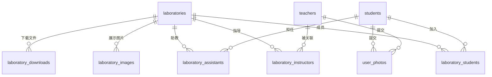
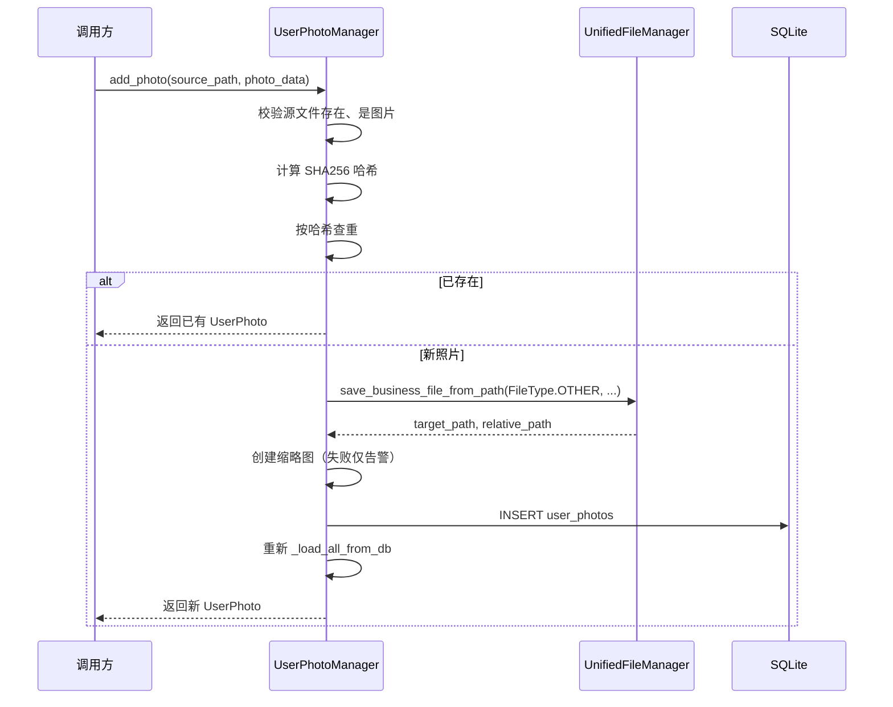

## 实验室与师生模型

### 模块职责

本模块位于 `backend/models/`，是实验室、学生、教师、用户照片四类基础数据模型的集合。它采用 **dataclass 实体 + Manager 管理器** 的模式，而非 SQLAlchemy ORM：每个实体类只描述字段与展示方法，Manager 负责 SQLite 读写、内存缓存和关联对象装配。这些模型共同支撑：

- 学生/教师门户中的个人资料、头像/相册、所属实验室展示；
- 管理端实验室 CRUD、成员关联、实验室图片与下载区维护；
- 用户照片的上传、缩略图、公开/私有控制。

### 领域模型

#### Student

`Student` 是学生实体，核心字段包括 `student_id`（学号）、`name`、`major`、`grade`、`phone`、`qq`、`skills`（JSON 字符串）、`user_activated`、`password_hash` 和 `role`。它提供了两个展示辅助方法：

- `__str__`：拼接“姓名 学号 年级 专业”，空字段自动忽略；
- `get_brief_desc`：生成“李家鸿(22计科)”式简要描述，将年级取后两位，专业按内置映射简写为“计科/软工/数媒”，未知专业回退原专业名。

#### Teacher

`Teacher` 是教师实体，字段包括 `teacher_id`、`name`、`department`（默认 `'未设置'`）、`title`、`phone`、`id_number`、`qq`、`skills`、`user_activated`、`password_hash`、`role`。目前未定义额外展示方法，但 Manager 在读取时会为空的 `department` 填充默认值，保证页面显示一致性。

#### Laboratory

`Laboratory` 是实验室实体，字段为 `id`、`name`、`description`、`cover_image`。它不是扁平化模型，而是通过对象引用持有四类关联数据：

- `instructors`：指导教师列表（`Teacher` 对象）；
- `students`：成员学生列表（`Student` 对象）；
- `assistants`：学生助教列表（`Student` 对象，且一个学生只能担任一个实验室的助教）；
- `images`：实验室图片路径列表；
- `downloads`：下载区文件元信息列表（字典）。

`from_db_row` 只填充主表字段，关联数据由 `LaboratoryManager` 加载后注入。

#### UserPhoto

`UserPhoto` 表示用户照片，支持两类场景：

- `photo_type = "lab_activity"`：实验室活动照片，关联 `laboratory_id`；
- `photo_type = "personal_gallery"`：个人相册照片。

模型保存文件路径、SHA256 哈希、缩略图路径、提交者类型/ID、可见性（`is_public`）、展示排序（`display_order`）等。`get_full_path` 与 `get_thumbnail_path` 基于基础目录解析出完整路径。

### 存储结构与关联关系

`LaboratoryManager._init_db` 定义了实验室相关表，`TeacherManager`/`UserPhotoManager` 各自负责 `teachers`、`user_photos` 表。整体关系可表达为：

关键约束：

- `laboratory_instructors`、`laboratory_students` 均为联合主键 `(laboratory_id, teacher_id/student_id)`，外键 `ON DELETE CASCADE`；
- `laboratory_assistants` 额外有 `UNIQUE (student_id)`，保证一个学生最多担任一个实验室的助教；
- `laboratory_images`、`laboratory_downloads` 通过外键级联删除，下载区还记录了提交者类型/ID、是否公开和排序；
- `user_photos` 通过 `file_hash` 提供内容级去重。

### 调用链与生命周期

#### 管理器装配

`LaboratoryManager` 构造时接收 `db_path` 以及可选的 `student_manager`、`teacher_manager`。初始化时：

1. 检查数据库文件是否存在；
2. 建立内存缓存索引（按 id、按 name）；
3. 初始化 `_dirty_laboratories` 与 `_deleted_laboratories` 集合；
4. `_init_db` 建表；
5. `_load_all_from_db` 加载主表、关联、图片、下载数据。

关联加载依赖外部 Manager：`_load_associations` 先从关联表读出 `(lab_id, teacher_id/student_id)`，再通过 `teacher_manager.get_teacher_by_pk` / `student_manager.get_student_by_pk` 解析出对象引用，并去重后追加到对应列表。这样**实验室对象持有的是内存中同一份学生/教师实例**，而非 ID，便于页面直接渲染。

#### 用户照片添加流程

`UserPhotoManager.add_photo` 是一条较完整的写入链路：

照片文件被统一复制到 `UnifiedFileManager` 的 `FileType.OTHER` 目录，数据库只保存相对路径；缩略图生成失败不会导致上传失败，仅记录 `warning`。

### 关键状态

- **内存缓存**：`TeacherManager.teachers`、`LaboratoryManager.laboratories`、`UserPhotoManager.photos` 都是全量加载到内存，查询走列表遍历或内存索引；
- **脏标记**：`LaboratoryManager` 通过 `_dirty_laboratories` / `_deleted_laboratories` 跟踪待同步变更，支持延迟写库；
- **排序状态**：`UserPhotoManager` 加载时按 `display_order` 升序、`submit_time` 降序排列，保证相册展示顺序稳定；
- **激活状态**：`user_activated` 默认 `True`，是账号是否可用的关键开关；`role` 默认值分别为 `'student'` / `'teacher'`。

### 边界条件

- **表缺失自愈**：`TeacherManager` 捕获 `"no such table"` 错误后自动 `_init_db` 并重新加载，兼容首次运行或旧库升级；
- **数据库文件不存在**：`LaboratoryManager` 在 `db_path` 不存在时不建表，仅在文件出现后初始化；
- **旧库字段兼容**：`laboratories` 表通过 `ALTER TABLE ... ADD COLUMN cover_image` 尝试补字段，字段已存在时忽略 `OperationalError`；
- **照片去重**：相同 SHA256 的文件直接返回已有照片，避免重复占用存储；
- **关联去重**：加载教师/学生/助教时都检查“对象已在列表中”，防止重复关联导致重复渲染；
- **缩略图失败降级**：缩略图创建异常只记录日志，主照片仍可入库；
- **重名实验室**：`_laboratories_by_name` 使用 `Dict[str, List[Laboratory]]`，支持按名称索引多个同名实验室。

### 扩展点

- **新的实验室关联类型**：可参照 `laboratory_instructors` 模式新增关联表，并在 `_load_associations` 中扩展注入逻辑，不影响现有调用方；
- **照片场景扩展**：`photo_type` 是字符串字段，新增场景只需扩展枚举值与前端展示，无需改表结构；
- **文件存储替换**：照片文件统一委托 `UnifiedFileManager`，更换存储位置或云存储时不必改动模型层；
- **字段兼容性**：`Laboratory.from_db_row` 通过 `row.keys()` 判断字段是否存在，旧库缺列时可安全降级；
- **展示格式扩展**：`Student.get_brief_desc` 的专业简写映射表可扩展，未匹配专业自动回退原名。

Sources: [backend/models/laboratory.py](backend/models/laboratory.py#L1-L260), [backend/models/student.py](backend/models/student.py#L1-L80), [backend/models/teacher.py](backend/models/teacher.py#L1-L100), [backend/models/user_photo.py](backend/models/user_photo.py#L1-L280)