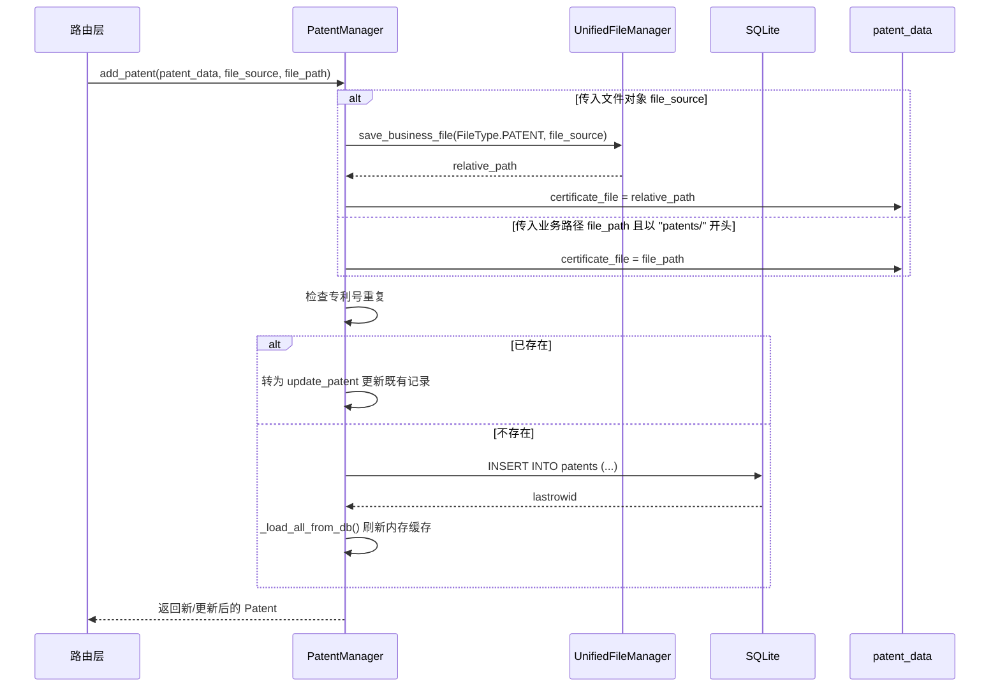
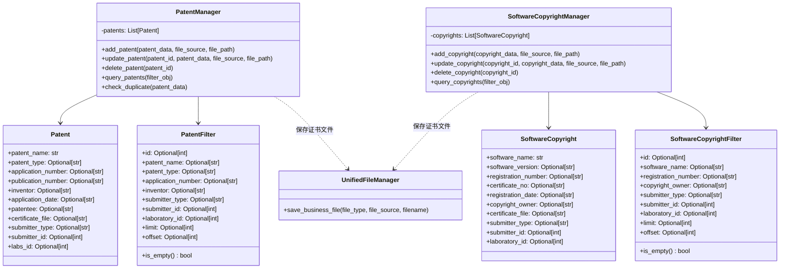

## 专利/软著/其他文件模型

### 模块职责

本模块承载专利、软件著作权（软著）以及其他文件类成果的领域模型与数据访问层。它通过统一的 `dataclass` 定义各成果的核心元数据、提交者信息、证书文件关联及系统审计字段，并借助对应的 `Manager` 提供基于 SQLite 的持久化、内存缓存、增删改查、去重与过滤能力。

模块内每个成果类型都遵循同一套设计范式：

- **数据模型**：`Patent`、`SoftwareCopyright` 等 `dataclass` 表示一条成果记录。
- **查询过滤器**：`PatentFilter`、`SoftwareCopyrightFilter` 封装可组合的过滤条件与分页参数。
- **管理器**：`PatentManager`、`SoftwareCopyrightManager` 负责数据库连接、全量加载、CRUD 操作和业务规则（如去重、文件替换）。

### 调用链

上层路由（如“专利、软著与其他成果”管理路由）通过实例化对应的 `Manager`，调用其 `add_*`、`update_*`、`delete_*`、`query_*` 方法完成数据操作。

典型调用链如下（以添加专利为例）：

软著添加流程与上述一致，仅将 `patents/` 替换为 `software/`，表名与字段替换为软著对应的列。

### 关键状态

#### 数据模型字段

专利与软著均具备三类字段：

1. **成果特有字段**
   - 专利：`patent_name`（必填）、`patent_type`（发明专利/实用新型/外观设计）、`application_number`、`publication_number`、`inventor`、`application_date`、`patentee`。
   - 软著：`software_name`（必填）、`software_version`、`registration_number`、`certificate_no`、`registration_date`、`copyright_owner`。

2. **提交归属字段**
   - `submitter_type`（student/teacher/admin）、`submitter_id`、`submit_time`、`laboratory_id`。

3. **系统与文件字段**
   - `certificate_file`（证书文件相对路径）、`id`、`created_at`、`updated_at`。

#### 记录生命周期

- **加载**：`Manager` 构造时执行 `SELECT * FROM ... ORDER BY id DESC`，将全部记录加载至内存列表。
- **新增**：若存在唯一编号（专利 `application_number`，软著 `registration_number`）则走更新；否则插入数据库并重新加载内存。
- **更新**：更新指定字段；若提供了新证书文件或新业务路径且与旧路径不同，会通过统一文件管理器删除旧文件。
- **删除**：删除数据库记录，并同步从内存列表中移除。

### 主要文件

- `backend/models/patent.py`：定义 `Patent`、`PatentFilter`、`PatentManager`。
- `backend/models/software_copyright.py`：定义 `SoftwareCopyright`、`SoftwareCopyrightFilter`、`SoftwareCopyrightManager`。

其他文件类成果模型未在当前证据中单独出现，但其设计完全可复用以上模式：新增一个 `dataclass` 数据类、一个 `Filter`、一个 `Manager`，并接入统一文件管理器即可。

### 边界条件

- **文件路径约束**：`file_path` 必须带有业务前缀（`patents/`、`software/`）才会被采纳为 `certificate_file`，否则忽略并使用已有值。
- **文件来源类型**：`file_source` 必须是 Flask 文件对象（具备 `save` 和 `filename` 属性），否则抛出 `ValueError`。
- **重复策略**：
  - 新增前按唯一编号查重，若存在自动转为更新。
  - `check_duplicate` 提供补充策略：专利按名称（去除首尾空白、转小写）匹配，软著未单独实现但可仿照。
- **分页过滤**：`limit`/`offset` 在内存过滤后切片实现。
- **数据库连接**：统一使用 `backend.utils.db_connection` 的 `get_connection`，不直接持有连接池。

### 扩展点

- **新成果类型**：仿照 `Patent`/`SoftwareCopyright` 新建数据类、Filter、Manager，并在统一文件管理器中新增对应的 `FileType` 枚举，即可快速接入同类管理流。
- **文件存储分类**：通过 `FileType` 决定文件保存到 `files/patents/` 或 `files/software/`，易于扩展 `files/other/` 等目录。
- **过滤条件扩展**：在 Filter 中加入新字段，并在 `query_*` 中实现对应过滤逻辑，即可支持更复杂的查询需求。

### 架构图

以下类图展示了模型、过滤器和管理器之间的静态关系，以及它们对统一文件管理器的依赖：

**关键节点说明**：

- `Patent` / `SoftwareCopyright` 是纯数据结构，字段与数据库表列一一对应，不包含业务逻辑。
- `PatentFilter` / `SoftwareCopyrightFilter` 通过 `is_empty()` 判断是否携带过滤条件，避免空过滤导致误过滤。
- `PatentManager` / `SoftwareCopyrightManager` 内部维护内存缓存，读写均基于该缓存，数据库操作后立即刷新。
- `UnifiedFileManager` 是文件存储的统一入口，确保证书文件按业务类型归档到 `files/{patents|software}/` 目录。

Sources: [backend/models/patent.py](backend/models/patent.py#L1-L376), [backend/models/software_copyright.py](backend/models/software_copyright.py#L1-L370)