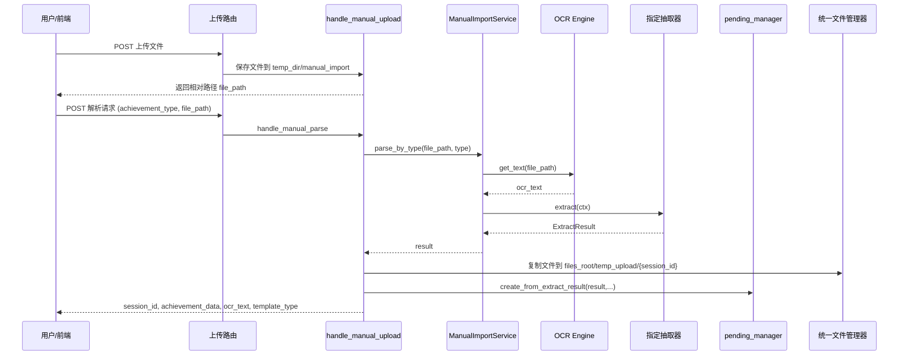
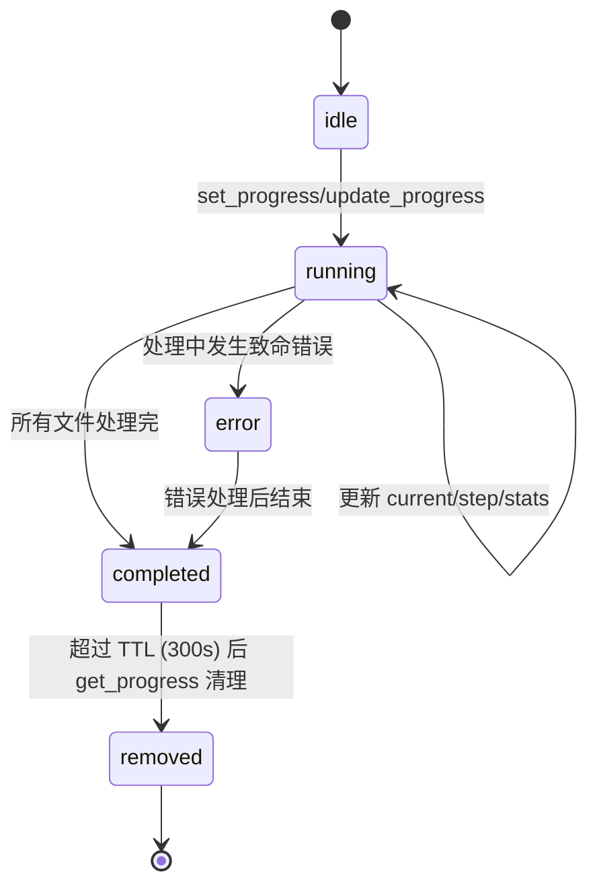

## 批量导入进度与手动导入

本页面聚焦两类相互独立但共同支撑成果录入的能力：一是**跨请求共享的批量导入进度存储**，解决长耗时导入任务中 Cookie Session 无法实时读取进度的问题；二是**手动导入链路**，即用户上传单个文件后，绕过硬编码的类型识别逻辑，直接调用指定类型的抽取器解析，并将结果组装、校验后写入待审核（pending）表。同时，`file_import_helpers.py` 提供了一批供导入结果页展示、统计和类型调整的辅助函数，服务于手动与批量导入后的数据呈现。

### 1. 模块职责

| 模块/文件 | 职责 |
| --- | --- |
| `app/import_progress_store.py` | 内存态的任务进度存储。通过进程内字典 + 线程锁实现跨请求共享，提供设置、更新、读取和过期清理能力。 |
| `backend/services/manual_import_service.py` | 手动导入服务。接收指定成果类型，强制调用对应抽取器，绕过框架的自动类型识别逻辑。 |
| `app/routes/manual_import_helpers.py` | 手动导入路由共享逻辑。封装文件上传、解析调用、文件归档、pending 落库以及获奖者/指导教师匹配状态计算。 |
| `app/routes/file_import_helpers.py` | 导入结果页辅助。读取成果类型配置、计算各类型有效/无效统计、调整展示 Tab、查询 pending 项并构建字段错误映射。 |

这四个文件共同支撑了从“上传文件/查看进度”到“手动解析并入库”的完整闭环。

### 2. 批量导入进度存储

#### 2.1 为什么需要跨请求进度存储

文件导入是耗时操作（涉及 OCR、LLM 抽取等），浏览器在请求未结束前无法通过 Cookie Session 读取其他请求写入的进度。`import_progress_store.py` 在服务端内存中维护一个全局字典，使上传接口写入进度、独立轮询接口读取进度成为可能。

#### 2.2 关键状态与数据结构

默认进度结构（`_default_progress`）定义于 `app/import_progress_store.py#L15-L31`：

```python
{
    'total': 0,
    'current': 0,
    'current_file': '',
    'current_step': '',
    'status': 'idle',          # 调用方可自定义：idle/running/completed/error...
    'uploaded_count': 0,
    'stats': {
        'award':      {'valid': 0, 'invalid': 0},
        'patent':     {'valid': 0, 'invalid': 0},
        'software':   {'valid': 0, 'invalid': 0},
        'innovation': {'valid': 0, 'invalid': 0},
        'other':      {'valid': 0, 'invalid': 0}
    },
    'errors': []
}
```

`status` 是核心状态字段，由调用方控制；`_updated_at` 为内部时间戳，不对外暴露（`get_progress` 中移除）。

#### 2.3 核心函数与并发控制

- `set_progress(task_id, data)`：覆盖写入整个进度对象，更新 `_updated_at`。
- `update_progress(task_id, **kwargs)`：按字段增量更新，若 task_id 不存在则先初始化为默认结构。
- `get_progress(task_id)`：读取副本；如果任务状态为 `completed` 且已超过 300 秒 TTL，则立即从字典中清除并返回 `None`。
- `get_progress_or_idle(task_id)`：若没有 task_id 或任务不存在，返回默认 idle 结构，避免调用方判空。

所有写操作均在 `threading.Lock` 保护下进行，防止多线程并发写导致数据错乱。

#### 2.4 边界条件

- **TTL 清理**：仅对 `completed` 状态执行超时清理，其它状态（如 `running`）不会被动过期，需由调用方主动更新状态。
- **内存隔离**：存储仅存在于单进程内存，多进程/多实例部署时无法共享；也未做持久化。
- **大小限制**：未设置任务数量上限，极端情况下可能内存增长，但配合 TTL 可缓解。

#### 2.5 扩展点

- 新增进度维度时，只需修改 `_default_progress` 或调用方传入的 dict 结构，无需改动存储层。
- 若需支持分布式场景，可将 `_store` 替换为 Redis 等外部存储，保持函数签名不变即可。

### 3. 手动导入链路

#### 3.1 整体调用链



#### 3.2 文件上传与解析

**上传阶段**（`manual_import_helpers.py#L17-L44`）：

- 从 `request.files` 取第一个有效文件，以 `uuid4().hex_原文件名` 保存到 `<temp_dir>/manual_import/`。
- 返回相对 `temp_dir` 的路径，供后续解析接口使用。

**解析阶段**（`manual_import_helpers.py#L47-L117`）：

1. 从 JSON 请求中提取 `achievement_type`、`file_path` 及缓存开关。
2. 校验类型必须为 `award`、`patent`、`software` 之一；文件必须存在。
3. 创建 `ManualImportService`，调用 `parse_by_type`。

#### 3.3 手动导入服务核心逻辑

`manual_import_service.py#L33-L107` 的 `parse_by_type`：

1. **OCR 识别**：调用 `ocr_engine.get_text(file_path, use_cache=use_ocr_cache, is_precise=False)`。若失败或文本为空，返回 `status="ocr_error"` 的 `ExtractResult`。
2. **按类型找抽取器**：遍历 `framework._extractors`，匹配 `award`/`patent`/`software` 对应名称的抽取器（`_get_extractor_by_type`），不支持则返回 `status="error"`。
3. **构造上下文**：创建 `ExtractContext`，设置 `force_type = achievement_type`，明确告知抽取器这是手动指定的类型。
4. **执行抽取**：调用 `extractor.extract(ctx)`，返回 `ExtractResult`；异常会被捕获并转为 `status="error"`。

> 注意：`ManualImportService` 直接访问框架内部 `_extractors` 列表，这是一种显式绕过框架类型选择的设计，但也意味着对框架内部结构的耦合。

#### 3.4 结果落库与展示关联

解析成功后，`handle_manual_parse` 执行：

- 生成 `session_id`（当前时间的 MD5）。
- 计算文件哈希。
- 通过统一文件管理器将文件复制到 `files_root/temp_upload/{session_id}/`，生成入库路径 `temp_upload/{session_id}/{filename}`。
- 在 `result.metadata` 中注入 `session_id`，并设置 `template_type`。
- 调用 `pending_manager.create_from_extract_result(...)`，将抽取结果写入 pending 表，状态为 `'pending'`。
- 返回前端所需的 `achievement_data`、`ocr_text` 和 `template_type`，供表单回填。

#### 3.5 表单展示辅助：获奖者/指导教师匹配状态

`build_winner_supervisor_status`（`manual_import_helpers.py#L123-L...`）针对 `award` 类型解析 `winner_name`，按逗号拆分并去掉括号中的附加信息，然后调用 `student_manager.find_students_by_name` 匹配学生：

- 唯一匹配 → `matched=True`，附带学生简要信息；
- 多个匹配 → `ambiguous=True`，提示用户手动选择；
- 零匹配 → `not_found=True`。

该函数返回的列表用于内联编辑表单中实时展示匹配状态，辅助用户确认或纠正。

#### 3.6 导入结果页的统计展示

`file_import_helpers.py` 中的函数虽然也服务于批量导入，但同样被手动导入结果页复用：

- `get_achievement_types()` 等函数从 `settings.json` 读取成果类型配置。
- `calculate_type_stats(session_id, pending_manager)` 按类型统计 pending 中有效/无效数量。
- `adjust_tab_and_status(tab_type, status, type_stats)` 自动切换到有数据的 Tab 和子状态，避免空页。
- `query_pending_items(tab_type, status, session_id, pending_manager)` 结合 `validation_passed()` 过滤出当前展示列表。
- `process_validation_result()` 将校验结果中的问题按字段映射成前端可展示的错误字典。

### 4. 边界条件与注意事项

- **类型限制**：手动导入只支持 `award`、`patent`、`software` 三类，不包括 `innovation` 和 `other`。若需扩展，需同步修改 `ManualImportService._get_extractor_by_type` 与路由中的校验。
- **文件位置**：解析时文件路径若为相对路径，则基于 `temp_dir` 拼接；同时 `handle_manual_parse` 会校验文件是否存在，防止后续 OCR 失败。
- **进度存储的过期**：`completed` 状态保留 300 秒后自动清除，若前端长时间不轮询进度，后续查询会返回 `idle` 结构（而非 `None`），便于前端直接渲染初始状态。
- **线程安全**：进度存储使用全局锁保证线程安全，但手动导入服务本身未做幂等控制，重复提交同一文件可能产生多条 pending 记录；幂等控制由更高层模块（如 `幂等与熔断` 页面）负责。

### 5. 扩展点

- **新增成果类型**：在 `ManualImportService._get_extractor_by_type` 增加映射分支，并在 `handle_manual_parse` 的类型白名单中放开；同时需对应抽取器已注册到框架。
- **替换进度存储后端**：当前内存实现不跨进程，若未来部署多实例，可将 `_store` 替换为 Redis，`set_progress/update_progress/get_progress` 接口不变。
- **表单内联校验**：`build_winner_supervisor_status` 目前只处理获奖者匹配，可将其扩展为通用人员匹配工具，支持教师/实验室等实体复用。

### 6. Mermaid 图



**关键节点说明**：
- `idle` 是默认状态，当没有 task_id 或未开始时返回。
- `running` 状态承载具体的进度数值（`current`、`current_file`、`current_step`）。
- `completed` 后开始 TTL 倒计时，仅当调用 `get_progress` 时检查并移除，避免额外后台扫描。
- `error` 状态并非框架强制，调用方可自由定义，但 `get_progress` 只对 `completed` 做清理。

---

Sources: [app/import_progress_store.py](app/import_progress_store.py#L1-L74)  
Sources: [backend/services/manual_import_service.py](backend/services/manual_import_service.py#L1-L149)  
Sources: [app/routes/manual_import_helpers.py](app/routes/manual_import_helpers.py#L1-L211)  
Sources: [app/routes/file_import_helpers.py](app/routes/file_import_helpers.py#L1-L120)  
Sources: [app/routes/file_import_helpers.py](app/routes/file_import_helpers.py#L120-L420)