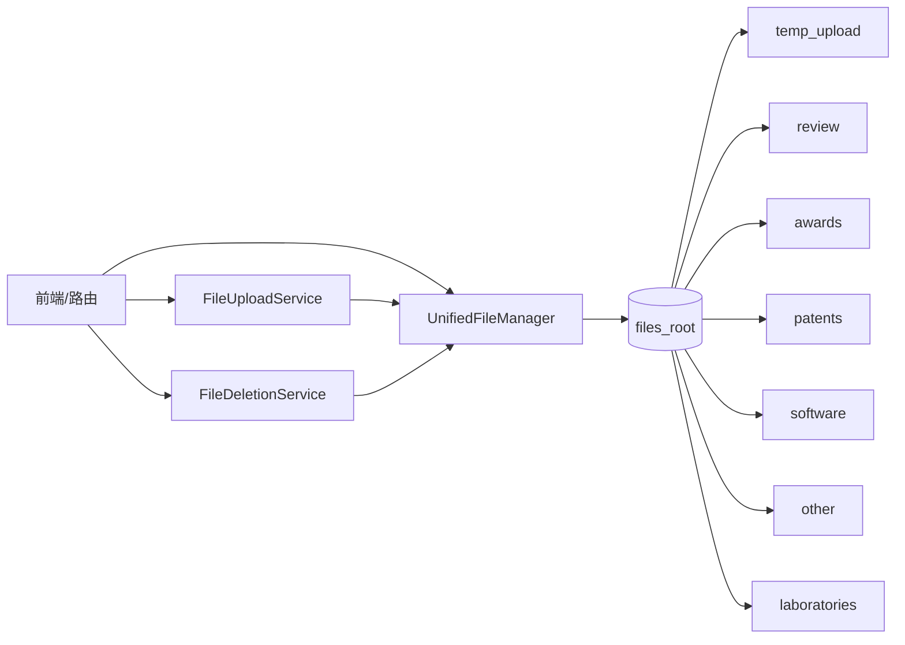
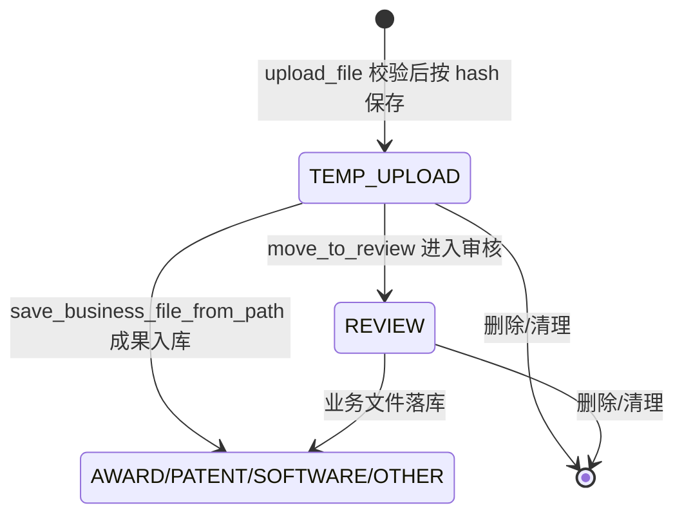

## 统一文件管理服务

统一文件管理服务是系统中所有文件上传、路径规划、类型识别、删除与关联的中央边界。它由 `UnifiedFileManager` 作为底层文件系统操作核心，`FileUploadService` 负责受控上传，`FileDeletionService` 负责业务对象文件清理。整体设计遵循“零兼容性、无降级方案”的严格模式：配置缺失直接抛出异常，目录创建失败立即失败，不静默跳过。

### 模块职责

#### 1. UnifiedFileManager — 统一文件管理器

- **严格配置加载**：从 `config.loader.get_config()` 获取 `files` 根路径，并要求配置中存在 `unified_file_manager.cleanup`；缺失或格式错误均抛出 `ConfigurationError`。
- **目录规划与预创建**：初始化时确保以下目录存在：
  - 会话目录：`temp_upload`、`review`、`temp_images`、`export`
  - 业务目录：`awards`、`patents`、`software`、`other`
  - 实验室基础目录：`laboratories`（具体 `laboratories/{lab_id}/{type}` 由业务方按需创建）
- **类型与路径映射**：
  - `FileType` 枚举：`award -> awards`、`patent -> patents`、`software -> software`、`other -> other`
  - `SessionStatus` 枚举：`temp_upload`、`review`、`temp_images`、`export`
  - `LabFileType` 枚举：`laboratories/{lab_id}/cover`、`downloads`、`photos`
- **文件查找**：按业务类型、hash、会话、实验室维度定位文件；未找到抛 `FileNotFoundError`。
- **业务文件保存**：
  - `save_business_file`：接收 Flask 上传对象，先写临时文件，计算 MD5 hash 后复制到目标业务目录，避免目标已存在时重复写入。
  - `save_business_file_from_path`：从已有路径复制/移动文件到业务目录，支持删除源文件。
- **审核流转**：`move_to_review` 将会话文件从 `temp_upload` 移动到 `review`，采用 `copy2 + safe_unlink` 而非 `shutil.move`，规避 Windows 文件占用问题。
- **安全删除**：`_safe_unlink` 带 5 次重试、递增延迟；删除后自动清理空父目录，默认到 `temp_upload` 或 `review` 为止。
- **路径解析**：`resolve_path` 兼容相对路径与历史绝对路径，统一转换为基于 `files_root` 的绝对路径。

#### 2. FileUploadService — 文件上传服务

- 基于 `UnifiedFileManager` 的会话上传服务。
- 上传路径：`temp_upload/{session_id}/{file_hash}{ext}`。
- 返回 `UploadResult`，包含 hash 文件名、相对路径、会话 ID、文件 hash 与错误信息。
- 三重校验：
  1. 扩展名白名单：`.jpg`、`.jpeg`、`.png`、`.pdf`、`.xlsx`、`.zip`、`.docx`
  2. 文件大小上限：100MB，与 `settings.max_content_length_mb=100` 双层对齐
  3. 魔术字节校验：防止伪造扩展名

#### 3. FileDeletionService — 文件删除服务

- 封装业务对象相关文件删除：
  - `delete_award_image`：按 hash 删除奖状图片
  - `delete_patent_file` / `delete_software_file`：按相对路径删除专利/软著文件
  - `delete_laboratory_files`：按 `lab_{lab_id}_` 命名模式递归清理实验室 cover、downloads、photos 文件
- 文件不存在时返回 `False` 或被吞掉，不视为失败；真正异常包装为 `OperationFailedError`。

### 调用链

- 上传：路由调用 `get_file_upload_service().upload_file(uploaded_file)` → 校验扩展名/大小/魔术字节 → MD5 hash → 写入 `temp_upload/{session_id}/{hash}.ext`。
- 入库：业务创建时调用 `UnifiedFileManager.save_business_file` 或 `save_business_file_from_path`，文件进入 `awards`、`patents`、`software`、`other` 目录。
- 审核流转：调用 `move_to_review(session_id, file_path)`，将文件从 `temp_upload` 复制到 `review/{session_id}/{filename}`，再安全删除源文件。
- 删除：路由调用 `FileDeletionService`，最终由 `UnifiedFileManager` 的查找、`resolve_path` 和 `_safe_unlink` 执行删除。

### 文件状态流转

- `TEMP_UPLOAD`：所有新上传文件的第一站，属于临时会话文件。
- `REVIEW`：进入审核流程的中间状态，保证审核期间文件与正式业务文件隔离。
- `AWARD/PATENT/SOFTWARE/OTHER`：正式业务目录，文件以内容 hash 命名并落库。

### 关键状态与目录规划

| 状态/类型 | 目录 | 说明 |
|---|---|---|
| `temp_upload` | `temp_upload/{session_id}/` | 上传后临时保存 |
| `review` | `review/{session_id}/` | 审核中文件 |
| `temp_images` | `temp_images/` | 模板测试临时图片 |
| `export` | `export/` | 报告导出临时文件 |
| `award` | `awards/` | 奖状文件 |
| `patent` | `patents/` | 专利文件 |
| `software` | `software/` | 软著文件 |
| `other` | `other/` | 其他成果文件 |
| `lab cover/downloads/photos` | `laboratories/{lab_id}/...` | 实验室文件 |

### 边界条件

- **配置缺失**：`get_path("files")` 或 `unified_file_manager` 配置缺失时直接抛 `ConfigurationError`，不提供默认值。
- **目录创建失败**：任一必需目录创建失败都会抛 `OperationFailedError`，保证后续写入不会落到不存在的路径。
- **上传安全**：无扩展名、非白名单扩展名、超大文件、魔术字节不匹配都会被拒绝；错误信息通过 `UploadResult.error` 返回。
- **路径不存在**：`find_file`、`move_to_review`、`save_business_file_from_path` 对源文件缺失均抛 `FileNotFoundError`。
- **删除容错**：文件不存在视为成功；删除在重试 5 次后仍失败仅记录 warning 并返回 `False`。
- **Windows 文件占用**：文件移动使用“复制 + 安全删除”策略，删除带重试退避；删除后清理空父目录。

### 扩展点

- **新文件类型**：通过扩展 `FileType`、`SessionStatus`、`LabFileType` 枚举及 `directory` 映射，即可接入新的业务目录。
- **上传校验**：`ALLOWED_EXTS` 与 `MAGIC_BYTES` 是白名单式扩展点，新增格式需同时补充扩展名与魔术字节映射。
- **删除策略**：`FileDeletionService` 可按业务对象新增删除方法，底层复用统一管理器的安全删除与空目录清理能力。
- **存储布局**：所有路径生成集中在 `UnifiedFileManager` 中，后续切换云存储或调整目录结构只需改动路径规划层。

Sources: [backend/services/unified_file_manager.py](backend/services/unified_file_manager.py#L1-L700), [backend/services/file_upload_service.py](backend/services/file_upload_service.py#L1-L158), [backend/services/file_deletion_service.py](backend/services/file_deletion_service.py#L1-L104)