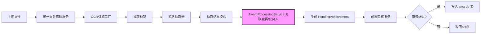

# 奖状处理流水线

## 运行机制

奖状处理流水线负责将一份上传的奖状文件（图片/PDF）逐步转换为结构化成果数据，并最终进入正式成果库。它不是单一服务，而是由多个独立模块按阶段编排的链路：

1. **上传与落盘**：通过统一文件管理服务接收文件，保存到规划路径，并生成文件关联记录。
2. **OCR 识别**：调用 OCR 引擎工厂选中的供应商（如百度、腾讯、本地模型），将图像/PDF 转为文本。OCR 结果可能被缓存，并带有供应商健康状态与熔断控制。
3. **结构化抽取**：抽取框架根据模板或 LLM 从 OCR 文本中提取字段（竞赛名称、奖项、学生/教师姓名等）。奖状抽取器是这里的主要实现。
4. **结果校验**：校验抽取结果完整性、合法性（如竞赛等级是否合法、日期格式是否正确），生成校验错误信息。
5. **业务关联**：通过 `AwardProcessingService` 将抽取结果关联到内部目录——根据模板或竞赛名称匹配 `Competition`，解析获奖者姓名并尝试与 `Student`/`Teacher` 实体匹配。
6. **生成待审核记录**：完整的状态数据转为 `PendingAchievement`，供人工审核。
7. **人工审核与入库**：审核服务处理提交/批准/驳回，最终通过审核的成果写入 `awards` 表，完成入库。

整个流程中，`AwardProcessingService` 不是入口，而是被路由或上游编排器调用的“业务装配器”，专门负责数据关联和姓名匹配状态列表生成。下面给出流水线总体流程：

关键节点：
- **OCR 引擎工厂**：根据配置动态选择供应商，支持故障转移，是外部 OCR 能力的隔离层。
- **抽取框架与奖状抽取器**：抽取框架定义字段类型与异常体系，奖状抽取器实现模板/LLM 混合抽取。
- **AwardProcessingService**：是整个业务流水线的“胶水层”，将技术字段转换为业务对象（竞赛、学生、教师）。
- **成果审核服务**：管理从 Pending 到 Awards 的状态机，是人工介入的闸门。

## 调用链

一次典型处理（以管理端导入奖状文件为例）的调用链如下：

1. 管理路由接收上传文件，调用 `统一文件管理服务` 保存文件。
2. 路由（或后台任务）调用 OCR 模块，通过 `OCR 引擎工厂` 获取具体供应商执行识别。
3. 识别文本传给 `抽取框架`，框架根据匹配到的模板或默认使用 LLM 抽取器，得到 `extract_data`（包含 `competition_name`、`winner_name` 等字段）。
4. 调用 `抽取结果校验` 验证字段类型和值域。
5. 将 `extract_data` 和 `template_id` 传给 `AwardProcessingService.associate_competition_by_template_or_name()`，尝试关联竞赛。
6. 调用 `build_winner_status_list()`，将获奖者姓名逐一与学生/教师表匹配，生成带 `matched`/`ambiguous`/`not_found` 的状态列表。
7. 组装 `PendingAchievement` 记录（部分字段来源为 `AwardProcessingService.get_template_match_info()` 提取的 ext_info）。
8. 进入审核路由，人工审核后调用 `成果审核服务` 完成批准/驳回，批准后写入 `awards` 表。

`AwardProcessingService` 不直接操作文件或 OCR，它只依赖外部传入的 `template_id`、`extract_data`、`pending_item` 等数据，并注入 `CompetitionManager`、`StudentManager`、`TeacherManager`。因此它易于被不同的路由/任务复用。

## 关键状态

- **导入状态**：记录在 `PendingAchievement` 上，区分导入中/完成/失败。
- **审核状态**：`pending` / `approved` / `rejected`，由审核服务维护。
- **匹配状态**：`AwardProcessingService.build_winner_status_list()` 输出的每个获奖者状态：
  - `matched`：唯一匹配到学生/教师
  - `ambiguous`：存在多个同名候选人，需要人工选择
  - `not_found`：未匹配到对应实体
- **模板关联状态**：`get_template_match_info()` 从 `ext_info` 中读取 `template_id` 和 `template_name`，用于反查模板或展示匹配信息。

## 主要文件与职责

| 路径（推断） | 职责 |
| --- | --- |
| `backend/services/award_processing_service.py` | 已提供片段。负责模板匹配信息读取、竞赛关联、获奖者状态列表构建、实验室自动匹配（注释提到）等业务装配逻辑。 |
| `backend/routes/*`（如管理导入路由、学生提交路由） | 调用上述 service，触发整个流水线。 |
| `backend/services/file_service.py`（推断） | 统一文件上传/存储/删除。 |
| `backend/services/ocr_factory.py` / `ocr_service.py`（推断） | OCR 供应商注册与工厂创建。 |
| `backend/extractors/*`（如 `award_extractor.py`） | 奖状抽取器实现。 |
| `backend/services/review_service.py`（推断） | 审核状态机。 |
| `backend/models/pending.py`、`backend/models/award.py` | PendingAchievement 与 Award 模型。 |

由于只提供了 `award_processing_service.py` 的局部片段，且页面说明涵盖整个流水线，以上路径中部分文件名是依据目录上下文推定的，实际名称以仓库为准。

## 边界条件与异常处理

- **模板未匹配**：`get_template_match_info()` 会返回 `template_id=None`，且不影响后续竞赛关联流程，只是失去默认字段来源。
- **竞赛关联失败**：`associate_competition_by_template_or_name()` 优先模板中的 `default_fields.competition_name`，其次从 `extract_data` 或嵌套的 `_extract_data` 中取 `competition_name`。若都未匹配到，返回 `None`，调用方需自行处理（如标记需要人工指定竞赛）。
- **姓名解析**：`_parse_names()` 支持逗号、顿号、分号分隔，但包含空格或特殊字符时可能分割错误。姓名列表空时返回空列表。
- **重名与找不到人**：`build_winner_status_list()` 区分 `ambiguous` 和 `not_found`，但没有自动消歧，需人工处理。
- **教师/学生证书**：由 `is_teacher_certificate` 决定使用 `teacher_manager` 还是 `student_manager`，若对应 manager 未传入则直接标记 `not_found`。
- **OCR/抽取异常**：此片段未覆盖，但根据整体架构，OCR 失败会走供应商故障转移，抽取异常会由抽取框架的异常体系捕获，并写入审计日志。

## 扩展点

- **竞赛关联策略**：可以在 `associate_competition_by_template_or_name()` 的“模板 > competition_name”优先级链中增加新的匹配规则（如按年份、按举办单位）。
- **获奖者匹配**：`build_winner_status_list()` 目前只按精确姓名匹配，未来可扩展为带院系/学号的模糊匹配，或接入外部人员主数据。
- **文件类型扩展**：新增证书类型时，只需提供新的抽取器并注册到抽取框架，流水线其余部分（上传、OCR、审核）无需改动。
- **OCR 供应商替换**：通过 OCR 引擎工厂注册新供应商即可，业务层不受影响。

## 限制说明

当前仅提供了 `backend/services/award_processing_service.py` 的片段（L1–L260），不能展示完整的流水线编排代码（如路由中的调用顺序、任务异步化、状态持久化细节）。以上对整体流水线的描述结合了目录上下文和模块命名进行推断，如需修改具体链路，请以实际代码为准。

Sources: [backend/services/award_processing_service.py](backend/services/award_processing_service.py#L1-L260)