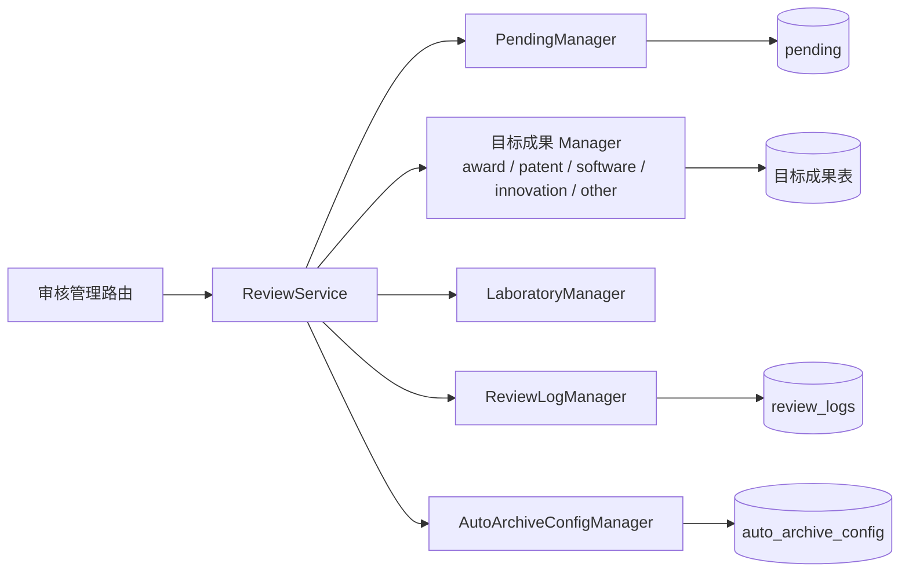
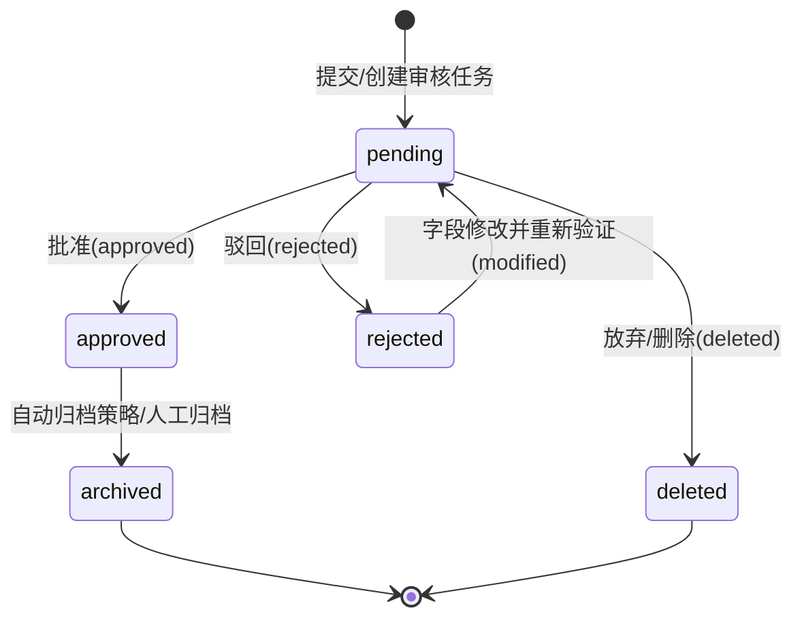

# 成果审核服务

## 模块职责

成果审核服务是系统从“待审核成果（pending）”到“正式成果数据”的转换中枢。它统一处理审核流中的以下几类操作：

- 单条/批量提交到主数据库（批准归档）；
- 单条/批量放弃（删除待审核记录）；
- 字段修改与重新验证；
- 审核日志记录；
- 实验室关联确定；
- 自动归档策略查询。

该服务将 Web 管理端和测试程序中的审核逻辑收敛到同一处，避免两套行为不一致。审核流覆盖多角色（学生、教师、管理员）和多成果类型（奖状、专利、软著、大创、其他文件）。

## 关键数据结构

### ReviewResult

`ReviewResult` 是审核操作的结果载体，字段包括：

- `action`：`approved`、`rejected`、`deleted`、`modified`；
- `target_table` / `target_id`：批准后写入的目标成果表与记录 ID；
- `file_moved_to`：批准后文件移动到的路径；
- `modifications`：字段修改记录；
- `laboratory_id` / `laboratory_name`：审核时确定的实验室关联；
- `submitted_count`：大创等一对多场景下的实际入库条数。

### Reviewer

`Reviewer` 表示审核人身份，包含 `reviewer_type`（`student`、`teacher`、`admin`）和 `reviewer_id`。

### ReviewLog

`ReviewLog` 用于持久化审核审计信息，记录 `pending_id`、成果类型、提交人、审核人、操作类型、批准后的目标成果信息、审核意见、操作备注和时间戳。操作类型包括：

- `approved`：审核通过；
- `rejected`：审核驳回；
- `deleted`：提交人删除/放弃。

### AutoArchiveConfig

`AutoArchiveConfig` 描述“某类成果在某种验证状态下是否自动归档”。`auto_archive_enabled` 为 `false` 时默认不自动归档。

## 模块协作图

关键节点说明：

- `ReviewService` 是统一业务入口，负责调度各 Manager；
- 目标成果 Manager 按成果类型注入，使审核服务不直接依赖具体成果表；
- `ReviewLogManager` 负责将每次审核动作落审计日志；
- `AutoArchiveConfigManager` 负责判断是否启用自动归档。

## 审核状态机

状态说明：

- `pending`：待审核状态，是审核流的起点；
- `approved`：审核通过。`ReviewResult` 会携带目标表、目标 ID 和文件移动路径；
- `rejected`：审核驳回。审核意见通过 `review_comment` 保留；
- `deleted`：提交人主动放弃，`ReviewLog` 记录 `deleted` 动作；
- `modified`：驳回后字段修改，重新进入待审核状态；该动作出现在 `ReviewResult` 中，`ReviewLog` 本身不记录 `modified` 动作；
- `archived`：批准后的成果最终进入正式成果库并完成文件落位。是否自动归档由 `AutoArchiveConfigManager` 控制，也可人工归档。

## 实验室关联规则

`ReviewService.determine_laboratory()` 定义了成果与实验室的归属推断优先级：

1. 编辑页用户选定的 `laboratory_id`：最高优先级；
2. pending 记录中导入时选定的 `laboratory_id`；
3. 大创：按第一指导教师所在实验室；
4. 奖状：教师奖状取获奖者中排名第一的教师实验室，学生奖状取指导教师中排名第一的教师实验室；
5. 其他类型：从指导教师中取排名第一的教师实验室；
6. 提交人是教师时，取提交人所在实验室；
7. 以上均不满足时不设置实验室关联。

边界规则：不根据学生提交人所属实验室推断成果关联，因为学生可能属于多个实验室，且学生提交的成果不一定与其所属实验室相关。

## 自动归档配置

`AutoArchiveConfigManager` 将成果类型分为两类：

- `award` / `patent` / `software`：区分 `valid` / `invalid` 两种验证状态；
- `innovation` / `other`：不区分验证状态，`validation_status` 为 `None`。

`should_auto_archive(achievement_type, is_valid)` 根据上述映射判断是否自动归档。若配置缺失，默认不自动归档。配置支持批量更新和重置为默认值。

## 审核日志

`ReviewLogManager` 提供完整的审计查询能力：

- 按操作类型、审核人、提交人、pending ID 过滤；
- 统计各类操作数量；
- 获取最近日志；
- 清理超过指定天数的旧日志。

该 Manager 采用 SQLite 直连方式，并在内存中缓存全部日志。因此日志量较大时需要考虑定期清理或后续改造为分页查询。

## 边界条件

- 配置缺失时自动归档默认关闭；
- `delete_log` 是清理性质操作，不应作为日常审核动作；
- `cleanup_old_logs(days=90)` 用于定期清理 90 天前的审核日志；
- 文件移动路径由 `files_dir` 和 `result_file_path` 管理，批准后文件位置变化会记录到审核日志；
- 大创等一对多成果通过 `submitted_count` 标识实际入库条数；
- 实验室推断涉及多优先级回退，任一环节数据无效时进入下一优先级。

## 扩展点

- `ReviewService` 构造函数按成果类型注入可选 Manager，新增成果类型时无需改动核心审核逻辑；
- `ACHIEVEMENT_TYPES` 集中维护成果类型映射；
- `AutoArchiveConfig` 按“成果类型 + 验证状态”配置自动归档，业务策略调整不需要修改代码；
- `ReviewLog` 的 `action_type` 是字符串字段，未来若需增加审计动作类型，可以在日志层平滑扩展。

Sources: [backend/services/review_service.py](backend/services/review_service.py#L1-L240), [backend/models/review_log.py](backend/models/review_log.py#L1-L320), [backend/models/auto_archive_config.py](backend/models/auto_archive_config.py#L1-L280)