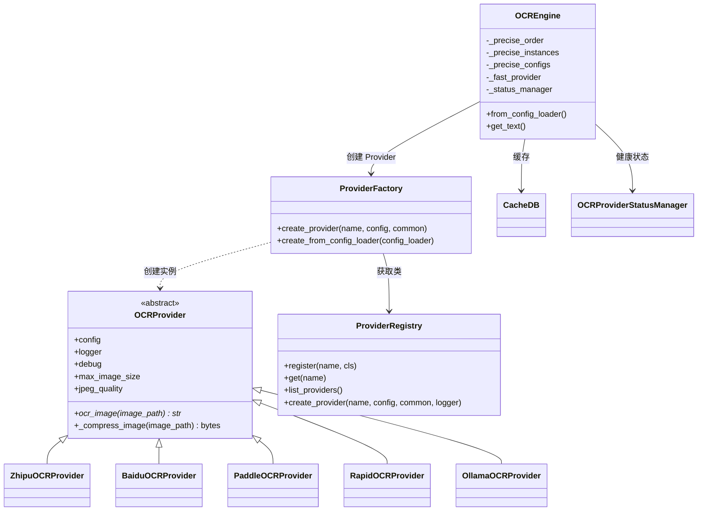
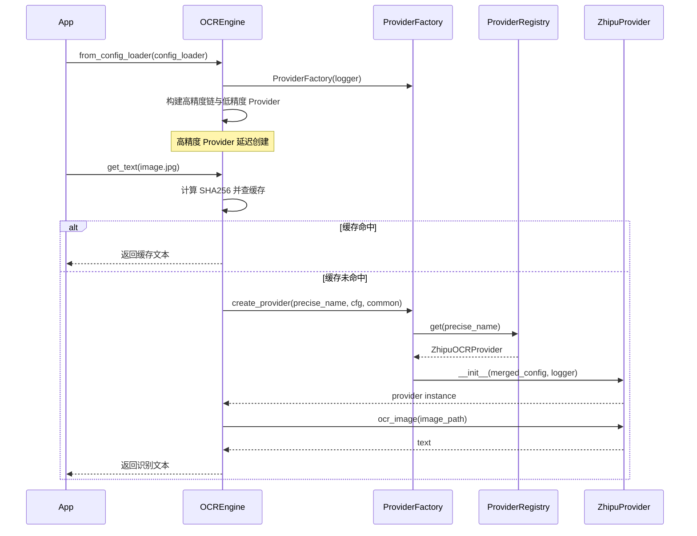

# OCR 引擎与供应商抽象

OCR 模块以 `OCRProvider` 抽象接口为边界，将不同供应商的差异隔离在 Provider 内部；`ProviderRegistry` 负责供应商类注册，`ProviderFactory` 负责按配置创建实例，`OCREngine` 负责精度分级、缓存、状态过滤与动态故障转移。新增 OCR 供应商时，不需要改动引擎核心逻辑。

## 模块职责

| 模块 | 职责 |
|---|---|
| `OCRProvider` | 抽象基类，定义统一接口 `ocr_image(image_path: str) -> str`；内部提供通用图片压缩、调试日志、最大尺寸/JPEG 质量等公共能力。 |
| `ZhipuOCRProvider` 等内置供应商 | 继承 `OCRProvider`，通过 `@register_provider("name")` 注册。Zhipu 实现基于 GLM-4V 的 API 调用、多模型回退与重试。 |
| `ProviderRegistry` | 单例注册表，保存 `provider_name -> provider_class` 映射；支持 `register`、`get`、`list_providers` 和 `create_provider`。 |
| `ProviderFactory` | 工厂类，通过注册表查找 Provider 类，合并通用配置与供应商特定配置后创建实例；也支持从 `ConfigLoader` 直接创建默认 Provider。 |
| `OCREngine` | OCR 引擎，协调缓存、Provider 创建、精度选择、状态过滤和故障转移；是上层服务直接使用的入口。 |
| `backend/ocr/__init__.py` | 包导出与便捷创建函数；导入所有 Provider，确保装饰器在模块加载时执行注册。 |

## 调用链与装配流程

1. **Provider 注册**  
   `backend/ocr/__init__.py` 导入所有 Provider 模块，`@register_provider("zhipu")` 等装饰器将 Provider 类写入全局 `ProviderRegistry`。

2. **Engine 初始化**  
   `OCREngine.from_config_loader` 从 `ConfigLoader` 读取 `ocr.providers` 配置，根据 `is_precise` 字段区分高精度与低精度 Provider。

   - 高精度 Provider 形成有序链：默认 Provider 优先，其余按配置文件中的键顺序排列。
   - 低精度 Provider 只创建一个实例，作为快速识别或降级路径。
   - 高精度 Provider 实例按需创建，不在一开始全部初始化。

3. **OCR 请求**  
   上层调用 `OCREngine.get_text` 后，引擎先计算文件 SHA256，查询缓存；未命中时再从可用 Provider 链中选择供应商执行识别。

4. **失败转移**  
   `_get_effective_precise_order` 会过滤掉由 `OCRProviderStatusManager` 标记为禁用的供应商；如果某个高精度 Provider 调用失败，引擎按顺序切换到下一个，直到成功或全部失败。

关键节点说明：

- `from_config_loader` 阶段只创建工厂和低精度 Provider，高精度 Provider 使用 `_precise_instances` 做懒加载缓存，避免启动时浪费资源。
- 每次 OCR 请求都会通过 `ProviderFactory` 获取或复用 Provider 实例，工厂负责合并通用配置与供应商特定配置。
- 缓存命中时不会触发 Provider 调用，因此供应商切换不影响已识别文件的缓存结果。

## 关键状态

- `ProviderRegistry._providers`：类级字典，保存所有已注册 Provider；全局单例，所有模块共享。
- `OCREngine._precise_order`：高精度供应商名称有序列表，包含可能被禁用的供应商。
- `OCREngine._precise_instances`：已创建的高精度 Provider 实例缓存，按需创建。
- `OCREngine._precise_configs`：每个高精度供应商的特定配置。
- `OCREngine._fast_provider` / `_fast_provider_name`：低精度 Provider 实例与名称；未配置时为 `None`。
- `OCREngine._status_manager`：运行时健康状态管理器，提供禁用判断。
- `OCREngine.last_ocr_warning`：高精度识别失败回退到低精度时由引擎设置，供上层读取。
- `OCREngine.last_ocr_failure_reason`：图片读取失败时设置，用于转换为 OCR 错误结果而非直接抛出异常。

## 主要文件

| 文件 | 职责 |
|---|---|
| `backend/ocr/__init__.py` | 公共 API 导出，Provider 导入注册，`create_ocr_engine` 便捷入口 |
| `backend/ocr/core/provider_registry.py` | Provider 注册表单例与注册装饰器 |
| `backend/ocr/core/providers.py` | `OCRProvider` 抽象类及内置供应商实现 |
| `backend/ocr/core/provider_factory.py` | Provider 工厂，负责查找类、合并配置、创建实例 |
| `backend/ocr/core/ocr_engine.py` | OCR 引擎，编排缓存、精度分级、故障转移 |
| `backend/ocr/core/cache_db.py` | OCR 请求缓存（引擎依赖，细节见“OCR 缓存与状态”） |
| `backend/ocr/core/provider_status.py` | 供应商健康状态与禁用标记（引擎依赖，细节见“OCR 缓存与状态”） |

## 边界条件

- **Provider 未注册**：`ProviderRegistry.get` 返回 `None`；手动调用 `create_provider` 或工厂创建时会抛出携带可用列表的 `ValueError` / `OCRConfigError`。
- **缺少运行时状态路径**：`OCREngine.from_config_loader` 要求 `ocr.runtime_status_path` 必须配置，缺失时直接抛错，不提供隐式默认路径。
- **缺少低精度 Provider**：如果配置中没有 `is_precise=false` 的提供商，`_fast_provider` 为 `None`，低精度 OCR 不可用但不会阻止引擎启动。
- **API Key 缺失**：Zhipu Provider 在 `__init__` 阶段检查 `api_key` 或 `api_key_env`，缺失时抛出 `OCRAPIServiceError`。
- **图片压缩失败**：`_compress_image` 内部捕获异常并回退到原始图片字节，不让预处理失败阻断主流程。
- **图片方向**：只依据 EXIF Orientation 校正方向，不使用宽高比启发式旋转，避免竖拍证书被横置导致乱码。
- **API 错误重试**：对 429 等待后重试，对 5xx 短暂重试；多个模型按配置顺序依次回退。

## 扩展点

1. **新增 OCR 供应商**  
   - 继承 `OCRProvider`，实现 `ocr_image`。
   - 使用 `@register_provider("vendor_name")` 装饰类。
   - 在 `settings.json` 的 `ocr.providers` 下新增配置节点，通过 `is_precise` 字段决定其属于高精度链还是低精度路径。

2. **自定义图片预处理**  
   `OCRProvider._compress_image` 是通用方法，子类可以覆盖，实现供应商特有的图片处理逻辑。

3. **配置驱动模型回退**  
   Zhipu Provider 支持把 `model` 配置为列表，识别时按列表顺序尝试不同视觉模型。

4. **运行时动态禁用供应商**  
   通过 `OCREngine.get_status_manager()` 获取状态管理器，将某个高精度供应商标记为禁用后，`_get_effective_precise_order` 会自动将其过滤，下次请求立即切换。

5. **手动注册外部 Provider**  
   不修改 `providers.py` 也能注册：调用 `get_registry().register(name, cls)` 或 `register_provider(name)` 装饰器。

Sources: [backend/ocr/__init__.py](backend/ocr/__init__.py#L25-L132); [backend/ocr/core/provider_registry.py](backend/ocr/core/provider_registry.py#L1-L116); [backend/ocr/core/provider_factory.py](backend/ocr/core/provider_factory.py#L1-L104); [backend/ocr/core/providers.py](backend/ocr/core/providers.py#L30-L221); [backend/ocr/core/ocr_engine.py](backend/ocr/core/ocr_engine.py#L23-L189)