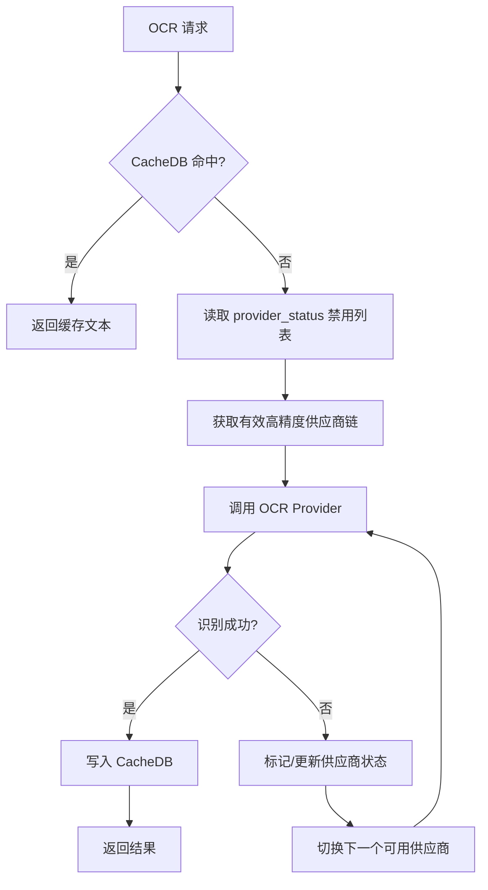

# OCR 缓存与状态

本页聚焦 OCR 模块的请求缓存、供应商运行时健康状态、熔断后的禁用标记，以及相关运行时配置。核心目标是提升重复图片识别的响应速度，并在供应商不可用时通过持久化状态自动跳过故障节点，避免每次请求都重新触发失败调用。

## 模块职责

- **OCR 请求缓存**：`CacheDB` 基于 SQLite 存储 `image_hash -> ocr_text` 的映射，将同一图片的 OCR 结果缓存到本地数据库，避免重复调用外部供应商。缓存支持高/低精度分级、按供应商统计、按时间或供应商清理。
- **供应商健康状态**：`OCRProviderStatusManager` 将供应商的“禁用”状态持久化到 JSON 运行时文件（如 `config/ocr_runtime.json`）。被标记为不可用的供应商会在引擎后续请求中被跳过，不会再被实例化或调用。
- **运行时配置**：`OCRConfig` 规定缓存路径、缓存开关、缓存保留天数等通用参数；`OCREngine.from_config_loader` 从全局配置加载供应商列表、默认供应商、PDF DPI 和运行时状态文件路径。
- **熔断的持久化语义**：本模块不计算失败次数或动态阈值，而是记录“熔断结果”——一旦上游判定某供应商连续失败或管理员手动禁用，就通过 `mark_disabled` 写入状态文件，后续所有 OCR 请求都会将其排除。

## 核心调用链

1. `OCREngine.from_config_loader` 读取 `config_loader.load_config()` 中的 `ocr` 配置。
2. 从供应商配置中识别高精度供应商列表（`is_precise=true`），默认供应商排在最前，形成 `_precise_order`。
3. 读取 `ocr.runtime_status_path`，创建 `OCRProviderStatusManager` 指向该 JSON 文件。
4. 识别低精度供应商（第一个 `is_precise=false`），由 `ProviderFactory` 创建单一 `_fast_provider`。
5. OCR 请求发生时，引擎先通过 `CacheDB.get_ocr_cache(image_hash)` 查缓存；命中则直接返回，未命中才进入供应商调用链。
6. 供应商选择使用 `_get_effective_precise_order()`，它会过滤掉被 `_status_manager.is_disabled(name)` 标记的供应商。
7. 选定可用供应商后，结果通过 `CacheDB.save_ocr_cache(...)` 写入缓存，并记录供应商名称和精度标记。



关键节点说明：

- `CacheDB 命中` 是性能第一道闸门，避免外部 API 调用。
- `provider_status 禁用列表` 是运行时熔断的持久化依据，使跳过故障供应商成为全局行为。
- `写入 CacheDB` 时遵循“高精度优先”和“拒绝空文本”两条保护规则，防止有效缓存被低质量结果覆盖。

## 关键状态

### 1. OCR 缓存表

`ocr_cache` 表结构由 `init_cache_tables` 创建：

- `image_hash`：图片哈希，唯一索引，作为缓存键。
- `ocr_text`：识别出的纯文本。
- `provider`：产生该结果的供应商名称。
- `is_precise`：是否高精度识别。
- `created_at` / `updated_at`：时间戳，用于按时间清理。

### 2. 缓存写入策略

`save_ocr_cache` 的核心规则：

- 空文本（`ocr_text.strip()` 为空）不写入，避免 API 失败或 429 返回空结果时覆盖已有有效缓存。
- 如果库中已有高精度记录，而新结果是低精度，则跳过覆盖，保留高精度结果。
- 其他情况（无记录、低精度->高精度、低精度->低精度、高精度->高精度）允许覆盖或插入。

### 3. 供应商运行时状态文件

`ocr_runtime.json` 的 `provider_status` 节点存储每个供应商的禁用状态，示例：

```json
{
  "provider_status": {
    "zhipu": {
      "disabled": true,
      "disabled_reason": "管理员手动禁用",
      "disabled_at": "2026-02-01T03:51:25"
    },
    "paddle": {
      "disabled": true,
      "disabled_reason": "PaddleOCR 未安装。请运行: pip install paddleocr",
      "disabled_at": "2026-07-09T06:56:58"
    }
  }
}
```

`OCRProviderStatusManager` 提供：

- `is_disabled(provider_name)`：判断是否禁用。
- `get_disabled_providers()`：返回所有禁用项及原因、时间。
- `mark_disabled(provider_name, reason)`：写入禁用状态。
- `clear_disabled(provider_name)`：清除禁用状态，重新启用。

### 4. 引擎内部状态

`OCREngine` 持有：

- `_precise_order`：高精度供应商有序列表。
- `_precise_instances`：按需创建的高精度 Provider 实例缓存。
- `_fast_provider` / `_fast_provider_name`：低精度供应商单例。
- `_status_manager`：供应商状态管理器。
- `last_ocr_warning` / `last_ocr_failure_reason`：最近一次降级或失败原因，供上层展示。

## 主要文件

| 文件 | 职责 |
|---|---|
| `backend/ocr/core/cache_db.py` | SQLite 缓存表的建表、增删查、统计、清理、按供应商统计/删除 |
| `backend/ocr/core/provider_status.py` | 供应商禁用状态的读写，持久化到 JSON 文件 |
| `backend/ocr/core/ocr_engine.py` | OCR 引擎主体，从配置构建供应商链，协调缓存与状态 |
| `backend/ocr/config.py` | `OCRConfig` 通用配置定义和校验 |
| `backend/ocr/__init__.py` | 导出 `OCREngine`、`CacheDB`、`ProviderFactory`，提供 `create_ocr_engine` 便捷函数 |
| `config/ocr_runtime.json` | 实际供应商运行时状态数据文件 |

## 边界条件与防护

- **缓存路径缺失**：`OCRConfig.__post_init__` 要求 `db_path`、`temp_dir`、`provider` 必须显式指定，否则抛出 `ValueError`，避免使用默认路径导致数据混乱。
- **运行时状态路径缺失**：`from_config_loader` 找不到 `ocr.runtime_status_path` 时直接抛出 `ValueError`，引导配置 `config/ocr_runtime.json`。
- **状态文件损坏**：`_load` 捕获 `JSONDecodeError` / `OSError`，返回空状态，不会阻断 OCR 启动。
- **空 OCR 结果**：不缓存，保留已有有效内容。
- **高精度保护**：已有高精度缓存时，低精度结果不会覆盖。
- **无低精度供应商**：`_fast_provider` 为 `None`，引擎记录 warning，低精度 OCR 不可用。
- **禁用供应商**：`_get_effective_precise_order` 会将其从候选链中剔除，且 `_get_or_create_precise_provider` 不会为禁用项创建实例。

## 扩展点

- **新增供应商**：实现 `OCRProvider` 子类并通过 `@register_provider` 注册，`backend/ocr/__init__.py` 会负责导入并触发注册。
- **高精度供应商链**：通过配置多个 `is_precise=true` 的供应商，引擎会按默认供应商优先、其余按配置顺序组成故障切换链。
- **运行时管理**：管理端可调用 `mark_disabled` / `clear_disabled` 动态调整供应商可用性，无需重启服务。
- **缓存维护**：支持按时间、按供应商、按哈希分别清理缓存，可接入定时任务定期执行。
- **状态文件位置可配置**：`ocr.runtime_status_path` 由 `settings.json` 提供，部署时可按环境切换。

Sources: [backend/ocr/core/cache_db.py](backend/ocr/core/cache_db.py#L1-L279) [backend/ocr/core/provider_status.py](backend/ocr/core/provider_status.py#L1-L95) [backend/ocr/core/ocr_engine.py](backend/ocr/core/ocr_engine.py#L51-L166) [backend/ocr/config.py](backend/ocr/config.py#L1-L92) [backend/ocr/__init__.py](backend/ocr/__init__.py#L81-L131) [config/ocr_runtime.json](config/ocr_runtime.json#L1-L14)