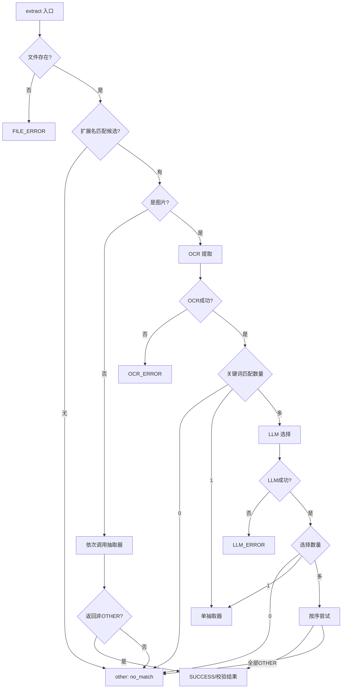

# 抽取框架与类型系统

## 模块定位

`backend/extract` 下的框架层与类型定义构成了整个抽取能力的 **共同基座**。它不关心具体业务文档的字段细节，而是解决三个通用问题：

- **抽取器是什么、如何接入** —— 通过 `Extractor` 抽象基类与 `ExtractFramework.register()` 注册机制，将奖状、专利、软著、大创、证书等具体抽取器纳入统一调度。
- **一次抽取的结果如何表达** —— `ExtractResult` 携带状态、数据、模板类型、OCR/LLM 缓存命中、验证信息等，保证所有抽取器返回结构一致，便于上层服务统一消费。
- **抽取过程中出错如何归类与提示** —— `ExtractStatus` 枚举细分错误来源，`exceptions.py` 将底层异常映射为面向用户的文案。

模板抽取与 LLM 抽取均在此框架上运行：抽取器内部可自由组合模板匹配、LLM 调用、规则校验，但对外暴露的接口和结果契约完全统一。

## 类型系统

### 抽取状态 `ExtractStatus`

定义于 `backend/extract/types.py#L8-L14`，是一个 `str` 枚举：

| 状态值 | 含义 |
|---|---|
| `SUCCESS` | 抽取成功 |
| `NO_TEMPLATE` | 没有可匹配的模板/抽取器 |
| `PARSE_ERROR` | 解析失败（如 LLM 返回非法 JSON） |
| `OCR_ERROR` | OCR 识别失败 |
| `LLM_ERROR` | LLM 调用或选择失败 |
| `FILE_ERROR` | 文件不存在等输入错误 |

### 模板类型 `TemplateType`

注意 `TemplateType` 不是枚举，而是带常量与类方法的普通类（`types.py#L17-L45`）。它定义了 `AWARD`、`PATENT`、`SOFTWARE`、`INNOVATION`、`OTHER` 五类，并提供 `ALL` 列表、`DISPLAY_NAMES` 显示名、`validate()` 校验和 `get_display_name()` 查询。

### 抽取结果 `ExtractResult`

`types.py#L91-L104` 定义了统一结果结构：

- `status`：必填，`ExtractStatus` 状态。
- `data`：抽取出的结构化字典，通常为字段名到值的映射。
- `error_message`：非成功时的错误说明。
- `template_type`：命中的模板类型，用于区分文档类别。
- `extractor_name`：实际执行抽取的抽取器名称。
- `ocr_text`：OCR 后的原始文本（可由抽取器覆盖为高精度重识别结果）。
- `ocr_cache_hit` / `llm_cache_hit`：是否命中对应缓存。
- `llm_prompt` / `llm_response`：LLM 调用痕迹，便于排查。
- `validation_result`：`ValidationResult` 对象，承载字段级校验信息。
- `metadata`：附加信息（如 `file_path`）。

### 验证结构

`ValidationError`（`types.py#L48-L68`）描述单个字段问题，包含 `field_name`、`error_type`、`error_message`、`error_category`（默认 `"content"`）、`invalid_value` 和 `suggestion`，并提供 `to_dict()` 用于序列化。

`ValidationResult`（`types.py#L71-L88`）聚合验证结果：`is_valid` 总标志、`content_issues`（内容问题）、`completeness_issues`（完整性问题）、`mapped_data`（值映射后的数据）。注意该结构当前主要作为结果附带的诊断信息，具体验证逻辑已下沉到各抽取器内部（见 `validator.py#L4-L14` 的弃用说明）。

### 抽取上下文 `ExtractContext`

`backend/extract/extractors/base.py#L11-L21` 定义了框架内传递的上下文对象：

- `file_path`：待抽取文件的路径。
- `ocr_text`：若为图片分支，携带 OCR 文本；非图片分支为 `None`，抽取器自行读取文件。
- `use_ocr_cache` / `use_llm_cache`：控制缓存策略。
- `ocr_engine` / `llm_engine`：由框架注入的引擎实例，抽取器按需调用。
- `use_default_prompt_only`：仅使用默认提示词（用于模板创建场景）。
- `force_type`：手动导入/创建模板时置 `True`，跳过有效性校验直接返回结果。

## 抽取器抽象基类

`base.py#L24-L55` 定义了所有具体抽取器必须实现的接口：

```python
class Extractor(ABC):
    def __init__(self, name, description, keywords, judgment_text, extensions, validator=None):
        ...
    def matches_extension(self, ext) -> bool: ...
    def matches_keywords(self, text) -> bool: ...
    @abstractmethod
    def extract(self, ctx: ExtractContext) -> ExtractResult: ...
```

- `name`：抽取器标识，如 `"award"`，用于 LLM 选择结果映射。
- `description` / `keywords` / `judgment_text`：用于文本关键词匹配和 LLM 分类选择。
- `extensions`：支持的文件扩展名列表（内部统一为含点的小写形式）。
- `extract()`：核心执行方法，签名注释明确了两种分支——`ctx.ocr_text` 有值时为图片分支（已 OCR），否则为非图片分支，按需读 `file_path`。
- `validator`：保留字段，但 `ExtractorValidator` 已弃用，验证逻辑由各抽取器内部实现。

## 异常体系

`backend/extract/exceptions.py` 定义了完整异常层次：

- `ExtractError`：所有抽取模块异常的基类。
- `ExtractorError`：抽取器内部异常。
- `TemplateError`：模板相关异常。
- `LLMError`：LLM 调用异常，构造时自动加 `"LLM错误: "` 前缀。

还定义了两个用户可见的固定文案：

- `USER_MESSAGE_QUOTA` = “OCR/LLM 费用不足，无法处理”
- `USER_MESSAGE_BROKEN_IMAGE` = “图片在压缩或OCR阶段无法解析（格式与当前解析库不兼容），页面预览可能正常，可尝试重新导出或更换图片。”

`user_facing_message(exc)` 函数将异常映射为上述文案：检测字符串中的 `"429"`、`"quota"`、`"余额不足"`、`"broken png"`、`"chunk"` 等关键词，命中则返回对应提示，否则返回原始异常信息或默认提示。该函数在框架的 OCR 失败、LLM 选择失败等兜底分支中被调用，保证前端只收到精简且友好的错误消息。

## 框架调度逻辑

`ExtractFramework` 定义于 `backend/extract/framework.py#L25-L415`，是整个抽取流程的编排中心。

### 构造与初始化

`__init__` 接收 OCR 引擎、LLM 引擎、图片扩展名列表、other 提示文案、LLM 文本长度限制等，并创建内部 `_other_extractor`（`framework.py#L51-L54`）。`from_config_loader()` 类方法从配置加载器读取 `extract` 节点，自动构建引擎和框架（`framework.py#L56-L86`）。注意原始配置会保留在 `_raw_config`，用于读取 `use_precise_ocr` 等运行时行为配置。

### 注册机制

`register()` 将 `Extractor` 实例加入 `_extractors` 列表并返回 `self` 支持链式调用（`framework.py#L88-L91`）。`get_extractor(name)` 按名称查询。

### 统一入口 `extract()`

`extract(file_path, use_ocr_cache, use_llm_cache)` 的流程如下（`framework.py#L108-L138`）：

1. **文件存在性检查**：不存在则返回 `FILE_ERROR` 结果。
2. **扩展名标准化**：确保以 `.` 开头的小写形式。
3. **候选抽取器筛选**：通过 `matches_extension` 得到候选列表。
4. **分支判断**：
   - 无候选 → 使用 `_other_extractor`（提示“没有抽取器能够处理此文件”）。
   - 扩展名在 `image_extensions` 中 → 走 `_extract_image`。
   - 否则 → 走 `_extract_non_image`。

### 非图片分支 `_extract_non_image`

`framework.py#L166-L180`：依次调用每个候选抽取器的 `extract(ctx)`，若返回的 `template_type` 不是 `OTHER` 则立即验证并返回；若全部返回 `OTHER`/空，则返回 `NO_TEMPLATE` 的 other 结果。

### 图片分支 `_extract_image`

这是最复杂的路径，体现了“关键词粗配 → LLM 精配 → 兜底”的三级策略（`framework.py#L201-L290`）：

1. **OCR 提取**：调用 `_ocr_image`，读取失败由引擎返回空串并记录 `last_ocr_failure_reason`，框架据此返回 `OCR_ERROR`。
2. **关键词匹配**：对 OCR 文本执行候选抽取器的 `matches_keywords`，得到 `matched` 列表。
3. **分类决策**：
   - 无匹配 → other 兜底。
   - 单匹配 → 直接 `_extract_with_single`。
   - 多匹配 → 调用 `_llm_select_extractors` 让 LLM 选择类别。
4. **LLM 选择后**：若失败 → `LLM_ERROR`；若选择 1 个 → 单抽取器；若多个 → `_extract_with_multiple` 按 LLM 返回顺序尝试，取第一个非 `OTHER` 的抽取结果。
5. **全部失败** → other 兜底。

### LLM 选择抽取器

`_llm_select_extractors`（`framework.py#L369-L389`）构造分类提示词，将候选抽取器的名称、描述和 `judgment_text` 拼入模板，截断 OCR 文本至 `llm_max_text_length`，调用 `llm_engine.chat()`，最后用 `_parse_extractor_list`（`framework.py#L401-L414`）解析 LLM 返回的 JSON 数组，过滤为候选名。默认提示词要求“仅返回 JSON 数组”，如 `["award"]`。

### 结果验证与返回

`_validate_and_return`（`framework.py#L391-L398`）目前仅原样返回结果。验证逻辑已由各抽取器在 `extract()` 内部完成，`ExtractResult.validation_result` 承载验证详情，此处不再做额外处理。

## 关键状态流转

抽取流程的状态变化遵循“先判定错误，再逐步收敛到成功”的路径：



关键节点说明：

- **`other` 兜底**贯穿全流程，它承担两类角色：扩展名不匹配时的“不支持文件类型”，匹配但无法识别内容时的“无法处理”。
- **OCR 失败**被转换为 `OCR_ERROR` 状态，而不是抛出异常，保证服务不中断。
- **LLM 选择失败**（超时、格式错误等）同样降级为 `LLM_ERROR` 或 other，不会阻断主流程。

## 主要文件

| 文件 | 职责 |
|---|---|
| `backend/extract/framework.py` | 框架主类、注册与调度、图片/非图片分支、LLM 选择 |
| `backend/extract/types.py` | `ExtractStatus`、`TemplateType`、`ExtractResult`、`ValidationError/Result`、类型别名 |
| `backend/extract/exceptions.py` | 异常层次与用户友好文案映射 |
| `backend/extract/extractors/base.py` | `ExtractContext` 与 `Extractor` 抽象基类 |
| `backend/extract/extractors/__init__.py` | 导出所有抽取器，供框架实例化 |
| `backend/extract/validator.py` | 旧版验证器，已弃用，仅作向后兼容 |

## 边界条件与降级策略

- **文件不存在**：直接返回 `FILE_ERROR`，不触碰引擎。
- **扩展名无候选**：返回 `NO_TEMPLATE`，提示“没有抽取器能够处理此文件”。
- **OCR 读取失败**：引擎返回空文本 + `last_ocr_failure_reason`，框架转为 `OCR_ERROR` 并附带可读提示。
- **OCR 返回 None**（防御性）：同样转为 `OCR_ERROR`。
- **LLM 选择失败**：返回 `LLM_ERROR`，文案由 `user_facing_message` 映射。
- **LLM 未给出合法 JSON**：`_parse_extractor_list` 返回空列表，走 other 兜底。
- **所有抽取器均返回 OTHER**：最终返回 other 的 `no_match` 结果，状态为 `NO_TEMPLATE`。
- **`force_type` 上下文**：在手动导入/创建模板时跳过有效性校验，保留抽取结果供人工确认。

## 扩展点

1. **新增一个抽取器**：继承 `Extractor`，实现 `extract()`、`matches_extension`、`matches_keywords`，并在框架初始化时调用 `register()`。框架只关心 `name`、`extension`、关键词和 `template_type`，不限制内部实现——模板规则、LLM prompt、规则校验可自由组合。
2. **调整图片识别精度**：在配置 `extract.use_precise_ocr` 即可切换 OCR 精度策略（`framework.py#L292-L301`），无需改代码。
3. **自定义 LLM 选择提示词**：虽然 `from_config_loader` 中写死为 `None`（使用代码默认），但 `__init__` 支持传入自定义模板，可在特殊部署场景中直接实例化框架覆盖。
4. **扩展模板类型**：在 `TemplateType` 中追加常量并同步更新 `ALL` 与 `DISPLAY_NAMES`，新的抽取器即可返回该类型。
5. **缓存策略**：`use_ocr_cache` 和 `use_llm_cache` 参数贯穿整个调用链，可根据业务场景（如手动创建模板时禁用缓存）逐次控制。

## Sources

- [backend/extract/framework.py](backend/extract/framework.py#L1-L415)
- [backend/extract/types.py](backend/extract/types.py#L1-L121)
- [backend/extract/exceptions.py](backend/extract/exceptions.py#L1-L59)
- [backend/extract/extractors/base.py](backend/extract/extractors/base.py#L1-L56)
- [backend/extract/extractors/__init__.py](backend/extract/extractors/__init__.py#L1-L16)
- [backend/extract/validator.py](backend/extract/validator.py#L1-L87)

Sources: [backend/extract/framework.py](backend/extract/framework.py#L1) [backend/extract/types.py](backend/extract/types.py#L1) [backend/extract/exceptions.py](backend/extract/exceptions.py#L1)