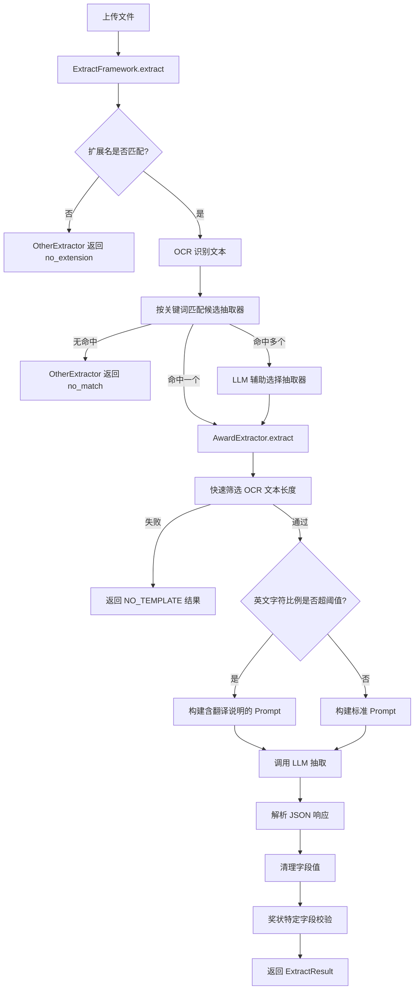

# 奖状抽取器

## 模块职责

`AwardExtractor` 负责从奖状/证书类图片或 PDF 中提取结构化数据，识别竞赛名称、获奖等级、获奖者（学生）、指导教师、日期/年份/届次等字段。该抽取器同时支持中文和英文奖状：英文奖状会自动检测，并在 Prompt 中加入翻译要求（人名保持原文，其余翻译为中文正式表述）。它通过快速筛选、LLM 提示词构建、响应解析、字段清洗和专项校验，最终返回符合 `ExtractResult` 契约的结构化结果。

## 调用链

在 `ExtractFramework` 的统一调度下，奖状抽取器参与的调用链如下：

关键节点说明：

- **关键词匹配**：`AwardExtractor` 以 `PRIMARY_KEYWORDS`（如“奖”“证书”“award”）和 `AWARD_KEYWORDS`（如“竞赛”“一等奖”“honor”）作为默认关键词，配置可覆盖。框架用这些关键词从 OCR 文本中筛出候选抽取器。
- **快速筛选**：仅检查 OCR 文本清洗后的长度（默认 15~1500 字），不检查关键词；关键词筛选由框架层完成。
- **英文检测**：当英文字母占所有字母的比例超过 `english_ratio_threshold`（默认 0.7）时判定为英文奖状，Prompt 中附加 `ENGLISH_TRANSLATION_NOTE`。
- **字段校验**：除确认主字段外，还会检查必填项（竞赛名称、获奖等级）、获奖者姓名、指导教师（教师奖状例外）、日期/年份/届次至少一项，以及日期格式和等级值。

## 关键状态与配置

`AwardExtractor` 的可配置状态在 `__init__` 中加载：

- `template_type = "award"`、`fields_name = "award"`：用于定位字段定义文件名 `award_fields.json`。
- `keywords`：可由配置提供；为空时使用 `PRIMARY_KEYWORDS + AWARD_KEYWORDS`。
- `min_confidence`：最小置信度（默认 0.3）。
- 快速筛选参数：`enable_quick_screen`（默认 True）、`quick_screen_min_length`（15）、`quick_screen_max_length`（1500）。
- 英文检测阈值：`english_ratio_threshold`（默认 0.7）。
- `fields_file`：字段定义文件路径，位于 `backend/extract/prompts/`，必须存在且为 JSON 对象，否则初始化失败。
- `template_manager`：可选模板管理器，用于模板匹配（当前页未展开）。

## 主要文件

- `backend/extract/extractors/award.py`：奖状抽取器实现，包含字段加载、Prompt 构建、响应解析、清洗与校验。
- `backend/extract/framework.py`：抽取框架，负责 OCR、关键词匹配、LLM 选择抽取器和结果组装。
- `backend/extract/prompts/award_fields.json`：由 `_load_fields` 加载的字段定义文件（路径由 `fields_name` 推导）。

## 边界条件

- **非竞赛证书拒绝**：考级证书、认证证书、能力测试证书等（无竞赛名称/获奖等级）通过 `is_valid_certificate: false` 拒绝。
- **快速筛选**：OCR 文本为空、清洗后字数小于最小值或大于最大值时，抽取器不继续。
- **字段清洗规则**：姓名相关字段（`winner_name`、`supervisor_name`、`supervisors`）会去除数字、特殊符号、多余空格和首尾逗号；非姓名字段合并多个空格。
- **指导教师例外**：当 `granted_role` 包含“教师”时，不要求指导教师字段。
- **日期完整**：`date`、`year`、`edition` 三者至少一项有值，否则提示需人工补充。
- **英文翻译**：人名必须保持原文，其他内容转为中文正式表达。

## 扩展点

- 通过继承 `Extractor` 并注册到 `ExtractFramework`，可添加新的文档抽取器。
- 配置可覆盖关键词列表、快速筛选阈值、英文检测阈值、字段定义文件名。
- 英文翻译提示词 `ENGLISH_TRANSLATION_NOTE` 是类级常量，可在子类中重写。
- 字段定义 JSON 可扩展新字段，Prompt 会自动拼接；`_clean_field_value` 按字段名区分清洗逻辑，可通过扩展清洗规则适配新字段。

Sources: [backend/extract/extractors/award.py](backend/extract/extractors/award.py#L1-L460), [backend/extract/framework.py](backend/extract/framework.py#L1-L415)