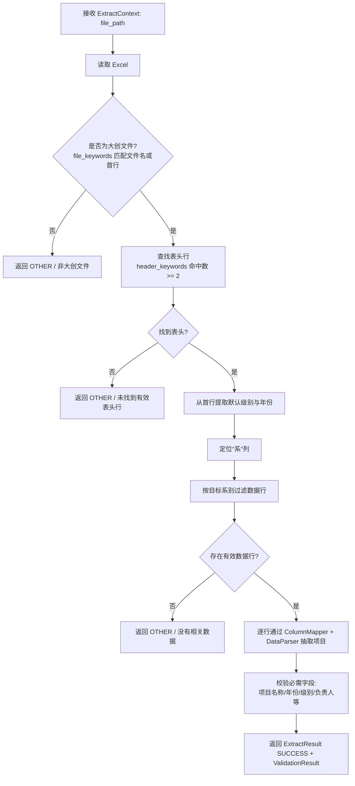

# 大创项目抽取器

## 模块定位与职责

大创项目抽取器（`InnovationExtractor`）负责从 Excel 表格（`.xlsx` / `.xls`）中抽取大学生创新创业训练项目数据，输出结构化的项目列表。与奖状、证书类抽取器不同，该抽取器**不依赖 OCR 或 LLM**，而是直接读取单元格内容，按列名映射、正则解析和规则校验完成抽取。

它继承自 `backend/extract/extractors/base.py` 中的 `Extractor` 抽象基类，并适配新的抽取框架 `backend/extract/framework.py`。由于数据来源是表格，该抽取器不使用关键词匹配（`keywords = []`，`matches_keywords` 返回 `False`），而是通过文件扩展名和内部规则判断是否为大创文件。

## 调用链

上层调用方（如文件导入服务、Agent 工具）构造 `ExtractContext`，其中携带 `file_path`；抽取框架根据扩展名或注册表找到 `InnovationExtractor`，然后调用 `extract()`。核心调用链如下：

关键节点说明：

- **读取 Excel**：`.xlsx` 使用 `openpyxl` 以只读模式读取；`.xls` 使用 `xlrd`，若未安装则抛出 `ExtractorError`。
- **大创文件识别**：通过 `file_keywords` 在首行或文件名中匹配；若 `file_keywords` 为空，则不会识别任何文件为大创文件。
- **表头行查找**：某行中包含至少 2 个 `header_keywords`（默认 `["项目", "学号", "教师", "负责人"]）时视为表头行。
- **默认级别/年份**：从表头之前的第一行文本中提取，例如“2024年国家级”，用于补全缺失字段。
- **系别过滤**：若找到含“系”的列，则只保留目标系别（默认 `["计算机工程系"]`）的数据行。
- **结果封装**：成功后返回 `ExtractResult`，`template_type` 为 `TemplateType.INNOVATION`，并附带 `metadata`（源文件、表头行索引、过滤行数、目标系别）。

## 关键组件

### ColumnMapper

将配置中的内部字段名（如“项目名称”“指导教师”）映射到 Excel 实际列名。构造时接收 `column_mapping: Dict[str, List[str]]`，支持多个候选列名；`normalize()` 会清洗空格、回车、Tab 等字符，使匹配更宽容。`get_value()` 从行字典中取出指定字段的值并去除首尾空格。

### DataParser

提供纯静态解析方法：

- `parse_teachers()`：解析指导教师，支持逗号、顿号、分号、全角空格等分隔符。
- `parse_students()`：解析成员，支持“姓名/学号”“姓名（学号）”“学号+姓名”“姓名直接连接学号”等多种格式；按学号去重并保留较长姓名。
- `parse_date_range()`：解析“2024.6-2025.6”等起讫时间。
- `validate_student_id()` / `validate_name()`：学号固定 9 位数字，姓名为 2–5 个非数字字符。

### 抽取产出

每行项目最终转换为如下结构：

- `project_number`：项目编号
- `project_name`：项目名称
- `start_date` / `end_date`：起止日期，格式统一为 `YYYY-MM`
- `leader_name` / `leader_student_id`：负责人姓名与学号
- `members`：成员列表，格式为 `["姓名(学号)"]`
- `supervisors`：指导教师字符串列表
- `project_level`：项目级别（国家级/省级/院级）
- `acceptance_level`：验收等级
- `project_description`：项目简介
- `department`：系别，缺失时使用配置的目标系别

## 关键状态与结果

`extract()` 返回 `ExtractResult`，其中 `status` 有以下可能：

- `SUCCESS`：成功抽取，`data` 中包含 `projects` 和 `count`。
- `PARSE_ERROR`：读取或解析过程中抛出 `ExtractorError`。
- `FILE_ERROR`：其他未预期异常。
- `OTHER`：文件不是大创文件、未找到表头、无相关数据等非致命场景。

校验阶段会对每个项目检查必需字段（项目名称、年份、项目级别、负责人姓名等），生成 `ValidationError` 并分类为 `completeness`（完整性）或 `content`（内容）问题；有效项目与 `ValidationResult` 一起返回。

## 边界条件与注意点

- 仅支持 `.xlsx` / `.xls`，其他格式直接抛出 `ExtractorError`。
- 读取 `.xls` 依赖可选库 `xlrd`，未安装时无法处理 `.xls`。
- `file_keywords` 为空时，所有文件都会被判定为“不是大创文件”。
- 系别过滤依赖表头中存在含“系”的列；若不存在，则不过滤。
- 成员解析依赖学号固定 9 位、姓名 2–5 个字符的强假设，异常格式可能被丢弃。
- 已知源码细节：`_extract_single_row()` 返回的项目字典未包含 `year` 字段，但 `_validate()` 使用 `project.get("year")` 检查年份，因此年份完整性校验可能始终告警，需上层补全或修复。
- 配置项 `student_id_length` 已读取，但当前 `DataParser` 仍固定使用 9 位正则。

## 扩展点

- **列名映射**：通过 `config["column_mapping"]` 可适配不同模板的 Excel 列名，新增内部字段只需扩展映射。
- **识别规则**：`header_keywords`、`file_keywords`、`target_departments` 均可配置。
- **解析能力**：`DataParser` 的正则模式可继续扩展以覆盖更多姓名/学号写法。
- **框架集成**：该抽取器已在 `backend/extract/extractors/__init__.py` 中导出，可被上层框架统一发现和调用。

Sources: [backend/extract/extractors/innovation.py](backend/extract/extractors/innovation.py#L1-L260) [backend/extract/extractors/innovation.py](backend/extract/extractors/innovation.py#L268-L405) [backend/extract/extractors/innovation.py](backend/extract/extractors/innovation.py#L407-L632) [backend/extract/extractors/innovation.py](backend/extract/extractors/innovation.py#L633-L783) [backend/extract/extractors/base.py](backend/extract/extractors/base.py#L11-L55) [backend/extract/extractors/__init__.py](backend/extract/extractors/__init__.py#L1-L16)