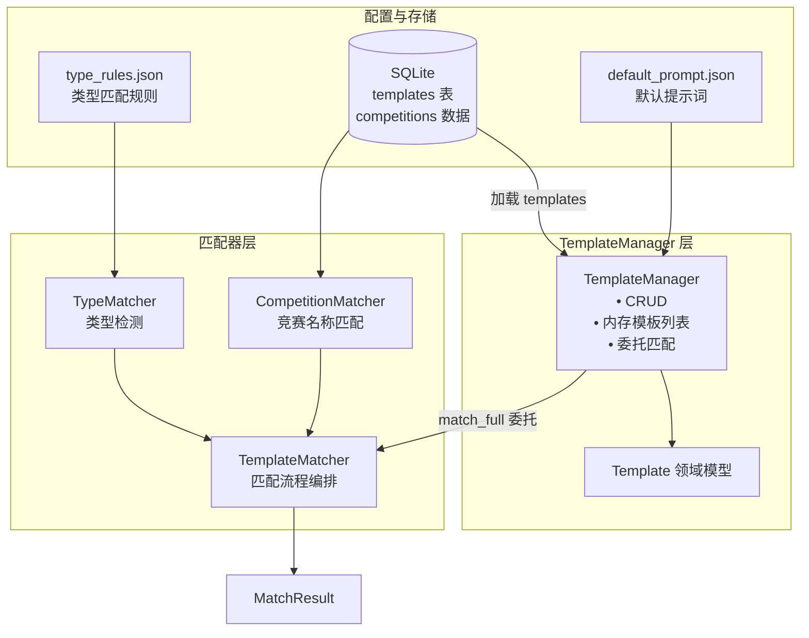
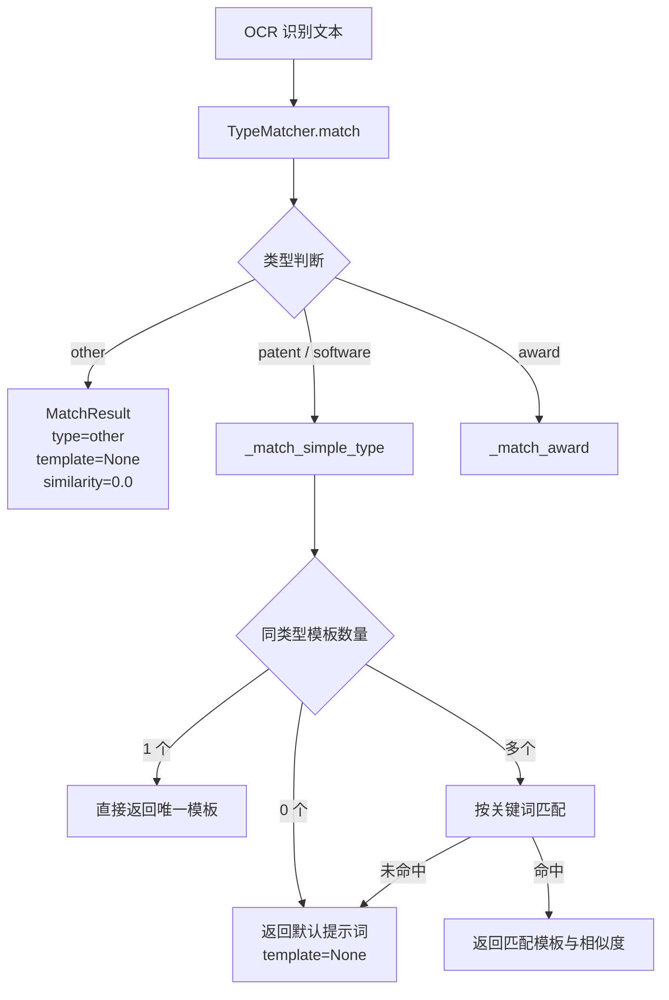

# 模板匹配与管理

## 模块职责

`backend/extract/template` 是模板匹配与管理的核心模块，为抽取流水线提供三种证书类型（奖状 `award`、专利 `patent`、软著 `software`）的版式匹配能力。其职责可拆解为四层：

1. **模板建模**：`Template` 描述证书版式的关键特征——关键词、样本文本、默认字段映射、LLM 字段、语言与翻译标记、样本图片等。
2. **模板 CRUD**：`TemplateManager` 提供增、删、改、查、清空、批量添加与统计，并将模板持久化到 SQLite `templates` 表；内存列表与数据库同步。
3. **类型识别**：`TypeMatcher` 基于 `type_rules.json` 规则判断 OCR 文本归属 `award` / `patent` / `software` / `other`。
4. **模板匹配**：`TemplateMatcher` 在类型识别后执行完整匹配流程，产出 `MatchResult`（类型、模板、相似度、默认提示词）。

模块入口为 `TemplateManager`，上层抽取器只需调用 `match_full()` 即可拿到包含类型与模板的结果，无需关心规则加载与匹配细节。

## 核心数据结构与状态

### Template（`template.py`）

从存储与序列化代码可还原其字段：

| 字段 | 说明 |
|------|------|
| `template_id` | 主键 ID（更新/删除依据） |
| `template_type` | `award` / `patent` / `software` |
| `competition_id` | 关联竞赛 ID |
| `min_length` / `max_length` | 文本长度约束 |
| `keywords` | 匹配关键词列表 |
| `sample_text` / `sample_extracted` | 样本原文与抽取结果 |
| `default_fields` / `llm_fields` | 字段映射（JSON 序列化存储） |
| `language` / `need_translate` | 语言标记与翻译需求 |
| `is_manual_edited` | 是否人工编辑过 |
| `sample_image_blob` | 样本图片二进制 |

关键方法：`from_db_row()` 从数据库行构造对象、`get_display_name()` 获取展示名、`get_type_display_name()`、`get_sample_image_bytes()`、`to_dict()`。

### MatchResult（`matcher.py`）

```python
@dataclass
class MatchResult:
    type: str                      # award/patent/software/other
    template: Optional[Template]   # 可能为 None
    similarity: float              # 0.0-1.0
    default_prompt: Optional[str]  # 未匹配模板时的兜底提示词
```

`to_dict()` 提供面向调用方与 API 的序列化输出。

### 关键状态

- **持久化状态**：SQLite `templates` 表，`keywords` / `default_fields` / `llm_fields` 以 JSON 字符串存储，`sample_image_blob` 存二进制。
- **内存状态**：`TemplateManager.templates`（模板列表）、`default_prompts`（类型 → 默认提示词）、`base_fields_map`（类型 → 字段定义）。
- **类级状态**：`TypeMatcher._rules`（类型规则，进程级共享）、`CompetitionMatcher`（竞赛数据）。

## 调用链

```
OCR 文本
  → TemplateManager.match_full(ocr_text)
    → TemplateMatcher.match_full(ocr_text, templates, default_prompts)
      → TypeMatcher.match(ocr_text)           # 第 1 步：类型识别
      → 分支：
        - other        → 直接返回空模板结果
        - patent/software → _match_simple_type
        - award        → _match_award
```

`TemplateManager` 初始化链同样关键：构造时若提供 `config_dir` 则加载配置；然后从数据库加载模板列表。



**关键节点说明**：`TemplateManager` 是唯一对外门面，内部将匹配职责委托给无状态的 `TemplateMatcher`；`TypeMatcher` 的规则来源于 JSON 文件而非数据库，而竞赛数据则从数据库加载，二者在 `TemplateMatcher.load_configs()` 中统一完成配置装配。

## 模板匹配流程

`TemplateMatcher.match_full()` 的流程可用下图概括：



**关键节点说明**：

- **类型识别优先**：先判定文档类型，再在该类型范围内匹配模板，避免跨类型误匹配。
- **专利/软著的简单分支**：专利与软著版式相对固定，模板数量少时直接返回；多模板时退化为关键词匹配。
- **奖状走独立分支**：`_match_award` 与简单类型分支并列，奖状的竞赛名称匹配逻辑更复杂（结合 `CompetitionMatcher`）。
- **兜底策略**：任何分支未命中时返回 `default_prompt`，供上层 LLM 抽取作为提示词，保证流水线不中断。

## 模板 CRUD 与持久化

`TemplateManager` 的 CRUD 全部以 **DB + 内存双写** 方式实现：

| 操作 | 行为 | 关键约束 |
|------|------|----------|
| `add_template` | 先查重（同类型 + 同名），再写库、再入内存 | 重复返回 `False` |
| `update_template` | 要求 `template_id` 非空且存在；写库后替换内存对象 | 不存在返回 `False` |
| `delete_template` | 先删库、后删内存 | 删除不存在的 ID 返回 `False` |
| `clear_templates` / `clear_templates_by_type` | 批量清空 | 需配置 DB 路径 |
| `add_templates_from_data` | 批量导入 | 供初始化/迁移使用 |

持久化通过 `_save_template_to_db()` 完成：新模板执行 `INSERT`，已有模板执行 `UPDATE`，并将复杂类型以 `json.dumps(..., ensure_ascii=False)` 序列化后写入。

## 边界条件

- **DB 路径缺失或文件不存在**：记录警告并跳过模板加载，`templates` 为空列表，匹配退化为纯类型识别 + 默认提示词。
- **表初始化失败**：优先尝试 `backend.extract.migrations.init_template_tables` 自动建表；`migrations` 模块不可用时假设表已存在。
- **空 OCR 文本**：`TypeMatcher.match` 返回 `"other"`。
- **规则未加载**：`TypeMatcher._rules` 为空时返回 `"other"` 并告警提示先调用 `load_rules()` 或 `TemplateMatcher.load_configs()`。
- **类型规则优先级**：检查顺序为 `patent → software → award`，专利/软著条件更精确、优先于奖状的宽泛条件（如"证书"），避免专利证书误判为奖状。
- **排除关键词优先**：规则中的 `exclude_keywords` 优先级最高，命中即跳过该类型。
- **匹配失败兜底**：目标类型无模板或多模板均未命中时，返回 `default_prompt`，`similarity` 为 `0.0`。

## 扩展点

- **新增文档类型**：扩展 `type_rules.json` 并向 `TypeMatcher.match` 的类型顺序中加入新条目；`TemplateManager` 天然支持任意 `template_type` 字符串。
- **字段定义注入**：构造时传入 `base_fields_map`，或运行时调用 `set_base_fields()` 动态调整各类型字段映射。
- **竞赛数据解耦**：`TemplateMatcher.load_configs()` 接受 `competition_manager` 实例（优先于 `db_path`），便于外部注入竞赛管理器而非直接读库。
- **默认提示词兜底**：`default_prompt.json` 按类型配置提示词，未匹配模板时供 LLM 抽取使用，可无侵入扩展。
- **LLM 字段与翻译**：模板内置 `llm_fields`、`language`、`need_translate`，为 Agent 抽取和跨语言文档处理预留能力。
- **样本追溯**：`sample_image_blob` 与 `sample_extracted` 支持管理员在界面上查看样本与历史抽取结果。

Sources: [backend/extract/template/manager.py](backend/extract/template/manager.py#L1-L560) [backend/extract/template/matcher.py](backend/extract/template/matcher.py#L1-L383) [backend/extract/template/__init__.py](backend/extract/template/__init__.py#L1-L41)