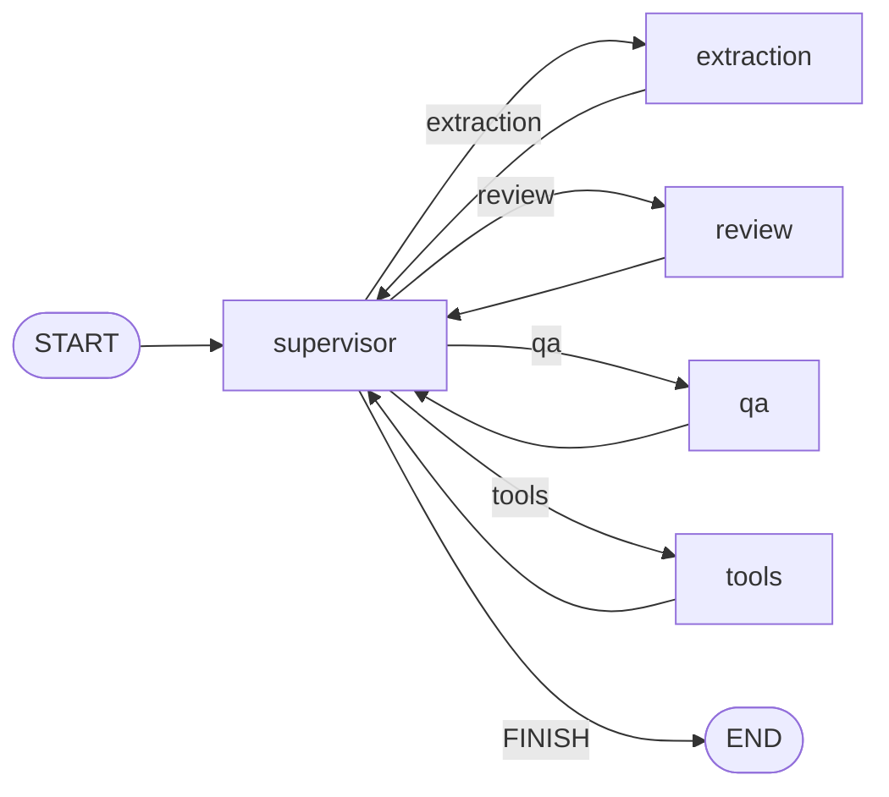
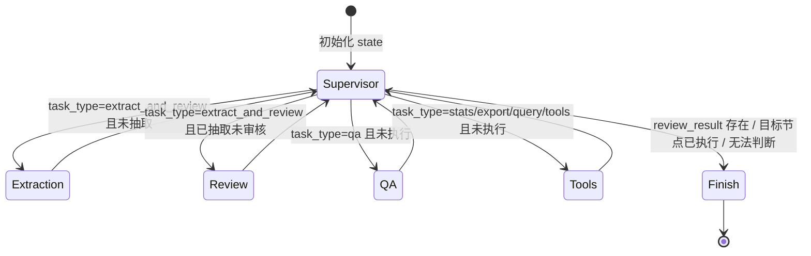

## Agent 工作流编排

### 模块职责

`backend/agent/graph/workflow.py` 是 Agent 系统的中枢装配模块，它基于 LangGraph 的 `StateGraph` 将多个智能体节点（Supervisor、抽取、审核、QA、工具）编排为一张可执行的有向图。图中采用 **Supervisor 模式**：统一入口路由，共享 `AgentState` 在节点间传递抽取/审核/问答结果；通过条件边实现动态调度，并支持 checkpoint 断点续跑。

核心设计目标：

- **单一入口、动态路由**：所有任务从 `supervisor` 节点进入，由它根据任务类型和当前状态决定下一个节点。
- **共享状态**：各节点只读写 `AgentState`，由 LangGraph 框架负责状态合并。
- **可扩展**：新增 Agent 只需注册节点并补充路由分支，不影响现有流程。

### 工作流装配与节点连接

`MultiAgentWorkflow.from_config()` 负责装配整张图：

1. 读取配置并构建 LLM（默认 provider 为 `deepseek`）。
2. 构造 `ToolContext`（惰性初始化，避免启动时加载 OCR 引擎）。
3. 创建各节点：`supervisor`、`extraction`、`review`、`qa`、`tools`。
4. 使用 `StateGraph(AgentState)` 添加节点，并定义边：
   - `START -> supervisor`
   - `supervisor` 通过条件边路由到 `extraction / review / qa / tools / END`
   - 所有执行节点完成后均返回 `supervisor`，形成循环，直到 supervisor 判定 `FINISH`。

下图直观展示了图的拓扑结构：

**关键节点解释：**

- **supervisor**：路由决策中心，根据 `state.task_type`、`steps` 轨迹和可选的 LLM 意图识别输出 `next_agent`。
- **extraction**：读取 `file_path`，调用抽取框架（OCR + LLM）生成 `extraction_result`，并记录 `steps`。
- **review**：基于 `extraction_result` 做规则校验和 RAG 交叉校验，输出 `review_result`（决策、问题清单、建议）。
- **qa**：将用户问题送入 RAG 问答管道，生成 `qa_context`（答案与来源）。
- **tools**：处理统计、导出、查询等数据操作类任务，是单 Agent 工具调用节点。

### 共享状态 AgentState

`backend/agent/state.py` 定义了 `AgentState`（TypedDict），它是所有节点之间传递的“消息总线”。

| 字段 | 类型 | 说明 |
|------|------|------|
| `messages` | `Annotated[List, add_messages]` | 会话消息列表，自动追加 |
| `task_type` | `str` | 任务类型：`extract_and_review / qa / stats / export / chat` |
| `file_path` | `str` | 待抽取文件路径 |
| `user_context` | `Dict` | 用户角色、ID、姓名，用于工具鉴权 |
| `extraction_result` | `ExtractionResult` | 抽取 Agent 的输出（文档类型、数据、置信度、OCR 文本） |
| `review_result` | `ReviewResult` | 审核 Agent 的输出（决策、issues、建议） |
| `qa_context` | `QAContext` | QA Agent 的输出（检索来源、回答） |
| `next_agent` | `str` | Supervisor 输出的下一个节点名 |
| `steps` | `List[Dict]` | 节点执行轨迹，用于防环和前端展示 |
| `done` | `bool` | 流程是否结束 |

`messages` 使用 `add_messages` reducer，支持追加；业务字段（如 `extraction_result`）默认覆盖。这样设计既保证了会话的连续性，又确保每个 Agent 能安全地写入自己的结果。

### Supervisor 路由决策

`backend/agent/graph/supervisor.py` 实现了路由逻辑 `_decide_next`，采用 **规则优先 + LLM 兜底** 的混合策略：

1. 从 `steps` 中提取已执行节点（排除 `supervisor`）。
2. 若 `review_result` 已存在且任务为 `extract_and_review`，则 `FINISH`。
3. 按明确的任务类型路由：
   - `extract_and_review`：先抽取（未抽取且无 `extraction_result`）→ 再审核（未审核且无 `review_result`）→ 完成。
   - `qa`：若未执行则路由到 `qa`，否则结束。
   - `stats/export/query/tools`：若未执行则路由到 `tools`，否则结束。
4. `auto`/`None` 类型且配置了 LLM：使用 LLM 理解用户消息并分类，归一化到合法路由；若目标节点已执行则结束。
5. 任何异常或无法判断的情况，兜底 `FINISH`。

该决策过程可由下面的状态图表示：

**关键状态说明：**

- **Extraction** 节点成功后会写入 `extraction_result`，供 Review 节点消费。
- **Review** 节点输出 `review_result`，Supervisor 据此判定是否完成整个 `extract_and_review` 流程。
- **steps 轨迹**是防循环的关键：无论规则还是 LLM 路由，只要目标节点已在 `steps` 中出现，Supervisor 就会转向 `FINISH`，避免无限循环。

### 主循环与执行入口

`MultiAgentWorkflow` 提供两种执行方式：

- `run()`：同步调用 `graph.invoke(initial_state, config)`，返回最终状态。
- `run_stream()`：流式执行 `graph.stream(...)`，逐节点 yield 进度（如 `{"node": "supervisor"}`），方便前端展示“AI 正在抽取/审核”的过程。注意：由于 LangGraph `updates` 模式不返回最终态，流式方法末尾会再补一次 `invoke` 获取完整结果（单机课程项目双跑成本可接受，生产环境可改用 `values` 模式）。

构造初始状态时，`task_type`、`file_path`、`user_context`、`messages` 会被写入；运行配置中设置了 `recursion_limit: 50` 作为安全上限，防止路由异常导致死循环。若传入 `thread_id`，会写入 `configurable` 以支持 checkpoint 多轮记忆。

### 调用链

外部入口（如 AI 助手聊天接口）通过以下调用链进入工作流：

1. 构造 `MultiAgentWorkflow`（通常由工厂在应用启动时装配）。
2. 调用 `run(task_type=..., message=..., file_path=..., user_context=..., thread_id=...)`。
3. 内部生成初始 `AgentState` 并调用 `graph.invoke`。
4. 图从 `START` 进入 `supervisor`，反复执行路由-执行-回环，直到 `FINISH` 到达 `END`。
5. 返回包含 `extraction_result / review_result / qa_context / steps` 的最终状态。

### 主要文件

- `backend/agent/graph/workflow.py`：工作流装配、`MultiAgentWorkflow` 类、`run`/`run_stream`。
- `backend/agent/graph/supervisor.py`：Supervisor 节点、路由决策函数、LLM 意图识别。
- `backend/agent/state.py`：共享状态 `AgentState` 及子结果结构定义。
- `backend/agent/graph/extraction_agent.py`：抽取 Agent 节点，封装现有抽取框架。
- `backend/agent/graph/review_agent.py`：审核 Agent 节点，规则校验 + RAG 交叉校验。
- `backend/agent/graph/qa_agent_node.py`：问答 Agent 节点，封装 RAG 问答能力。

### 边界条件

- **无 `file_path`**：抽取节点直接返回 `skipped` 步骤，不抛异常。
- **抽取失败**：捕获异常并写入 `error` 步骤，同时设置空的 `extraction_result`（置信度 0），保证后续审核可正常处理。
- **OCR 文本过大**：在写入状态时截取前 500 字符，避免状态膨胀。
- **RAG 向量库不可用**：审核节点会惰性构建向量库，失败则 `None`，跳过交叉校验，不影响规则校验。
- **非法奖项级别**：审核节点从配置读取合法集合（顶层 `award_levels`），若级别不合法会生成 `medium` 严重度 issue。
- **LLM 路由失败**：捕获异常并记录 warning，兜底 `FINISH`，避免流程卡死。
- **checkpoint 未安装**：启用时会尝试导入 `MemorySaver`，失败则警告并继续无 checkpoint 运行。

### 扩展点

- **新增 Agent 节点**：在 `from_config` 中调用对应的 `make_xxx_node` 构造节点，通过 `builder.add_node()` 注册，并在 `supervisor` 的条件边映射中添加路由目标。同时需在 `_decide_next` 或 LLM 路由中补充相应的 `task_type` 分支。
- **支持更多任务类型**：扩展 `task_type` 枚举（如增加 `analyze`），并在 supervisor 的路由逻辑中增加对应分支。
- **启用多轮记忆**：设置 `enable_checkpoint=True`，并传入稳定 `thread_id`，即可利用 LangGraph checkpoint 实现跨轮状态恢复。
- **替换路由策略**：supervisor 的 `_decide_next` 是纯函数，可以替换为更复杂的策略（如基于 state 的完整策略网络）。
- **流式输出增强**：`run_stream` 当前产出节点级进度，可扩展为字级流式（需配合 LLM 流式能力）。

Sources:
- [workflow.py](backend/agent/graph/workflow.py#L1-L221)
- [supervisor.py](backend/agent/graph/supervisor.py#L1-L159)
- [state.py](backend/agent/state.py#L1-L98)
- [extraction_agent.py](backend/agent/graph/extraction_agent.py#L1-L100)
- [review_agent.py](backend/agent/graph/review_agent.py#L1-L212)
- [qa_agent_node.py](backend/agent/graph/qa_agent_node.py#L1-L91)