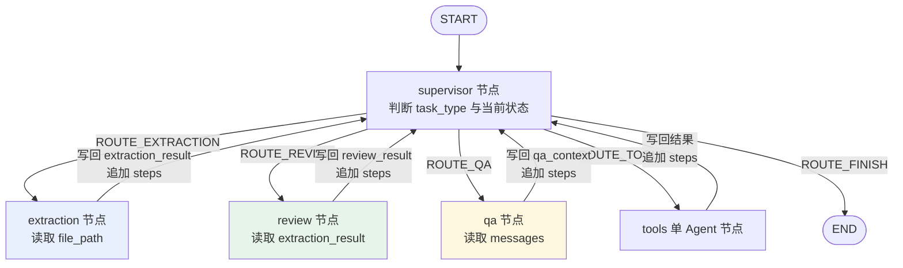

### Agent 节点实现

三个执行节点——抽取、审核、QA——各自独立实现并将结果写回共享 `AgentState`。全部节点通过工厂函数生成，由 `MultiAgentWorkflow.from_config()` 装配进 LangGraph 图，在 Supervisor 路由下协作。

#### 模块职责与调用链

**抽取节点（extraction_agent.py）**：把现有的 `ExtractFramework`（OCR + LLM 抽取流水线）原样封装为图节点。节点读取 `state.file_path`，调用 `framework.extract(file_path, use_ocr_cache=True, use_llm_cache=True)`，将识别结果以 `extraction_result` 写回 state，并在 `steps` 中追加一条执行记录。若节点创建时传入的是 `ToolContext` 而非已构造的 `ExtractFramework`，framework 会在首次执行时惰性获取——避免工作流装配阶段就初始化 OCR 引擎。

**审核节点（review_agent.py）**：基于抽取结果做双校验——规则校验与 RAG 交叉校验。规则校验覆盖三类问题：必填字段缺失（`high`）、奖项级别不合法（`medium`）、角色非法（`low`）；RAG 交叉校验在竞赛名已知时检索知识库，确认该竞赛的登记类别/等级与抽取是否一致，并以 `info` 级 issue 的形式附加到 `issues`。最后调用公共模块 `aggregate_decision()` 得出 `pass / need_manual / reject` 决策。

**QA 节点（qa_agent_node.py）**：从 `state.messages` 中反向提取最后一条 user/human 消息，复用 `qa_agent.answer_question()` 完成 RAG 检索 + LLM 生成，将 `{answer, sources}` 写入 `state.qa_context`。该节点是 RAG 问答链路的图封装，支持在 supervisor 的 auto 模式下执行多轮提问。

下图展示节点在工作流图中的位置与状态回写关系：

图的关键点：supervisor 是唯一路由中枢，四个执行节点完成后都会回到 supervisor，由其判断任务是否继续（如 `extract_and_review` 先走抽取再走审核）或终止；所有跨节点数据均通过共享 `AgentState` 传递，节点之间无直接调用。

#### 关键状态

`AgentState`（state.py）是 LangGraph 的 `TypedDict`，字段语义由 LangGraph 根据类型注解自动合并：

| 字段 | 写入节点 | 说明 |
|---|---|---|
| `file_path` | 外部调用 | 待抽取文件路径，抽取节点的唯一输入 |
| `extraction_result` | extraction | `{doc_type, data, confidence, ocr_text}`，其中 `ocr_text` 截断为 500 字符，防止 state 过大 |
| `review_result` | review | `{decision, issues, suggestion, rag_reference}` |
| `qa_context` | qa | `{answer, sources}` |
| `steps` | 全部节点 | 执行流水记录：`{agent, status, ...}`，追加语义 |
| `messages` | 外部调用 / 节点 | LangChain `add_messages` reducer，追加而非覆盖 |

#### 主要文件

- `backend/agent/graph/extraction_agent.py`：抽取节点工厂及置信度启发式估算（有效字段数 / 8.0）。
- `backend/agent/graph/review_agent.py`：审核节点工厂、规则校验、RAG 交叉校验、建议生成。
- `backend/agent/graph/qa_agent_node.py`：QA 节点工厂、消息提取、向量库兜底。
- `backend/agent/qa_agent.py`：RAG 问答核心逻辑（`answer_question` 与 `stream_answer`）。
- `backend/agent/graph/workflow.py`：从配置装配图，注册节点与条件边，编译与执行入口。
- `backend/agent/state.py`：共享状态定义。

#### 边界条件

- **抽取节点**：`file_path` 为空时标记 `skipped` 并不执行流水线；framework 调用抛异常时捕获并写回 `error` 步 + 空 `extraction_result`，保证图上其他节点仍可执行。
- **审核节点**：仅 `doc_type == "award"` 时执行完整规则校验，其他文档类型跳过；`vectorstore` 未显式传入且惰性构建失败时，交叉校验静默降级跳过，不影响主流程决策；RAG 检索异常（如向量库未初始化）同样降级为 `None`。
- **QA 节点**：`messages` 中无 user

Sources: [backend/agent/graph/extraction_agent.py](backend/agent/graph/extraction_agent.py#L1) [backend/agent/graph/review_agent.py](backend/agent/graph/review_agent.py#L1) [backend/agent/graph/qa_agent_node.py](backend/agent/graph/qa_agent_node.py#L1) [backend/agent/qa_agent.py](backend/agent/qa_agent.py#L1)