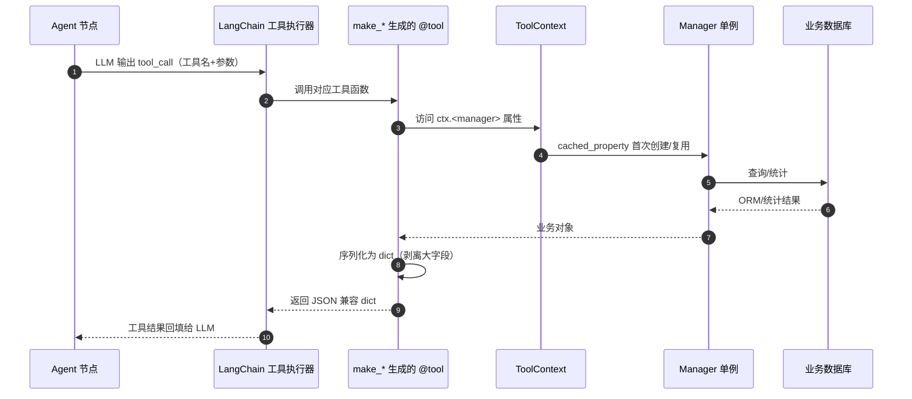

Agent 工具集是 Agent 工作流与业务模型之间的「只读边界」：它把现有的 AwardManager、CompetitionManager、DataAnalysisManager 查询/统计能力，以及 ExtractFramework 抽取能力和报表导出能力包装成 LangChain 可识别的 `@tool`，供 Agent 节点在对话中自主调用。工具本身不实现业务逻辑，只做参数透传、结果序列化和异常兜底。

## 运行机制

### 1. 函数工厂 + 闭包注入

工具集没有在模块加载时直接创建 Tool 对象，而是提供 `make_*_tool(ctx)` 工厂函数。每个工厂接受一个 `ToolContext` 实例，通过闭包把 `ctx` 注入到 `@tool` 装饰的函数内部。

这种设计主要解决两个问题：

- LangChain 的 `@tool` 装饰器不便于直接传入外部依赖；
- 所有工具共享同一个 `ToolContext`，可以复用耗资源的管理器单例。

调用链如下：

关键节点说明：

- `Runtime` 指的是上层 LangChain Agent 执行器，负责把 LLM 生成的 tool_call 分发到对应工具函数。这一层代码不在本页面源码中，但工具集的 `make_*` 函数返回的 `@tool` 对象就是被它消费的。
- `ToolContext` 是唯一依赖入口，工具不直接访问全局 `config_loader` 或 `ServiceContext`，保证依赖方向统一。
- 工具函数内部捕获所有异常并返回 `{"error": ...}`，而不是抛给 LangChain runtime，避免一次查询失败导致整个 Agent 对话中断。

### 2. 工具分类与副作用边界

工具集按职责分为四类：

- **查询类**（`query_tools.py`）：奖状查询、竞赛模糊匹配、竞赛详情、白名单判断、白名单列表。只读，无副作用。
- **抽取类**（`extract_tools.py`）：对文件执行 OCR + LLM 结构化抽取。有真实副作用（消耗 OCR/LLM 额度、写缓存），但不修改业务库。
- **统计类**（`stats_tools.py`）：有奖状竞赛列表、竞赛贡献度排名、获奖趋势、热力图。只读，委托 `DataAnalysisManager`。
- **导出类**（`export_tools.py`）：生成年度成果汇总 Excel + HTML 报表，落盘到 `output/agent_reports/`，返回文件路径。副作用仅限于生成报表文件，不改业务库。

`__init__.py` 的包级 docstring 明确写着「绝不封装写/删操作」，这是工具集的根本边界。新增工具时必须遵守这一约束。

### 3. 关键状态

工具集的运行状态集中在 `ToolContext`：

- `ToolContext` 用 `cached_property` 惰性创建并缓存 `AwardManager`、`CompetitionManager`、`DataAnalysisManager`、`LaboratoryManager` 和 `ExtractFramework`。其中 `AwardManager` 构造时会全量加载数据库到内存，所以必须单例。
- `ExtractFramework` 不是新建的，而是复用 `ServiceContext` 中已注册好四个业务抽取器（Innovation/Patent/Software/Award）的实例。如果在这里新建空框架，工具会因抽取器未注册而失效（见 `extract_tools.py` 和 `context.py` 的注释）。
- `get_tool_context()` 维护全局单例 `_tool_context`；`reset_tool_context()` 提供测试用重置入口。
- 导出工具每次调用都会 `mkdir(parents=True, exist_ok=True)` 确保 `output/agent_reports/` 存在。

## 文件职责与协作

### `context.py` —— 依赖容器

`ToolContext` 是整个工具集的「接线板」。它持有 `config_loader`，通过 `get_path_str("database", "competitions_db")` 解析主库路径，并惰性创建各 Manager。

它与各工具模块的协作方式是：工具工厂函数接收 `ctx`，在函数体内通过 `ctx.award_manager`、`ctx.extract_framework` 等属性访问依赖。工具不需要知道这些 Manager 如何构造，也不需要关心它们是否已经初始化。

### `query_tools.py` —— 查询能力封装

该模块把 `AwardManager.query_awards`、`CompetitionManager.match_competition` 等方法包装为工具。它做的事情很薄：

- 把 `ctx` 闭包传入的工具参数转发给 Manager；
- 用 `_award_to_dict` 和 `_competition_to_dict` 把 ORM 对象序列化为纯 dict；
- 记录日志并捕获异常。

注意 `_award_to_dict` 通过 `getattr` / `hasattr` 防御性访问字段，说明 `Award` 对象可能不是所有实例都有同样的属性/方法。修改此文件时要保持这种防御风格，避免序列化时新增字段导致 AttributeError。

### `stats_tools.py` —— 统计能力封装

这四个工具直接透传 `DataAnalysisManager` 的方法。它们的返回结果已经是可 JSON 化的结构，不需要额外序列化。`get_competition_contribution` 内部构造 `years = [year] if year else None`，表示年份过滤是「单年列表」语义；`get_competition_trend` 和 `get_competition_heatmap` 返回带 `years` / `counts` / `data` 字段的字典。

### `extract_tools.py` —— 抽取能力封装

这是唯一有外部额度消耗的工具。它调用 `ctx.extract_framework.extract(file_path, use_ocr_cache=..., use_llm_cache=...)`，并把 `ExtractResult` 序列化为轻量 dict。序列化时剥离了 OCR 原文等大字段，避免把整段 OCR 文本塞给 LLM 上下文。`use_cache` 同时控制 OCR 和 LLM 缓存，默认 `True`，可避免重复计费。

注意该文件的注释明确提到「`extract_framework` 默认未注册业务抽取器，需在 AgentService 中完成注册后再传入」。因此 `ToolContext` 选择复用 `ServiceContext` 里的框架，而不是自己构造。

### `export_tools.py` —— 导出能力封装

导出工具先调用 `AwardManager.query_awards` 拿到奖状列表，再调用 `export_utils.generate_department_summary_reports` 生成 Excel bytes 和 HTML 字符串，最后写入 `output/agent_reports/`。工具返回的是本地文件路径，LLM 可以将路径展示给用户或由前端下载。

这里隐藏一个边界条件：`query_awards` 的 `limit` 被硬编码为 `100000`，意味着导出会尝试获取全量数据。如果后续业务库超过十万条，这个写死值会成为隐患。修改导出逻辑时建议考虑分页或按需流式处理。

### `__init__.py` —— 包级约束

该文件只有 docstring，没有具体导出代码。它实际上是工具集的「宪章」：声明了只读封装、复用 Manager、依赖注入三条设计原则。后续新增工具时，应让新模块同样遵守这三条原则，并在合适的位置（比如 AgentService 的工具收集逻辑）注册工厂函数。

## 边界条件与注意点

- **数据新鲜度**：`AwardManager` / `CompetitionManager` 构造时全量加载到内存并被 `ToolContext` 单例缓存。如果业务库在这些 Manager 实例化之后被修改，工具查询到的可能是旧内存快照。修改工具前需要确认 Manager 是否提供刷新机制，或者是否允许重启重建。
- **错误返回值契约**：所有工具在异常时都返回 `{"error": ...}` 而非抛出异常。这会让 LLM 看到「错误」字段，而不是工具调用失败。如果要改变错误处理方式，需要同步调整 Agent 对工具错误的解读逻辑。
- **白名单列表依赖**：`list_white_list_competitions` 直接读取 `ctx.competition_manager.competitions` 或 `_competitions` 属性，这是一个潜在脆弱点。如果 CompetitionManager 重构这些内部属性名，这个工具会静默返回空列表。
- **导出目录持久化**：报表文件写入 `output/agent_reports/`，但本页面没有看到文件清理逻辑。长时间运行后该目录可能持续增长，需要留意运维侧清理策略是否覆盖到它。
- **工具数量扩展**：当前共有 11 个工具（5 查询 + 1 抽取 + 4 统计 + 1 导出）。如果工具数量继续增长，LLM 的 tool 选择准确率和 token 消耗都会上升。扩展时应考虑是否需要按子 Agent 拆分工具集，而不是全部绑定给同一个 LLM。

## 扩展点

1. **新增查询/统计工具**：在对应模块写 `make_xxx_tool(ctx)`，内部用 `@tool` 定义一个参数化函数，并保持 try/except 包裹。然后把工厂函数加入 AgentService 的工具收集列表（本页面未覆盖该收集代码）。
2. **新增 Manager 依赖**：如果新工具需要访问别的 Manager，在 `ToolContext` 加一个 `@cached_property`。要注意管理器的构造函数是否昂贵——如果它也会全量加载数据，就必须缓存，不能每次工具调用都重新构造。
3. **替换 Manager 实现**：测试或特殊场景下可调用 `reset_tool_context()` 后重新创建 `ToolContext`，或直接构造自定义 `ToolContext` 子类，但需要保持所有工厂函数对 `ctx` 的属性访问不变。
4. **抽取工具扩展**：`extract_document` 目前只透传 `file_path` 和 `use_cache`。若需要暴露模板选择、文档类型提示等能力，可以在工具函数中增加参数并透传给 `ExtractFramework.extract`，但要同步更新工具 docstring，否则 LLM 不知道如何填参。

## 信息限制

本页面源码只覆盖 `backend/agent/tools/` 目录。工具如何被收集并绑定到具体 LLM（如 `bind_tools`）、在 Agent 工作流中由哪个节点调用、工具结果如何参与下一步决策，这些逻辑不在当前片段中。若需修改工具接入方式，请进一步查看 `AgentService` 或 `Agent 节点实现` 相关源码。

Sources: [backend/agent/tools/query_tools.py](backend/agent/tools/query_tools.py#L1-L240)
[backend/agent/tools/extract_tools.py](backend/agent/tools/extract_tools.py#L1-L70)
[backend/agent/tools/stats_tools.py](backend/agent/tools/stats_tools.py#L1-L123)
[backend/agent/tools/export_tools.py](backend/agent/tools/export_tools.py#L1-L90)
[backend/agent/tools/context.py](backend/agent/tools/context.py#L1-L119)
[backend/agent/tools/__init__.py](backend/agent/tools/__init__.py#L1-L12)