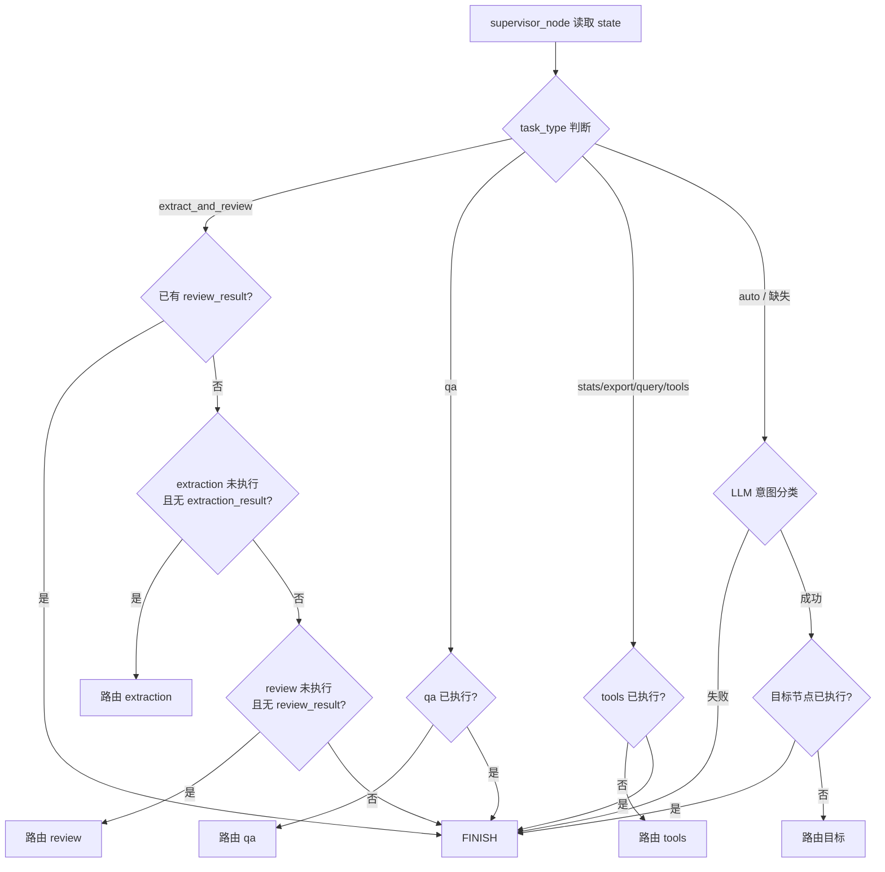
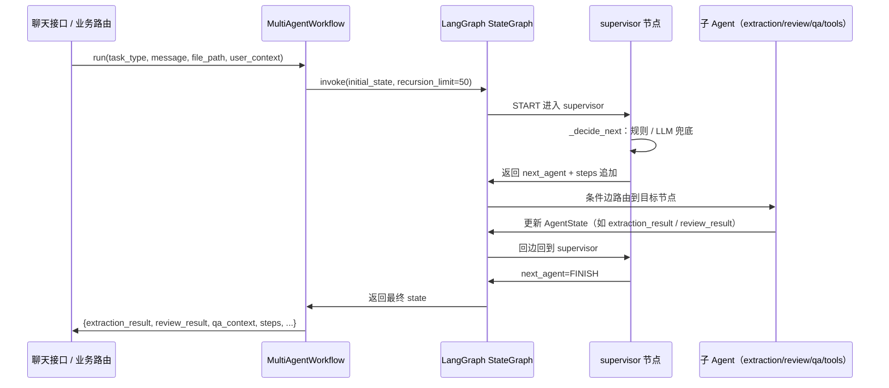

# Agent 状态与服务入口

> 页面说明：本页聚焦多智能体协作的**数据载体**与**服务入口**——`AgentState` 对话状态结构、`AgentService` 单 Agent 入口、`MultiAgentWorkflow` 多智能体入口，以及 Supervisor 如何依据 `task_type`、消息内容与已执行步骤，将用户请求路由到合适的子 Agent（extraction / review / qa / tools）。

## 1. 职责概览

本模块位于 AI 助手链路的前端，承担三件事：

1. **定义共享状态契约**：`AgentState` 是 LangGraph `StateGraph` 在多个 Agent 节点之间传递信息的唯一载体，由框架负责合并（`backend/agent/state.py`）。
2. **提供对外服务入口**：`AgentService` 封装单 Agent Function Calling 能力；`MultiAgentWorkflow` 装配并执行多智能体图，二者均可被聊天接口直接调用（`backend/agent/service.py`、`backend/agent/graph/workflow.py`）。
3. **上下文路由决策**：Supervisor 节点根据任务类型、消息内容与执行轨迹决定下一个 Agent，支持规则优先 + LLM 兜底（`backend/agent/graph/supervisor.py`）。审核决策的聚合规则收敛在 `decision.py`，作为 `review_result.decision` 的单一数据源。

## 2. 对话状态结构：AgentState

`AgentState` 使用 `TypedDict(total=False)` 声明，所有字段可选，由各 Agent 按需读写：

| 字段 | 类型 / Reducer | 写入方 | 语义 |
|---|---|---|---|
| `messages` | `Annotated[List[Any], add_messages]` | 入口、各节点 | 会话消息，Reducer 保证追加而非覆盖 |
| `task_type` | `str` | `run()` 入口 | `extract_and_review` / `qa` / `stats` / `export` / `query` / `tools` / `auto` |
| `file_path` | `str` | `run()` 入口 | 抽取任务的文件路径 |
| `user_context` | `Dict[str, Any]` | `run()` 入口 | 用户角色、id、姓名，供工具鉴权 |
| `extraction_result` | `ExtractionResult` | 抽取 Agent | `doc_type` / `data` / `confidence` / `ocr_text` |
| `review_result` | `ReviewResult` | 审核 Agent | `decision` / `issues` / `suggestion` |
| `qa_context` | `QAContext` | QA 节点 | `sources` / `answer` |
| `next_agent` | `str` | Supervisor | 条件边读取的路由目标 |
| `steps` | `List[Dict]` | Supervisor、各节点 | 逐步决策记录，供前端展示思考过程 |
| `done` | `bool` | — | 契约预留字段，当前以 `next_agent=FINISH` 隐式表达结束 |

关键设计点：

- **消息流与业务数据采用不同合并语义**：`messages` 使用 `Annotated + add_messages` 追加；而抽取结果、审核结果等业务字段使用默认覆盖语义，避免旧结果残留。
- **惰性导入降级**：`langgraph.graph.message.add_messages` 在 `try/except ImportError` 中导入，未安装 langgraph 时退化为列表拼接占位符，并设置 `_LANGGRAPH_AVAILABLE = False`，使模块在纯配置校验/类型检查场景仍可导入。

子结果类型同样为 `TypedDict(total=False)`：

- `ExtractionResult`：`doc_type`（`award/patent/software/innovation/other`）、结构化 `data`、置信度 `confidence`（0~1）、`ocr_text`（供审核 Agent 复用，避免二次识别）。
- `ReviewResult`：`decision`（`pass/reject/need_manual`）、`issues` 异常项清单、`suggestion` 修改建议。
- `QAContext`：RAG 检索到的 `sources` 与生成的 `answer`。

## 3. 服务入口

### 3.1 单 Agent 服务：AgentService

`AgentService` 面向单 Agent 对话场景（Function Calling），职责链为：**配置 → LLM → 工具 → Agent 组装 → 对话执行**。

- **构造**：`from_config(config_loader, llm_provider=None)` 读取 `agent` 配置段，`default_llm_provider` 缺省为 `deepseek`，`max_iterations` 缺省 `10`；通过 `build_chat_model` 构造 LLM，`ToolContext` 承载工具所需配置。
- **工具收集**：`_collect_all_tools` 汇总 11 个工具——查询类 5 个（奖状查询、竞赛匹配/获取、白名单检查/列表）、统计类 4 个（竞赛列表、贡献度排名、趋势、热力图）、抽取类 1 个、导出类 1 个。
- **Agent 组装**：使用 langchain 1.x 统一 API `create_agent`（基于 langgraph 自带消息状态与工具调用循环），系统提示词 `AGENT_SYSTEM_PROMPT` 定义助手角色与工作原则。
- **对话执行**：`chat(query, user_context=None, chat_history=None)` 将历史消息追加 `HumanMessage` 后 `invoke`，`recursion_limit = max_iterations * 4 + 2`；异常时不阻断，返回可读错误 `Agent 执行失败: ...`。
- **结果解析**：`_extract_final_answer` 从消息轨迹末尾取无 `tool_calls` 的 `AIMessage` 作为最终回答；`_extract_tool_steps` 将 `AIMessage.tool_calls` 与 `ToolMessage` 配对，输出 `{tool, input, output}` 轨迹（输出截断 500 字符）。

### 3.2 多智能体工作流入口：MultiAgentWorkflow

`MultiAgentWorkflow` 是"上传奖状 → 抽取 → 审核"这类多步任务的统一入口：

- **装配**：`from_config` 构造 supervisor / extraction / review / qa / tools 五个节点并编译 `StateGraph(AgentState)`。值得注意：只传 `ToolContext` 而非已构造的抽取框架，避免工作流构造时初始化 OCR 引擎（惰性初始化）。
- **执行**：`run()` 组装 `initial_state`（`task_type`、`file_path`、`user_context`、`steps`，可带 `messages`），以 `recursion_limit=50` 作为安全上限（防止路由异常死循环）；`thread_id` 可选，配合 checkpoint 实现多轮记忆。
- **流式执行**：`run_stream()` 以 `stream_mode="updates"` 逐节点 yield `{"node": "supervisor"}` 之类的进度事件，最终再补一次 `invoke` 取全量结果（诚实标注双跑成本，生产可改 `values` 模式）。
- **进程级单例**：`get_default()` 使用双检锁缓存默认参数实例，避免每次请求重建编译图（约 300ms+ 成本）；管理端配置热更新后调用 `reset_default()` 失效重建。

### 3.3 两种入口的定位

| 入口 | 形态 | 适用场景 |
|---|---|---|
| `AgentService.chat` | 单 Agent + 工具循环 | 查询、统计、导出、抽取等单轮数据操作 |
| `MultiAgentWorkflow.run/run_stream` | Supervisor 多智能体图 | 抽取+审核串联、自动意图路由、多步任务 |

二者共享同一套 `ToolContext` 与工具集；多智能体的 `tools` 节点内部即"单 Agent 工具"形态，承接 `stats/export/query` 类请求。

## 4. 上下文决策：Supervisor 路由

Supervisor 是多智能体的"指挥中心"，`make_supervisor_node` 返回两个函数：

- `supervisor_node(state)`：调用 `_decide_next` 计算目标，写入 `next_agent`，并把 `{"agent": "supervisor", "decision": next_agent}` 追加到 `steps`。
- `route_function(state)`：供 `StateGraph.add_conditional_edges` 读取 `state.next_agent`，缺省 `FINISH`。

路由目标常量：`extraction` / `review` / `qa` / `tools` / `FINISH`。

`_decide_next` 采用**规则优先 + LLM 兜底**的混合策略：

1. 从 `steps` 提取已执行节点集合 `executed`（排除 supervisor），防止重复路由。
2. `extract_and_review` 且已有 `review_result` → `FINISH`（审核流程完成）。
3. `task_type == "extract_and_review"`：未抽取且无 `extraction_result` → `extraction`；未审核且无 `review_result` → `review`；否则 `FINISH`。
4. `qa` / `stats` / `export` / `query` / `tools`：对应节点已执行则 `FINISH`（单轮语义），否则路由到对应节点。
5. `auto` / 缺失且 LLM 可用：`_llm_route` 从消息中取最近一条 `user/human` 消息，让 LLM 分类为 `extraction / qa / tools / FINISH`；目标已执行则结束；LLM 调用失败兜底 `FINISH`。
6. 最终兜底 `FINISH`。

关键节点说明：`FINISH` 既是兜底也是正常终止路径，保证任意输入下状态图必然收敛；`executed` 集合与单轮语义共同防止 supervisor 在循环边中无限路由；`auto` 模式仅在有 LLM 且意图可归类时才走智能路由，规则路由始终优先，确保可预期。

## 5. 审核决策聚合

`decision.py` 是审核决策规则的**单一数据源**（P2-5：消除 `review_api` / `review_agent` 双实现）。`aggregate_decision(issues)`：

- 只统计 `severity` 为 `high / medium / low` 的真实问题；`info` 仅作知识附加提示，不拦截。
- `high` 数量 ≥ 2 → `reject`；
- 存在任一真实问题 → `need_manual`；
- 否则 → `pass`。

该结果写入 `review_result.decision`，是 Supervisor 判定 `extract_and_review` 流程结束的事实依据。

## 6. 调用链全景

以"用户上传奖状 + 提问"为例，完整调用链如下：

关键节点说明：`run()` 只负责播种初始状态与限制递归上限；真正的路由循环由 `supervisor` 条件边 + 四个子节点的回边构成；最终 state 同时携带业务结果（`extraction_result` 等）与过程轨迹（`steps`），供上层决定入库、退回或展示。

## 7. 边界条件

- **langgraph 未安装**：`state.py` 仍可导入，`add_messages` 退化为列表拼接，仅支持配置校验/类型检查。
- **LLM 路由失败**：Supervisor 捕获异常并警告，兜底 `FINISH`。
- **工具调用异常**：`AgentService.chat` 捕获后返回可读错误文本，不阻断会话。
- **重复执行与死循环**：`executed` 集合 + 单轮语义防止重复路由；`run`/`run_stream` 的 `recursion_limit=50` 为硬性安全上限。
- **流式中断**：进度事件流异常时降级，最终结果通过额外 `invoke` 兜底取得。
- **Checkpoint 缺失**：`enable_checkpoint=True` 但未安装 `langgraph-checkpoint` 时跳过并告警。
- **审核决策**：`info` 级 issue 不参与拦截；无 `vectorstore` 时审核 Agent 跳过知识库交叉校验。
- **抽取任务**：每次请求重建工作流代价高，`get_default` 单例仅缓存默认参数路径；自定义 `vectorstore/llm_provider/checkpoint` 走 `from_config` 新建。

## 8. 扩展点

- **新子 Agent**：在 `MultiAgentWorkflow.from_config` 中 `add_node` + 注册条件边 + 添加回边，并在 `AgentState` 增加可选输出字段。
- **新任务类型**：在 `supervisor._decide_next` 增加分支与路由常量。
- **新工具**：在 `_collect_all_tools` 注册即可，`ToolContext` 统一承载配置，Supervisor 的 `tools` 节点自动获得能力。
- **意图分类扩展**：`_llm_route` 的类别提示词可扩展更多路由目标。
- **审核规则调整**：只改 `decision.py`，所有消费方（API/Agent）自动生效。
- **断点续跑**：开启 `enable_checkpoint` 并以 `thread_id` 关联会话，支持长任务恢复。
- **状态扩展**：`AgentState` 为 `total=False` 的 TypedDict，新增字段对既有节点无破坏性。

Sources:
- [backend/agent/state.py](backend/agent/state.py#L1-L98)
- [backend/agent/service.py](backend/agent/service.py#L1-L266)
- [backend/agent/graph/supervisor.py](backend/agent/graph/supervisor.py#L1-L159)
- [backend/agent/decision.py](backend/agent/decision.py#L1-L19)
- [backend/agent/graph/workflow.py](backend/agent/graph/workflow.py#L1-L280)