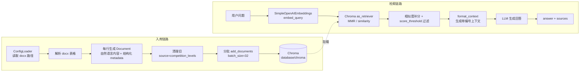

# RAG 知识库

## 模块职责

`backend/rag/` 是 QA Agent 的知识来源层，围绕“竞赛等级分类表”构建本地向量知识库，提供文档解析、切分、向量化、持久化、检索与上下文格式化能力。共 4 个核心模块：

| 文件 | 职责 |
|---|---|
| `embeddings.py` | 将 `config/settings.json` 中的 `rag.embedding` 配置解析为 LangChain Embeddings 实例；自实现 `SimpleOpenAIEmbeddings`，保证 query/document 编码完全对称，并内置超时与重试。 |
| `vectorstore.py` | 基于 `langchain_chroma.Chroma` 构建/加载持久化向量库，持久化目录默认 `database/chroma/`，集合默认 `competition_rules`。 |
| `indexer.py` | 解析竞赛等级分类表 docx，按表格行切分为知识条目，转为 Document 后分批写入 Chroma。 |
| `retriever.py` | 封装相似度/MMR 检索、`score_threshold` 过滤、元数据过滤和上下文格式化，供 QA Agent 使用。 |

主要消费者是 `backend/agent/qa_agent.py`：它调用 `retrieve()` + `format_context()` 构造 RAG 上下文，再交给 LLM 生成回答。

---

## 配置与关键状态

RAG 配置统一从 `ConfigLoader` 加载，核心节点如下：

- `rag.default_embedding_provider`：默认 embedding provider 名。
- `rag.embedding.<provider>`：`base_url` / `api_key_env` / `model` / `dimensions`。
- `rag.vectorstore.persist_path`：Chroma 持久化路径，默认 `database/chroma`，相对项目根解析。
- `rag.vectorstore.default_collection` / `collections`：默认集合名与可用集合列表。
- `rag.retrieval.top_k` / `score_threshold` / `search_type` / `mmr_lambda`：检索参数。
- `rag.knowledge_sources.competition_levels_doc`：竞赛等级分类表 docx 的相对路径。

向量库集合状态存在三种情况：

1. **首次写入时创建**：`build_vectorstore()` 返回 Chroma 实例，若 collection 不存在则首次 `add_documents` 时自动创建。
2. **已有数据直接加载**：持久化目录存在时，加载已有 collection。
3. **构建失败降级**：`build_default_vectorstore()` 在任何异常下返回 `None`，调用方跳过 RAG，绝不抛异常阻断流程。

---

## 核心链路

关键节点说明：

- **入库时按行切分**：竞赛等级分类表是“序号 / 竞赛名称 / 级别 / 类别 / 备注”结构，每个竞赛天然是独立知识条目，因此不使用递归字符切分，避免把多条竞赛信息切碎。
- **清理旧数据**：入库前按 `source=competition_levels` 过滤删除旧文档，避免重复入库；清除失败不阻断写入，兼容空库场景。
- **分批写入**：embedding API 通常限制单次请求条数，`indexer` 按 32 条/批写入，小于 Provider 上限 64，留出余量。
- **检索采用 MMR**：相近竞赛名称（如多个“挑战杯”赛事）会导致纯相似度检索重复召回，MMR 在相关性与多样性之间平衡，`fetch_k = max(top_k * 2, 8)`，`lambda_mult` 取配置值。
- **score_threshold 硬过滤**：`retrieve_with_scores()` 对 MMR 命中结果补一次底层 `similarity_search_with_score` 取分，低于阈值的直接丢弃，无关查询返回空列表，避免强关联错误上下文。
- **QA 消费**：`qa_agent.answer_question()` 将检索结果格式化为 `【知识库】` 上下文，system prompt 要求未命中时明说“知识库中未找到”，不编造。

---

## 主要文件与调用关系

### 1. embeddings.py

- `resolve_embedding_config()`：解析 provider 配置，自动剥离 `/embeddings` 后缀得到 OpenAI 兼容 base_url，并校验 `api_key_env` 环境变量。
- `SimpleOpenAIEmbeddings`：
  - 实现 LangChain 协议 `embed_query` / `embed_documents`。
  - 不使用 `langchain_openai.OpenAIEmbeddings`，避免其对 query/document 添加不对称前缀导致 bge-m3 等模型检索质量下降。
  - 底层 `OpenAI(api_key, base_url, timeout=30)` 惰性初始化。
  - 对网络超时/连接错误/HTTPError 指数退避重试 3 次，4xx 参数错误直接抛出。
  - `embed_documents` 按 64 条/批调用，批量编码顺序按 `index` 排序保证稳定。

### 2. vectorstore.py

- `resolve_vectorstore_config()`：将相对 `persist_path` 转为项目根下绝对路径，并自动 `mkdir`。
- `build_vectorstore()`：返回 `langchain_chroma.Chroma`，支持指定集合名。
- `build_default_vectorstore()`：按默认配置惰性构建 embedding + Chroma，失败返回 `None`，供 Agent 节点兜底。

### 3. indexer.py

- `_parse_competition_docx()`：读取 docx 第一个表格，跳过含“序号/竞赛名称/等级”的表头行，过滤少于 4 列的无效行。
- `_entries_to_documents()`：生成 `page_content` 自然语言描述，例如“竞赛名称：挑战杯。级别：国家级。类别：A类赛事。”`metadata` 保留 `name/level/category/remark/seq/source`，便于精确过滤。
- `index_competition_levels()`：完整入库入口，支持从配置读取 docx 路径、清空旧数据、分批写入。
- `get_collection_stats()`：返回当前 collection 文档总量与 ID 样例，用于运维/调试。

### 4. retriever.py

- `resolve_retrieval_config()`：读取检索参数，默认 `top_k=4`、`score_threshold=0.5`、`search_type=mmr`、`mmr_lambda=0.5`。
- `build_retriever()`：将 Chroma 转为 LangChain Retriever，支持 `search_kwargs` 覆盖（如 metadata filter）。
- `retrieve()`：便捷返回 Document 列表，低于阈值结果已过滤。
- `retrieve_with_scores()`：返回 `[(Document, score)]`，供 review Agent 交叉校验统一使用（P2-6/P2-23）。
- `format_context()`：把检索结果格式化为带编号文本，方便 LLM 引用和来源标注。

---

## 边界条件与降级策略

- **配置缺失**：缺少 `rag` 节点、默认 provider、`base_url`、`api_key_env`、`model` 时抛出 `ValueError`，引导检查 `config/settings.json`。
- **依赖缺失**：`langchain_chroma` 未安装时 `build_vectorstore()` 抛 `ImportError`；`openai` 未安装时 `build_embeddings()` 抛 `ImportError`。
- **docx 不存在或解析为空**：抛出 `FileNotFoundError` 或记录 warning 后跳过入库，不创建空 collection 数据。
- **清除旧数据失败**：仅记录 debug 日志，不阻断本次入库。
- **网络故障**：embedding 调用 30 秒超时，对网络类异常重试 3 次；持久失败直接抛出，由上层降级。
- **无相关检索结果**：低于 `score_threshold` 的文档全部丢弃，`format_context()` 返回“（未检索到相关知识）”，QA Agent 会明确告知用户。
- **默认向量库构建失败**：`build_default_vectorstore()` 返回 `None`，Agent 节点可跳过 RAG，不影响主流程。

---

## 扩展点

- **新增 embedding provider**：在 `rag.embedding` 中增加 provider 配置，通过 `rag.default_embedding_provider` 切换，代码无需改动。
- **新增向量集合**：在 `rag.vectorstore.collections` 中声明集合，`build_vectorstore(config_loader, embeddings, collection_name)` 可指定集合名。
- **新增知识来源**：`indexer.py` 目前聚焦竞赛等级分类表，可在 `rag.knowledge_sources` 下扩展其他文档路径，参照 `_entries_to_documents` 实现新的解析/切分逻辑。
- **检索策略调整**：`rag.retrieval.search_type` 支持 `mmr` / `similarity`，`top_k`、`score_threshold`、`mmr_lambda` 均可配置化，无需改代码。
- **元数据过滤**：`retrieve()` / `retrieve_with_scores()` 支持 `filter` 参数（如 `{"category": "A"}` 或 `{"level": "国家级"}`），可按业务需要精确限定检索范围。
- **QA Prompt 定制**：`qa_agent.QA_SYSTEM_PROMPT` 是独立模板，可调整角色定义、回答规范和来源标注方式，不影响 RAG 底层。

---

Sources: [backend/rag/__init__.py](backend/rag/__init__.py#L1-L12) [backend/rag/embeddings.py](backend/rag/embeddings.py#L1-L213) [backend/rag/vectorstore.py](backend/rag/vectorstore.py#L1-L124) [backend/rag/indexer.py](backend/rag/indexer.py#L1-L201) [backend/rag/retriever.py](backend/rag/retriever.py#L1-L152) [backend/agent/qa_agent.py](backend/agent/qa_agent.py#L1-L142)