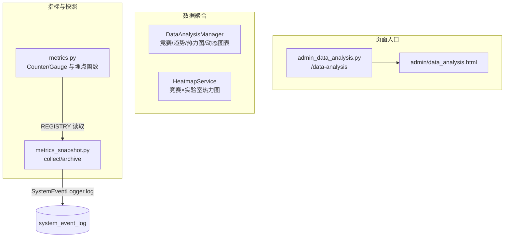

# 数据分析与指标

本页覆盖看板与 Agent stats 工具所需的数据分析能力，分为三块：

- **数据聚合**：`DataAnalysisManager` 提供竞赛列表、时间分布、贡献度、趋势、热力图和动态图表；`HeatmapService` 提供竞赛×实验室热力图矩阵。
- **指标埋点**：`metrics.py` 定义 Prometheus 业务黄金指标，并通过 `/metrics` 暴露。
- **指标快照**：`metrics_snapshot.py` 周期采集 Prometheus 当前值并归档到 `system_event_log`，作为后续趋势图表的数据源。

## 模块职责

### DataAnalysisManager

文件：`backend/managers/data_analysis_manager.py`

通过 `sqlite3` 直连数据库，围绕 `competitions`、`awards`、`laboratories`、`award_supervisors`、`teachers` 等表做聚合统计。构造参数 `db_path` 为数据库路径，`laboratory_id` 用于限定数据范围。

| 方法 | 职责 |
|---|---|
| `get_competitions_with_awards` | 查询有奖状的竞赛列表，`INNER JOIN awards` 并 `COUNT(a.id)` 得到 `award_count`；通过 `parse_competition_time` 解析 `competition_time` 为 `start_month`、`end_month`、`is_cross_year`。保留 `watcher_type`/`watcher_id` 参数以兼容旧接口。 |
| `get_competition_award_timeline` | 按 `awards.date`（格式 `YYYY-MM`）统计某竞赛的月度分布，返回 `months`、`peak_month` 和 `year_range`。 |
| `get_competition_contribution` | 按竞赛分组统计奖状数量，支持 `years` 列表或 `year_range` 范围筛选、`white_list_only` 只看白名单、`include_teacher_certificates` 控制是否包含教师证书。默认只统计学生奖状。 |
| `get_competition_trend` | 按 `year` 分组统计某竞赛历年获奖数量，返回 `years` 与 `counts` 两个平行数组。 |
| `get_competition_heatmap` | 从 `awards.date` 解析出年份和月份，构建“年份 × 12 个月”的计数矩阵。 |
| `get_dynamic_chart_data` | 动态图表聚合：`x_axis` 支持 `year`/`laboratory`/`teacher`，`color_by` 支持 `laboratory`/`year`/`competition_level`；动态拼接 SQL，支持实验室过滤、年份范围和额外实验室筛选。 |

### HeatmapService

文件：`backend/services/heatmap_service.py`

提供竞赛×实验室热力图，管理员视图（`laboratory_id=None`）与实验室视图（指定 `laboratory_id`）复用同一服务。

- `HeatmapFilters`：封装 `years`、`white_list_only`、`include_teacher_certificates` 三个筛选条件。
- `HeatmapData`：返回 `competitions`（Y 轴）、`laboratories`（X 轴）和 `data` 矩阵。
- `get_lab_competition_heatmap`：先查询实验室列表，再 `INNER JOIN awards/laboratories` 按 `competition_id, laboratory_id` 分组计数，最后组装为完整矩阵。
- `get_heatmap_service`：全局实例缓存 `_heatmap_services`，`None` 映射为 `-1`，保证管理员视图复用同一实例。

### metrics.py

文件：`backend/utils/metrics.py`

定义业务黄金指标，使用 `prometheus_client` 的 `Counter` 和 `Gauge`：

- `upload_total{result}`：上传成功/失败计数。
- `review_action_total{action}`：审核动作计数（approve/reject/withdraw/discard）。
- `llm_call_total{provider,outcome}`：LLM 调用成功/失败/熔断拒绝。
- `breaker_state{name}`：熔断器状态 gauge（0=closed，1=half_open，2=open）。
- `review_cycle_hours{kind}`：提交→入库时长（最近一次）。
- `audit_write_total{result}`：留痕写入成功/失败。

配套埋点函数 `inc_upload`、`inc_review`、`inc_llm`、`set_breaker`、`set_review_cycle`、`inc_audit`。当 `prometheus_client` 未安装时，`_AVAILABLE=False`，所有函数降级为 `_noop`，不影响业务主链路。`exporter_response()` 生成 `/metrics` 响应体。

### metrics_snapshot.py

文件：`backend/services/metrics_snapshot.py`

- `collect()`：遍历 `prometheus_client.REGISTRY.collect()` 的 `metric.samples`，读取全部指标当前值；带 labels 的指标以 `name{k=v,...}` 作为 key。兼容 prometheus_client 0.26+ 的 `Metric` 包装对象，避免业务 Counter 被过滤。
- `archive()`：调用 `collect()` 后，通过 `SystemEventLogger.log("system", "info", "metrics_snapshot", ...)` 将快照写入 `system_event_log` 表，`detail` 为 `{"type": "metrics_snapshot", "values": {...}}`。无快照时返回 `False`，不写库。

### admin_data_analysis.py

文件：`app/routes/admin_data_analysis.py`

管理后台页面入口，`GET /data-analysis` 受 `require_role('admin')` 保护，渲染 `admin/data_analysis.html`。该路由本身只负责页面入口，不直接承载聚合逻辑。

## 调用链

图后说明：

- **D1/D2 是并列的数据查询服务**，直接通过 `sqlite3` 聚合，返回给看板接口或 Agent stats 工具使用；页面路由与数据服务的具体接口衔接由外部 API 层完成，不在本页证据范围内。
- **M1 → M2 → DB 是完整的指标归档链路**：业务代码在 `metrics.py` 中埋点更新 Counter/Gauge，`metrics_snapshot.collect()` 从 REGISTRY 读取当前值，`archive()` 将 JSON 快照写入 `system_event_log`。

## 关键状态

- `DataAnalysisManager.laboratory_id` / `HeatmapService.laboratory_id`：`None` 表示管理员全量视图，有值表示限定某个实验室。
- `_heatmap_services`：全局单例缓存，key 为 `laboratory_id`，`None` 归一化为 `-1`。
- `metrics.py._AVAILABLE`：prometheus_client 是否可用；不可用时所有埋点函数变为 `_noop`。
- `system_event_log` 中的 `metrics_snapshot` 记录：`category='system'`、`level='info'`，`detail.values` 为指标快照 JSON。

## 边界条件

- **旧数据学生/教师证书区分**：当 `granted_role` 为空时，通过 `award_teacher_winners` 子查询排除“只有教师获奖者”的记录，避免教师证书污染学生统计。该逻辑在 `DataAnalysisManager.get_competition_contribution` 和 `HeatmapService.get_lab_competition_heatmap` 中重复出现。
- **日期格式容错**：热力图解析 `awards.date` 时，非 `YYYY-MM` 格式会记录 warning 并跳过；竞赛时间由 `parse_competition_time` 负责解析。
- **年份筛选优先级**：`get_competition_contribution` 优先使用 `years` 列表精确多选，其次才使用 `year_range` 范围。
- **指标降级**：`prometheus_client` 未安装时，`/metrics` 返回纯文本提示，业务埋点静默失败。
- **快照为空**：`archive()` 在 `collect()` 返回空 dict 时返回 `False`，不产生归档记录。

## 扩展点

- **新增聚合维度**：`get_dynamic_chart_data` 的 `x_axis`/`color_by` 枚举是明确的扩展点，增加新字段时需同步补充 `select_fields` 和 `group_by`。
- **热力图筛选条件**：可在 `HeatmapFilters` 中加入竞赛等级、年份区间等字段，并在 `get_lab_competition_heatmap` 的 SQL 中追加条件。
- **新增黄金指标**：在 `metrics.py` 中声明新的 `Counter`/`Gauge` 并提供伴随埋点函数即可；`metrics_snapshot.collect()` 遍历整个 REGISTRY，新指标会自动进入快照，无需修改归档逻辑。

Sources: [backend/managers/data_analysis_manager.py](backend/managers/data_analysis_manager.py#L1-L483), [backend/utils/metrics.py](backend/utils/metrics.py#L1-L80), [backend/services/heatmap_service.py](backend/services/heatmap_service.py#L1-L172), [backend/services/metrics_snapshot.py](backend/services/metrics_snapshot.py#L1-L47), [app/routes/admin_data_analysis.py](app/routes/admin_data_analysis.py#L1-L15)