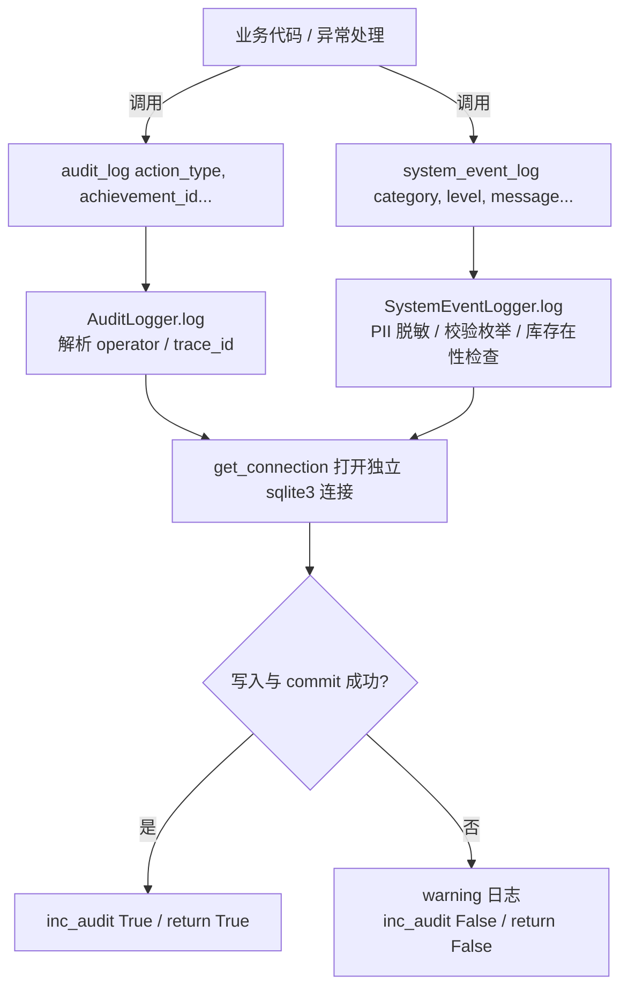
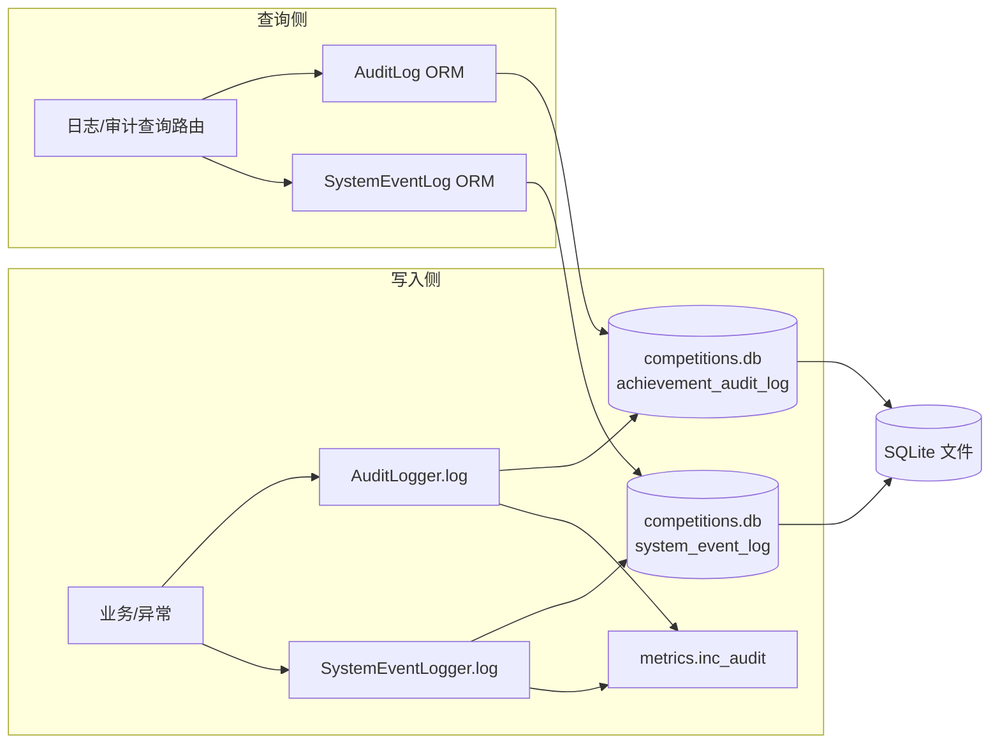

## 审计日志与系统事件

### 运行机制

本页面涉及两条独立但同构的“落库通道”：**操作审计**（`achievement_audit_log`）与**系统事件**（`system_event_log`）。两者共同遵循一个核心契约（来源见 `audit_logger.py` 头部注释）：

- **append-only**：只 INSERT，永不 UPDATE/DELETE；
- **不阻塞主业务**：各自使用独立 SQLite 连接、独立事务，任何失败都只记 warning 并返回 `False`，绝不向调用方抛异常；
- **trace_id 贯通**：由请求链路注入的 `trace_id` 随调用方显式传入，落库后成为跨模块排障的关联键；
- **操作人解析**：显式 `operator` → Flask session → AI 常量，优先级递减。

写入路径可概括为：

图中关键节点：

- `AuditLogger.log` 不检查表是否存在，假定表已由迁移建立；`SystemEventLogger.log` 会调用 `_ensure_table` 兜底建表，这是两处写入逻辑的主要差异。
- 两处 `log` 都各自负责 `get_connection` 和 `conn.close()`，不使用 Flask 的请求级连接，避免与主业务事务耦合。
- 调用方不感知写入失败，`log` 方法的返回值仅作诊断/计数使用。

#### trace_id 如何贯穿

`trace_id` 不是由 `logger` 自动生成，而是由调用方传入。在 Flask 请求上下文中，`create_app` 统一注入 `trace_id`（见“应用工厂与启动装配”页面），业务层在调用 `audit_log` 或 `system_event_log` 时从当前上下文取出并作为参数传入。异常落库时（`SystemEventLogger.from_exception`）也会接收外部传入的 `trace_id`，从而把异常与同一请求链路上的审计记录关联起来。

#### 查询与展示侧

查询侧不依赖这两个 logger，而是通过 ORM 模型 `AuditLog`、`SystemEventLog` 对两张表做只读查询。“操作日志与审计视图”“日志查询与分析”等路由对这两个模型做条件筛选（如按操作者、时间、`trace_id`）。由于日志是 append-only，查询需要配合分页/时间范围，避免全表扫描。

### 文件职责与协作

| 文件 | 职责 |
|---|---|
| `backend/utils/audit_logger.py` | 操作审计写入器。定义 `AuditLogger`、`audit_log` 便捷函数、`ACTION_LABELS` 枚举标签、操作人解析与显示名解析。 |
| `backend/utils/system_event_logger.py` | 系统事件写入器。定义 `SystemEventLogger`、事件类别/级别枚举、PII 掩码规则、异常落库便捷方法 `from_exception`。 |
| `backend/orm/audit_log.py` | `achievement_audit_log` 的 SQLAlchemy 映射模型，供查询、报表和路由侧使用。 |
| `backend/orm/system_event_log.py` | `system_event_log` 的 SQLAlchemy 映射模型，`operator_id` 带外键关联 `users.id`。 |
| `backend/utils/db_connection.py` | 提供 `get_connection`（sqlite3 连接），两个 logger 均依赖它打开独立连接。 |
| `backend/utils/metrics.py` | 提供 `inc_audit(True/False)`，统计留痕写入成功/失败数。 |
| `config/loader.py` | 提供 `ConfigLoader().get_path('database', 'competitions_db')`，两个 logger 共享同一 DB 路径。 |

协作关系：

- 写入端：业务代码 → `AuditLogger` / `SystemEventLogger` → `get_connection` → 目标表。
- 查询端：路由/服务 → ORM 模型 → SQLAlchemy 会话（基于 `backend/orm/base.py`）。
- 表结构来源：`system_event_log` 的兜底建表是 `SystemEventLogger._ensure_table`，但正规迁移由 Alembic 0006 建立；`achievement_audit_log` 则由迁移建立，`AuditLogger` 不负责建表。
- 两 logger 共享 `ConfigLoader` 的 DB 路径，因此始终写在同一个数据库中。

### 关键状态与契约

#### 操作审计的核心状态

- `action_type`（SRS 附录 D.3）：1=提交、2=AI审核、3=AI通过、4=AI驳回、5=教师复核、6=审核通过、7=驳回打回、8=入库、9=修改字段、10=删除/放弃、11=撤回、12=成果删除。`ACTION_LABELS` 是这些标签的唯一真源。
- `operator_role`：1=学生、2=教师、3=AI、4=管理员。
- `action_result`：默认 1，表示操作成功；0/其他值可由调用方传递，但语义未在片段中严格定义，需结合调用处理解。
- `operator_id`：AI 时为 `NULL`；人类操作人存 `users.id`。
- `change_detail`：JSON 字符串，由 `change_detail` 参数经 `json.dumps` 序列化得到，用于记录字段级变更。

#### 系统事件的核心状态

- `event_category`：`ocr`、`llm`、`breaker`、`auth`、`upload`、`db`、`security`、`system`，由 `EVENT_CATEGORIES` 约束；
- `event_level`：`debug`、`info`、`warning`、`error`、`critical`，由 `EVENT_LEVELS` 约束；
- 非法 category/level 在写入前被拒绝，返回 `False`，不触碰数据库；
- 所有 `message` 与 `detail` 在写入前经过 `_sanitize` 脱敏：18/15 位身份证、手机号、9 位学号会被掩码，保留首尾片段。

#### 失败吞掉原则

两个 logger 都将整段写入逻辑包在 `try/except Exception` 中，`except` 只做 `logger.warning` 和指标计数。因此，即使数据库表缺失、连接失败、磁盘满，也不影响主业务。副作用是：调用方无法通过异常感知审计失败，只能依赖返回值或日志。

### 边界条件

- **表不存在**：`AuditLogger.log` 不建表，如果表缺失会失败并吞掉；`SystemEventLogger.log` 先调用 `_ensure_table`，但该 `CREATE TABLE IF NOT EXISTS` 仍可能因迁移版本不匹配而失败，同样被吞掉。
- **库文件不存在**：`SystemEventLogger.log` 会通过 `Path.exists()` 预检，直接返回 `False`，不创建空白库文件。这是为了避免 CI 或新环境因启动事件意外生成空 `competitions.db`。
- **operator 缺失**：`AuditLogger.log` 在无法解析到操作人时直接跳过留痕（`return False`），不写入记录；`SystemEventLogger.log` 则允许 `operator` 为空，`operator_id`/`operator_code` 存 `NULL`。
- **历史数据兼容**：`AuditLogger.resolve_display_names` 处理 `operator_name`/`operator_code` 的历史形态差异——M1 后存过 `users.id`，更早存过业务号。查询侧做展示解析时必须兼容两种格式。
- **PII 脱敏只覆盖已知模式**：`_PII_RULES` 只处理身份证、手机号、9 位学号。新的 PII 格式不会自动脱敏，需扩展规则。
- **时间格式**：`AuditLogger` 使用 `datetime.now().strftime("%Y-%m-%d %H:%M:%S")` 存**应用本地时间**，不使用 SQLite 的 `CURRENT_TIMESTAMP`（UTC）。`SystemEventLog` 的 `created_at` 默认值来自 `func.now()` / `CURRENT_TIMESTAMP`，两表时间基准不一致，查询联表时需注意。

### 扩展点

1. **新增操作类型**：在 `ACTION_LABELS` 中增加映射，同时更新 `AuditLog` ORM 注释与迁移约束（如果表有 CHECK）。查询视图的筛选下拉也会展示该字典，做到“单一真源”。
2. **新增系统事件类别**：需要同步修改 `EVENT_CATEGORIES`、`SystemEventLog` ORM 的注释、`system_event_log` 表的 CHECK 约束（通过新的 Alembic 迁移）。`_ensure_table` 的兜底建表也应同步，否则老库升级后新类别写入会被数据库拒绝并使 `log` 返回 `False`。
3. **新增 PII 规则**：在 `_PII_RULES` 元组中追加 `(regex, repl_func)` 即可，脱敏会在序列化前统一执行。
4. **异常落库**：`SystemEventLogger.from_exception` 是现成的异常转事件入口，会自动填充 `source_file`、`source_line` 和堆栈摘要。需要接入额外异常类型时，应优先复用该方法，而不是在每个 `except` 中手动拼参数。
5. **查询侧扩展**：若需要按 `trace_id` 串联审计和事件，可在路由层对两个 ORM 模型分别执行 `filter_by(trace_id=...)`，但要注意两张表的 `created_at` 时间基准不同，排序时建议按各自存储格式排序，混合排序需先统一为应用本地时间。

### 信息不足与限制

- 查询端点的具体实现（如“操作日志与审计视图”路由）不在本页提供的片段内；本页只描述 ORM 模型与写入器，具体筛选逻辑请参见对应的管理后台路由页面。
- `AuditLogger` 所依赖的表结构迁移（`achievement_audit_log` 的建表语句）未给出，实际修改表结构前需找到对应 Alembic 迁移。
- `action_result` 的取值释义未在片段中完整定义，需要结合写入方调用处确认。

Sources: [backend/utils/audit_logger.py](backend/utils/audit_logger.py#L1-L162), [backend/utils/system_event_logger.py](backend/utils/system_event_logger.py#L1-L153), [backend/orm/audit_log.py](backend/orm/audit_log.py#L1-L26), [backend/orm/system_event_log.py](backend/orm/system_event_log.py#L1-L25)