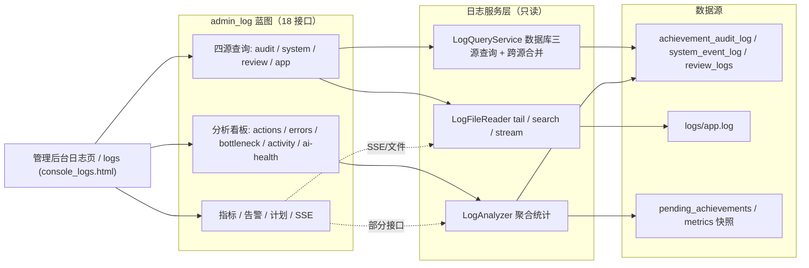

# 日志查询与分析

## 概述

本页面覆盖日志体系的查询与分析侧，由三个只读服务和一组管理接口组成：

- **LogFileReader**：直接读取 `logs/app.log` 文本日志，提供 `tail` / `search` / `stream` 三种方式。
- **LogQueryService**：查询 `achievement_audit_log`、`system_event_log`、`review_logs` 三张数据库日志表，支持分页、过滤、跨源合并和展示加工。
- **LogAnalyzer**：基于日志表和 metrics 快照做聚合统计，产出动作分布、错误趋势、审核瓶颈、活跃用户、AI 健康、留痕健康、每日摘要。
- **admin_log 蓝图**：上述服务的 HTTP 出口，提供 18 个接口，统一管理员鉴权和 `{trace_id, code, message, data}` 响应协议。

三个服务均被注释明确标记为“只读”：LogFileReader 不写文件（`stream` 在文件不存在时 `touch` 空文件的例外见边界条件），LogQueryService 不触碰任何写入路径，LogAnalyzer 只做聚合查询。

## 模块职责

### LogFileReader（日志文件读取）

文件：`backend/services/log_file_reader.py`

核心是 `parse_line` 单行解析器，支持两种格式：

- 新格式（含 trace_id）：`2026-08-20 10:00:00 - INFO [app.routes] [tid:abc123] 消息`
- 旧格式（无 tid）：`2026-08-20 10:00:00 - INFO [app.routes] 消息`

解析结果为 `{ts, level, logger, trace_id, msg}`；`trace_id` 在新格式中取自 `[tid:...]`，旧格式为 `None`；非日志行返回 `None` 并被调用方丢弃。

三个类方法：

| 方法 | 行为 |
|------|------|
| `tail(lines=100)` | 从文件末尾倒读最后 N 行，返回新→旧顺序；文件不存在返回空列表 |
| `search(keyword, level, limit=500, start_time, end_time)` | 顺序扫描全文，按关键词（不区分大小写）/级别/时间范围过滤，返回旧→新顺序，达到 `limit` 停止 |
| `stream(filter_level, filter_keyword)` | 增量监控生成器：`seek(0, 2)` 定位文件末尾，循环 `readline` 产出新增行，无新行时 `sleep(0.5)`；调用方负责 `close` |

日志路径由 `ConfigLoader().project_root / logs / app.log` 确定，并缓存在类变量 `_log_path` 中。

### LogQueryService（多源日志查询）

文件：`backend/services/log_query_service.py`

三个静态查询方法对应三张表：

- **`query_audit_logs`**：查询 `achievement_audit_log`，过滤条件有 `action_type`（整型）、`operator_role`、`achievement_id`、`trace_id`、`start_date/end_date`。默认追加 `COALESCE(is_redundant,0)=0` 排除重复删除留痕。返回前做展示加工：`action_label`（动作中文标签）和 `operator_display`（操作人显示名）。历史数据中 `operator_name` 曾存 `users.id` 纯数字，会批量解析为“学号 姓名”；非数字快照原样保留。
- **`query_system_events`**：查询 `system_event_log`，过滤条件有 `event_category`、`event_level`、`trace_id`、时间范围。由于该表 `created_at` 为 SQLite `CURRENT_TIMESTAMP`（UTC），返回前逐一通过 `_utc_to_local` 转为本地时间。
- **`query_review_logs`**：查询 `review_logs`，过滤条件有 `action_type`（字符串）、`reviewer_id`、`submitter_id`、时间范围。

此外 `query_all` 将 audit 与 system_event 两源分别（每源最多 500 条）取出，附加 `_source` 标记后按 `created_at` 降序合并，再做内存分页。注释明确说明 `review_logs` 字段异构，不并入默认合并视图。

所有方法共用私有 `_paginate`：先 `COUNT(*)` 求总数，再 `ORDER BY id DESC LIMIT ? OFFSET ?` 取当前页，返回 `{items, total, page, per_page}`。

### LogAnalyzer（日志分析器）

文件：`backend/services/log_analyzer.py`

静态方法各自独立查询：

| 方法 | 产出 | 数据源 |
|------|------|--------|
| `action_distribution(start_date, end_date)` | `{action_type: count}` 动作分布 | achievement_audit_log（排除冗余） |
| `error_trend(days=7)` | `[{date, error, warning}]` 错误/警告日趋势 | system_event_log（error/warning） |
| `review_bottleneck()` | `{pending_total, over_48h, avg_wait_hours, max_wait_hours}` 待审核积压 | pending_achievements（`status='submit'`） |
| `user_activity(top_n=10)` | `[{operator_code, operator_name, count}]` 活跃用户 Top N | achievement_audit_log |
| `ai_health()` | `{breakers: {llm, ocr}, llm_success_rate}` AI 服务健康 | CircuitBreaker + metrics 快照 |
| `audit_write_health()` | `{total, failure_rate}` 留痕写入健康 | metrics 快照 |
| `daily_summary(day)` | `{date, audit_actions, system_events, system_errors}` 每日摘要 | audit_log + system_event_log |

设计上有两个明确的时间基准决策：

- `system_event_log.created_at` 是 UTC，`error_trend` 的窗口下限用 `datetime.utcnow() - timedelta(days=days)` 生成，避免本地时间过滤把新记录滤掉（代码注释记录为“L2 教训①变体，实测踩坑”）。
- `daily_summary` 按本地日界 `00:00:00 ~ 23:59:59` 查询，比较的是 ISO 字符串，不涉及时区转换。

`ai_health` 和 `audit_write_health` 依赖 `metrics_snapshot.collect()` 返回的指标快照。`ai_health` 对以 `llm_call_total` 开头的键（排除 `llm_call_created`）按 `outcome=ok` / `outcome=fail` 聚合求成功率；`audit_write_health` 读取 `audit_write_total_total{result=ok/fail}` 键推算失败率。

### admin_log 蓝图（管理接口）

文件：`app/routes/admin_log.py`

蓝图 `admin_log` 提供 18 个接口，文件头注释将其归类为：四源查询（audit/system/review/app）+ 分析看板 5 + 指标/告警/计划 + SSE 实时流。所有接口统一 `@require_role_api_json('admin')` 鉴权，通过 `_ok` 包装为 `{trace_id, code, message, data}`，其中 `trace_id` 取自 `current_app._current_trace_id()`，与全局异常契约对齐。

接口分三组：

1. **查询类**：`/api/logs/audit`、`/api/logs/system`、`/api/logs/review` 委托 LogQueryService；`/api/logs/app` 委托 `LogFileReader.search`；`/api/logs/app/tail` 委托 `LogFileReader.tail`。
2. **分析类**：`/api/logs/analysis/actions`、`errors`、`bottleneck`、`activity`、`ai-health` 分别委托 LogAnalyzer 的五个方法；`ai-health` 同时返回 AI 健康与留痕健康。
3. **其它**：`/api/logs/metrics` 直接返回 `metrics_snapshot.collect()` 快照；`/api/logs/daily-report` 委托 `plan_generator.daily_report()`；`/api/logs/alerts` 提供当前告警；另有 SSE 实时流接口（文件头注明，本次证据中未完全展开）。

`/logs` 路由渲染 `admin/logs/console_logs.html`，是控制台日志页面的入口。

`_int_arg` 帮助函数对 `page/per_page/limit/lines/top_n/days` 等查询参数做安全转换：非法值回落默认值，避免客户端传非数字导致 500。

## 调用链

| 请求 | 鉴权 | 服务方法 | 数据源 |
|------|------|----------|--------|
| `GET /logs` | admin | 渲染 `console_logs.html` | - |
| `GET /api/logs/audit` | admin | `LogQueryService.query_audit_logs` | achievement_audit_log |
| `GET /api/logs/system` | admin | `LogQueryService.query_system_events` | system_event_log |
| `GET /api/logs/review` | admin | `LogQueryService.query_review_logs` | review_logs |
| `GET /api/logs/app` | admin | `LogFileReader.search` | logs/app.log |
| `GET /api/logs/app/tail` | admin | `LogFileReader.tail` | logs/app.log |
| `GET /api/logs/analysis/actions` | admin | `LogAnalyzer.action_distribution` | achievement_audit_log |
| `GET /api/logs/analysis/errors` | admin | `LogAnalyzer.error_trend` | system_event_log |
| `GET /api/logs/analysis/bottleneck` | admin | `LogAnalyzer.review_bottleneck` | pending_achievements |
| `GET /api/logs/analysis/activity` | admin | `LogAnalyzer.user_activity` | achievement_audit_log |
| `GET /api/logs/analysis/ai-health` | admin | `LogAnalyzer.ai_health` + `audit_write_health` | CircuitBreaker / metrics |
| `GET /api/logs/metrics` | admin | `metrics_snapshot.collect` | metrics |
| `GET /api/logs/daily-report` | admin | `plan_generator.daily_report` | 多表 |
| `GET /api/logs/alerts` | admin | `current_alerts`（未完整展开） | - |

## 架构图

**图释**：

- **A 路由组**是最常用的查询入口：audit/system/review 走 `LogQueryService`，app 走 `LogFileReader`；两类数据源天然隔离（数据库 vs 文本文件）。
- **B 路由组**全部委托 `LogAnalyzer`，分析结果由数据库日志表与 metrics 快照联合计算，不新增数据源。
- **C 路由组**是混合出口：`metrics` 直连 `metrics_snapshot.collect()`、`daily-report` 走 `plan_generator`、SSE 实时流接 `LogFileReader.stream`，虚线标注仅部分关联。
- 三层严格单向依赖：蓝图 → 服务 → 数据源；服务层只读，不反向写回。

## 关键状态

- **日志格式双轨**：新格式含 `[tid:...]`，旧格式无 tid；`parse_line` 先尝试新格式正则，失败后回退旧格式，保证升级前后日志均可检索。
- **trace_id 贯穿**：文件日志中 trace_id 由正则提取；数据库日志查询以 trace_id 为可选过滤条件；响应中 `_ok` 回传 `current_app._current_trace_id()`，形成“请求 → 写入 → 查询 → 响应”的闭环。
- **路径/连接缓存**：`LogFileReader._log_path`、`LogQueryService._db_path`、`LogAnalyzer._db_path` 均为类变量，首次经 ConfigLoader 解析后缓存，避免每次请求重复解析配置。
- **UTC 基准**：`system_event_log.created_at` 由 SQLite `CURRENT_TIMESTAMP` 写入，是 UTC 时间；查询展示时转本地，`error_trend` 窗口用 UTC，只有保持基准一致才能得到正确的日趋势。
- **冗余留痕排除**：audit 查询和分析默认追加 `COALESCE(is_redundant,0)=0`，避免重复删除留痕污染统计。
- **分页排序语义**：数据库日志统一 `ORDER BY id DESC`（新→旧）；`query_all` 合并后按 `created_at` 降序并做内存分页；文件日志 `tail` 返回新→旧、`search` 返回旧→新，语义不同。

## 主要文件

| 文件 | 职责 |
|------|------|
| `app/routes/admin_log.py` | admin_log 蓝图：日志页面、18 个 API、统一鉴权与响应包装 |
| `backend/services/log_file_reader.py` | app.log 文件读取：单行解析、tail、search、stream |
| `backend/services/log_query_service.py` | 数据库三源日志查询、分页过滤、展示加工、跨源合并 |
| `backend/services/log_analyzer.py` | 日志聚合分析：动作分布、错误趋势、审核瓶颈、活跃用户、AI/留痕健康、每日摘要 |

## 边界条件

1. **日志文件不存在**：`tail/search` 返回 `[]`；`stream` 会 `path.touch()` 创建空文件（这是唯一涉及文件系统写入的路径，属于维持增量监控可用性的例外）。
2. **非日志行**：`parse_line` 返回 `None`，在 tail/search/stream 中被直接丢弃。
3. **编码容错**：文件以 `errors='replace'` 打开，坏字节替换为替换符，不影响整体解析。
4. **search 时间过滤**：`ts < start_time` 依赖 ISO 字符串前缀比较，要求传入时间格式与日志一致（`%Y-%m-%d %H:%M:%S`）。
5. **搜索上限**：`search` 默认 `limit=500`；`query_all` 合并时每源硬编码 `per_page=500`，超量时内存分页结果不完整——这是大数据量下的已知边界。
6. **表结构差异**：`review_logs` 的 `action_type` 是字符串，`achievement_audit_log` 的 `action_type` 是整型；过滤判断方式因此不同（`if action_type:` vs `if action_type is not None:`）。
7. **老库缺表**：`error_trend` 和 `daily_summary` 对 system_event_log 缺失的旧库捕获异常返回空趋势或 0，不影响主流程。
8. **指标命名差异**：Prometheus 0.26 下 Counter 指标名已含 `_total`，`metrics_snapshot.collect()` 返回的键中 `llm_call_total{...}` 与 `audit_write_total_total{...}` 并存；`ai_health` 按前缀匹配时需排除 `*_created` 元数据键。
9. **历史操作人数据**：`operator_name` 可能是纯数字的 `users.id`，查询时批量解析为显示名，解析不到的回落原值。

## 扩展点

- **新增日志源**：在 `LogQueryService.query_all` 的 `source` 分支中增加新表查询，并在合并逻辑中附加 `_source` 标记即可加入统一视图。
- **新增分析维度**：在 `LogAnalyzer` 中增加静态方法，按现有模式在 admin_log 蓝图挂载新路由，即可对管理后台暴露。
- **自定义日志文件**：`LogFileReader.tail/search/stream` 均接受 `log_file` 参数，可读取非默认路径，便于按部署环境扩展。
- **SSE 实时日志流**：`stream` 是独立生成器，设计上“适合 SSE 接线”，调用方负责 `close`；可扩展为长轮询、WebSocket 或事件流。
- **展示加工策略**：audit 的 `operator_display` 解析逻辑可扩展更多用户体系映射；`action_label` 依赖 `ACTION_LABELS` 字典，新增审计动作时只需扩展该字典。
- **时间策略**：`_utc_to_local` 和 `error_trend` 的 UTC 窗口是集中封装点，若迁移到带时区的新数据库，只需改动这两个位置。

Sources: [backend/services/log_file_reader.py](backend/services/log_file_reader.py#L1-L113), [backend/services/log_query_service.py](backend/services/log_query_service.py#L1-L164), [backend/services/log_analyzer.py](backend/services/log_analyzer.py#L1-L176), [app/routes/admin_log.py](app/routes/admin_log.py#L1-L221)