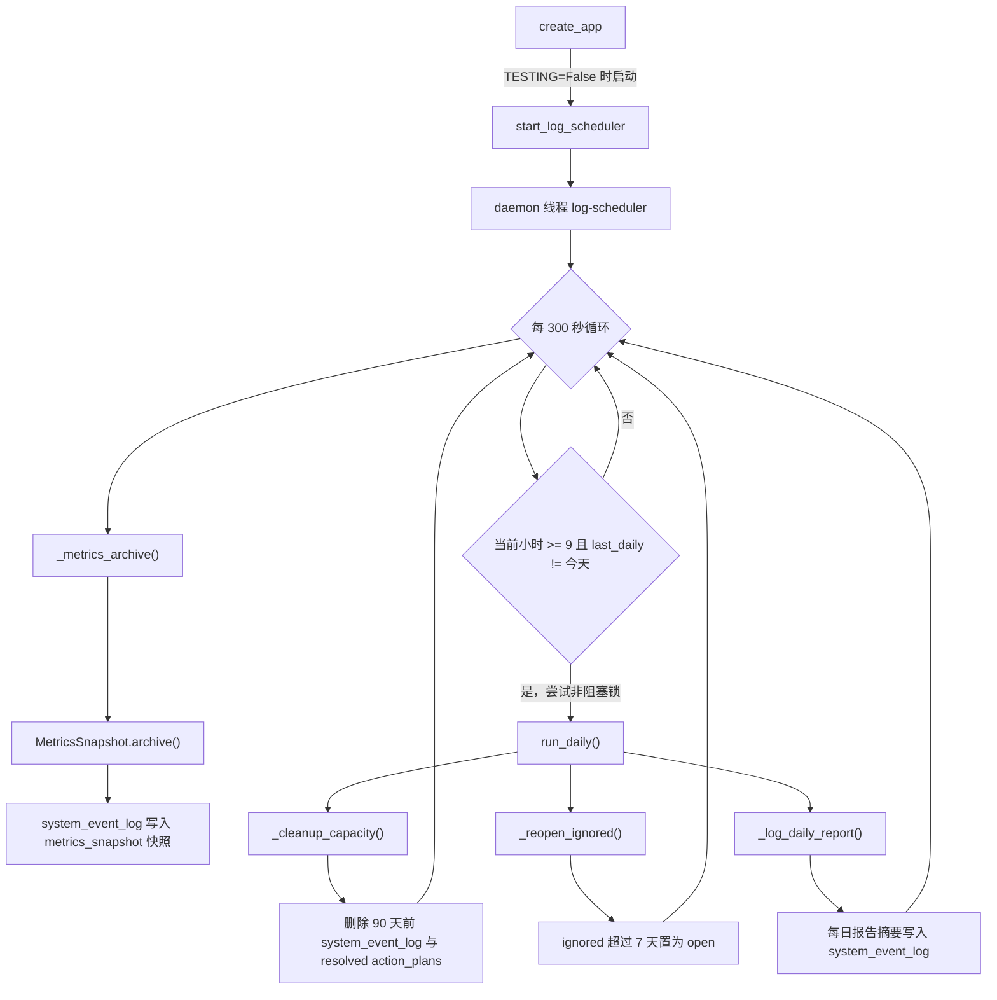

## 定时任务与日志调度

### 模块职责

`backend/utils/log_scheduler.py` 是后台日志调度与容量清理的入口，在 Flask 应用工厂 `create_app()` 中启动。它采用轻量实现，不引入 APScheduler，而是通过一个 **daemon 线程** 常驻运行，主要承担四类任务：

1. **指标快照归档**：每 5 分钟调用 `MetricsSnapshot.archive()`，将 Prometheus 指标当前值写入 `system_event_log` 表，供趋势图表与看板使用。
2. **每日报告留痕**：每日 09:00 后首次循环时，调用 `daily_report()` 生成当日摘要，并作为一条 `system` 事件写入日志表。
3. **容量清理**：删除 `system_event_log` 中 90 天前的记录，以及 `action_plans` 中状态为 `resolved` 且 `resolved_at` 超过 90 天的计划，防止日志与计划表无限膨胀。
4. **ignored 计划重评估**：将状态为 `ignored` 且创建超过 7 天的行动计划重新置为 `open`，交由下一轮 `AlertEngine.evaluate()` 决定其去向。

这种设计使系统在长期运行中不会因日志、指标快照和计划表持续增长而导致内存或磁盘膨胀。

### 启动与调用链

调度器由 `app/__init__.py` 在应用装配阶段启动：

```python
if not app.config.get('TESTING'):
    from backend.utils.log_scheduler import start as start_log_scheduler
    start_log_scheduler()
```

`start()` 会检查 `_state["thread"]` 是否存活，避免重复启动。启动后 `_loop()` 进入无限循环，核心调用链如下：



图中关键节点：

- `_metrics_archive()` 在每次循环都执行，但只有 `MetricsSnapshot.archive()` 返回 `True` 时才记录 info 日志；未安装 `prometheus_client` 或快照为空时静默跳过。
- 每日任务通过 `_state["last_daily"]` 记录上次执行日期，保证一天只执行一次；`threading.Lock` 的非阻塞获取用于防止多个循环重叠执行每日任务。
- `run_daily()` 是每日任务的聚合入口，内部依次执行容量清理、ignored 重评估、每日报告留痕。它也可以在测试中被直接调用，幂等性由调用方控制。

### 关键状态与常量

调度器使用模块级 `_state` 保存运行状态：

```python
_state = {"last_daily": None, "lock": threading.Lock()}
```

启动后还会在 `_state["thread"]` 中保存线程对象。`last_daily` 是“每日只跑一次”的核心状态；`lock` 保证同一天内多个循环不会并发进入每日任务。

关键常量：

| 常量 | 值 | 含义 |
|---|---|---|
| `_METRICS_INTERVAL` | 300 | 循环间隔，秒 |
| `_DAILY_HOUR` | 9 | 每日任务最早触发小时 |
| `_IGNORED_REOPEN_DAYS` | 7 | ignored 计划重新评估的等待天数 |
| `_KEEP_DAYS` | 90 | 日志与已解决计划的保留天数 |

这些常量集中定义在文件顶部，是调整调度频率与保留期限的扩展点。

### 核心任务拆解

#### 指标快照归档

`backend/services/metrics_snapshot.py` 的 `collect()` 遍历 `prometheus_client.REGISTRY`，将每个 metric 的 samples 转成扁平字典；带标签的指标会以 `name{k=v,...}` 形式作为 key。`archive()` 将快照包装成 `detail` 后调用 `SystemEventLogger.log()`，写入 `system_event_log` 表：

```python
SystemEventLogger.log(
    "system", "info", "metrics_snapshot",
    detail={"type": "metrics_snapshot", "values": snap},
    source_module="backend.services.metrics_snapshot")
```

该实现兼容 Prometheus client 0.26+ 的 `Metric` 包装对象，直接遍历 `metric.samples`，避免因版本差异导致业务 Counter 被过滤。

#### 容量清理

`_cleanup_capacity(db_path)` 使用 `backend.utils.db_connection.get_connection()` 获取带统一契约的 SQLite 连接，执行两条 DELETE：

- `system_event_log` 中 `created_at` 早于 `datetime('now', '-90 days')` 的记录。
- `action_plans` 中 `status='resolved'` 且 `resolved_at` 早于 90 天前的记录。

所有连接都经过 `db_connection` 工厂，因此自动启用外键约束、WAL 模式和 30 秒 busy_timeout，避免多 worker 环境下清理任务与业务写入互相锁死。

#### ignored 计划重评估

`_reopen_ignored(db_path)` 将 `action_plans` 中 `status='ignored'` 且 `created_at` 超过 7 天的记录更新为 `open`，同时更新 `updated_at`。这是 `plan_generator.py` 中 `open → ignored` 状态机的自动复活机制：让被忽略的计划有机会被下一次 `AlertEngine.evaluate()` 重新评估，而不是永久搁置。

#### 每日报告留痕

`_log_daily_report(db_path)` 调用 `backend.services.plan_generator.daily_report()`，其中包含：

- `LogAnalyzer.daily_summary()`：审计操作数、系统错误数等。
- `AlertEngine.evaluate()`：当前告警列表。
- `LogAnalyzer.ai_health()`：AI 组件健康状态。

随后 `SystemEventLogger.log()` 将报告摘要写入 `system_event_log`，消息格式与 `LogAnalyzer.daily_summary` 的键对齐，包含今日 actions、错误数和告警数。该事件可作为后续推送通道的数据源。

### 数据写入路径

所有归档与留痕最终都汇聚到 `system_event_log` 表，由 `SystemEventLogger` 统一写入：

- 写入采用独立连接、append-only 模式，任何失败仅 warning，不阻塞主业务。
- 写入前会进行 PII 脱敏，身份证、手机号、学号等敏感信息被掩码。
- 若数据库文件不存在，则跳过写入，避免在 CI 或新环境中创建空库文件。

`action_plans` 表由 `plan_generator.py` 幂等建表，老库演进时不会破坏。每日任务中的清理和重评估直接操作该表，与此表中的状态机保持一致。

### 边界条件

- **测试环境不启动线程**：`app.config.get('TESTING')` 为真时跳过 `start_log_scheduler()`，避免测试进程残留后台线程。
- **daemon 线程随进程退出**：调度器不持有应用生命周期，进程结束后自动终止，不阻塞 Flask 关闭。
- **异常不中断循环**：所有任务函数内部捕获异常并只记录 warning，`_loop` 自身也有兜底，保证调度线程持续存活。
- **每日执行去重**：依赖 `last_daily` 和当日日期比较；若锁获取失败，则下个 5 分钟循环会继续尝试，不会永久跳过。
- **空快照不落库**：未安装 `prometheus_client` 或没有指标时，`archive()` 返回 `False`，不产生无意义事件。
- **SQLite 连接契约**：清理任务使用统一连接工厂，避免破坏外键约束和并发写安全。

### 扩展点

- **调度频率与窗口**：修改 `_METRICS_INTERVAL` 和 `_DAILY_HOUR` 可调整采集与每日任务触发时机。
- **保留策略**：修改 `_KEEP_DAYS` 可调整日志与已解决计划的保留时长。
- **指标采集范围**：由于 `collect()` 遍历整个 Prometheus REGISTRY，新增的业务指标会自动进入快照，无需改动调度器。
- **每日报告推送**：`_log_daily_report` 已将摘要写入 `system_event_log`，后续可在此事件基础上扩展邮件、Webhook 等推送通道。
- **计划重评估周期**：修改 `_IGNORED_REOPEN_DAYS` 可控制 ignored 计划重新参与评估的间隔。

### Sources

Sources: [backend/utils/log_scheduler.py](backend/utils/log_scheduler.py#L1-L129)  
[backend/services/metrics_snapshot.py](backend/services/metrics_snapshot.py#L1-L47)  
[backend/utils/db_connection.py](backend/utils/db_connection.py#L1-L32)  
[backend/services/plan_generator.py](backend/services/plan_generator.py#L1-L161)  
[backend/utils/system_event_logger.py](backend/utils/system_event_logger.py#L1-L153)  
[app/__init__.py](app/__init__.py#L105-L108)