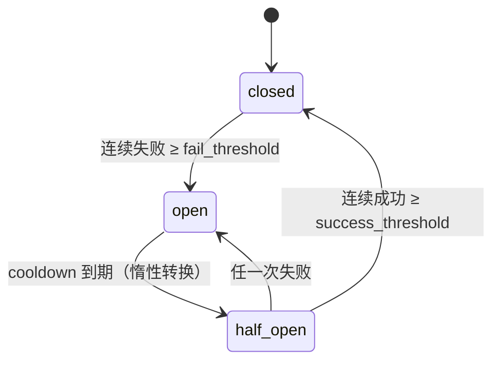
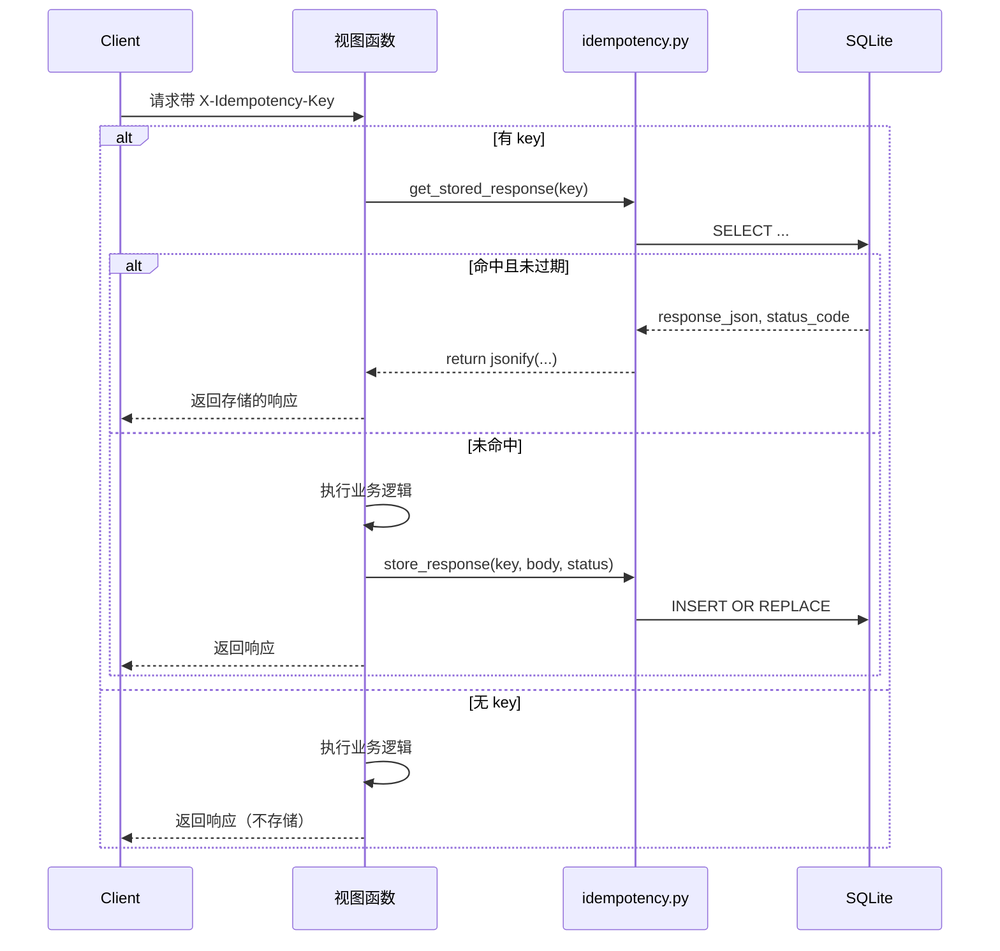

# 幂等与熔断

## 运行机制

### 幂等控制

本模块解决“重复提交”问题。客户端在写操作请求中携带一个调用方生成的键（`X-Idempotency-Key` 头或 JSON body 中的 `idempotency_key`），服务端在 `idempotency_keys` 表中记录该键对应的响应。若在 TTL（默认 600 秒）窗口内收到相同键的请求，直接返回上次的响应体与状态码，避免重复执行业务逻辑（如批量审核、导入）。

关键点在于存储层选择 SQLite 而非进程内存，使多 worker 共享同一份幂等键数据，避免单机内存导致跨进程失效。存储与查询均使用直接 SQL，并附带惰性过期清理，无后台任务。

### 熔断器

熔断器保护外部服务调用（如 OCR、LLM Provider）。状态机为 `closed → open → half_open → closed`：

- `closed`：正常调用，连续失败次数在时间窗口内达到 `fail_threshold` 后进入 `open`。
- `open`：直接拒绝调用（`guard()` 抛出 `BreakerOpenError`），持续 `cooldown` 秒后自动变为 `half_open`。
- `half_open`：允许少量探活请求通过。若连续成功 `success_threshold` 次则恢复 `closed`；若失败一次立即回到 `open`。

只有被 `is_service_failure` 判定的“网络/服务类失败”才会计数；4xx 参数错误和业务异常不触发熔断。

## 文件职责与协作

### `backend/utils/idempotency.py`

- `_db_path()`：惰性获取主库路径。
- `_ensure_table()`：建表。
- `_gc()`：清理过期键。
- `get_stored_response(key)` / `store_response(...)`：读写表。
- `idempotent(ttl)`：路由装饰器，负责提取 key、查询、执行函数、存储响应。

装饰器内部解析 Flask 视图返回的 `(body, status)` 元组，仅对 JSON 响应生效；无 key 时直接透传，保证向后兼容。存储失败被吞掉，不阻塞主流程（后续重试可再次执行）。

### `backend/utils/circuit_breaker.py`

- `CircuitBreaker`：核心类，持有状态、失败时间戳列表、锁。
- `CircuitBreaker.get(name, **kwargs)`：进程级单例注册表，同名字复用实例。
- `guard()`：上下文管理器，用于包裹外部调用，`open` 态直接抛异常。
- `record_success()` / `record_failure()`：由调用方在成功/失败后主动标记。
- `is_service_failure()`：判断异常是否属于应计数的失败类型。

### 两者协作

它们默认独立使用，但可在同一外部服务调用链上组合：以熔断器保护网络调用，以幂等键保护可能由客户端重试导致的重复提交。例如一个调用外部 OCR 的路由，可以同时标注 `@idempotent()`，并在内部用 `breaker.guard()` 包裹 HTTP 请求。熔断器在 `open` 时抛出 `BreakerOpenError`，调用方捕获后返回降级响应（如缓存结果或友好错误），实现降级策略。

另外，两者都依赖观测组件：幂等命中/失败打日志；熔断状态变更会调用 `metrics.set_breaker` 和 `system_event_logger.SystemEventLogger`，便于监控与审计。

## 关键状态与边界条件

- **幂等键表**：`key` 为主键，`response_json` 存响应体，`status_code` 保存状态码，`expires_at` 用于过期判断。插入采用 `INSERT OR REPLACE`，同 key 多次写入会覆盖。
- **幂等范围**：仅 JSON 响应；2xx/4xx/5xx 都存储（确定性结果复用）；TTL 内有效；无 key 时跳过。
- **熔断状态转换**：`_normalize()` 在读取 `state` 或记录成功/失败时惰性将过期的 `open` 转为 `half_open`；`half_open` 下成功计数达到阈值才复位，且 `record_success` 在 `closed` 态会清空失败窗口，避免历史失败残留。
- **计数窗口**：`window` 秒内失败时间戳被保留，超出窗口的失败被 `_prune()` 移除。
- **并发**：熔断器内部使用 `threading.Lock` 保证线程安全；注册表使用类级锁。

## 扩展点

- **幂等存储替换为 Redis**：所有数据库操作集中在 `get_stored_response` / `store_response` 两个函数中，替换实现即可，装饰器不受影响。
- **TTL 可配置**：装饰器与存储函数均接受 `ttl` 参数，可按路由覆盖默认值。
- **熔断参数可调**：`CircuitBreaker.get()` 支持按 name 传入不同阈值，适合不同外部服务的差异化保护。
- **降级策略扩展**：熔断器本身只负责阻断，具体降级逻辑（如返回缓存、默认值）由调用方捕获 `BreakerOpenError` 实现，可在调用链中自由定制。
- **观测接入**：新增指标或审计事件可在 `_open()` / `record_success()` 中扩展，目前已有 `set_breaker` 和 `SystemEventLogger` 挂钩。

## 架构图

### 熔断状态机

关键节点：
- `closed` 状态记录失败时间戳，窗口内失败数达标后跳转 `open`。
- `open` 状态不直接计时切换，而是依赖下次访问时调用 `_normalize()` 惰性转为 `half_open`，减少定时器开销。
- `half_open` 只允许有限探活，成功计数清零仅在复位时进行。

### 幂等请求流程

关键节点：
- 幂等检查在业务逻辑之前，命中直接返回，后续代码不执行。
- 存储发生在业务逻辑之后，且 best-effort，失败不改变主流程响应。

## 限制说明

当前代码片段仅包含幂等与熔断的核心实现，未提供：
- 调用方如何使用 `guard()` 的示例（如具体 HTTP 请求代码）。
- 降级策略的具体实现模板。
- 与 `app_error.BreakerOpenError` 的字段定义及全局异常处理关联。

如需理解这些调用链，请参阅统一异常契约、LLM 引擎或 OCR 供应商等页面。

Sources:
[backend/utils/idempotency.py](backend/utils/idempotency.py#L1-L118)
[backend/utils/circuit_breaker.py](backend/utils/circuit_breaker.py#L1-L123)