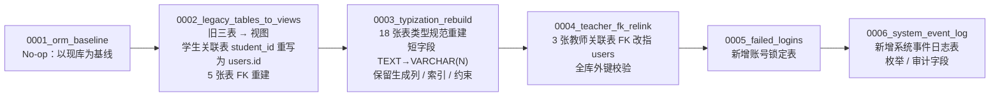

### 数据库迁移链

数据库迁移链是系统从“旧三表用户体系”逐步演进到“ORM 建模 + 视图兼容 + 类型规范 + 审计落库”的完整 Alembic 迁移序列。当前证据覆盖 `0001` 至 `0006` 六个版本，对应 `migrations/env.py` 与 `migrations/versions/` 下的手写迁移文件。该链路的核心原则是：**一切迁移手写，禁用 autogenerate**，因为旧库中存在未建模表，autogenerate 会将它们识别为 DROP 从而造成数据丢失。

#### 模块职责

- **`migrations/env.py`**：Alembic 运行环境装配。负责加载 ORM 元数据（`Base.metadata`），解析目标数据库路径（支持 `ALEMBIC_DB` 环境变量、`-x db=` 参数及默认配置），并分别实现离线/在线迁移模式。在线模式复用 `backend.orm.base.build_engine`，从而继承主库的 PRAGMA 事件监听（外键、WAL、busy_timeout），确保迁移期间连接行为与业务代码一致。
- **迁移版本文件**：每个文件定义一次幂的 `upgrade()` / `downgrade()`。版本之间通过 `down_revision` 形成单向链，新版本必须显式声明前驱版本，否则 Alembic 无法定位迁移顺序。
- **ORM 模型导入**：`env.py` 显式导入 `backend.orm.users`、`pending`、`awards`、`audit_log`、`system_event_log` 等模块，使 `Base.metadata` 包含全部当前建模表，供离线 SQL 生成与未来可能的 autogenerate 参考（虽然实际禁用）。

#### 调用链与执行流程

Alembic 命令（如 `alembic upgrade head`）触发 `env.py` 的 `run_migrations_online()`：

1. 调用 `_resolve_db_path()` 确定库文件路径。
2. 通过 `build_engine()` 创建 SQLAlchemy 引擎（带 PRAGMA 事件）。
3. 建立连接后，`context.configure(connection=connection, target_metadata=target_metadata)` 绑定迁移上下文。
4. Alembic 根据 `alembic_version` 表当前版本，依次执行后续迁移文件的 `upgrade()`。
5. 每个迁移文件通过 `op.get_bind()` 获取连接，直接执行 SQL（`text()` 封装），完成 DDL/DML 操作。

离线模式（`alembic upgrade head --sql`）则仅生成 SQL 脚本，不实际连接数据库；此时 URL 直接来自 `_db_url()`，且不会经过 ORM engine。

#### 迁移链关键状态

- **`0001`**：空操作。声明当前数据库 schema 即为 ORM 起点，为后续迁移提供锚点。
- **`0002`**：将 `students` / `teachers` / `admins` 实体表替换为指向 `users` 的视图（列序与旧表完全一致），并同步处理 5 张学生关联表——先把 `student_id` 从旧 `students.id` 映射到 `users.id`（经 `login_code`），再重建表将外键指向 `users(id)`。迁移内置“零悬空断言”，若存在无法映射的行则抛错。
- **`0003`**：按字段类型规范映射表，对 18 张表执行“建新表 → INSERT SELECT → 行数校验 → 删旧表 → 改名 → 重建索引”。覆盖字段为短枚举/标识型（如 `status`、`role`、`file_hash`），长文本保持 `TEXT`。重建前抓取视图 DDL，先删视图再重建表，最后重建视图并校验可查询；全程关闭外键以免重建 `users` 被关联表阻断。
- **`0004`**：补漏 `0002`。3 张教师关联表（`laboratory_instructors`、`award_teacher_winners`、`award_supervisors`）的 FK 仍指向已被视图化的 `teachers`，SQLite 禁止 FK 引用视图。本迁移重建这 3 张表，将 `REFERENCES teachers(id)` 替换为 `REFERENCES users(id)`，末尾执行 `PRAGMA foreign_key_check` 确保全库无外键不匹配。
- **`0005`**：新增 `failed_logins` 表，用于账号登录失败锁定计数（多 worker 共享状态）。代码层另有 `CREATE TABLE IF NOT EXISTS` 兜底，但迁移链显式建表保证 schema 完整。
- **`0006`**：新增 `system_event_log` 表，将应用层关键事件（OCR 失败、熔断翻转、认证失败等）从非结构化日志升级为结构化 DB 记录。表包含 `event_category` / `event_level` 的 CHECK 约束，以及 `trace_id`、`operator_id`、`source_module` 等审计字段，并建立分类索引。

#### 主要文件

| 文件 | 作用 |
| --- | --- |
| `migrations/env.py` | Alembic 环境配置，库路径解析，ORM metadata 接入，在线/离线执行 |
| `migrations/versions/0001_orm_baseline.py` | 基线版本，无操作 |
| `migrations/versions/0002_legacy_tables_to_views.py` | 旧表视图化 + 学生关联表外键重写 |
| `migrations/versions/0003_typization_rebuild.py` | 18 表类型规范重建，保留约束/索引/生成列 |
| `migrations/versions/0004_teacher_fk_relink.py` | 教师关联表外键补漏，全库外键校验 |
| `migrations/versions/0005_failed_logins.py` | 新增登录失败锁定表 |
| `migrations/versions/0006_system_event_log.py` | 新增系统事件日志表 |

#### 边界条件与扩展点

- **禁用手写迁移代替 autogenerate**：因为旧库存在未建模表，autogenerate 会生成 DROP 语句。所有迁移必须手写，且新迁移应追加在 `versions/` 下并显式声明 `down_revision`。
- **库路径动态解析**：`env.py` 通过 `ALEMBIC_DB` 环境变量允许测试库隔离，避免误操作生产库。
- **SQLite 约束处理**：迁移期间需注意外键开关、视图重建顺序、索引恢复。`0003` 在关闭外键前已抓取视图 DDL，重建后恢复；`0004` 则依赖 `PRAGMA foreign_key_check` 作为最终校验。
- **数据一致性保障**：每个重建步骤都校验新旧表行数一致；`0002` 额外断言 `student_id` 映射零悬空。
- **扩展点**：新增业务表时，只需在 `env.py` 导入对应 ORM 模块即可纳入元数据；新迁移手写，参照既有“备份 → 建新表 → 迁移数据 → 校验 → 替换”模式；若需引入新枚举字段，可在 `0006` 之后追加版本维护 CHECK 约束。

Sources:  
- [migrations/env.py](migrations/env.py#L1-L80)  
- [migrations/versions/0001_orm_baseline.py](migrations/versions/0001_orm_baseline.py#L1-L20)  
- [migrations/versions/0002_legacy_tables_to_views.py](migrations/versions/0002_legacy_tables_to_views.py#L1-L197)  
- [migrations/versions/0003_typization_rebuild.py](migrations/versions/0003_typization_rebuild.py#L1-L180)  
- [migrations/versions/0004_teacher_fk_relink.py](migrations/versions/0004_teacher_fk_relink.py#L1-L75)  
- [migrations/versions/0005_failed_logins.py](migrations/versions/0005_failed_logins.py#L1-L35)  
- [migrations/versions/0006_system_event_log.py](migrations/versions/0006_system_event_log.py#L1-L49)