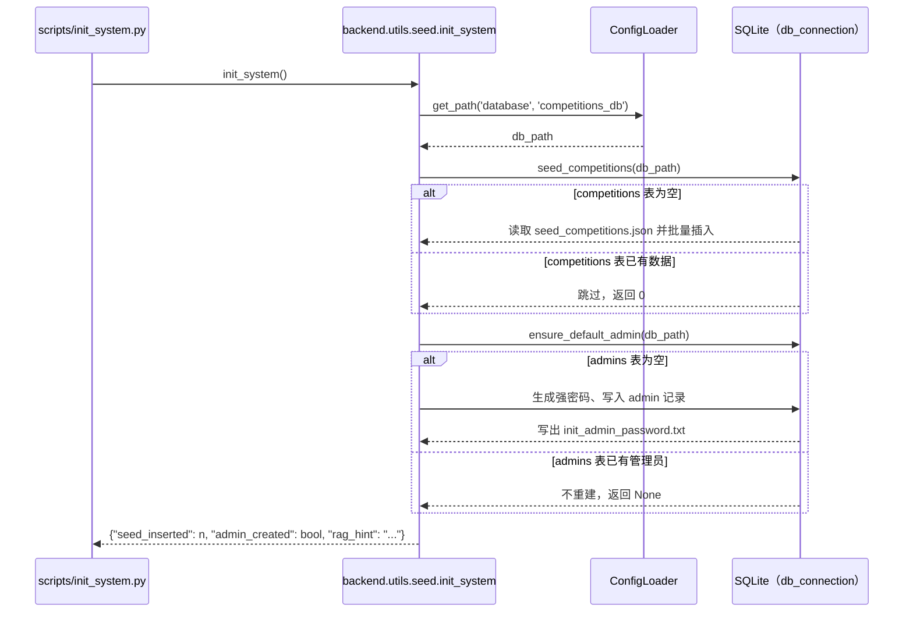

# 初始化与种子数据

## 模块职责

`backend/utils/seed.py` 是系统初始化与种子数据的核心模块，对应 **FR-INIT / SRS 3.10**。模块明确声明了三项职责，且全部具备幂等性，可重复执行：

- **FR-INIT-01 竞赛白名单种子**：在空库部署时，从 `database/seed_competitions.json` 灌入预置白名单竞赛数据。按模块注释说明为 84 条，测试断言至少 50 条且全部 `white_list=1`。
- **FR-INIT-03 默认管理员**：当 `admins` 表为空时，创建用户名 `admin` 的默认管理员，使用强随机密码，并将明文初始密码写入一次性文件，供首次登录后修改。
- **FR-INIT-02 RAG 知识库**：仅打印操作指引，不自动索引，需要额外运行 `backend/rag/indexer.py` 完成竞赛规则 docx 的索引。

对外的一键入口是 `scripts/init_system.py`，执行 `python scripts/init_system.py` 即可完成初始化。

## 调用链

初始化流程从 CLI 脚本进入，最终写入 SQLite 数据库：

关键节点说明：

- `init_system()` 是总入口；若未显式传入 `db_path`，通过 `ConfigLoader().get_path('database', 'competitions_db')` 获取默认数据库路径。
- 所有数据库连接必须经过 `backend/utils/db_connection.py` 的 `get_connection()`，该工厂统一启用 `PRAGMA foreign_keys=ON`、`journal_mode=WAL`、`busy_timeout=30000`，避免外键孤儿数据和并发写锁问题。
- 默认管理员创建依赖 `app/password_policy.py` 的 `generate_strong_password(is_admin=True)`，生成的密码满足管理员密码策略。
- `init_system()` 返回 `dict`，包含 `seed_inserted`（新插入竞赛条数）、`admin_created`（是否创建了管理员）、`rag_hint`（RAG 操作提示）。

## 关键状态与数据

### 竞赛种子

- 种子数据源：`database/seed_competitions.json`。
- 字段包含：`competition_name`、`official_website`、`organizer`、`competition_time`、`participant_requirements`、`grade_category`、`brief_description`、`alias_list`、`white

Sources: [backend/utils/seed.py](backend/utils/seed.py#L1) [scripts/init_system.py](scripts/init_system.py#L1)