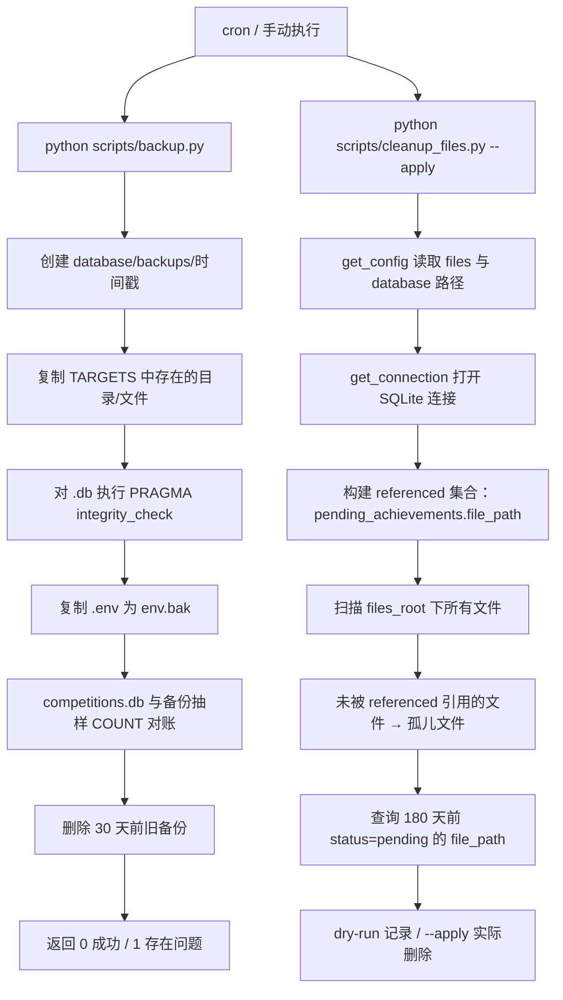

## 备份与清理脚本

本页覆盖两个独立运维脚本：`scripts/backup.py` 负责数据库与数据的全量备份；`scripts/cleanup_files.py` 负责成果文件的定期清理。两者都是通过 cron 调度的命令行脚本，不进入 Flask 请求链路。

### 模块职责

#### `scripts/backup.py` —— 全量备份

按部署设计 §5，将以下内容备份到 `database/backups/<时间戳>/`：

- `competitions.db`：主业务库（竞赛、成果、用户等）
- `ocr_cache.db`：OCR 缓存库
- `extract_cache.db`：抽取缓存库
- `chroma/`：向量数据库目录
- `files/`：成果文件目录
- `.env`：环境变量/密钥文件，单独复制为 `env.bak`

备份策略为“复制一份新快照 + 30 天滚动清理”：每次执行生成独立时间戳目录，不覆盖旧备份；目录修改时间早于 30 天的旧备份会被删除。

#### `scripts/cleanup_files.py` —— 成果文件清理

按 P1-9 与 SRS 5.4，清理三类文件残留：

1. **孤儿文件**：`files` 目录中存在、但 `pending_achievements.file_path` 没有任何记录引用的文件；
2. **长期未提交的 pending 关联文件**：`pending_achievements` 中 `status='pending'` 且 `created_at` 早于 180 天的记录所关联的文件。

脚本默认 **dry-run**，只打印将删除的文件，不实际删除；只有显式传入 `--apply` 才会真正删除。

### 调用链

两个脚本均为独立入口，不经过 `create_app` 或蓝图。

**关键节点说明：**

- `backup.py` 使用固定 `TARGETS` 字典定义备份范围，不读取 `settings.json`；
- `cleanup_files.py` 通过 `config.loader.get_config()` 解析 `files` 与 `competitions_db` 路径，再通过 `backend/utils/db_connection.py` 的 `get_connection()` 获取连接；
- `get_connection()` 会对 SQLite 连接强制设置 `PRAGMA foreign_keys=ON`、`journal_mode=WAL`、`busy_timeout=30000`，清理脚本因此也遵循统一连接契约。

### 关键状态与变量

#### `backup.py`

| 状态/常量 | 值 | 说明 |
|---|---|---|
| `BACKUP_ROOT` | `PROJECT_ROOT / database / backups` | 备份根目录 |
| `RETAIN_DAYS` | `30` | 保留天数，超过即删除 |
| `TARGETS` | 5 类目标 | 三个 `.db`、`chroma/`、`files/` |
| `ok_all` | `bool` | 任一复制/校验失败会置为 `False` |
| 时间戳目录名 | `YYYYmmdd_HHMMSS` | 每次备份独立目录 |

`main()` 返回值：全部成功返回 `0`；存在跳过以外的任何错误返回 `1`。这样 cron 可以通过退出码感知备份失败。

#### `cleanup_files.py`

| 状态/常量 | 值 | 说明 |
|---|---|---|
| `PENDING_DAYS` | `180` | 长期未提交判定阈值 |
| `dry_run` | 默认 `True` | 仅记录，不删除 |
| `--apply` | 使 `dry_run=False` | 实际删除 |
| `removed_files` / `removed_bytes` | 累加计数 | 汇总删除结果 |

### 备份流程边界条件

- `TARGETS` 中某个源路径不存在时，脚本只记录 “跳过（不存在）”，不视为失败；
- 每个 `.db` 复制完成后会执行完整性检查，若 `PRAGMA integrity_check` 不是 `ok`，`ok_all` 置为 `False`，但备份文件仍保留，便于人工排查；
- `.env` 单独复制为 `env.bak`，`copy2` 保留原文件权限元数据，避免密钥文件权限被放宽；
- 抽样对账仅在 `competitions.db` 上进行，检查 `students`、`awards`、`pending_achievements` 三张表在源库与备份库中的 `COUNT(*)` 是否一致；
- 滚动清理只按目录 `st_mtime` 判断，不按目录名或备份数量限制；
- 注意：`backup.py` 直接使用 `sqlite3.connect`，未走 `db_connection` 统一工厂。作为独立运维脚本，它只做只读校验，与应用内连接契约不同。

### 清理脚本边界条件

- `referenced` 集合**只来自** `pending_achievements.file_path`，不包含其他表（如 `awards`）的文件引用。因此，若某些文件只被 `pending_achievements` 之外的表引用，当前实现仍可能将其判为孤儿文件；
- 长期未提交清理只针对 `status='pending'` 的记录，且**只删除文件、不删除 `pending_achievements` 记录**，这是刻意保守的设计；
- `cleanup_files.py` 是 dry-run 优先的：直接运行不会删除任何文件，必须加 `--apply` 才生效；
- 脚本通过配置文件获取 `files` 根目录，因此若所有文件都放在该目录下，临时上传目录中的无引用文件也会被“孤儿文件”分支覆盖，但代码中并没有独立的 `temp_upload` 专项目录扫描逻辑。

### 扩展点

- **备份范围扩展**：在 `TARGETS` 字典中追加条目即可纳入新的数据库或目录；调整 `RETAIN_DAYS` 可改变保留周期。若需要异地备份、压缩归档或上传对象存储，可在 `main()` 的复制与滚动清理之间插入新步骤。
- **清理策略扩展**：将 `PENDING_DAYS` 改为配置项，或在 `referenced` 集合中追加来自其他业务表的 `file_path` 查询，即可扩大/收紧孤儿文件判定范围。
- **连接契约扩展**：若希望 `backup.py` 也使用 `PRAGMA` 契约，可将其中的裸 `sqlite3.connect` 替换为 `backend.utils.db_connection.get_connection`，使运维脚本与应用内连接策略统一。

Sources: [scripts/backup.py](scripts/backup.py#L1-L106), [scripts/cleanup_files.py](scripts/cleanup_files.py#L1-L85), [config/loader.py](config/loader.py#L1-L387), [backend/utils/db_connection.py](backend/utils/db_connection.py#L1-L32), [config/settings.json](config/settings.json#L1-L221)