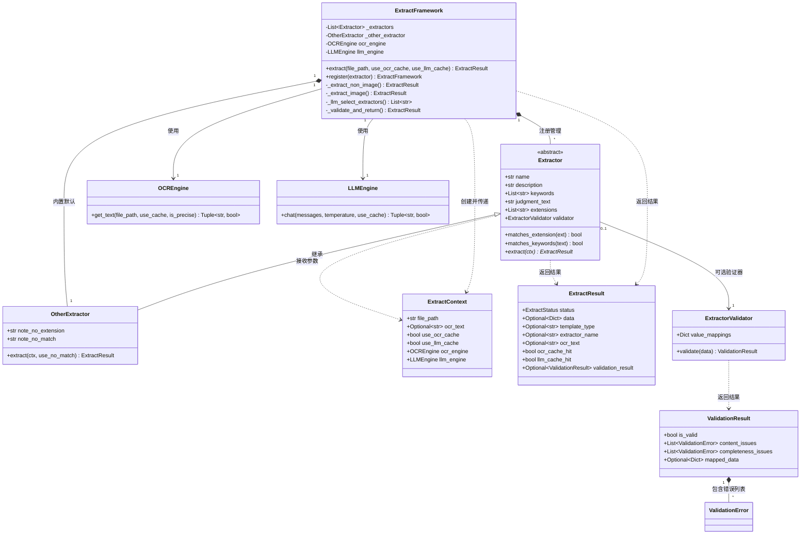
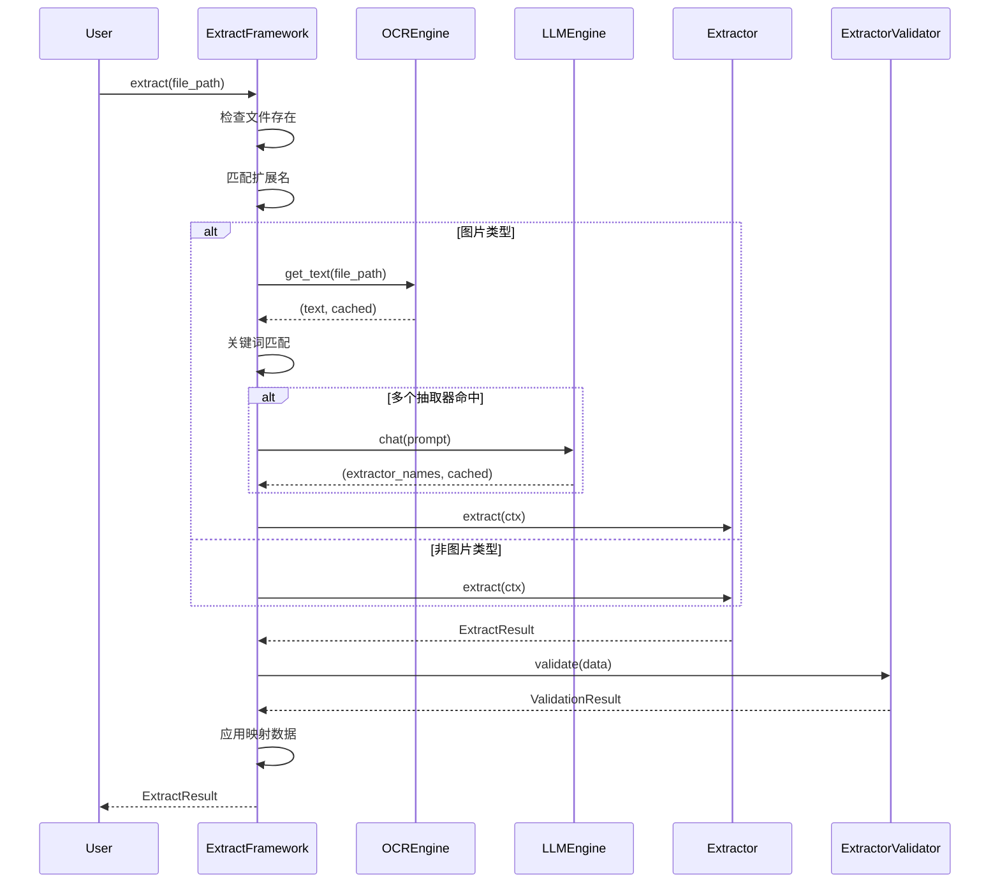
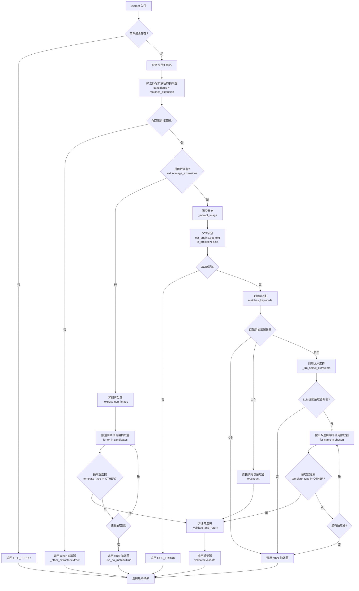

> ⚠️ 已归档（2026-08-24）：本文档为历史资料，不反映项目现状。现行权威文档见 docs/README.md 路由。

# 抽取框架设计

## 概述

抽取框架提供统一接口：输入文件路径，输出抽取结果。支持可注册的抽取器（奖状、大创等），通过扩展名与关键词快速过滤，兼顾性能与 AI Token 节省。

## 类关系图

### 核心类关系



### 类关系说明

#### 1. ExtractFramework（框架核心类）

**职责**：统一入口，管理抽取器注册与调度

**关系**：
- **组合关系**：
  - `_extractors: List[Extractor]`：管理所有注册的抽取器（0 到多个）
  - `_other_extractor: OtherExtractor`：内置默认抽取器（1 个）
- **依赖关系**：
  - `ocr_engine: OCREngine`：OCR 引擎，用于图片文本识别
  - `llm_engine: LLMEngine`：LLM 引擎，用于多抽取器选择
- **创建关系**：
  - 创建 `ExtractContext` 并传递给抽取器
  - 接收抽取器返回的 `ExtractResult` 并处理验证

**代码位置**：`backend/extract/framework.py`

#### 2. Extractor（抽取器抽象基类）

**职责**：定义抽取器的统一接口和基础功能

**关系**：
- **继承关系**：
  - `OtherExtractor` 继承 `Extractor`
  - 所有自定义抽取器必须继承 `Extractor`
- **关联关系**：
  - `validator: Optional[ExtractorValidator]`：可选的验证器（0 或 1 个）
- **方法关系**：
  - `extract(ctx: ExtractContext) -> ExtractResult`：抽象方法，子类必须实现
  - `matches_extension(ext: str) -> bool`：检查扩展名匹配
  - `matches_keywords(text: str) -> bool`：检查关键词匹配

**代码位置**：`backend/extract/extractors/base.py`

#### 3. OtherExtractor（默认抽取器）

**职责**：处理无法匹配任何特定抽取器的文件

**关系**：
- **继承关系**：继承 `Extractor`
- **特殊性质**：
  - 不需要注册，由 `ExtractFramework` 内部创建
  - `extensions=[]`，`keywords=[]`，不参与扩展名和关键词匹配
  - 由框架逻辑决定何时调用

**代码位置**：`backend/extract/extractors/other.py`

#### 4. ExtractContext（抽取上下文）

**职责**：在抽取过程中传递文件信息和服务实例

**关系**：
- **数据类**：使用 `@dataclass` 定义，仅包含数据字段
- **传递关系**：
  - 由 `ExtractFramework` 创建
  - 传递给所有抽取器的 `extract()` 方法
  - 包含文件路径、OCR 文本、缓存设置、引擎实例等

**代码位置**：`backend/extract/extractors/base.py`

#### 5. ExtractResult（抽取结果）

**职责**：统一的结果返回类型

**关系**：
- **数据类**：使用 `@dataclass` 定义
- **包含关系**：
  - `validation_result: Optional[ValidationResult]`：验证结果（可选）
- **返回关系**：
  - 所有抽取器的 `extract()` 方法必须返回 `ExtractResult`
  - `ExtractFramework.extract()` 返回 `ExtractResult`

**代码位置**：`backend/extract/types.py`

#### 6. ExtractorValidator（验证器）

**职责**：对抽取结果进行验证和值映射

**关系**：
- **关联关系**：
  - 每个 `Extractor` 可以关联一个 `ExtractorValidator`（可选）
- **返回关系**：
  - `validate(data: Dict) -> ValidationResult`：返回验证结果
- **使用关系**：
  - 由 `ExtractFramework._validate_and_return()` 调用
  - 在抽取器返回非 `other` 结果后自动调用

**代码位置**：`backend/extract/validator.py`

#### 7. ValidationResult（验证结果）

**职责**：包含验证状态、错误列表和映射后的数据

**关系**：
- **组合关系**：
  - `content_issues: List[ValidationError]`：内容错误列表
  - `completeness_issues: List[ValidationError]`：完整性错误列表
- **包含关系**：
  - `mapped_data: Optional[Dict]`：值映射后的数据

**代码位置**：`backend/extract/types.py`

#### 8. OCREngine 和 LLMEngine（外部服务）

**职责**：提供 OCR 和 LLM 能力

**关系**：
- **依赖关系**：
  - `ExtractFramework` 依赖这两个引擎
  - 通过 `ExtractContext` 传递给抽取器（可选使用）
- **外部模块**：
  - `OCREngine` 来自 `backend.ocr`
  - `LLMEngine` 来自 `backend.extract.llm`

### 数据流向



### 关键关系总结

| 关系类型 | 关系描述 | 示例 |
|---------|---------|------|
| **组合** | ExtractFramework 拥有多个 Extractor | `_extractors: List[Extractor]` |
| **组合** | ExtractFramework 拥有一个 OtherExtractor | `_other_extractor: OtherExtractor` |
| **继承** | OtherExtractor 继承 Extractor | `class OtherExtractor(Extractor)` |
| **关联** | Extractor 可选关联 ExtractorValidator | `validator: Optional[ExtractorValidator]` |
| **依赖** | ExtractFramework 依赖 OCREngine 和 LLMEngine | 通过构造函数注入 |
| **传递** | ExtractContext 在框架和抽取器间传递 | 作为 `extract()` 的参数 |
| **返回** | 所有抽取器返回 ExtractResult | `extract() -> ExtractResult` |
| **包含** | ExtractResult 包含 ValidationResult | `validation_result: Optional[ValidationResult]` |

## OCR/LLM 异常与用户可见提示

当 OCR 或 LLM 调用失败（如 429 频率限制、费用不足、API 异常）时，框架与抽取器会统一返回带说明的 `ExtractResult`，便于界面展示和测试排查。

**OCR 高精度失败时的行为**：OCREngine 在高精度调用失败（如 429）时**不抛异常**，而是将该供应商标记为不可用、自动尝试下一可用高精度供应商，全部不可用时回退到低精度（rapid），并通过 `last_ocr_warning` 及抽取结果 `metadata["ocr_warning"]` 向上报告。详见设计文档 [OCR供应商故障切换与管理员状态管理](../ocr/OCR供应商故障切换与管理员状态管理.md)。

### 行为约定

1. **异常转用户文案**（`backend/extract/exceptions.py`）
   - `user_facing_message(exc)`：将异常转为面向用户的简短提示。
   - 若异常信息中包含 `429`、`频率限制`、`quota`、`费用不足`、`余额不足`、`rate limit` 等，统一返回 **「OCR/LLM 费用不足，无法处理」**（常量 `USER_MESSAGE_QUOTA`）。
   - 其他异常返回异常信息或默认「服务暂时不可用，请稍后重试」。

2. **框架层**
   - **OCR 失败**：`_extract_image` 中调用 `_ocr_image()` 若抛异常，返回 `ExtractResult(status=OCR_ERROR, error_message=msg, data={"note": msg}, template_type=OTHER, ...)`。
   - **LLM 选择抽取器失败**：`_llm_select_extractors()` 若抛异常，返回 `ExtractResult(status=LLM_ERROR, error_message=msg, data={"note": msg}, ...)`。
   - `_ocr_image` 不再内部吞掉异常，由上层统一捕获并写入 `error_message` 与 `data.note`。

3. **抽取器层**（如奖状抽取器）
   - 内部调用 `ctx.ocr_engine.get_text()` 或 LLM 时若抛异常，捕获后使用 `user_facing_message(e)`，通过 `_other_result(msg)` 返回，保证 `data.note` 与 `error_message` 一致。

4. **结果与展示**
   - `ExtractResult` 的 `error_message` 与 `data.note` 在 OCR_ERROR/LLM_ERROR/other 场景下会同时存在，便于日志和界面展示。
   - 文件解析/导入时，other 类型在 pending 的 `achievement_data` 中会保存 `note`；结果页（如文件导入结果页）在 other 类型下展示「无法处理原因：{note}」。

5. **测试**
   - `tests/quick_extract_test.py` 与 `tests/extract_test.py` 在出现 `error_message` 或 `data.note` 时，会打印 `[异常/other]` 信息（含 `error_message`、`data.note`、`status`），便于测试 OCR/LLM 失败与费用不足等场景。

## 对外接口

### ExtractFramework

- **入口**：`extract(file_path, use_ocr_cache=True, use_llm_cache=True) -> ExtractResult`
  - `use_ocr_cache`：是否使用 OCR 缓存（默认 True）
  - `use_llm_cache`：是否使用 LLM 缓存（默认 True）
  - 两个参数独立控制，可分别设置
- **初始化**：`ExtractFramework.from_config_loader(config_loader)`，依赖配置中的 `ocr`、`llm`、`extract`、`database` 等。

### ExtractResult 字段说明

`ExtractResult` 是框架的统一返回类型，定义在 `backend/extract/types.py`。各字段含义和取值示例：

| 字段 | 类型 | 说明 | 取值示例 |
|------|------|------|---------|
| `status` | `ExtractStatus` | 抽取状态枚举 | `ExtractStatus.SUCCESS`（成功）<br>`ExtractStatus.NO_TEMPLATE`（无匹配模板）<br>`ExtractStatus.OCR_ERROR`（OCR失败）<br>`ExtractStatus.LLM_ERROR`（LLM失败）<br>`ExtractStatus.FILE_ERROR`（文件错误）<br>`ExtractStatus.PARSE_ERROR`（解析错误） |
| `data` | `Optional[Dict[str, Any]]` | 抽取的数据字典 | `{"competition_name": "蓝桥杯", "award_level": "一等奖", "winner_name": "张三"}`<br>`{"note": "不支持的文件扩展名"}`（other类型） |
| `error_message` | `Optional[str]` | 错误信息（如果有） | `"文件不存在: /path/to/file.jpg"`<br>`"OCR识别失败: ..."` |
| `template_type` | `Optional[str]` | 模板类型 | `TemplateType.AWARD`（"award"）<br>`TemplateType.INNOVATION`（"innovation"）<br>`TemplateType.OTHER`（"other"） |
| `extractor_name` | `Optional[str]` | 实际完成抽取的抽取器名称 | `"award"`（奖状抽取器）<br>`"innovation"`（大创抽取器）<br>`"other"`（默认抽取器） |
| `ocr_text` | `Optional[str]` | OCR识别的文本（图片类型才有） | `"蓝桥杯全国软件和信息技术专业人才大赛\n一等奖\n获奖者：张三"` |
| `ocr_cache_hit` | `bool` | OCR是否命中缓存 | `True`（命中缓存）<br>`False`（未命中，真实调用） |
| `llm_prompt` | `Optional[str]` | LLM提示词（调试用） | 完整的提示词文本，用于调试和追踪 |
| `llm_response` | `Optional[str]` | LLM原始返回（调试用） | LLM的原始响应文本，可能包含JSON格式的抽取结果 |
| `llm_cache_hit` | `bool` | LLM是否命中缓存 | `True`（命中缓存）<br>`False`（未命中，真实调用） |
| `validation_result` | `Optional[ValidationResult]` | 验证结果 | 包含 `is_valid`、`content_issues`、`completeness_issues`、`mapped_data` 等 |
| `metadata` | `Dict[str, Any]` | 额外元数据 | `{"file_path": "/path/to/file.jpg"}` |

**示例：**

```python
# 成功抽取奖状
ExtractResult(
    status=ExtractStatus.SUCCESS,
    data={"competition_name": "蓝桥杯", "award_level": "一等奖"},
    template_type="award",
    extractor_name="award",
    ocr_text="蓝桥杯...",
    ocr_cache_hit=True,
    validation_result=ValidationResult(is_valid=True, mapped_data={...})
)

# 扩展名不匹配，返回other
ExtractResult(
    status=ExtractStatus.NO_TEMPLATE,
    data={"note": "不支持的文件扩展名"},
    template_type="other",
    extractor_name="other",
    ocr_text=None
)
```

## 抽取器注册

### 抽取器属性

每个抽取器（继承 `Extractor` 基类）包含以下属性：

| 属性 | 类型 | 说明 | 代码位置 |
|------|------|------|---------|
| `name` | `str` | 抽取器名称，唯一标识 | `backend/extract/extractors/base.py:Extractor.__init__` |
| `description` | `str` | 描述（面向目标、特征、排除特征），用于 LLM 识别 | 同上 |
| `keywords` | `List[str]` | 快速过滤关键词列表（命中文本则可能由该抽取器处理） | 同上 |
| `judgment_text` | `str` | 供 LLM 分类任务的类别说明，应包含：类别名称、类别特征、通常包含的信息、通常出现的文档类型 | 同上 |
| `extensions` | `List[str]` | 支持的文件扩展名列表，如 `['.jpg','.png','.pdf']` | 同上，自动转换为小写并规范化 |
| `validator` | `Optional[ExtractorValidator]` | 验证器实例（统一验证器类，按抽取器配置） | 同上 |

### 注册流程

**函数**：`ExtractFramework.register(extractor: Extractor) -> ExtractFramework`

**代码位置**：`backend/extract/framework.py:69-72`

**关键代码：**

```python
def register(self, extractor: Extractor) -> "ExtractFramework":
    self._extractors.append(extractor)
    logger.info("注册抽取器: %s", extractor.name)
    return self  # 支持链式调用
```

**使用示例：**

```python
from backend.extract import ExtractFramework, Extractor

framework = ExtractFramework.from_config_loader(config_loader)

# 注册奖状抽取器
award_extractor = AwardExtractor(...)
framework.register(award_extractor)

# 注册大创抽取器（链式调用）
framework.register(innovation_extractor).register(patent_extractor)
```

**other 抽取器**：不需要注册，框架在初始化时自动创建 `_other_extractor`（`backend/extract/framework.py:40-43`），扩展名未命中任何抽取器时使用。

## 如何实现抽取器

### 必须实现的接口

每个抽取器必须继承 `Extractor` 基类（`backend/extract/extractors/base.py`），并实现以下接口：

#### 1. `extract(ctx: ExtractContext) -> ExtractResult`

**必须实现**：这是抽象方法（`@abstractmethod`），所有抽取器都必须实现。

**参数说明**：
- `ctx: ExtractContext`：抽取上下文，包含以下字段：
  - `file_path: str`：文件路径（绝对路径或相对路径）
  - `ocr_text: Optional[str]`：OCR 识别的文本（图片类型时才有值，非图片类型为 `None`）
  - `use_ocr_cache: bool`：是否使用 OCR 缓存（由框架传入）
  - `use_llm_cache: bool`：是否使用 LLM 缓存（由框架传入）
  - `ocr_engine: Optional[OCREngine]`：OCR 引擎实例（如需额外 OCR 调用）
  - `llm_engine: Optional[LLMEngine]`：LLM 引擎实例（如需额外 LLM 调用）

**返回值**：`ExtractResult`，必须包含：
- `status`：抽取状态（`ExtractStatus.SUCCESS` 表示成功）
- `template_type`：模板类型（如 `TemplateType.AWARD`、`TemplateType.OTHER` 等）
- `data`：抽取的数据字典（成功时包含字段，失败时可为 `None` 或包含 `{"note": "..."}`）
- `extractor_name`：框架会自动设置，但抽取器也可以自己设置

**注意事项**：
- 如果 `ctx.ocr_text` 有值，表示这是图片分支，已经完成 OCR，直接使用文本即可
- 如果 `ctx.ocr_text` 为 `None`，表示这是非图片分支，需要自己读取 `ctx.file_path` 文件
- 如果无法抽取或文件不匹配，应返回 `template_type=TemplateType.OTHER` 的结果
- 抽取器可以定义额外的可选参数（如 `OtherExtractor` 的 `use_no_match`），但框架调用时只会传入 `ctx`，额外参数需有默认值

### 在框架中的调用位置

抽取器的 `extract` 方法在以下位置被框架调用：

1. **非图片分支**（`backend/extract/framework.py:130`）：
   ```python
   for ex in candidates:
       res = ex.extract(ctx)  # 按注册顺序调用
       if res.template_type != TemplateType.OTHER:
           return self._validate_and_return(ex, res)
   ```

2. **图片分支 - 单抽取器命中**（`backend/extract/framework.py:190`）：
   ```python
   if len(matched) == 1:
       ex = matched[0]
       res = ex.extract(ctx)  # ctx.ocr_text 已包含 OCR 文本
   ```

3. **图片分支 - LLM 选择后**（`backend/extract/framework.py:224`）：
   ```python
   for name in chosen:  # LLM 返回的抽取器列表
       ex = next((e for e in matched if e.name == name), None)
       res = ex.extract(ctx)  # ctx.ocr_text 已包含 OCR 文本
       if res.template_type != TemplateType.OTHER:
           return self._validate_and_return(ex, res)
   ```

### 实现示例：OtherExtractor

`OtherExtractor` 是框架内置的默认抽取器，用于处理无法匹配任何特定抽取器的文件。以下是其完整实现（`backend/extract/extractors/other.py`）：

```python
class OtherExtractor(Extractor):
    """Other 默认抽取器，不需要注册，框架内部使用。"""

    def __init__(self, note_no_extension: str, note_no_match: str):
        super().__init__(
            name="other",
            description="其他类型文档抽取器（默认）",
            keywords=[],  # 空关键词列表，不参与关键词匹配
            judgment_text="其他类型文档，无法匹配任何特定抽取器",
            extensions=[],  # 空扩展名列表，不参与扩展名匹配
            validator=None,  # 不需要验证器
        )
        self.note_no_extension = note_no_extension
        self.note_no_match = note_no_match

    def extract(self, ctx: ExtractContext, use_no_match: bool = False) -> ExtractResult:
        """
        执行抽取，返回 other 类型结果。

        Args:
            ctx: 抽取上下文
            use_no_match: 如果为 True，使用 note_no_match；否则根据 ocr_text 判断：
                - ocr_text 为 None：使用 note_no_extension（扩展名不匹配）
                - ocr_text 有值：使用 note_no_match（关键词不匹配或所有抽取器都返回 other）

        Returns:
            ExtractResult，template_type 为 other
        """
        # 判断使用哪个提示信息
        if use_no_match:
            note = self.note_no_match
        elif ctx.ocr_text is None:
            note = self.note_no_extension  # 扩展名不匹配
        else:
            note = self.note_no_match  # 关键词不匹配或所有抽取器都返回 other

        return ExtractResult(
            status=ExtractStatus.NO_TEMPLATE,
            data={"note": note},
            error_message=note,
            template_type=TemplateType.OTHER,
            extractor_name=self.name,
            ocr_text=ctx.ocr_text,
            ocr_cache_hit=False,  # other 抽取器不涉及 OCR 缓存，框架会覆盖
        )
```

**实现要点**：
1. **继承 `Extractor`**：必须调用 `super().__init__()` 初始化基类属性
2. **实现 `extract` 方法**：必须接受 `ExtractContext` 参数，可以有额外可选参数（如 `use_no_match`）
3. **返回 `ExtractResult`**：必须设置 `status`、`template_type`、`data` 等字段
4. **使用 `ctx` 字段**：根据 `ctx.ocr_text` 判断是图片分支还是非图片分支
5. **设置 `extractor_name`**：框架会自动设置，但也可以自己设置

### 实现自定义抽取器的步骤

1. **创建抽取器类**：继承 `Extractor`，在 `__init__` 中设置 `name`、`description`、`keywords`、`judgment_text`、`extensions`、`validator`
   
   **`judgment_text` 编写要求**（用于LLM分类任务）：
   - 应包含类别名称（如"奖状类别"、"大创项目类别"）
   - 应说明该类别的特征（如"包含竞赛名称、奖项等级、获奖者姓名"）
   - 应说明通常包含的信息（如"竞赛名称、奖项等级、获奖者姓名"）
   - 应说明通常出现在哪些文档中（如"竞赛证书、获奖证明、奖状等文档中"）
   
   **示例**：
   ```python
   judgment_text = "奖状类别。特征：包含竞赛名称、奖项等级（如一等奖、二等奖、三等奖、金奖、银奖、铜奖）、获奖者姓名等信息。通常出现在竞赛证书、获奖证明、奖状等文档中。"
   ```

2. **实现 `extract` 方法**：
   - 检查 `ctx.ocr_text` 是否有值（判断是图片还是非图片）
   - 图片分支：直接使用 `ctx.ocr_text` 进行文本解析
   - 非图片分支：读取 `ctx.file_path` 文件，解析内容
   - 如果匹配成功，返回 `template_type` 为对应类型的结果
   - 如果不匹配，返回 `template_type=TemplateType.OTHER` 的结果
3. **注册抽取器**：调用 `framework.register(extractor)` 注册

### ExtractContext 字段详解

| 字段 | 类型 | 说明 | 使用场景 |
|------|------|------|---------|
| `file_path` | `str` | 文件路径 | 非图片分支时，需要读取文件内容 |
| `ocr_text` | `Optional[str]` | OCR 识别的文本 | 图片分支时，框架已提供 OCR 文本，直接使用即可 |
| `use_ocr_cache` | `bool` | 是否使用 OCR 缓存 | 如需额外 OCR 调用，传递给 `ocr_engine.get_text()` |
| `use_llm_cache` | `bool` | 是否使用 LLM 缓存 | 如需额外 LLM 调用，传递给 `llm_engine.chat()` |
| `ocr_engine` | `Optional[OCREngine]` | OCR 引擎实例 | 如需对文件进行额外 OCR（如非图片分支需要 OCR） |
| `llm_engine` | `Optional[LLMEngine]` | LLM 引擎实例 | 如需调用 LLM 进行文本理解或抽取 |

**使用建议**：
- 图片分支（`ctx.ocr_text` 有值）：直接使用 `ctx.ocr_text`，无需再调用 OCR
- 非图片分支（`ctx.ocr_text` 为 `None`）：根据文件类型读取 `ctx.file_path`，如 Excel、Word、JSON 等
- 如需额外 OCR：使用 `ctx.ocr_engine.get_text(file_path, use_cache=ctx.use_ocr_cache, is_precise=False)`
- 如需 LLM 辅助：使用 `ctx.llm_engine.chat(messages, use_cache=ctx.use_llm_cache)`

## 执行流程

### 主入口函数

**函数**：`ExtractFramework.extract(file_path, use_ocr_cache=True, use_llm_cache=True) -> ExtractResult`

**代码位置**：`backend/extract/framework.py:74-112`

### 执行流程图



### 详细执行步骤

#### 1. 扩展名检查

**代码位置**：`backend/extract/framework.py:85-103`

**关键代码：**

```python
ext = path.suffix.lower()
if not ext.startswith("."):
    ext = f".{ext}"

# 从已注册的抽取器中筛选能处理当前扩展名的抽取器
candidates = [e for e in self._extractors if e.matches_extension(ext)]
if not candidates:
    # 如果没有抽取器匹配该扩展名，则使用"other"抽取器
    ctx = ExtractContext(...)
    return self._other_extractor.extract(ctx)
```

**处理逻辑**：
- 调用 `Extractor.matches_extension(ext)` 方法（`backend/extract/extractors/base.py:47-48`）
- 若 `candidates` 为空，直接调用 `OtherExtractor.extract()`（`backend/extract/extractors/other.py:30-59`）

#### 2. 非图片类型分支

**函数**：`ExtractFramework._extract_non_image(file_path, candidates, use_ocr_cache, use_llm_cache) -> ExtractResult`

**代码位置**：`backend/extract/framework.py:114-144`

**关键代码：**

```python
for ex in candidates:
    res = ex.extract(ctx)
    res.extractor_name = ex.name
    if res.template_type and res.template_type != TemplateType.OTHER:
        return self._validate_and_return(ex, res)  # 首个非other即返回
# 所有抽取器都返回 other，使用 note_no_match
return self._other_extractor.extract(ctx, use_no_match=True)
```

**处理逻辑**：
- 按注册顺序（`self._extractors` 的顺序）依次调用每个候选抽取器的 `extract()` 方法
- 一旦某个抽取器返回 `template_type != TemplateType.OTHER`，立即调用 `_validate_and_return()` 验证并返回
- 若所有抽取器都返回 `other`，调用 `OtherExtractor.extract(ctx, use_no_match=True)`

#### 3. 图片类型分支（含 PDF）

**函数**：`ExtractFramework._extract_image(file_path, candidates, use_ocr_cache, use_llm_cache) -> ExtractResult`

**代码位置**：`backend/extract/framework.py:146-254`

##### 3.1 OCR 识别

**关键代码：**

```python
# 步骤1：先用OCR引擎抽取图片中的文本内容
text, ocr_cached = self.ocr_engine.get_text(
    file_path, 
    use_cache=use_ocr_cache, 
    is_precise=False  # 使用低精度OCR
)
```

**说明**：
- PDF 文件会自动转换为第一页图片（由 `OCREngine.get_text()` 内部处理，调用 `backend.utils.pdf_to_image.pdf_to_image()`）
- 使用低精度 OCR（`is_precise=False`）以节省成本
- OCR 缓存由 `use_ocr_cache` 参数控制

##### 3.2 关键词过滤

**关键代码：**

```python
# 步骤2：根据文本内容，匹配候选抽取器（通过关键词匹配方法）
matched = [e for e in candidates if e.matches_keywords(text)]
```

**处理逻辑**：
- 调用 `Extractor.matches_keywords(text)` 方法（`backend/extract/extractors/base.py:50-55`）
- 对 OCR 文本，检查是否包含抽取器的 `keywords` 列表中的任意关键词

##### 3.3 单抽取器命中

**关键代码：**

```python
# 步骤2.2：如果仅命中一个抽取器，直接用该抽取器抽取
if len(matched) == 1:
    ex = matched[0]
    res = ex.extract(ctx)
    res.extractor_name = ex.name
    res.ocr_text = text
    res.ocr_cache_hit = ocr_cached
    return self._validate_and_return(ex, res)
```

**说明**：单命中时不调用 LLM，直接派发给对应抽取器，节省 Token。

##### 3.4 多抽取器命中 - LLM 分类任务

**函数**：`ExtractFramework._llm_select_extractors(ocr_text, candidates, use_llm_cache) -> List[str]`

**代码位置**：`backend/extract/framework.py:279-303`

**关键代码：**

```python
# 步骤2.3：如果有多个抽取器都命中，调用LLM进行分类任务
parts = []
for e in candidates:
    # 使用分类任务的格式：类别名称 + 类别特征和包含的信息
    desc = e.judgment_text or e.description
    parts.append(f"- {e.name}（类别标识）: {desc}")

# 截断OCR文本（使用配置的长度）
text = ocr_text if len(ocr_text) <= self._llm_max_text_length else ocr_text[:self._llm_max_text_length]

# 使用配置的提示词模板（分类任务）
prompt = self._llm_selector_prompt_template.format(
    extractors="\n".join(parts),
    ocr_text=text
)

messages = [{"role": "user", "content": prompt}]
raw, llm_cached = self.llm_engine.chat(messages, temperature=0.1, use_cache=use_llm_cache)
names = _parse_extractor_list(raw)  # 解析JSON数组
return [n for n in names if n in {e.name for e in candidates}]  # 过滤无效名称
```

**处理逻辑**：
- **分类任务**：将任务表述为文档分类，让LLM更容易理解
- 组装提示词，包含所有匹配抽取器的类别说明（`judgment_text` 或 `description`）
- 每个抽取器的 `judgment_text` 应包含：类别名称、类别特征、通常包含的信息
- 调用 `LLMEngine.chat()`，要求返回 JSON 数组格式的类别标识列表
- 使用 `_parse_extractor_list()` 解析 LLM 返回（支持代码块格式）
- 过滤掉不在候选列表中的类别标识

**提示词模板**（可配置，`config/settings.json` 中的 `extract.llm_selector_prompt_template`）：
```
以下是一段文档的 OCR 识别文本。请将其归类到以下类别之一（或几个）。

**分类任务说明：**
请仔细分析 OCR 文本的内容，判断文档属于哪个类别。每个类别都有明确的特征和应包含的信息。

**重要规则：**
1. 优先选择最匹配的单一类别，只有在文档确实包含多种类型信息时才返回多个
2. 如果文档明显是某一种类型（如奖状、证书），即使包含其他类型的关键词，也只返回该类型
3. 仅返回 JSON 数组，元素为类别标识（见下方说明）。例如 ["award"] 或 ["award","innovation"]

**类别说明：**
{extractors}

**OCR 文本：**
{ocr_text}
```

**抽取器 `judgment_text` 编写建议**：
- 应包含类别名称（如"奖状类别"、"大创项目类别"）
- 应说明该类别的特征（如"包含竞赛名称、奖项等级、获奖者姓名"）
- 应说明通常包含的信息（如"竞赛名称、奖项等级、获奖者姓名"）
- 应说明通常出现在哪些文档中（如"竞赛证书、获奖证明、奖状等文档中"）

**示例**：
```python
judgment_text = "奖状类别。特征：包含竞赛名称、奖项等级（如一等奖、二等奖、三等奖、金奖、银奖、铜奖）、获奖者姓名等信息。通常出现在竞赛证书、获奖证明、奖状等文档中。"
```

##### 3.5 按 LLM 返回顺序调用抽取器

**关键代码：**

```python
# 步骤2.4：逐个尝试LLM选择的抽取器，取第一个抽取成功且类型不是OTHER的
for name in chosen:
    ex = next((e for e in matched if e.name == name), None)
    if not ex:
        continue
    res = ex.extract(ctx)
    res.extractor_name = ex.name
    res.ocr_text = text
    res.ocr_cache_hit = ocr_cached
    # 若抽取类型不是OTHER，验证结果并返回
    if res.template_type and res.template_type != TemplateType.OTHER:
        return self._validate_and_return(ex, res)

# 步骤2.5：所有抽取器都未能有效抽取，最终兜底返回other抽取器结果
return self._other_extractor.extract(ctx)
```

**处理逻辑**：
- 按 LLM 返回的顺序（`chosen` 列表）依次调用抽取器
- 一旦某个抽取器返回 `template_type != TemplateType.OTHER`，立即验证并返回
- 若所有抽取器都返回 `other`，最终调用 `OtherExtractor.extract()`

#### 4. 验证与结果

**函数**：`ExtractFramework._validate_and_return(extractor, result) -> ExtractResult`

**代码位置**：`backend/extract/framework.py:277-284`

**关键代码：**

```python
def _validate_and_return(self, extractor: Extractor, result: ExtractResult) -> ExtractResult:
    if not extractor.validator or not result.data:
        return result
    vr = extractor.validator.validate(result.data)  # 应用值映射和验证
    result.validation_result = vr
    if vr.mapped_data is not None:
        result.data = vr.mapped_data  # 使用映射后的数据
    return result
```

**处理逻辑**：
- 调用抽取器的 `validator.validate()` 方法（`backend/extract/validator.py:18-25`）
- 验证器会应用 `value_mappings` 进行域修正（如 "Gold" → "金奖"）
- 将验证结果和映射后的数据写入 `ExtractResult`

## 性能与 Token 节省

- 先按扩展名过滤，避免无关类型走 OCR/LLM。
- 图片用**低精度 OCR** + 缓存（`use_ocr_cache` 控制），减少调用与成本。
- LLM 调用使用缓存（`use_llm_cache` 控制），减少 Token 消耗。
- 关键词过滤：单命中直接派发，不调 LLM；仅多命中时才调 LLM 做抽取器选择。
- 抽取器顺序调用，首个非 other 即返回，减少无效调用。
- OCR 和 LLM 缓存可独立控制，灵活应对不同场景。

## 验证器

### ExtractorValidator

**位置**：`backend/extract/validator.py`

**功能**：
- **统一验证器类**，每个抽取器通过配置（如字段类型、规则、value_mappings）实例化后使用
- 当前实现主要做**值映射**（value_mappings），将非标准值映射为标准值
- 校验规则、域修正（如映射）均来自配置，不硬编码

**关键代码：**

```python
class ExtractorValidator:
    def __init__(self, value_mappings: Dict[str, Dict[str, str]]):
        self.value_mappings = value_mappings or {}
    
    def validate(self, data: Dict[str, Any]) -> ValidationResult:
        mapped = self._apply_mappings(data)  # 应用值映射
        return ValidationResult(is_valid=True, mapped_data=mapped)
```

**配置来源**：`config/settings.json` 的 `validation.value_mappings` 节点

## 配置依赖

- `config.settings.json` 中需提供：
  - `extract.image_extensions`：视为图片的扩展名列表（含 `.pdf`）
  - `extract.other.note_no_extension`：扩展名不匹配时的提示信息
  - `extract.other.note_no_match`：无抽取器能处理时的提示信息
- OCR、LLM、数据库路径等均从 `config` / `config_loader` 解析，**禁止硬编码**

## 与 document_extract 的关系

- 框架落地在 `backend/extract`，**不依赖** `backend/document_extract`
- 若需复用逻辑（如验证规则、值映射），**拷贝至 `backend/extract` 并改写**，以适配本设计与配置驱动、无硬编码原则

## 模块结构

```
backend/extract/
├── __init__.py
├── exceptions.py
├── types.py           # ExtractResult, ExtractStatus, TemplateType
├── framework.py       # ExtractFramework, 注册与调度
├── extractors/
│   ├── __init__.py
│   ├── base.py        # 抽取器基类、注册协议
│   └── other.py       # Other 默认抽取器
├── validator.py       # 统一验证器（可配置域、映射）
└── llm/               # 已有 LLM 模块
```

## PDF 第一页转图片

- PDF 处理由 `OCREngine.get_text()` 内部完成
- `OCREngine.get_text()` 会调用 `backend.utils.pdf_to_image.pdf_to_image(..., first_page_only=True)`
- 转换后的图片保存在 PDF 同目录下，文件名为 `{pdf_name}.png`
- 输出路径等由配置或调用约定确定，不写死

## 使用示例

```python
from backend.extract import ExtractFramework
from config.loader import get_config

# 初始化框架
config_loader = get_config()
framework = ExtractFramework.from_config_loader(config_loader)

# 注册抽取器
framework.register(award_extractor)
framework.register(innovation_extractor)

# 抽取文件
result = framework.extract(
    "path/to/file.jpg",
    use_ocr_cache=True,
    use_llm_cache=True
)

# 检查结果
if result.is_success():
    print(f"抽取成功，类型: {result.template_type}")
    print(f"抽取器: {result.extractor_name}")
    print(f"数据: {result.data}")
    print(f"OCR缓存命中: {result.ocr_cache_hit}")
    print(f"LLM缓存命中: {result.llm_cache_hit}")
else:
    print(f"抽取失败: {result.error_message}")
```
